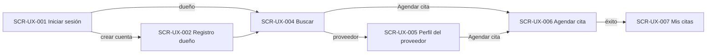

# UX Specification and Visual Design System

> **Classification legend:** **FACT** = stated in an upstream artifact or confirmed by the team · **DECISION** = decision already made upstream · **ASSUMPTION** = non-blocking interpretation used to proceed · **PROPOSAL** = design choice that still needs team review · **REQUIRES_DECISION** = open decision that affects design or implementation · **BLOCKED** = cannot be specified until a decision is made.
>
> **ID conventions:** P04 creates only `COMP-UX-`, `SCR-UX-`, `FLOW-UX-` and, for its own open items, `P04-ASM-`, `P04-PROP-`, `P04-RD-` and `P04-BLK-`. All other IDs (`FR-`, `NFR-`, `US-`, `AC-`, `BR-`, `EDGE-`, `DEP-`, `P02-ASM-`, `P02-Q-`, `ASSUM-`, `PRIOR-`, `P03-RISK-`) are upstream IDs, used with their upstream meaning.
>
> **Language:** this document is in English. Text in quotation marks and italics, such as *"Agendar cita"*, is the proposed Spanish interface copy (NFR-004).

---

## 1. Document Metadata and Status

| Field | Value |
|---|---|
| Stage | P04 — UX Design |
| Version | 1.0 |
| Generated | 2026-10-09 |
| Sprint | `SPRINT-001` (the only sprint; `RELEASE-001`) |
| Delivery scope designed | The 14 committed P0 stories of `SPRINT-001`: US-001, US-002, US-003, US-008, US-009, US-010, US-013, US-016, US-017, US-018, US-019, US-020, US-021, US-024 (PRIORITIZATION §5.1). |
| Not designed in this version | Conditional Group A (US-004, US-005, US-011, US-022, US-023, US-025, US-026), Conditional Group B (US-006, US-007, US-012, US-014, US-015, US-028 to US-032) and the blocked stories (US-027, US-033). See §11 (P04-RD-005, P04-BLK-001, P04-BLK-002). |
| **Overall status** | **READY_WITH_ASSUMPTIONS** |

### 1.1 Source Artifacts

| Artifact | Version | Status | How it was used |
|---|---|---|---|
| `PRIORITIZATION_V1.md` | 1.0 | READY_WITH_ASSUMPTIONS | Delivery scope. **Verified by diff: identical to `artifacts/03_planning/PRIORITIZATION.md`.** |
| `product_backlog_priori_v1.json` | 3.0 | READY_WITH_ASSUMPTIONS | Stories, acceptance criteria, priorities and sprint status. **Verified by diff: identical to `artifacts/03_planning/product_backlog.json`.** |
| `artifacts/03_planning/PRIORITIZATION_VALIDATION.md` | — | PASS_WITH_WARNINGS | P04 readiness (§15): "P04 can proceed"; design only the committed scope in depth. |
| `artifacts/02_requirements/REQUIREMENTS.md` | 2.0 | READY_WITH_ASSUMPTIONS | Authoritative FRs, NFRs, business rules, edge cases and open questions. |
| `artifacts/02_requirements/REQUIREMENTS_VALIDATION.md` | 2.0 | PASS_WITH_WARNINGS | Known warnings carried forward. |
| `SYSTEM_PROMPT.md` | — | — | Global rules: classification, traceability, MVP minimalism, human-in-the-loop. |

### 1.2 Team Confirmation Applied

**FACT (team statement, 2026-10-09):** "All of the assumptions in PRIORITIZATION_V1.md are 100% confirmed and approved by the team." This covers ASSUM-001 to ASSUM-008 (PRIORITIZATION §10).

How this document applies the confirmation (interpretation recorded as **P04-ASM-001**):

| Confirmed item | Effect on UX |
|---|---|
| ASSUM-001, -003, -004, -005, -007 | Planning only. No UX effect. |
| ASSUM-002 | P04 and P05 happen before `SPRINT-001`. This document is part of that preparation. |
| ASSUM-006 | Product ordering stays in MVP scope, placed last. It is not designed here because US-027 and US-033 are still blocked by open questions (P04-BLK-001, -002). |
| ASSUM-008 | The P02 assumptions P02-ASM-001, -002 and -004 to -016 hold. This document treats them as **confirmed**. The UX-relevant ones are P02-ASM-001 (email and password), -002 (one account per type per email), -004 (offerings have a name), -005 (owner chooses the modality), -006 (no past slots), -007 (Bogotá time), -008 (provider appointment details), -010 (weekly pattern), -013 (search matches names) and -014 (price mandatory, in Colombian pesos). |

**Not covered by the confirmation.** These are questions or decisions, not assumptions, so they stay open:

- **P02-Q-004** (species mismatch at booking) and **P02-Q-009** (address for in-clinic services). Both affect committed stories. They are carried as **P04-RD-001** and **P04-RD-002**.
- **P02-Q-001** and **P02-Q-017** (ordering and stock). They affect only blocked stories.
- **PRIOR-001** (approve the committed scope) and **PRIOR-002** (what happens to unfinished work). They are still open. PRIOR-003 and PRIOR-004 are planning decisions with no UX effect.

### 1.3 Status Explanation

**READY_WITH_ASSUMPTIONS.** Every committed user-facing story has screens, flows, components and states specified against one shared visual system. Implementation can proceed with the documented, non-blocking assumptions in §11.

Two open upstream decisions affect committed stories: P04-RD-001 (US-019) and P04-RD-002 (US-010, and US-008 if its option A is chosen). P03 placed both in step 0 of the sprint (DEP-011). This specification does not resolve them. It defines one variation point for each and specifies the interface for every option, so the decision changes a rule, not the layout. **Both must be decided before US-019 and US-010 are implemented** (and before US-008, if option A of P04-RD-002 is chosen). If they are not decided, those two stories cannot be completed as specified. The status would then have to be lowered for them.

The visual direction (§3) is a **PROPOSAL** that no team member has approved yet (P04-PROP-001).

---

## 2. UX Objectives and Design Principles

### 2.1 Primary User Needs

| User (P01) | Need the interface must support | Source |
|---|---|---|
| Pet owner (P01-USER-001) | Find veterinary services and products from all Bogotá providers in one place, without other channels. | P01-PROB-001; FR-017; P01-SUCCESS-007 |
| Pet owner | Understand an offering at a glance: price, provider type and where the service is given. | FR-019; AC-039 |
| Pet owner | Book a one-hour appointment for one of their pets, at the clinic or at home, with no confirmation wait. | FR-021 to FR-025; BR-014 |
| Pet owner | Know when and where each appointment is, including cancelled ones. | FR-026; BR-035 |
| Provider: clinic or independent veterinarian (P01-USER-002, -003) | Publish its profile, working hours, services and products quickly. | FR-009 to FR-011, FR-014 |
| Provider | See what it must attend, when and where. | FR-029; P02-ASM-008 |

### 2.2 Usability Objectives

| ID | Objective | Verifiable rule in this specification |
|---|---|---|
| UO-1 | The core journey is short. | Search → provider profile or result → booking → appointments: at most 3 screens after sign-in, and booking happens on a single screen (SCR-UX-006). |
| UO-2 | Errors are prevented first and explained second. | Controls make invalid input impossible where P02 fixes the values: species is a choice of two, hours are whole-hour selects, only offered slots are shown. Every remaining validation error names the field and the fix (§3.9). |
| UO-3 | Each account type sees only its own interface. | Two separate navigation sets (COMP-UX-011). Screens of the other type are not reachable from the navigation (FR-004, AC-013). |
| UO-4 | The interface never promises what the MVP does not do. | No copy mentions confirmation, notifications, payment, ratings or ordering (BR-014; P01-OOS-004, -007; US-027 blocked). |
| UO-5 | Mobile and desktop are equal. | Every screen is specified at mobile width first and adapted at `breakpoint-md` (NFR-003). |

### 2.3 Design Principles

1. **One shared system.** Every color, size and space comes from a token in §4. Every repeated element is a component in §5. A story implementation does not create new visual values. Changes go through §12.
2. **Show only what is in scope.** Actions of conditional or blocked stories (edit, remove, cancel, reschedule, order) are **not rendered** in `SPRINT-001`. Space is reserved only where noted (§6.4).
3. **Labels with text.** Icons always come with a visible text label. The only exception is the password visibility toggle, which has an accessible name.
4. **Status is never color-only.** Status uses a text badge (COMP-UX-009). Color only reinforces it.
5. **Plain Spanish.** Copy is short, direct and consistent (§3.9).

### 2.4 Accessibility and Responsive Considerations

- **Accessibility target — PROPOSAL (P04-PROP-003):** WCAG 2.1 level AA. No upstream requirement exists; this target is proposed because it is a standard, testable baseline. The rules applied in this document:
  - **Contrast:** at least 4.5:1 for text and 3:1 for UI component boundaries and focus indicators. Ratios are computed in §3.2.
  - **Focus:** visible on every interactive element, with a 2px outline in `color-primary` and a 2px offset.
  - **Keyboard:** full operation; tab order follows visual order.
  - **Forms:** every field has a programmatic label; errors are linked to their field and announced (§3.9).
  - **Touch:** targets are at least `size-control-height` (44px).
  - **Language:** the page language is declared as Spanish (`es`).
- **Responsive — FACT (NFR-003):** the product must work in Google Chrome on computers and mobile phones. Responsive rules are in §3.7; each screen states its adaptations.

---

## 3. Visual Direction

**Status: PROPOSAL (P04-PROP-001).** No visual identity, brand, logo or product name exists in any upstream artifact. Everything in this section is a proposed default. No human has approved it. Implementation may start with it. If the team changes it, only token values change (§4); components and screens keep their references.

### 3.1 Style and Intended Perception

- **Style:** clean, light and functional. White surfaces on a very light gray page, one teal brand color, generous spacing and no decorative imagery.
- **Perception:** trustworthy and calm, like a health service; friendly but not childish; simple enough for a first-time user on a phone.
- **Why teal:** it is associated with health and care, it is different from the semantic colors (green for success, amber for warning, red for error, blue for information), and it passes AA contrast with white text.

### 3.2 Color Palette

All values are defined as tokens in §4.1. The contrast ratios below were computed with the WCAG 2.1 relative-luminance formula.

| Role | Token | Hex | Contrast | Use |
|---|---|---|---|---|
| Primary | `color-primary` | #0F766E | 5.47:1 on white (both directions) | Primary buttons, links, active navigation, selected states and focus ring. |
| Primary hover | `color-primary-hover` | #115E59 | 7.58:1 with white text | Hover and pressed state of primary elements. |
| Primary subtle | `color-primary-subtle` | #F0FDFA | `color-primary` on it: 5.25:1 | Background of a selected option. |
| Text on primary | `color-on-primary` | #FFFFFF | — | Text and icons on `color-primary`. |
| Page background | `color-bg-page` | #F9FAFB | Body text on it: 14.05:1 | Page background. |
| Surface | `color-bg-surface` | #FFFFFF | — | Cards, forms, header and navigation. |
| Muted surface | `color-bg-muted` | #F3F4F6 | Secondary text on it: 6.87:1 | Disabled fields and the neutral badge background. |
| Text, primary | `color-text-primary` | #1F2937 | 14.68:1 on white | Body text and titles. |
| Text, secondary | `color-text-secondary` | #4B5563 | 7.56:1 on white | Helper text and metadata. |
| Text, disabled | `color-text-disabled` | #9CA3AF | 2.54:1 on white | Only for disabled controls, which are exempt from contrast rules. Never for information the user needs. |
| Input border | `color-border-input` | #6B7280 | 4.83:1 on white | Borders of text fields, selects and unselected radio options. Meets the 3:1 rule. |
| Subtle border | `color-border-subtle` | #E5E7EB | Decorative | Card borders and dividers. Never the only boundary of a control. |
| Success | `color-success` / `color-success-bg` | #15803D / #F0FDF4 | 5.02:1 on white; 4.79:1 on its background | Success alerts and toasts. |
| Warning | `color-warning` / `color-warning-bg` | #B45309 / #FFFBEB | 4.84:1 on its background | Warning alerts. |
| Error | `color-error` / `color-error-bg` | #B91C1C / #FEF2F2 | 6.47:1 on white; 5.91:1 on its background | Field errors and error alerts. |
| Information | `color-info` / `color-info-bg` | #1D4ED8 / #EFF6FF | 6.16:1 on its background | Information alerts. |

**Badge colors** (text on background):

| Badge | Text / background | Ratio |
|---|---|---|
| Success | #166534 / #DCFCE7 | 6.49:1 |
| Information | #1E40AF / #DBEAFE | 7.15:1 |
| Primary | #134E4A / #CCFBF1 | 8.41:1 |
| Warning | #92400E / #FEF3C7 | 6.37:1 |
| Neutral | #374151 / #F3F4F6 | 9.37:1 |

### 3.3 Typography and Text Hierarchy

- **Font family (PROPOSAL, P04-PROP-007):** the system font stack, `system-ui, -apple-system, "Segoe UI", Roboto, "Helvetica Neue", Arial, sans-serif`.
  - **Why:** no font download; it renders Spanish accents and "ñ" natively; it uses Roboto on Android Chrome and Segoe UI on Windows. This matches NFR-003 with no added dependency.
  - **Alternative if the team wants one look on all devices:** Inter, loaded from a font service. That would be a P05 decision.
- **Hierarchy:**

| Level | Size token | Weight token | Line height | Use |
|---|---|---|---|---|
| Page title (h1) | `font-size-2xl` (24px) | `font-weight-semibold` | `line-height-tight` | One per screen, in COMP-UX-019. |
| Section title (h2) | `font-size-xl` (20px) | `font-weight-semibold` | `line-height-tight` | Form sections, list groups. |
| Card title (h3) | `font-size-lg` (18px) | `font-weight-semibold` | `line-height-tight` | Offering and appointment cards. |
| Body | `font-size-md` (16px) | `font-weight-regular` | `line-height-normal` | Text, input values. |
| Label / button | `font-size-md` (16px) | `font-weight-medium` | `line-height-normal` | Field labels, buttons, header navigation links (from `breakpoint-md`). |
| Bottom tab label | `font-size-sm` (14px) | `font-weight-medium` | `line-height-normal` | Mobile bottom tab bar (below `breakpoint-md`). |
| Small | `font-size-sm` (14px) | `font-weight-regular` or `-medium` | `line-height-normal` | Helper text, error text, badges, metadata. |

- **Rules:**
  - All text uses `font-family-base`.
  - Nothing is smaller than 14px.
  - Input text is 16px on every device.
  - Use sentence case.
  - No body text is in all capitals.

### 3.4 Spacing, Sizing and Layout

- **Spacing scale:** a 4px base, with the tokens `spacing-1` (4px), `-2` (8px), `-3` (12px), `-4` (16px), `-6` (24px), `-8` (32px) and `-12` (48px). No other spacing values are used.
- **Conventions:**

| Context | Value |
|---|---|
| Page side padding | `spacing-4` on mobile, `spacing-6` from `breakpoint-md` |
| Space between page sections | `spacing-8` |
| Space between form fields | `spacing-4` |
| Label to input | `spacing-1` |
| Card padding | `spacing-4` |
| Gap between cards | `spacing-3` |
| Gap between inline buttons | `spacing-3` |

- **Sizing:**

| Element | Value |
|---|---|
| Controls (buttons, inputs, selects, chips, radio rows) | Minimum height `size-control-height` (44px) |
| Icons | `size-icon` (20px) |
| Content width | At most `size-content-max` (960px), centered |
| Forms | At most `size-form-max` (560px) |
| Header | `size-header-height` (56px) |
| Mobile bottom navigation | `size-bottom-nav-height` (64px) |

### 3.5 Borders, Radius and Elevation

| Element | Border | Radius | Shadow |
|---|---|---|---|
| Text field, select | `border-width-default` `color-border-input`; on error, `border-width-strong` `color-error` | `radius-md` | none |
| Button | none; secondary: `border-width-default` `color-primary` | `radius-md` | none |
| Radio card / slot chip | `border-width-default` `color-border-input`; when selected, `border-width-strong` `color-primary` | `radius-md` | none |
| Card | `border-width-default` `color-border-subtle` | `radius-lg` | `shadow-sm` |
| Badge | none | `radius-full` | none |
| Toast | none | `radius-md` | `shadow-md` |
| Alert | `border-width-default` in the semantic color | `radius-md` | none |

**Elevation levels:**

- **0:** page and inline elements.
- **1:** cards (`shadow-sm`).
- **2:** toasts (`shadow-md`).

There are no modal dialogs in `SPRINT-001` (none is needed).

### 3.6 Iconography and Images

- **Icons — PROPOSAL (P04-PROP-007):** one outline icon set, at `size-icon` with about a 2px stroke, colored with `currentColor`.
  - Proposed set: Lucide (ISC license). P05 confirms how it is included.
  - Icons used: search, dog, cat, calendar, clock, map-pin, phone, mail, home (home visit), building (clinic), alert, check, eye and eye-off (password), chevrons (date navigation).
- **Images:** none. No upstream requirement includes photos, avatars or uploads, so the MVP uses no images. Species uses dog and cat icons plus text.
- **Logo:** none exists. The header shows a text wordmark with a placeholder name (P04-RD-004).

### 3.7 Responsive Behavior

| Range | Layout |
|---|---|
| Below `breakpoint-md` (under 768px): mobile, the base design | Single column. Top header with the app wordmark only (COMP-UX-011); the page title is at the top of the content (COMP-UX-019). Account navigation is a bottom tab bar (COMP-UX-011). Primary form buttons are full width. Cards are stacked. |
| `breakpoint-md` to below `breakpoint-lg` (768–1023px) | Navigation moves into the top header as horizontal links. Content is centered at `size-content-max`. Forms are centered at `size-form-max`. Cards are in one column. |
| `breakpoint-lg` and above (1024px or more) | As above. Card lists (search results, catalog, appointments) use 2 columns. |

- **Minimum supported width:** 360px (PROPOSAL, part of P04-PROP-003).
- **No horizontal scrolling** at any width. The slot picker's day strip is the only horizontally scrollable element, and it also has arrow buttons.

### 3.8 Visual Hierarchy, Contrast and Readability Rules

1. **One primary button per screen region.** Other actions are secondary or tertiary.
2. **Price emphasis:** the price is shown in `font-weight-semibold`. The provider name is a link in `color-primary`.
3. **Line length:** text lines are at most about 75 characters. `size-form-max` and the card widths enforce this.
4. **Disabled controls:** they use `color-text-disabled` on `color-bg-muted`. They always come with a reason when the user needs one (for example, an ineligible pet).

### 3.9 Content and Microcopy Conventions (Spanish UI, NFR-004)

**PROPOSAL (P04-PROP-002):** the register and formats below. Shared messages are defined once here; screens reference them by key.

- **Register:** informal "tú", which is common in consumer apps in Colombia. The team may switch to "usted"; only copy changes.
- **Formats (es-CO, Bogotá time, P02-ASM-007):**
  - Dates: *"lun 12 oct 2026"* in lists and *"lunes 12 de octubre"* in titles.
  - Times: 12-hour format, *"8:00 a. m."*. A slot is shown as its start time; its one-hour length is stated once in the picker.
  - Prices: Colombian pesos (P02-ASM-014), *"$ 45.000"*, with no decimals and "." as the thousands separator.
- **Required fields:** every required field has a visible marker (`*`), and a legend *"* Campo obligatorio"* appears once per form. Optional fields add *"(opcional)"* to the label.
- **Validation timing:**
  - A field is validated when it loses focus, and again on submit.
  - On submit with errors, focus moves to the first invalid field, and an error alert (COMP-UX-012) at the top of the form lists the problems as links.

**Shared message catalog:**

| Key | Spanish copy | Used when |
|---|---|---|
| MSG-REQ | *"Este campo es obligatorio."* | Any required field is empty. |
| MSG-EMAIL | *"Escribe un correo válido, por ejemplo nombre@correo.com."* | Email format invalid (P04-ASM-005). |
| MSG-PRICE | *"Escribe un precio en pesos, solo números, mayor que 0."* | Price invalid (P04-ASM-013). |
| MSG-INTEGER | *"Escribe un número entero, sin decimales."* | Pet age and height. |
| MSG-DECIMAL | *"Escribe un número; puedes usar un decimal, por ejemplo 4,5."* | Pet weight (decimal comma, es-CO). |
| MSG-PHONE | *"Usa solo números, espacios y el signo +."* | Provider phone (P04-ASM-005). |
| MSG-SLOT-GONE | *"Ese horario ya no está disponible. Elige otro."* | Booking rejected because the slot is no longer offered (EDGE-007, or it passed or left the working hours meanwhile). |
| MSG-PLACE-ADDR | *"Lugar: [dirección]"* | Where an in-clinic appointment takes place (SCR-UX-006, COMP-UX-008). |
| MSG-PLACE-NONE | *"El proveedor no registró dirección."* followed, only if the provider has a phone, by *"Puedes contactarlo al [teléfono]."* | In-clinic appointment of a provider with no address (BR-026). |
| MSG-FORM | *"Revisa los campos marcados para continuar."* | Title of the error alert on submit. |
| MSG-NET | *"No pudimos completar la acción. Revisa tu conexión e inténtalo de nuevo."* | Network or server failure; the alert includes *"Reintentar"*. |
| MSG-LOAD | *"Cargando…"* | Accessible text of any loading indicator. |
| MSG-SAVED | *"Cambios guardados."* | Successful save (toast). |

**Canonical labels.** The same concept always uses the same words. The form changes only with the context:

| Concept | Badge (COMP-UX-009) | Provider form / profile | Owner choice at booking |
|---|---|---|---|
| Clinic provider | *"Clínica"* | *"Clínica veterinaria"* | — |
| Independent vet | *"Veterinario independiente"* | *"Veterinario independiente"* | — |
| Modality: clinic | *"En clínica"* | *"En mi clínica"* | *"En la clínica"* |
| Modality: home | *"A domicilio"* | *"A domicilio"* | *"A domicilio"* |
| Modality: both | *"En clínica y a domicilio"* | *"En clínica y a domicilio"* | (the owner chooses one) |
| Species | *"Perro"*, *"Gato"* | *"Perro"*, *"Gato"* | *"Perro"*, *"Gato"*, *"Especie sin especificar"* |
| Appointment status | *"Programada"*, *"Cancelada"* | — | — |

**Prohibited wording:**

- *"solicitud"* and *"pendiente de confirmación"* for appointments, because booking is immediate (BR-014).
- *"pagar"*.
- *"notificación"*.
- *"calificación"*.
- *"pedido"* or *"pedir"* until US-027 is unblocked.

---

## 4. Design Tokens

**Status: PROPOSAL (P04-PROP-001)** for the values. The names and categories are the contract. This section is the **single source of truth**: components (§5) and screens (§8) reference only these names. Token names use kebab-case, `category-role[-variant]`. The format of the implementation (CSS custom properties, a theme file or another option) is decided in P05.

### 4.1 Color

| Token | Value | Intended usage |
|---|---|---|
| `color-primary` | #0F766E | Primary buttons, links, active navigation item, selected borders, focus outline. |
| `color-primary-hover` | #115E59 | Hover and pressed state of primary buttons and links. |
| `color-primary-subtle` | #F0FDFA | Background of selected radio cards, slot chips and segmented options. |
| `color-on-primary` | #FFFFFF | Text and icons on `color-primary`. |
| `color-bg-page` | #F9FAFB | Page background. |
| `color-bg-surface` | #FFFFFF | Cards, forms, header, navigation, inputs. |
| `color-bg-muted` | #F3F4F6 | Disabled controls; neutral badge background. |
| `color-text-primary` | #1F2937 | Body text, titles, input values. |
| `color-text-secondary` | #4B5563 | Helper text, metadata, inactive navigation items. |
| `color-text-disabled` | #9CA3AF | Text of disabled controls only. |
| `color-border-input` | #6B7280 | Boundaries of inputs, selects and unselected options. |
| `color-border-subtle` | #E5E7EB | Card borders, dividers. |
| `color-success` | #15803D | Success icon and border; success toast accent. |
| `color-success-bg` | #F0FDF4 | Success alert background. |
| `color-warning` | #B45309 | Warning icon and border. |
| `color-warning-bg` | #FFFBEB | Warning alert background. |
| `color-error` | #B91C1C | Error text, error borders and icons. |
| `color-error-bg` | #FEF2F2 | Error alert background. |
| `color-info` | #1D4ED8 | Information icon and border. |
| `color-info-bg` | #EFF6FF | Information alert background. |
| `color-badge-success-text` | #166534 | Success badge text (status *"Programada"*). |
| `color-badge-success-bg` | #DCFCE7 | Success badge background. |
| `color-badge-info-text` | #1E40AF | Information badge text (provider type *"Clínica"*). |
| `color-badge-info-bg` | #DBEAFE | Information badge background. |
| `color-badge-primary-text` | #134E4A | Primary badge text (provider type *"Veterinario independiente"*). |
| `color-badge-primary-bg` | #CCFBF1 | Primary badge background. |
| `color-badge-warning-text` | #92400E | Warning badge text (pet option warning, P04-RD-001 option B). |
| `color-badge-warning-bg` | #FEF3C7 | Warning badge background. |
| `color-badge-neutral-text` | #374151 | Neutral badge text (species, modality, offering type, *"Cancelada"*). Background: `color-bg-muted`. |

### 4.2 Typography

| Token | Value | Intended usage |
|---|---|---|
| `font-family-base` | system-ui, -apple-system, "Segoe UI", Roboto, "Helvetica Neue", Arial, sans-serif | All text. |
| `font-size-sm` | 0.875rem (14px) | Helper, error and metadata text; badges. |
| `font-size-md` | 1rem (16px) | Body, labels, buttons, inputs. |
| `font-size-lg` | 1.125rem (18px) | Card titles; the app wordmark below `breakpoint-md`. |
| `font-size-xl` | 1.25rem (20px) | Section titles; the app wordmark from `breakpoint-md`. |
| `font-size-2xl` | 1.5rem (24px) | Page titles (COMP-UX-019). |
| `font-weight-regular` | 400 | Body text. |
| `font-weight-medium` | 500 | Labels, buttons, navigation, badges. |
| `font-weight-semibold` | 600 | Titles, prices. |
| `line-height-tight` | 1.25 | Titles. |
| `line-height-normal` | 1.5 | Body and everything else. |

### 4.3 Spacing and Size

| Token | Value | Intended usage |
|---|---|---|
| `spacing-1` | 4px | Label to input; icon to text inside badges. |
| `spacing-2` | 8px | Icon to text in buttons; gap between badges. |
| `spacing-3` | 12px | Gap between cards and between inline buttons; alert padding. |
| `spacing-4` | 16px | Card padding; gap between fields; mobile page padding. |
| `spacing-6` | 24px | Desktop page padding; padding of form sections. |
| `spacing-8` | 32px | Gap between page sections. |
| `spacing-12` | 48px | Empty-state vertical padding. |
| `size-control-height` | 44px | Minimum height of buttons, inputs, selects, chips and radio rows; minimum touch target. |
| `size-icon` | 20px | All icons. |
| `size-header-height` | 56px | Top header. |
| `size-bottom-nav-height` | 64px | Mobile bottom tab bar. |
| `size-content-max` | 960px | Maximum content width. |
| `size-form-max` | 560px | Maximum form width. |

### 4.4 Radius, Border, Shadow, Motion

| Token | Value | Intended usage |
|---|---|---|
| `radius-sm` | 4px | Corners of the focus outline on tertiary links and tabs. |
| `radius-md` | 8px | Buttons, inputs, selects, radio cards, chips, alerts, toasts. |
| `radius-lg` | 12px | Cards. |
| `radius-full` | 9999px | Badges; the switch track. |
| `border-width-default` | 1px | Default borders. |
| `border-width-strong` | 2px | Error borders, selected borders, focus outline and its offset, active-tab indicator. |
| `shadow-sm` | 0 1px 2px rgba(17, 24, 39, 0.08) | Cards. |
| `shadow-md` | 0 4px 12px rgba(17, 24, 39, 0.15) | Toasts. |
| `motion-duration-fast` | 150ms | Hover, focus and selection transitions. Disabled when the user prefers reduced motion. |
| `motion-delay-loading` | 300ms | Wait before a loading indicator appears, to avoid flicker. |
| `motion-duration-toast` | 5s | Time a toast stays visible. |
| `border-width-accent` | 4px | Left accent of toasts. |

### 4.5 Breakpoints

| Token | Value | Intended usage |
|---|---|---|
| `breakpoint-md` | 768px | Navigation moves from the bottom tab bar to the header; page padding becomes `spacing-6`. |
| `breakpoint-lg` | 1024px | Card lists use 2 columns. |

**Token rules:**

1. Use no raw values in components or screens.
2. A new need is first met with an existing token. If none fits, a token is added to this section through the change process in §12.
3. There are no dark-mode tokens in the MVP. No upstream requirement asks for dark mode.

---

## 5. Shared Component Library Specification

These are UI components only. They do not define backend modules, services or data entities. Each component is defined once. Screens reference the component ID and state only screen-specific behavior.

**Common interaction states:**

- **Hover:** a color change using the `-hover` token, with a `motion-duration-fast` transition.
- **Focus:** an outline of `border-width-strong` in `color-primary`, offset by the same width (`border-width-strong`), with `radius-md` corners (`radius-sm` on tertiary links and tabs); only on keyboard focus.
- **Disabled:** `color-bg-muted` background and `color-text-disabled` text; not focusable unless it has a reason to read.
- **Error:** a `border-width-strong` border in `color-error`, plus an error message (COMP-UX-002).

### COMP-UX-001 — Button

| Aspect | Specification |
|---|---|
| Purpose | Trigger an action or a navigation. |
| Used in | All screens. |
| Variants | **Primary:** `color-primary` fill and `color-on-primary` text; one per screen region. **Secondary:** `color-bg-surface` fill, a `border-width-default` `color-primary` border and `color-primary` text. **Tertiary (link):** no fill, `color-primary` text, underlined on hover. |
| Sizes | One size: height `size-control-height`, horizontal padding `spacing-4`, text `font-size-md` / `font-weight-medium`, `radius-md`. Full width below `breakpoint-md` when it is the primary action of a form. |
| States | default, hover (`color-primary-hover`), focus, disabled, **loading**. In the loading state the button keeps its width, shows a spinner (COMP-UX-015) before the label, is not clickable twice, and has `aria-busy="true"`. |
| Behavior | Form submit buttons are never disabled just to show that fields are missing. They stay enabled, and submitting shows the validation errors. This prevents a silent dead end. Exception: the search button (COMP-UX-006). |
| Accessibility | A real button element for actions and a link for navigation; the visible label is the accessible name; contrast as in §3.2. |
| Tokens | `color-primary`, `color-primary-hover`, `color-on-primary`, `color-bg-surface`, `color-bg-muted`, `color-text-disabled`, `size-control-height`, `spacing-2`, `spacing-4`, `radius-md`, `font-size-md`, `font-weight-medium`, `border-width-default`, `border-width-strong`, `motion-duration-fast` |
| Related | All SCR-UX; NFR-003, NFR-004 |

### COMP-UX-002 — Text Field

| Aspect | Specification |
|---|---|
| Purpose | Single-line text entry with label, helper text and error message. |
| Used in | SCR-UX-001, -002, -003, -006, -009, -012, -013. |
| Variants | **text**; **email** (email keyboard on mobile); **password** (masked, with a show/hide toggle button labeled *"Mostrar contraseña"* / *"Ocultar contraseña"*); **tel** (phone keypad); **number** (numeric keypad, whole numbers or decimals depending on the field); **currency** (numeric keypad with a fixed *"$"* prefix, whole pesos only, shown with thousands separators after leaving the field). |
| Anatomy | Label (above; `font-size-md` / `font-weight-medium`; required marker `*`), input (height `size-control-height`, `radius-md`, `border-width-default` `color-border-input`, padding `spacing-3`), optional helper (`font-size-sm`, `color-text-secondary`), error message (`font-size-sm`, `color-error`, alert icon, below the input; it replaces the helper while shown). |
| States | default, focus, filled, error, disabled. |
| Behavior | Validation follows §3.9. The error clears as soon as the value becomes valid. The input keeps the value the user typed after a failed submit. |
| Accessibility | The label is linked to the input. The error is linked with `aria-describedby` and the input gets `aria-invalid="true"`. Required fields get `aria-required="true"`. Errors shown on submit are announced through the form alert (COMP-UX-012). |
| Tokens | `color-border-input`, `color-error`, `color-text-primary`, `color-text-secondary`, `color-bg-surface`, `color-bg-muted`, `color-text-disabled`, `size-control-height`, `spacing-1`, `spacing-3`, `radius-md`, `font-size-md`, `font-size-sm`, `font-weight-medium`, `border-width-default`, `border-width-strong` |
| Related | FR-001, FR-002, FR-003, FR-005, FR-009, FR-011, FR-014, FR-017, FR-023 |

### COMP-UX-003 — Select

| Aspect | Specification |
|---|---|
| Purpose | Choose one value from a list that is too long for radio options. |
| Used in | SCR-UX-010 (hours, inside COMP-UX-018). Reserved for any future list longer than four options. |
| Variants | **Standard**, with the browser's native dropdown so it works well on Chrome for Android. |
| States | default, focus, error, disabled. |
| Appearance | Same box, label, helper and error anatomy and tokens as COMP-UX-002, with a chevron icon at the right. |
| Accessibility | Native select element with a programmatic label. |
| Tokens | As COMP-UX-002, plus `size-icon`. |
| Related | FR-010; BR-033 |

### COMP-UX-004 — Choice Group

| Aspect | Specification |
|---|---|
| Purpose | Choose exactly one option from a small set (two to four options) with all options visible. |
| Used in | SCR-UX-001 (account type), SCR-UX-002 (optional pet species), SCR-UX-003 (provider type), SCR-UX-004 (species filter), SCR-UX-006 (pet, modality), SCR-UX-012 (species, modality), SCR-UX-013 (species). |
| Variants | **Segmented:** options side by side in one bordered row of equal-width segments, used for two or three short options. **Radio list:** stacked rows of a radio circle and a label, used when options need a description line. **Radio card:** a bordered card with a title and up to two lines of detail, used for the pet choice at booking. |
| States per option | default (`color-border-input` border); hover; focus; **selected** (`border-width-strong` `color-primary` border, `color-primary-subtle` background, check icon or filled circle); **disabled with reason** (`color-bg-muted`, `color-text-disabled` title, and a reason line in `color-text-secondary` that stays readable); **warning** (radio card only: selectable, with a warning badge, COMP-UX-009 warning variant); **error** (group-level message below the group, as in COMP-UX-002). |
| Behavior | Nothing is pre-selected in a **required** group unless a screen says so, so required choices are deliberate. An **optional** group pre-selects its neutral option (for example *"Sin especificar"*). When a required group is empty on submit, it shows MSG-REQ. Arrow keys move between options. |
| Accessibility | A radio group with a group label (`fieldset`/`legend` or `role="radiogroup"`). Disabled options stay readable by screen readers together with their reason. The selected state is shown by border, background and icon, not by color alone. |
| Tokens | `color-border-input`, `color-primary`, `color-primary-subtle`, `color-bg-muted`, `color-text-disabled`, `color-text-secondary`, `color-error`, `size-control-height`, `spacing-2`, `spacing-3`, `spacing-4`, `radius-md`, `border-width-default`, `border-width-strong`, `font-size-md`, `font-size-sm`, `font-weight-medium`, `motion-duration-fast` |
| Related | FR-002, FR-003, FR-005, FR-011, FR-014, FR-018, FR-022, FR-023; BR-006, BR-007, BR-032, BR-036 |

### COMP-UX-005 — Switch

| Aspect | Specification |
|---|---|
| Purpose | Turn a single on/off setting on or off. |
| Used in | SCR-UX-010 (*"Atiende"* for each day). |
| Anatomy | A track (`radius-full`; `color-primary` when on, `color-border-input` when off) with a white thumb, next to a visible text label. A status text (*"Atiende"* / *"No atiende"*) next to it changes with the state. |
| States | off, on, focus, disabled. |
| Behavior | It takes effect in the form only; nothing is saved until the screen's save button is used. |
| Accessibility | `role="switch"` with `aria-checked`; label linked; the target is at least `size-control-height`. |
| Tokens | `color-primary`, `color-border-input`, `color-bg-surface`, `radius-full`, `size-control-height`, `spacing-2`, `motion-duration-fast` |
| Related | FR-010 |

### COMP-UX-006 — Search Bar

| Aspect | Specification |
|---|---|
| Purpose | Text search of services and products. |
| Used in | SCR-UX-004. |
| Anatomy | COMP-UX-002 text variant with a search icon at the left and placeholder *"Busca un servicio o producto, por ejemplo: vacuna"*, followed by a COMP-UX-001 primary button *"Buscar"*. Below `breakpoint-md` the button sits to the right of the field at the same height; the label *"Buscar"* stays visible. |
| States | default, focus, filled; the button is disabled while the text is empty or only spaces (P04-ASM-006); loading while a search runs. |
| Behavior | Enter or the button submits. Leading and trailing spaces are ignored. The text stays in the field after the search. A clear button (*"Borrar búsqueda"*) appears when there is text. It empties the field but does not clear the current results. |
| Accessibility | A search landmark (`role="search"`); a visually hidden label *"Buscar servicios y productos"*. |
| Tokens | As COMP-UX-002 and COMP-UX-001. |
| Related | FR-017; US-016 |

### COMP-UX-007 — Offering Card

| Aspect | Specification |
|---|---|
| Purpose | Show one service or product in the same format everywhere. |
| Used in | SCR-UX-004 (results), SCR-UX-005 (provider profile), SCR-UX-006 (booking summary), SCR-UX-011 (provider catalog). |
| Content | **Title:** the offering name (`font-size-lg`, `font-weight-semibold`). **Badges** (COMP-UX-009): offering type (*"Servicio"* / *"Producto"*), species (*"Perro"* / *"Gato"*, with icon) and, for services, modality (*"En clínica"*, *"A domicilio"*, *"En clínica y a domicilio"*). **Price:** *"$ 45.000"*, `font-weight-semibold`. **Provider line** (result variant only): the provider name as a tertiary link to SCR-UX-005, followed by the provider-type badge (*"Clínica"* / *"Veterinario independiente"*). |
| Variants | **result** (SCR-UX-004): all content; actions are *"Agendar cita"* (secondary button, services only) and the provider link. **profile** (SCR-UX-005): no provider line, because the page is the provider; action *"Agendar cita"* (secondary button, services only). **summary** (SCR-UX-006): the service being booked; title as h2; provider line without link; no actions. **catalog** (SCR-UX-011): no provider line, no actions in `SPRINT-001`. The action area is reserved for future edit/remove actions (US-011, US-012, US-014, US-015; conditional, not rendered). |
| Products | Show no action in any variant. Ordering (US-027) is blocked; the card must not suggest it can be ordered. |
| States | default; hover (only the links and buttons react); there is no selected state. |
| Layout | Surface card: `color-bg-surface`, `border-width-default` `color-border-subtle`, `radius-lg`, `shadow-sm`, padding `spacing-4`, internal gaps `spacing-2`. On mobile the price is under the badges; from `breakpoint-md` it is aligned right on the title line. |
| Accessibility | Each card is a list item with a heading (h3) for its name. The *"Agendar cita"* button has the accessible name *"Agendar cita: [nombre del servicio]"*. |
| Tokens | `color-bg-surface`, `color-border-subtle`, `color-text-primary`, `color-primary`, `radius-lg`, `shadow-sm`, `spacing-2`, `spacing-4`, `font-size-lg`, `font-weight-semibold`, `border-width-default`, `breakpoint-md` |
| Related | FR-011, FR-014, FR-017, FR-019, FR-020; AC-039, AC-044; BR-002, BR-006, BR-007, BR-027 |

### COMP-UX-008 — Appointment Card

| Aspect | Specification |
|---|---|
| Purpose | Show one appointment in the same format for both account types. |
| Used in | SCR-UX-007 (owner variant), SCR-UX-008 (provider variant). |
| Common content | **Date and time:** title line, for example *"lun 12 oct 2026 · 8:00 a. m. – 9:00 a. m."*, in `font-size-lg` / `font-weight-semibold`. **Status badge:** *"Programada"* (success) or *"Cancelada"* (neutral). **Service name.** **Modality badge.** |
| Owner variant (FR-026, AC-055) | Adds: the provider name and provider-type badge, and the pet name. Adds a **place line**: for a home visit, *"Domicilio: [dirección de la visita]"*; for an in-clinic visit, MSG-PLACE-ADDR, or MSG-PLACE-NONE when the provider has no address (P04-ASM-011; BR-026). The place line is always shown; it is the documented exception to the COMP-UX-017 omission rule. |
| Provider variant (FR-029, AC-063) | Adds: the pet name, the owner name and, for a home visit, *"Dirección: [dirección de la visita]"* (P02-ASM-008). |
| Cancelled state | The badge *"Cancelada"*; the card keeps all its data (BR-035). The date line is in `color-text-secondary` and has no strike-through, so it stays readable. |
| Actions | None in `SPRINT-001`. The footer area is reserved for *"Cancelar"* and *"Reprogramar"* (US-022, US-023, US-025, US-026; conditional, not rendered). |
| Layout | Same card surface tokens as COMP-UX-007. Data rows use COMP-UX-017. |
| Accessibility | List item with an h3 that holds the date and time; the status is text, not color only. |
| Tokens | `color-bg-surface`, `color-border-subtle`, `color-text-primary`, `color-text-secondary`, `radius-lg`, `shadow-sm`, `spacing-2`, `spacing-4`, `font-size-lg`, `font-weight-semibold`, `border-width-default` |
| Related | FR-026, FR-029; AC-055, AC-056, AC-063, AC-087, AC-088; BR-035 |

### COMP-UX-009 — Badge

| Aspect | Specification |
|---|---|
| Purpose | A short, non-interactive label for a category or status. |
| Used in | COMP-UX-004, -007, -008; SCR-UX-005. |
| Variants and fixed mapping | **success:** *"Programada"*. **neutral:** *"Cancelada"*, *"Servicio"*, *"Producto"*, *"Perro"*, *"Gato"*, *"En clínica"*, *"A domicilio"*, *"En clínica y a domicilio"*. **info:** *"Clínica"*. **primary:** *"Veterinario independiente"*. **warning:** used only by the pet-option warning (P04-RD-001, option B). No other mappings may be invented. |
| Appearance | `font-size-sm`, `font-weight-medium`, padding `spacing-1` vertical and `spacing-2` horizontal, `radius-full`, an optional leading icon at `size-icon`. Colors come from the `color-badge-*` tokens (neutral background: `color-bg-muted`). |
| Accessibility | Text is always present; icons are decorative (`aria-hidden`). |
| Tokens | `color-badge-success-text`, `color-badge-success-bg`, `color-badge-info-text`, `color-badge-info-bg`, `color-badge-primary-text`, `color-badge-primary-bg`, `color-badge-warning-text`, `color-badge-warning-bg`, `color-badge-neutral-text`, `color-bg-muted`, `font-size-sm`, `font-weight-medium`, `spacing-1`, `spacing-2`, `radius-full`, `size-icon` |
| Related | BR-002, BR-007, BR-032, BR-035; FR-019 |

### COMP-UX-010 — Slot Picker

| Aspect | Specification |
|---|---|
| Purpose | Choose a one-hour appointment slot among those offered by the provider. |
| Used in | SCR-UX-006. |
| Anatomy | (1) A **date strip**: 7 day chips (*"lun 12"*) starting today, with *"Semana anterior"* and *"Semana siguiente"* arrow buttons; the previous arrow is disabled on the current week. (2) A **slot grid**: the start times of the selected day as chips (*"8:00 a. m."*), 3 per row on mobile and 4 per row from `breakpoint-md`. (3) A **help line**: *"Cada cita dura 1 hora. Hora de Bogotá."* |
| What is offered | Slots start on every whole hour from the day's *"Desde"* time up to one hour before its *"Hasta"* time, because an appointment lasts one hour and must fit within working hours (BR-010, BR-011). Only offered slots appear; nothing else is shown as a disabled slot. Rules applied by the data (P05 decides how):<br>• Only slots within the provider's working days and hours (BR-011, AC-046).<br>• Clinic: every slot within hours, however many bookings it already has (BR-012, AC-049).<br>• Independent veterinarian: booked slots are not shown (BR-013, AC-050).<br>• Slots whose start time has passed are not shown (P02-ASM-006, AC-051). |
| Day chip states | default; selected (`color-primary` fill, `color-on-primary` text); **no availability**: shown but disabled and **not selectable**, with the caption *"Sin horarios"* in `color-text-secondary` (6.87:1 on `color-bg-muted`, so it stays readable). This covers non-working days, fully booked days and past days; the reason is not distinguished because P02 does not need it. |
| Slot chip states | default, hover, focus, selected (as COMP-UX-004 selected), loading (the grid shows COMP-UX-015 while slots load). |
| Empty states | No day of the shown week has slots: no day is selected and the grid shows *"No hay horarios disponibles esta semana. Prueba la semana siguiente."* A selected day whose slots disappear on reload (for example after MSG-SLOT-GONE): *"No hay horarios disponibles este día. Elige otro día."* Provider with no working hours at all: the picker is replaced by an info alert (COMP-UX-012): *"Este proveedor aún no ha definido su horario de atención, por eso no es posible agendar."* (AC-026, EDGE-014). |
| Horizon | Weeks can be advanced with no upper limit (P04-ASM-009). |
| Behavior | **Initial state:** the first day with slots in the current week (today if it has slots); if none, no day is selected and the week empty message is shown. **Week change** (*"Semana anterior"* / *"Semana siguiente"*): the same rule applies to the new week; the selected slot is cleared. **Day change:** clears the selected slot. Only days with availability can be selected. |
| Accessibility | The date strip is a radio group *"Día"* and the grid is a radio group *"Hora"*. Each chip has a full accessible name, for example *"lunes 12 de octubre, 8:00 a. m. a 9:00 a. m."*. |
| Tokens | `color-primary`, `color-on-primary`, `color-primary-subtle`, `color-border-input`, `color-bg-muted`, `color-text-disabled`, `color-text-secondary`, `size-control-height`, `spacing-2`, `spacing-3`, `radius-md`, `font-size-md`, `font-size-sm`, `border-width-default`, `border-width-strong`, `breakpoint-md` |
| Related | FR-021, FR-024, FR-025; BR-010 to BR-013; AC-046, AC-049 to AC-051; EDGE-005, -006, -009, -014 |

### COMP-UX-011 — App Shell and Navigation

| Aspect | Specification |
|---|---|
| Purpose | A consistent frame for every screen and the navigation of each account type. |
| Variants | **Public** (SCR-UX-001 to -003): header with the wordmark only. **Pet owner:** tabs *"Buscar"* (SCR-UX-004) and *"Mis citas"* (SCR-UX-007). **Provider:** tabs *"Citas"* (SCR-UX-008), *"Catálogo"* (SCR-UX-011), *"Horario"* (SCR-UX-010) and *"Perfil"* (SCR-UX-009). |
| Layout | Header: height `size-header-height`, `color-bg-surface`, bottom border `color-border-subtle`, wordmark at the left (`font-size-xl`, `font-weight-semibold`; `font-size-lg` below `breakpoint-md`). Below `breakpoint-md` the account navigation is a fixed bottom tab bar (height `size-bottom-nav-height`, icon above label, `font-size-sm`); page content gets bottom padding equal to that height. From `breakpoint-md`, the tabs are links in the header, right-aligned. |
| States | Tab: default (`color-text-secondary`), hover, focus, **active** (`color-primary` text and icon, plus an indicator bar of `border-width-strong`). |
| Not included | **No sign-out control.** Sign-out is excluded from the MVP (P02-Q-015, approved by AVISO-R1); see P04-RD-006. No account switcher. No tabs for conditional stories. If US-005 is delivered, *"Mis mascotas"* would become the third owner tab (P04-RD-005). |
| Accessibility | Header in a `banner` landmark; tabs in a `navigation` landmark labeled *"Menú principal"*; the active tab has `aria-current="page"`; a *"Saltar al contenido"* skip link is the first focusable element. |
| Tokens | `color-bg-surface`, `color-border-subtle`, `color-text-secondary`, `color-primary`, `size-header-height`, `size-bottom-nav-height`, `size-icon`, `font-size-xl`, `font-size-lg`, `font-size-sm`, `font-weight-semibold`, `font-weight-medium`, `spacing-4`, `spacing-6`, `breakpoint-md` |
| Related | FR-004; NFR-002, NFR-003; AC-010, AC-011, AC-013 |

### COMP-UX-012 — Alert

| Aspect | Specification |
|---|---|
| Purpose | A persistent message inside the page: form error summaries, guidance, warnings and failures. |
| Variants | **info** (`color-info` / `color-info-bg`), **success** (`color-success` / `color-success-bg`), **warning** (`color-warning` / `color-warning-bg`), **error** (`color-error` / `color-error-bg`). Each has a matching icon, a title in `font-weight-semibold`, body text in `color-text-primary` and an optional action (a COMP-UX-001 tertiary button, for example *"Reintentar"*). |
| Layout | `border-width-default` in the semantic color, `radius-md`, padding `spacing-3`, full content width. |
| Behavior | Not dismissible; it disappears when its cause is resolved. The form error summary lists each invalid field as a link that moves focus to it. |
| Accessibility | Error alerts shown after an action have `role="alert"`; info and warning alerts present on load have no live role. |
| Tokens | `color-info`, `color-info-bg`, `color-success`, `color-success-bg`, `color-warning`, `color-warning-bg`, `color-error`, `color-error-bg`, `color-text-primary`, `border-width-default`, `radius-md`, `spacing-3`, `font-weight-semibold`, `size-icon` |
| Related | All forms; EDGE-007, EDGE-014 |

### COMP-UX-013 — Toast

| Aspect | Specification |
|---|---|
| Purpose | Short confirmation after a successful action that navigates or saves. |
| Variants | **success** only in `SPRINT-001`. Failures always use COMP-UX-012, so they persist. |
| Layout | `color-bg-surface`, a left accent of `border-width-accent` in `color-success`, `radius-md`, `shadow-md`, padding `spacing-3`. Bottom-center above the bottom tab bar on mobile; bottom-right from `breakpoint-md`. |
| Behavior | Disappears after `motion-duration-toast` or when its close button (*"Cerrar"*) is used; one toast at a time. |
| Accessibility | `role="status"` (polite); the timer pauses while it has hover or focus. |
| Tokens | `color-bg-surface`, `color-success`, `color-text-primary`, `radius-md`, `shadow-md`, `spacing-3`, `breakpoint-md`, `border-width-accent`, `motion-duration-toast` |
| Related | FR-009 to FR-011, FR-014, FR-022 |

### COMP-UX-014 — Empty State

| Aspect | Specification |
|---|---|
| Purpose | Explain why a list has nothing and what the user can do. |
| Anatomy | An icon (`size-icon` in `color-text-secondary`), a title (`font-size-lg`, `font-weight-semibold`), one line of explanation (`color-text-secondary`) and up to two COMP-UX-001 actions (one primary, one secondary). Centered. |
| Variants | **page** (padding `spacing-12`): a whole list or screen is empty. **compact** (padding `spacing-6`, no icon): one section inside a screen is empty. |
| Used in | SCR-UX-004, -005, -007, -008, -011, -014. Texts are defined per screen. On SCR-UX-014 its title is the page's h1. |
| Tokens | `color-text-secondary`, `color-text-primary`, `size-icon`, `spacing-12`, `spacing-6`, `spacing-2`, `font-size-lg`, `font-weight-semibold` |

### COMP-UX-015 — Loading Indicator

| Aspect | Specification |
|---|---|
| Purpose | Show that content or an action is in progress, the same way everywhere. |
| Used in | COMP-UX-001 (loading), COMP-UX-010, and every screen that loads data. |
| Variants | **inline spinner** (`size-icon`, in buttons and the slot grid); **section loader** (spinner plus MSG-LOAD text, centered in the area being loaded). No skeleton screens, for simplicity. |
| Behavior | Shown only if loading lasts longer than `motion-delay-loading`, to avoid flicker. The page frame and navigation stay visible. |
| Accessibility | `role="status"` with the text *"Cargando…"*; the spinner respects reduced motion (it is then shown static). |
| Tokens | `color-primary`, `color-text-secondary`, `size-icon`, `spacing-2`, `motion-delay-loading` |

### COMP-UX-016 — Form Section

| Aspect | Specification |
|---|---|
| Purpose | Group related fields under a title inside a form. |
| Used in | SCR-UX-001 (untitled), SCR-UX-002 (*"Tus datos"*, *"Tu primera mascota"*), SCR-UX-003, SCR-UX-006 (booking steps), SCR-UX-009, SCR-UX-010, SCR-UX-012, SCR-UX-013. |
| Variants | **titled** (default, below). **untitled:** the same card container without a `fieldset` legend, for a form with a single group whose title is already the page title (SCR-UX-001). |
| Anatomy | `fieldset` with a `legend` styled as h2 (`font-size-xl`, `font-weight-semibold`), an optional description line (`color-text-secondary`), fields separated by `spacing-4`. The section is a surface card (`color-bg-surface`, `radius-lg`, `border-width-default` `color-border-subtle`, padding `spacing-6`; padding `spacing-4` below `breakpoint-md`). |
| Tokens | `color-bg-surface`, `color-border-subtle`, `color-text-secondary`, `radius-lg`, `border-width-default`, `spacing-4`, `spacing-6`, `font-size-xl`, `font-weight-semibold` |

### COMP-UX-017 — Detail List

| Aspect | Specification |
|---|---|
| Purpose | Show read-only label/value pairs with an icon, consistently. |
| Used in | SCR-UX-005 (provider contact), SCR-UX-006 (inside the COMP-UX-007 summary card), SCR-UX-009 (provider type row), COMP-UX-008. |
| Anatomy | Rows of an icon, a label (`color-text-secondary`, `font-size-sm`) and a value (`color-text-primary`, `font-size-md`). Phone and email values are links (P04-PROP-005). A row with no value is **omitted**, never shown empty (for example a provider address, BR-026). Only exception: the place line of COMP-UX-008 and SCR-UX-006, which uses MSG-PLACE-NONE. |
| Accessibility | A description list (`dl`). |
| Tokens | `color-text-secondary`, `color-text-primary`, `color-primary`, `font-size-sm`, `font-size-md`, `size-icon`, `spacing-2`, `spacing-3` |

### COMP-UX-018 — Day Hours Row

| Aspect | Specification |
|---|---|
| Purpose | Set whether the provider works on one day of the week and its hours. |
| Used in | SCR-UX-010 (7 rows: *"Lunes"* to *"Domingo"*). |
| Anatomy | Day name (`font-weight-medium`) · COMP-UX-005 *"Atiende"* · *"Desde"* COMP-UX-003 · *"Hasta"* COMP-UX-003. When the switch is off, both selects are hidden and the text *"No atiende"* is shown. Below `breakpoint-md` the selects go on a second line. |
| Options | *"Desde"*: whole hours from *"12:00 a. m."* to *"11:00 p. m."*. *"Hasta"*: whole hours from *"1:00 a. m."* to *"12:00 a. m. (medianoche)"*. Only whole hours are offered, so BR-033 is enforced by the control. |
| Validation | When the day is on, both selects are required (MSG-REQ). *"Hasta"* must be later than *"Desde"*: *"La hora de cierre debe ser posterior a la de apertura."* (P04-ASM-008). If a time not on the hour ever comes back from the server, the row shows *"Usa horas en punto, por ejemplo 8:00 a. m."* (AC-080, EDGE-025). |
| Tokens | As COMP-UX-003 and COMP-UX-005, plus `color-border-subtle`, `spacing-3`, `spacing-4`, `breakpoint-md` |
| Related | FR-010; BR-033; AC-025, AC-080; EDGE-025 |

### COMP-UX-019 — Page Header

| Aspect | Specification |
|---|---|
| Purpose | A consistent title area at the top of every screen's content. |
| Anatomy | An optional back link (COMP-UX-001 tertiary, chevron icon and *"Volver"*), the page title (h1, `font-size-2xl`, `font-weight-semibold`), an optional subtitle (`color-text-secondary`) and up to two actions (one primary, one secondary) at the right (from `breakpoint-md`) or stacked full width below the title (mobile). |
| Rules | Exactly one h1 per screen. The back link appears only on screens reached from another screen (SCR-UX-002, -003, -005, -006, -012, -013); it returns to the previous screen. |
| Tokens | `font-size-2xl`, `font-weight-semibold`, `line-height-tight`, `color-text-primary`, `color-text-secondary`, `spacing-2`, `spacing-6`, `breakpoint-md` |

---

## 6. Information Architecture and Navigation

### 6.1 Access Boundaries (FR-003, FR-004, NFR-002)

| Area | Who can reach it | Screens |
|---|---|---|
| Public | Anyone without a session | SCR-UX-001 sign-in, SCR-UX-002 owner sign-up, SCR-UX-003 provider sign-up |
| Pet owner interface | A user signed in as a pet owner | SCR-UX-004, -005, -006, -007 |
| Provider interface | A user signed in as a provider | SCR-UX-008, -009, -010, -011, -012, -013 |
| Any signed-in user | An address of the other account type, of another user's data, or one that does not exist | SCR-UX-014 |

**Boundary rules:**

1. **Opening the app with no session**, at any address of the owner or provider interface, leads to SCR-UX-001. There is no public search or landing page. DEP-001 and the stories require a signed-in owner for search. After sign-in, the user goes to the home screen of the chosen type, not back to the original address (P04-ASM-017). An unknown address with no session also leads to SCR-UX-001.
2. **A signed-in user opening SCR-UX-001, -002 or -003** is taken to the home screen of the current type. This follows from having no sign-out (P04-RD-006).
3. **A signed-in user** only sees the navigation of the type they entered as. Reaching a screen of the other type, or of another user's data, shows SCR-UX-014 (AC-013, EDGE-020).
4. **Session and sign-out.** There is no sign-out (P02-Q-015, AVISO-R1). How long a session lasts is a P05 decision. The UI offers no way to switch account type during a session (P04-RD-006).
5. **Public versus own data.** Provider profiles and offerings are visible to every signed-in owner. Owners and providers see only their own appointments (NFR-002).

### 6.2 Navigation Diagram

```text
[No session]
SCR-UX-001 Iniciar sesión ─┬─ "Crear cuenta de dueño de mascota" ──► SCR-UX-002 Registro dueño ──(éxito)──► SCR-UX-004
                           ├─ "Crear cuenta de proveedor" ─────────► SCR-UX-003 Registro proveedor ─(éxito)─► SCR-UX-009
                           ├─ (entra como dueño) ──────────────────► SCR-UX-004
                           └─ (entra como proveedor) ──────────────► SCR-UX-008

[Pet owner interface]  tabs: Buscar | Mis citas
SCR-UX-004 Buscar ─┬─ provider link on a result ──► SCR-UX-005 Perfil del proveedor ── "Agendar cita" ──► SCR-UX-006
                   └─ "Agendar cita" on a service ────────────────────────────────────────────────────► SCR-UX-006
SCR-UX-006 Agendar cita ──(éxito)──► SCR-UX-007 Mis citas      SCR-UX-006 ── "Volver" ──► origin (004 or 005)
SCR-UX-007 Mis citas (tab)

[Provider interface]  tabs: Citas | Catálogo | Horario | Perfil
SCR-UX-008 Citas (tab, home)
SCR-UX-011 Catálogo (tab) ─┬─ "Publicar servicio" ──► SCR-UX-012 ──(éxito / Volver)──► SCR-UX-011
                           └─ "Publicar producto" ──► SCR-UX-013 ──(éxito / Volver)──► SCR-UX-011
SCR-UX-010 Horario (tab)
SCR-UX-009 Perfil (tab)

[Signed in]  disallowed or unknown address ──► SCR-UX-014 ── "Ir al inicio" ──► home of the current type (004 or 008)
[No session] any address other than 001–003 ──► SCR-UX-001
```

### 6.3 Home Screens and Entry Points

| Event | Destination | Source |
|---|---|---|
| Sign in as a pet owner | SCR-UX-004 | AC-010 |
| Sign in as a provider | SCR-UX-008 | AC-011 |
| Pet owner sign-up succeeds | SCR-UX-004, already signed in (P04-ASM-003) | AC-001 |
| Provider sign-up succeeds | SCR-UX-009, already signed in, with the onboarding alert (P04-PROP-006) | AC-006 |

### 6.4 Reserved Extension Points (Not Rendered in SPRINT-001)

These points tell developers where conditional work would attach. That keeps the layout stable if capacity allows (P04-RD-005). They are **not** specifications of that work.

- **Owner navigation:** a third tab *"Mis mascotas"* (US-005; US-004, US-006, US-007 inside it).
- **COMP-UX-008 footer:** *"Cancelar"* and *"Reprogramar"* (US-022, US-023, US-025, US-026).
- **COMP-UX-007 catalog variant action area:** edit and remove (US-011, US-012, US-014, US-015).
- **Product ordering and orders** (US-027 to US-033): no reserved point. It is blocked, and its navigation is undecided.

---

## 7. Screen Inventory

All screens are in the scope of `SPRINT-001` committed work (scope `COMMITTED (P0)`), except SCR-UX-014, which supports FR-004 and NFR-002 across all of it. Screen names are given in Spanish (the UI title) with an English gloss.

| Screen ID | Name | Primary user and purpose | Requirements / stories | Scope | Entry points | Main actions | Destinations | Shared components | Dependencies / open decisions |
|---|---|---|---|---|---|---|---|---|---|
| SCR-UX-001 | *Iniciar sesión* (Sign in) | Any registered user; enter the interface of the chosen account type. | FR-003, FR-004; NFR-002; US-003 | COMMITTED (P0) | App opened with no session; any inner address with no session (§6.1); links from SCR-UX-002, -003 | Choose type, enter credentials, sign in; go to sign-up | SCR-UX-004 or SCR-UX-008; SCR-UX-002; SCR-UX-003 | COMP-UX-001, -002, -004, -011, -012, -016, -019 | P04-RD-006 |
| SCR-UX-002 | *Crear cuenta de dueño de mascota* (Owner sign-up) | New pet owner; create an account with the first pet. | FR-001, FR-005; NFR-001; US-001 | COMMITTED (P0) | SCR-UX-001 | Fill account and pet data; create account | SCR-UX-004; SCR-UX-001 (back) | COMP-UX-001, -002, -004, -011, -012, -016, -019 | P04-RD-003 |
| SCR-UX-003 | *Crear cuenta de proveedor* (Provider sign-up) | New clinic or independent vet; create a provider account. | FR-002; NFR-001; US-002 | COMMITTED (P0) | SCR-UX-001 | Fill account data and provider type; create account | SCR-UX-009; SCR-UX-001 (back) | COMP-UX-001, -002, -004, -011, -012, -016, -019 | — |
| SCR-UX-004 | *Buscar* (Search; owner home) | Pet owner; find services and products of all providers. | FR-017, FR-018, FR-019; US-016, US-017 | COMMITTED (P0) | Owner sign-in or sign-up; tab *"Buscar"*; SCR-UX-014; SCR-UX-007 empty state | Search by text, filter by species, open a provider, start a booking | SCR-UX-005; SCR-UX-006 | COMP-UX-001, -004, -006, -007, -009, -011, -012, -014, -015, -019 | — |
| SCR-UX-005 | *Perfil del proveedor* (Provider profile, owner view) | Pet owner; see a provider's details and offerings and how to reach it. | FR-020; US-018 | COMMITTED (P0) | Provider link on a SCR-UX-004 result | Contact (phone, email links); start a booking | SCR-UX-006; back to SCR-UX-004 | COMP-UX-001, -007, -009, -011, -012, -014, -015, -017, -019 | P04-RD-002 (address of clinic services) |
| SCR-UX-006 | *Agendar cita* (Book appointment) | Pet owner; book a one-hour appointment for one pet, at the clinic or at home. | FR-021 to FR-025; US-019, US-020 | COMMITTED (P0) | *"Agendar cita"* on a service in SCR-UX-004 or SCR-UX-005 | Choose pet, modality, address (home), day and slot; book | SCR-UX-007 (success); back to origin | COMP-UX-001, -002, -004, -009, -010, -011, -012, -013, -015, -016, -017, -019 | **P04-RD-001** (pet eligibility); P04-RD-002 |
| SCR-UX-007 | *Mis citas* (My appointments; owner) | Pet owner; see appointments with current details and status. | FR-026; NFR-002; US-021 | COMMITTED (P0) | Tab *"Mis citas"*; booking success | Read; go to search when empty | SCR-UX-004 (empty-state action) | COMP-UX-001, -008, -009, -011, -012, -013, -014, -015, -017, -019 | — |
| SCR-UX-008 | *Citas* (Appointments; provider home) | Provider; see appointments booked with it. | FR-029; NFR-002; US-024 | COMMITTED (P0) | Provider sign-in; tab *"Citas"*; SCR-UX-014 | Read; go to catalog or hours when empty | SCR-UX-011, SCR-UX-010 (empty-state actions) | COMP-UX-001, -008, -009, -011, -012, -014, -015, -017, -019 | — |
| SCR-UX-009 | *Mi perfil* (Provider profile edit) | Provider; maintain the public profile. | FR-009; US-008 | COMMITTED (P0) | Provider sign-up; tab *"Perfil"*; link from SCR-UX-012 | Edit name, phone, email, address; save | Same screen (saved) | COMP-UX-001, -002, -011, -012, -013, -016, -017, -019 | P04-RD-002 |
| SCR-UX-010 | *Horario de atención* (Working hours) | Provider; set working days and hours. | FR-010; US-009 | COMMITTED (P0) | Tab *"Horario"*; SCR-UX-008 empty state | Turn days on/off, set hours, save | Same screen (saved) | COMP-UX-001, -003, -005, -011, -012, -013, -016, -018, -019 | — |
| SCR-UX-011 | *Catálogo* (Provider catalog) | Provider; see its published services and products and publish new ones. | FR-011, FR-014 (list result); US-010, US-013 | COMMITTED (P0) | Tab *"Catálogo"*; SCR-UX-008 empty state; return from SCR-UX-012/-013 | Publish a service; publish a product | SCR-UX-012; SCR-UX-013 | COMP-UX-001, -007, -009, -011, -012, -013, -014, -015, -019 | — |
| SCR-UX-012 | *Publicar servicio* (Publish a service) | Provider; publish a service. | FR-011; US-010 | COMMITTED (P0) | SCR-UX-011 | Enter name, price, species, modality; publish | SCR-UX-011 (success or back); SCR-UX-009 (address link, option A of P04-RD-002) | COMP-UX-001, -002, -004, -011, -012, -016, -019 | **P04-RD-002** |
| SCR-UX-013 | *Publicar producto* (Publish a product) | Provider; publish a product. | FR-014; US-013 | COMMITTED (P0) | SCR-UX-011 | Enter name, price, species; publish | SCR-UX-011 | COMP-UX-001, -002, -004, -011, -012, -016, -019 | Stock not included (US-033 blocked) |
| SCR-UX-014 | *No puedes ver esta página* (Access denied / not found) | Signed-in user; explain that a page is unavailable. | FR-004; NFR-002; US-003 (AC-013) | COMMITTED (P0) | A disallowed or unknown address while signed in (§6.1) | Go to home | SCR-UX-004 or SCR-UX-008 | COMP-UX-001, -011, -014 | — |

**Screens deliberately not included** (no upstream basis or not in committed scope):

- **Forgotten password and password reset:** not in any requirement.
- **Sign-out and account settings:** sign-out is excluded by AVISO-R1.
- **Public landing page:** search requires a signed-in owner (DEP-001).
- **Pet list and pet form outside sign-up:** US-004 to US-007 are conditional.
- **Provider public-profile preview:** not required.
- **Appointment detail page:** cards show all required data.
- **Product detail, order, orders and stock:** blocked or conditional.

---

## 8. Screen-Level Specifications

Each screen uses COMP-UX-011 (shell) and COMP-UX-019 (page header) unless stated. Every form shows the required-field legend *"* Campo obligatorio"* once, at the top of the form (§3.9). Components are referenced by ID; only screen-specific behavior is described. Accessibility rules from §2.4 and the components apply to every screen and are not repeated.

### SCR-UX-001 — *Iniciar sesión* (Sign in)

**Acceptance criteria addressed:** AC-010, AC-011, AC-012, AC-013 (with SCR-UX-014), AC-077. **Rules:** BR-001, BR-036; EDGE-003.

**A. Structure and layout**

1. Public shell (COMP-UX-011).
2. COMP-UX-019, title *"Iniciar sesión"*, no back link.
3. One form card (COMP-UX-016 untitled), centered, max `size-form-max`. It contains:
   1. Account type.
   2. Email.
   3. Password.
   4. Error alert area (above the fields when present).
   5. Primary button.
4. Below the card, a *"¿No tienes cuenta?"* block with two tertiary links.

**B. Content**

| Element | Copy | Required | Component |
|---|---|---|---|
| Account type | Legend *"¿Cómo quieres entrar?"*; options *"Dueño de mascota"*, *"Proveedor"* | Yes; no default | COMP-UX-004 segmented |
| Email | *"Correo electrónico"* | Yes | COMP-UX-002 email |
| Password | *"Contraseña"* | Yes | COMP-UX-002 password |
| Submit | *"Iniciar sesión"* | — | COMP-UX-001 primary, full width on mobile |
| Links | *"Crear cuenta de dueño de mascota"*, *"Crear cuenta de proveedor"* | — | COMP-UX-001 tertiary |

**Messages:**

- Missing type: *"Elige cómo quieres entrar."*
- Missing email or password: MSG-REQ.
- Email format: MSG-EMAIL.
- Failed sign-in (AC-012, EDGE-003): error alert *"No pudimos iniciar sesión. Revisa el correo, la contraseña y el tipo de cuenta."* The message deliberately does not say which part failed, and it covers signing in as a type the user has not registered.

**C. Actions and interactions**

- **Submit:**
  1. Client validation.
  2. Button enters the loading state.
  3. On success, go to SCR-UX-004 (owner, AC-010) or SCR-UX-008 (provider, AC-011). With two accounts under one email, the type chosen decides the interface (AC-077).
  4. On failure, show the alert, keep the email and type, and clear the password.
- **Links** go to SCR-UX-002 and SCR-UX-003.

**D. States**

- **Default:** empty fields, no type selected.
- **Loading:** the submit button.
- **Error:** field errors or the failure alert.
- **Network error:** MSG-NET alert.
- There is no empty state.

**E. Visual consistency**

- **Tokens:** `color-bg-page` behind the card.
- **Responsive:** on mobile the card has no side border and spans the content width.
- **Focus:** on load, focus goes to the account type group.

### SCR-UX-002 — *Crear cuenta de dueño de mascota* (Owner sign-up)

**Acceptance criteria addressed:** AC-001, AC-002, AC-003, AC-004, AC-074, AC-075. AC-005 is not UX-relevant (password storage, NFR-001). **Rules:** BR-003, BR-032, BR-036, BR-037; EDGE-001, EDGE-002.

**A. Structure and layout**

1. Public shell.
2. COMP-UX-019, title *"Crear cuenta de dueño de mascota"*, back link to SCR-UX-001.
3. Form (max `size-form-max`):
   1. Error alert area.
   2. Required-field legend.
   3. COMP-UX-016 *"Tus datos"*.
   4. COMP-UX-016 *"Tu primera mascota"*.
   5. Primary button.
   6. Tertiary link *"Ya tengo cuenta. Iniciar sesión"*.

**B. Content**

*"Tus datos"*:

| Field | Label | Required | Component / validation |
|---|---|---|---|
| Name | *"Nombre"* | Yes | COMP-UX-002 text; MSG-REQ |
| Email | *"Correo electrónico"* | Yes | COMP-UX-002 email; MSG-REQ, MSG-EMAIL |
| Password | *"Contraseña"* | Yes | COMP-UX-002 password; MSG-REQ. No strength rule (P04-ASM-005). |

*"Tu primera mascota"* has the description *"Necesitas registrar al menos una mascota para crear tu cuenta."* (BR-003). One pet only (P04-ASM-004).

| Field | Label | Required | Component / validation |
|---|---|---|---|
| Pet name | *"Nombre de la mascota"* | Yes (BR-037) | COMP-UX-002 text |
| Species | *"Especie (opcional)"*; options *"Perro"*, *"Gato"*, *"Sin especificar"* (pre-selected) | No (BR-037); only dog or cat (BR-032, AC-075) | COMP-UX-004 segmented (optional group). Helper: *"Algunos servicios son solo para perros o para gatos."* |
| Breed | *"Raza"* | Yes | COMP-UX-002 text, free text (P04-ASM-016) |
| Age | *"Edad (años)"* | Yes | COMP-UX-002 number, whole number of 0 or more; MSG-REQ, MSG-INTEGER. Helper: *"Si tiene menos de un año, escribe 0."* (P04-RD-003) |
| Weight | *"Peso en kg (opcional)"* | No | COMP-UX-002 number, up to one decimal; MSG-DECIMAL (P04-RD-003) |
| Height | *"Altura en cm (opcional)"* | No | COMP-UX-002 number, whole number; MSG-INTEGER (P04-RD-003) |

**Messages:**

- Missing required fields: MSG-REQ on each one (AC-003).
- If the whole pet section is empty: an extra line in the error alert, *"Debes registrar al menos una mascota para crear tu cuenta."* (AC-002, EDGE-001).
- Email already used by an owner account (AC-004): error on the email field, *"Ya existe una cuenta de dueño de mascota con este correo."*, plus a link *"Iniciar sesión"*.
- An email that belongs only to a provider account is accepted (AC-074, BR-036). There is no message.

**C. Actions and interactions**

- **Submit *"Crear cuenta"*:**
  1. Client validation.
  2. Loading.
  3. On success: the account and its pet are created, the user is signed in as a pet owner (P04-ASM-003), and the app goes to SCR-UX-004 with the toast *"¡Te damos la bienvenida! Tu cuenta fue creada."* (gender-neutral)
  4. On failure: errors as above, and all entered values are kept except the password.
- **Back** returns to SCR-UX-001 without saving.

**D. States**

- **Default:** empty fields, species *"Sin especificar"*.
- **Loading:** the button.
- **Error:** field errors and the alert, or MSG-NET.
- **Success:** navigation and toast.

**E. Visual consistency**

- Two COMP-UX-016 sections, with `spacing-8` between them.
- The button is full width on mobile.
- Numeric fields use the numeric keypad.

### SCR-UX-003 — *Crear cuenta de proveedor* (Provider sign-up)

**Acceptance criteria addressed:** AC-006, AC-007, AC-008, AC-076. AC-009 is not UX-relevant (NFR-001). **Rules:** BR-001, BR-002, BR-036; EDGE-002.

**A. Structure and layout**

1. Public shell.
2. COMP-UX-019, title *"Crear cuenta de proveedor"*, back link to SCR-UX-001.
3. Form (max `size-form-max`):
   1. Error alert area.
   2. Legend.
   3. One COMP-UX-016 section, *"Datos de tu cuenta"*.
   4. Primary button.
   5. Sign-in link.

**B. Content**

| Field | Label | Required | Component / validation |
|---|---|---|---|
| Name | *"Nombre de la clínica o del veterinario"* | Yes | COMP-UX-002 text; MSG-REQ |
| Email | *"Correo electrónico"* | Yes | COMP-UX-002 email; MSG-REQ, MSG-EMAIL |
| Password | *"Contraseña"* | Yes | COMP-UX-002 password; MSG-REQ |
| Provider type | Legend *"¿Qué tipo de proveedor eres?"*; options: *"Clínica veterinaria"* (description *"Puedes recibir varias citas a la misma hora."*, from BR-012) and *"Veterinario independiente"* (description *"Recibes una cita por hora."*, from BR-013) | Yes; no default | COMP-UX-004 radio list; missing: *"Elige el tipo de proveedor."* (AC-007) |

**Messages:**

- Email already used by a provider account (AC-008): *"Ya existe una cuenta de proveedor con este correo."*, plus a link *"Iniciar sesión"*.
- An email of an owner account only is accepted (AC-076).

**C. Actions and interactions**

- **Submit *"Crear cuenta"*:** on success, the provider account of the chosen type is created, the user is signed in as a provider (P04-ASM-003), and the app goes to SCR-UX-009 with the onboarding alert (P04-PROP-006). The failure behavior is as in SCR-UX-002.
- The provider type cannot be changed afterwards. No requirement allows it, so SCR-UX-009 shows it read-only.

**D. States**

Default, loading, error and success, as in SCR-UX-002.

**E. Visual consistency**

As SCR-UX-002. The option descriptions use `font-size-sm` / `color-text-secondary`.

### SCR-UX-004 — *Buscar* (Search; owner home)

**Acceptance criteria addressed:** AC-038, AC-039, AC-040, AC-041, AC-042, AC-043, AC-086. **Rules:** BR-006, BR-008, BR-009, BR-027, BR-032; EDGE-015; P02-ASM-013.

**A. Structure and layout**

1. Owner shell, with the tab *"Buscar"* active.
2. COMP-UX-019, title *"Buscar"*, subtitle *"Servicios y productos de veterinarias y veterinarios en Bogotá."*
3. COMP-UX-006 search bar, full content width.
4. Species filter (COMP-UX-004 segmented), labeled *"Especie"*, with the options *"Todas"* (default), *"Perro"* and *"Gato"*. It sits below the search bar and is left-aligned.
5. Results summary line, for example *"8 resultados para «vacuna»"* (`color-text-secondary`). It is announced politely when it changes.
6. Results list (COMP-UX-007, result variant): 1 column, and 2 columns from `breakpoint-lg`.

**B. Content**

- Each result shows what COMP-UX-007 defines:
  - the offering name (P02-ASM-004), type, species and price (AC-039);
  - for services, the modality (AC-039);
  - the provider name and the provider-type label (BR-002, AC-039).
  - Showing the provider name and the species is P04-ASM-007.
- Results come from all providers, with no location filter (AC-038, BR-009). The text matches names of services and products (P02-ASM-013).
- The order of results is not a UX requirement (P04-ASM-006). There is no pagination.

**C. Actions and interactions**

- **Search:** submitting text runs the search with the current species filter. The results replace the previous ones.
- **Species filter:**
  - Changing it re-applies the current search immediately. The text and the species must both match (AC-086).
  - *"Perro"* or *"Gato"* show only offerings of that species (AC-041), whatever pets the owner has (AC-042, BR-008).
  - *"Todas"* removes the filter and shows both species again (AC-043).
  - If no search has run yet, the filter choice is kept and applied to the first search.
- **Provider link** on a result goes to SCR-UX-005.
- ***"Agendar cita"*** on a service result goes to SCR-UX-006 for that service.
- **Returning:** coming back to this screen (back link or tab) keeps the text, the filter, the results and the scroll position within the session.

**D. States**

| State | Display |
|---|---|
| Initial (no search yet) | COMP-UX-014: title *"¿Qué necesita tu mascota?"*; text *"Escribe el nombre de un servicio o producto para ver las opciones de todos los proveedores."*; no action. |
| Loading | COMP-UX-015 section loader in the results area; the search button is loading. |
| Results | Summary line and list. |
| No results (AC-040, EDGE-015) | COMP-UX-014: title *"No encontramos resultados"*; text *"Prueba con otra palabra."* If a species filter is active, the text adds *"o quita el filtro de especie"* and an action *"Quitar filtro"* (it sets *"Todas"*). |
| Error | COMP-UX-012 error with MSG-NET and *"Reintentar"*. |

**E. Visual consistency**

- `spacing-4` between the search bar and the filter; `spacing-6` before the results.
- Cards are separated by `spacing-3`.
- On mobile the filter is full width with three equal segments.

### SCR-UX-005 — *Perfil del proveedor* (Provider profile, owner view)

**Acceptance criteria addressed:** AC-044, AC-045. **Rules:** BR-002, BR-026, BR-027, BR-038.

**A. Structure and layout**

1. Owner shell, with the tab *"Buscar"* still active, because the profile is reached from search.
2. COMP-UX-019:
   - back link to SCR-UX-004;
   - title: the provider name;
   - subtitle area: the provider-type badge (COMP-UX-009).
3. Contact card: COMP-UX-017 inside a card.
4. Section *"Servicios"*, with a count, as a COMP-UX-007 profile-variant list.
5. Section *"Productos"*, with a count, as a COMP-UX-007 profile-variant list (products have no action).

From `breakpoint-lg`, the contact card spans the full content width and each offering list uses 2 columns.

**B. Content**

- **Contact rows:**
  - *"Dirección"*: only if the provider has one (AC-045, BR-026). If it has none, the row is omitted. There is no placeholder.
  - *"Teléfono"*: a call link (P04-PROP-005).
  - *"Correo"*: an email link.
  - All values come from SCR-UX-009 (BR-038).
- **Services and products:** name, species, price and, for services, modality (AC-044).
- **Working hours are not shown.** FR-020 does not include them. Availability appears at booking.

**C. Actions and interactions**

- ***"Agendar cita"*** on a service goes to SCR-UX-006.
- **Phone and email links** open the device's dialer or email app.
- **Back** returns to SCR-UX-004 with its state kept.

**D. States**

- **Loading:** COMP-UX-015 for the whole content.
- **Section without items:**
  - COMP-UX-014 compact variant.
  - Services: *"Este proveedor aún no ha publicado servicios."*
  - Products: *"Este proveedor aún no ha publicado productos."*
- **Provider not found:** SCR-UX-014.
- **Error:** MSG-NET alert.

**E. Visual consistency**

- The contact card uses the same card tokens as COMP-UX-007.
- Section titles are h2, `font-size-xl`.

### SCR-UX-006 — *Agendar cita* (Book appointment)

**Acceptance criteria addressed:** AC-046, AC-047, AC-048, AC-049, AC-050, AC-051 (US-019); AC-052, AC-053, AC-054 (US-020). **Rules:** BR-005, BR-007, BR-010 to BR-015, BR-024; EDGE-004 to EDGE-009, EDGE-014, EDGE-016; P02-ASM-005, P02-ASM-006, P02-ASM-007.

**A. Structure and layout**

1. Owner shell.
2. COMP-UX-019, title *"Agendar cita"*, back link to the origin screen.
3. Service summary card (COMP-UX-007 summary variant; its data rows use COMP-UX-017). It shows:
   - the service name (h2);
   - the provider name and type badge;
   - the species badge;
   - the price;
   - the offered modality badge.
4. Error alert area.
5. COMP-UX-016 *"1. ¿Para qué mascota?"*
6. COMP-UX-016 *"2. ¿Dónde será la cita?"*
7. COMP-UX-016 *"3. ¿Cuándo?"*
8. Primary button *"Agendar cita"*, with the helper line *"La cita queda agendada de inmediato."* (BR-014).

The layout is one column at all widths, max `size-form-max`. The order is fixed, but the user may fill the sections in any order.

**B. Content and C. Actions and interactions (by section)**

**1. Pet (FR-022, BR-005)**

- Uses the COMP-UX-004 radio-card variant, with one card per pet of the owner. Each card shows:
  - the pet name (title);
  - the species, or *"Especie sin especificar"*;
  - the breed.
- If exactly one pet can be chosen, it is pre-selected.
- **Eligibility is P04-RD-001 (P02-Q-004, open).** The component supports every option. The rule is applied once, here:

| P04-RD-001 option | Matching species | Other species | No species recorded |
|---|---|---|---|
| A — P02 PROPOSAL: only matching species | selectable | disabled with reason *"Este servicio es solo para [perros/gatos]."* | disabled with reason *"Especie sin especificar."* |
| B — allow with warning | selectable | selectable, warning badge *"Servicio para [perros/gatos]"* | selectable, warning badge *"Especie sin especificar"* |
| C — allow without restriction | selectable | selectable | selectable |

- Missing on submit: *"Elige una mascota."*

**2. Modality and address (FR-023, BR-007, BR-015, P02-ASM-005)**

- **Service offered only in clinic or only at home:** read-only line, *"Esta cita es en la clínica."* or *"Esta cita es a domicilio."* There is no control.
- **Service offered both ways:** COMP-UX-004 radio list, with *"En la clínica"* and *"A domicilio"*. Nothing is pre-selected. Missing: *"Elige dónde será la cita."* (AC-054).
- **Home chosen (or the only modality):**
  - Shows COMP-UX-002 text field *"Dirección de la visita"* (required). Helper: *"Incluye barrio, torre o apartamento si aplica."*
  - Missing: MSG-REQ, and the appointment is not booked (AC-053, EDGE-008).
  - If the user switches to clinic, the field is hidden. Its value is kept on screen but not sent.
- **Clinic chosen (or the only modality):** shows the place line, MSG-PLACE-ADDR with the provider's address, or MSG-PLACE-NONE if it has none (the phone sentence only if the provider has a phone). This case depends on P04-RD-002.

**3. Day and time (FR-021, FR-024, FR-025)**

- Uses COMP-UX-010, with all of its rules (AC-046, AC-049, AC-050, AC-051).
- Missing: *"Elige un horario."*

**Submit *"Agendar cita"*:**

1. Client validation of the three sections.
2. Loading.
3. On success: the appointment is scheduled immediately, with no provider confirmation (AC-047, BR-014). The app goes to SCR-UX-007 with the toast *"Cita agendada: [día] a las [hora]."* Focus moves to the heading of the new appointment card (made programmatically focusable).
4. On failure:
   - **Slot no longer offered** (taken by another owner for an independent vet, EDGE-007; its start time passed, P02-ASM-006; or the provider's hours changed meanwhile, BR-011), for clinics and independent vets alike: error alert MSG-SLOT-GONE. The slots reload and the selection is cleared. The pet, modality and address are kept.
   - **Service no longer available:** SCR-UX-014.
   - **Network failure:** MSG-NET.

**D. States**

| State | Display |
|---|---|
| Loading | Section loaders for the pets and the slots. |
| Owner has no pets (AC-048, EDGE-004) | Sections 1 to 3 and the button are replaced by an info alert: *"Para agendar necesitas tener al menos una mascota registrada."* No link is shown, because adding a pet (US-004) is conditional. **In SPRINT-001 this state is not reachable:** sign-up requires a pet (BR-003), and pet removal (US-007) is conditional. It becomes reachable only if US-007 is delivered, and then needs US-004 for a way out (P04-RD-005). |
| No eligible pet (P04-RD-001 option A only) | Section 1 shows all pets disabled, plus a warning alert: *"Ninguna de tus mascotas puede recibir este servicio, que es solo para [perros/gatos]."* The button is hidden. |
| Provider has no working hours (AC-026, EDGE-014) | Section 3 shows the COMP-UX-010 info alert, and the button is hidden. |
| Selected day has no slots | COMP-UX-010 empty message. |
| Error | Alerts as above. |
| Success | Navigation and toast. |

**E. Visual consistency**

- The step numbers are part of the legend text; there are no custom step indicators.
- The summary card uses COMP-UX-007 card tokens.
- The button is full width on mobile.

### SCR-UX-007 — *Mis citas* (My appointments; owner)

**Acceptance criteria addressed:** AC-055, AC-056, AC-087. **Rules:** BR-035; NFR-002.

**A. Structure and layout**

1. Owner shell, with the tab *"Mis citas"* active.
2. COMP-UX-019, title *"Mis citas"*.
3. Group *"Próximas"*: appointments whose start time has not passed, earliest first.
4. Group *"Anteriores"*: start time has passed, most recent first (P04-ASM-010).
5. Each group is a list of COMP-UX-008 owner-variant cards: 1 column, and 2 columns from `breakpoint-lg`.

**B. Content**

- Each card shows the service, provider, pet, date and time, modality and status (AC-055), plus the place line (P04-ASM-011).
- Cancelled appointments, whoever cancelled them, stay in their group with the badge *"Cancelada"* (AC-087, BR-035).
- Only the owner's own appointments appear (NFR-002).

**C. Actions and interactions**

- Read-only in `SPRINT-001`.
- The data is loaded each time the screen opens, so changes made by the provider (for example a new time, AC-056) appear without any notification.

**D. States**

| State | Display |
|---|---|
| Loading | Section loader. |
| No appointments at all | COMP-UX-014: title *"Aún no tienes citas"*; text *"Busca un servicio para agendar tu primera cita."*; action *"Buscar servicios"* (goes to SCR-UX-004). |
| A group is empty | One line in `color-text-secondary`: *"No tienes citas próximas."* or *"No tienes citas anteriores."* |
| Error | MSG-NET alert with *"Reintentar"*. |
| Just booked | Toast from SCR-UX-006; focus on the heading of the new card. |

**E. Visual consistency**

- Group titles are h2.
- Cards are separated by `spacing-3`; groups by `spacing-8`.

### SCR-UX-008 — *Citas* (Appointments; provider home)

**Acceptance criteria addressed:** AC-063, AC-064, AC-088. **Rules:** BR-035; NFR-002; P02-ASM-008.

**A. Structure and layout**

Same as SCR-UX-007:

- provider shell, with the tab *"Citas"* active;
- title *"Citas"*;
- groups *"Próximas"* and *"Anteriores"*;
- COMP-UX-008 provider variant.

**B. Content**

- Each card shows the service, date and time, pet, owner's name, modality and status and, for home visits, the address (AC-063).
- Cancelled appointments are shown as cancelled (AC-088).
- Only this provider's appointments are listed (AC-064).

**C. Actions and interactions**

- Read-only in `SPRINT-001`.
- The data is loaded on each visit.

**D. States**

| State | Display |
|---|---|
| Loading | Section loader. |
| No appointments | COMP-UX-014: title *"Aún no tienes citas agendadas"*; text *"Para recibir citas, publica tus servicios y define tu horario de atención."*; actions *"Ir al catálogo"* (primary, SCR-UX-011) and *"Definir horario"* (secondary, SCR-UX-010). |
| A group is empty | *"No tienes citas próximas."* or *"No tienes citas anteriores."* |
| Error | MSG-NET alert. |

**E. Visual consistency**

As SCR-UX-007.

### SCR-UX-009 — *Mi perfil* (Provider profile edit)

**Acceptance criteria addressed:** AC-023, AC-024. **Rules:** BR-025, BR-026, BR-038; EDGE-017.

**A. Structure and layout**

1. Provider shell, with the tab *"Perfil"* active.
2. COMP-UX-019, title *"Mi perfil"*, subtitle *"Esta información es pública para los dueños de mascotas."*
3. Onboarding alert (P04-PROP-006): info. Shown after sign-up until the profile is saved for the first time (its cause is then resolved, COMP-UX-012).
4. Form (max `size-form-max`) with one COMP-UX-016 section, *"Datos públicos"*.
5. Read-only row *"Tipo de proveedor: [Clínica veterinaria / Veterinario independiente]"* (COMP-UX-017).
6. Primary button *"Guardar cambios"*.

**B. Content**

| Field | Label | Required | Validation |
|---|---|---|---|
| Name | *"Nombre"* | Yes | MSG-REQ. Pre-filled from sign-up (P04-ASM-012). |
| Phone | *"Teléfono de contacto"* | Yes | COMP-UX-002 tel; MSG-REQ, MSG-PHONE. No rule beyond digits, spaces and "+" (P04-ASM-005). |
| Contact email | *"Correo de contacto"* | Yes | MSG-REQ, MSG-EMAIL. Pre-filled with the account email (P04-ASM-012). |
| Address | *"Dirección (opcional)"* | No (BR-026) | Helper: *"Si atiendes en un local, escribe su dirección. Se mostrará en tu perfil."* If P04-RD-002 option A is chosen, the helper adds *"Es necesaria para ofrecer servicios en la clínica."* |

**Onboarding alert text:** *"Completa tu perfil, define tu horario y publica tus servicios para que los dueños de mascotas puedan encontrarte y agendar contigo."*

**C. Actions and interactions**

- ***"Guardar cambios"*:**
  - On success: the toast MSG-SAVED, and the profile shows the saved data (AC-023).
  - Saving without an address is allowed, and the public profile then has no address row (AC-024).
  - On failure: field errors or MSG-NET.
- **If P04-RD-002 option A is chosen:** removing the address while the provider has in-clinic services needs a rule that is not decided. It is part of P04-RD-002.

**D. States**

- **Loading:** form loader.
- **Default:** fields pre-filled.
- **Error and success:** as above.

**E. Visual consistency**

Standard form layout.

### SCR-UX-010 — *Horario de atención* (Working hours)

**Acceptance criteria addressed:** AC-025, AC-026 (owner side in SCR-UX-006), AC-080, AC-081. **Rules:** BR-011, BR-033, BR-034, BR-035; EDGE-013, EDGE-014, EDGE-025; P02-ASM-010.

**A. Structure and layout**

1. Provider shell, with the tab *"Horario"* active.
2. COMP-UX-019, title *"Horario de atención"*, subtitle *"Los dueños solo podrán agendar en estos días y horas. Cada cita dura 1 hora."*
3. Info alert, only if no hours are defined: *"Aún no has definido tu horario. Mientras no lo hagas, los dueños no podrán agendar citas contigo."* (AC-026).
4. COMP-UX-016 *"Semana"*, with 7 COMP-UX-018 rows from Monday to Sunday.
5. Warning alert (P04-PROP-008): *"Si cambias tu horario, las citas próximas que queden por fuera del nuevo horario se cancelarán automáticamente y aparecerán como canceladas."* (BR-034, AC-081).
6. Primary button *"Guardar horario"*.

**B. Content**

- One range per day (P04-ASM-008), with hours that may differ by day (AC-025).
- The hours repeat every week (P02-ASM-010).

**C. Actions and interactions**

- **Toggle a day:** shows or hides its selects.
- **Save:**
  1. Row validation (COMP-UX-018).
  2. Loading.
  3. On success: the toast *"Horario guardado."* Owners are offered slots only within the saved hours (AC-025). Affected upcoming appointments are cancelled by the system (AC-081); they appear as cancelled in SCR-UX-008 and SCR-UX-007.
  4. Hours not on the hour are impossible through the controls (AC-080). The server message is defined in COMP-UX-018.
- **Leaving the screen with unsaved changes** discards them. There is no prompt; a prompt would be a new interaction not needed for the MVP.

**D. States**

- **Loading:** form loader.
- **No hours yet:** all days off, plus the info alert.
- **Error:** row errors or MSG-NET.
- **Success:** toast.

**E. Visual consistency**

- Rows are separated by `color-border-subtle` dividers.
- On mobile the selects go on a second line.

### SCR-UX-011 — *Catálogo* (Provider catalog)

**Acceptance criteria addressed:** AC-027 (the service appears in the catalog), AC-033 (the product appears in the catalog). **Rules:** BR-025.

**A. Structure and layout**

1. Provider shell, with the tab *"Catálogo"* active.
2. COMP-UX-019:
   - title *"Catálogo"*;
   - subtitle *"Lo que publiques aquí aparece en tu perfil y en las búsquedas."*;
   - actions *"Publicar servicio"* (primary) and *"Publicar producto"* (secondary). They are side by side from `breakpoint-md` and stacked full width on mobile.
3. Section *"Servicios"* with a count.
4. Section *"Productos"* with a count.
5. Both sections are COMP-UX-007 catalog-variant lists.

**B. Content**

Name, type, species, price and, for services, modality.

**C. Actions and interactions**

- The two publish buttons go to SCR-UX-012 and SCR-UX-013.
- The cards have no actions in `SPRINT-001` (§6.4).

**D. States**

- **Loading.**
- **Empty section:** COMP-UX-014 compact variant, with *"Aún no has publicado servicios."* or *"Aún no has publicado productos."* There is no extra action; the header buttons are visible.
- **Error:** MSG-NET.
- **After publishing:** the toast comes from SCR-UX-012 or SCR-UX-013, and the new item appears in its section.

**E. Visual consistency**

Lists use 1 column, and 2 from `breakpoint-lg`.

### SCR-UX-012 — *Publicar servicio* (Publish a service)

**Acceptance criteria addressed:** AC-027, AC-028, AC-029, AC-082. **Rules:** BR-006, BR-007, BR-025, BR-027, BR-032; EDGE-017; P02-ASM-004, P02-ASM-014.

**A. Structure and layout**

1. Provider shell.
2. COMP-UX-019, title *"Publicar servicio"*, back link to SCR-UX-011.
3. Form (max `size-form-max`):
   1. Error alert area.
   2. Legend.
   3. One COMP-UX-016 section.
   4. Primary button *"Publicar servicio"*.

**B. Content**

| Field | Label | Required | Component / validation |
|---|---|---|---|
| Name | *"Nombre del servicio"*; placeholder *"Ej.: Consulta general"* | Yes | COMP-UX-002 text; MSG-REQ |
| Price | *"Precio"* | Yes (P02-ASM-014) | COMP-UX-002 currency; missing: MSG-REQ; invalid: MSG-PRICE (P04-ASM-013) (AC-082) |
| Species | *"¿Para qué especie es?"*; options *"Perro"*, *"Gato"* | Yes, exactly one (BR-006) | COMP-UX-004 segmented, no default; missing: *"Elige una especie."* (AC-028) |
| Modality | *"¿Dónde ofreces este servicio?"*; options *"En mi clínica"*, *"A domicilio"*, *"En clínica y a domicilio"* | Yes (BR-007) | COMP-UX-004 radio list, no default; missing: *"Elige dónde ofreces el servicio."* (AC-029) |

**P04-RD-002 (P02-Q-009, open): a provider with no profile address.**

- **Option A (P02 PROPOSAL: address required):** *"En mi clínica"* and *"En clínica y a domicilio"* are disabled with the reason *"Agrega una dirección en tu perfil para ofrecer servicios en la clínica."* and a tertiary link *"Ir a mi perfil"* (SCR-UX-009). Following the link leaves the form without saving; after saving the profile, the provider returns with the tab *"Catálogo"*.
- **Option B (not required):** all options are enabled, with no message.

**C. Actions and interactions**

- **Publish:**
  - On success: the service appears in the catalog, on the profile and in search results (AC-027). The app goes to SCR-UX-011 with the toast *"Servicio publicado."*
  - On failure: field errors or MSG-NET, and the values are kept.
- **Back:** returns to SCR-UX-011 without saving.

**D. States**

Default (empty), loading, error and success.

**E. Visual consistency**

Standard form.

### SCR-UX-013 — *Publicar producto* (Publish a product)

**Acceptance criteria addressed:** AC-033, AC-034, AC-084. **Rules:** BR-006, BR-025, BR-027, BR-032.

**A. Structure and layout**

As SCR-UX-012, with the title *"Publicar producto"* and the button *"Publicar producto"*.

**B. Content**

| Field | Label | Required | Validation |
|---|---|---|---|
| Name | *"Nombre del producto"*; placeholder *"Ej.: Concentrado para gato 2 kg"* | Yes | MSG-REQ |
| Price | *"Precio"* | Yes | MSG-REQ, MSG-PRICE (AC-084) |
| Species | *"¿Para qué especie es?"*; *"Perro"* / *"Gato"* | Yes, exactly one | *"Elige una especie."* (AC-034) |

There is **no stock field**: US-033 is blocked (P04-BLK-002).

**C. Actions and interactions**

- **On success:** the product appears in the catalog, on the profile and in search results (AC-033). The app goes to SCR-UX-011 with the toast *"Producto publicado."*
- **Failure and back:** as in SCR-UX-012.

**D. States**

As SCR-UX-012.

**E. Visual consistency**

Standard form.

### SCR-UX-014 — *No puedes ver esta página* (Access denied / not found)

**Acceptance criteria addressed:** AC-013. **Rules:** FR-004, NFR-002; EDGE-020.

**A. Structure and layout**

- The shell of the current session type (owner or provider).
- A centered COMP-UX-014 (page variant). Exception to the §8 preamble: there is no COMP-UX-019; the COMP-UX-014 title is the screen's only h1.

**B. Content**

- Title: *"No puedes ver esta página"*.
- Text: *"La página no existe o no está disponible para tu tipo de cuenta."*
- One message covers both cases, so the screen does not reveal whether something exists.

**C. Actions and interactions**

The primary button *"Ir al inicio"* goes to SCR-UX-004 (owner) or SCR-UX-008 (provider). With no session, users never see this screen (§6.1, rule 1).

**D. States**

Static.

**E. Visual consistency**

COMP-UX-014 tokens.

---

## 9. User Flows

Each flow lists numbered user actions (**U**) and system responses (**S**). Screens and messages are those of §8. The core journey of the MVP (P01-SUCCESS-007) is FLOW-UX-001 or FLOW-UX-003, then FLOW-UX-008, FLOW-UX-009 and FLOW-UX-010 or FLOW-UX-011, then FLOW-UX-012.



### FLOW-UX-001 — Pet Owner Signs Up with the First Pet

- **Goal:** create a pet owner account with one pet and enter the owner interface.
- **User:** a new pet owner.
- **Preconditions:** no session.
- **Start:** SCR-UX-001.
- **IDs:** SCR-UX-001, SCR-UX-002, SCR-UX-004; US-001; FR-001, FR-005; AC-001 to AC-004, AC-074, AC-075.

**Steps:**

1. **U:** selects *"Crear cuenta de dueño de mascota"*. **S:** shows SCR-UX-002.
2. **U:** fills in name, email and password.
3. **U:** fills in the pet's name, breed and age, and optionally species (dog or cat), weight and height.
4. **U:** selects *"Crear cuenta"*. **S:** validates and creates the account with the pet.
5. **S:** signs the user in as a pet owner and shows SCR-UX-004 with the welcome toast.

**Completion:** the owner is on SCR-UX-004, signed in.

**Alternatives:**

- **1a.** The user already has an account and selects *"Iniciar sesión"* → FLOW-UX-003.
- **4a.** The email belongs to a provider account → the account is created normally (AC-074).

**Errors and recovery:**

- **4b.** Required fields are missing → field errors, the error alert and focus on the first error. The user corrects them and resubmits (AC-003).
- **4c.** The pet section is empty → the alert adds *"Debes registrar al menos una mascota…"* (AC-002).
- **4d.** The email already has an owner account → email error with a sign-in link (AC-004).
- **4e.** Network failure → MSG-NET. The values are kept, and the user retries.

### FLOW-UX-002 — Provider Signs Up

- **Goal:** create a provider account of the right type and start setting it up.
- **User:** a new clinic or independent veterinarian.
- **Preconditions:** no session.
- **Start:** SCR-UX-001.
- **IDs:** SCR-UX-001, SCR-UX-003, SCR-UX-009; US-002; FR-002; AC-006 to AC-008, AC-076.

**Steps:**

1. **U:** selects *"Crear cuenta de proveedor"*. **S:** shows SCR-UX-003.
2. **U:** fills in name, email and password, and chooses *"Clínica veterinaria"* or *"Veterinario independiente"*.
3. **U:** selects *"Crear cuenta"*. **S:** creates the account, signs the user in as a provider and shows SCR-UX-009 with the onboarding alert.

**Completion:** the provider is on SCR-UX-009 and continues with FLOW-UX-004.

**Alternatives:**

- **2a.** The email belongs to an owner account → the account is created (AC-076).

**Errors and recovery:**

- **3a.** No type was chosen → *"Elige el tipo de proveedor."* (AC-007).
- **3b.** The email already has a provider account → email error with a sign-in link (AC-008).
- **3c.** Network failure → MSG-NET.

### FLOW-UX-003 — Sign In Choosing the Account Type

- **Goal:** enter the interface of the chosen account type.
- **User:** any registered user, including a person with both account types under one email.
- **Preconditions:** no session.
- **Start:** SCR-UX-001.
- **IDs:** SCR-UX-001, SCR-UX-004, SCR-UX-008, SCR-UX-014; US-003; FR-003, FR-004; AC-010 to AC-013, AC-077.

**Steps:**

1. **U:** chooses *"Dueño de mascota"* or *"Proveedor"*.
2. **U:** enters email and password, and selects *"Iniciar sesión"*.
3. **S:** grants access and shows SCR-UX-004 (owner, AC-010) or SCR-UX-008 (provider, AC-011). With two accounts, the type chosen decides (AC-077).

**Completion:** the user is on the home screen of that type, with that type's navigation only.

**Errors and recovery:**

- **3a.** Wrong email or password, or a type the user has not registered → the generic failure alert. The password is cleared, and the user retries (AC-012).
- **3b.** No type was chosen → *"Elige cómo quieres entrar."*
- **Later.** The signed-in user opens an address of the other type → SCR-UX-014, then *"Ir al inicio"* (AC-013).
- **Later.** The signed-in user opens SCR-UX-001 → taken to the home screen of the current type (§6.1, rule 2).

**Limitation:** there is no sign-out (AVISO-R1), so switching to the other account type within a session is not offered (P04-RD-006).

### FLOW-UX-004 — Provider Maintains the Public Profile

- **Goal:** publish the name, phone and email and, optionally, the address.
- **User:** a provider.
- **Preconditions:** signed in as a provider.
- **Start:** SCR-UX-009 (after sign-up or from the tab *"Perfil"*).
- **IDs:** SCR-UX-009, SCR-UX-005; US-008; FR-009; AC-023, AC-024.

**Steps:**

1. **U:** reviews the pre-filled name and contact email, and enters the phone and, optionally, the address.
2. **U:** selects *"Guardar cambios"*.
3. **S:** saves the profile and shows MSG-SAVED. Owners see the data on SCR-UX-005 (AC-023).

**Completion:** the profile is saved.

**Alternatives:**

- **1a.** No address → saved; the public profile has no address row (AC-024).

**Errors and recovery:**

- **2a.** Required field missing or email invalid → field errors.
- **2b.** Network failure → MSG-NET.

**Open:** P04-RD-002 (address and in-clinic services).

### FLOW-UX-005 — Provider Sets Working Days and Hours

- **Goal:** define when owners can book.
- **User:** a provider.
- **Preconditions:** signed in as a provider.
- **Start:** SCR-UX-010.
- **IDs:** SCR-UX-010, SCR-UX-006, SCR-UX-007, SCR-UX-008; US-009; FR-010; AC-025, AC-026, AC-080, AC-081.

**Steps:**

1. **U:** for each working day, turns on *"Atiende"* and chooses *"Desde"* and *"Hasta"* in whole hours.
2. **U:** selects *"Guardar horario"*.
3. **S:** saves and shows *"Horario guardado."* Owners are offered slots only within these hours (AC-025).

**Completion:** the hours are saved.

**Alternatives:**

- **1a.** Different hours on different days → allowed (AC-025).
- **3a.** The change leaves upcoming appointments outside the hours → the system cancels them, and they appear as *"Cancelada"* in SCR-UX-008 and SCR-UX-007 (AC-081). The static warning on the screen states this before saving.

**Errors and recovery:**

- **2a.** A day is on with a missing time → MSG-REQ.
- **2b.** End not after start → the row error.
- **2c.** A server rejects a time not on the hour → the row error (AC-080).
- **2d.** Network failure → MSG-NET.

**Note:** before the first save, owners cannot book this provider (AC-026; FLOW-UX-010, error 3c).

### FLOW-UX-006 — Provider Publishes a Service

- **Goal:** publish a service that owners can find and book.
- **User:** a provider.
- **Preconditions:** signed in as a provider.
- **Start:** SCR-UX-011.
- **IDs:** SCR-UX-011, SCR-UX-012, SCR-UX-009; US-010; FR-011; AC-027 to AC-029, AC-082.

**Steps:**

1. **U:** selects *"Publicar servicio"*. **S:** shows SCR-UX-012.
2. **U:** enters the name and price, and chooses the species and where the service is offered.
3. **U:** selects *"Publicar servicio"*.
4. **S:** publishes and returns to SCR-UX-011 with *"Servicio publicado."* The service is in the catalog, on the profile and in search (AC-027).

**Completion:** the service is listed in SCR-UX-011.

**Errors and recovery:**

- **3a.** Species missing → *"Elige una especie."* (AC-028).
- **3b.** Modality missing → its message (AC-029).
- **3c.** Price missing or invalid → MSG-REQ or MSG-PRICE (AC-082).
- **3d.** Network failure → MSG-NET.

**Open (P04-RD-002):** a provider without an address choosing a clinic modality. Under option A, those options are disabled, and the link *"Ir a mi perfil"* leads to FLOW-UX-004 (unsaved service data is not kept); afterwards the provider returns with the tab *"Catálogo"* and starts again.

### FLOW-UX-007 — Provider Publishes a Product

- **Goal:** publish a product that owners can find.
- **User:** a provider.
- **Preconditions:** signed in as a provider.
- **Start:** SCR-UX-011.
- **IDs:** SCR-UX-011, SCR-UX-013; US-013; FR-014; AC-033, AC-034, AC-084.

**Steps:**

1. **U:** selects *"Publicar producto"*.
2. **U:** enters the name and price, and chooses the species.
3. **U:** publishes.
4. **S:** returns to SCR-UX-011 with *"Producto publicado."* The product is in the catalog, on the profile and in search (AC-033).

**Completion:** the product is listed.

**Errors and recovery:**

- **3a.** Species missing → *"Elige una especie."* (AC-034).
- **3b.** Price missing or invalid (AC-084).
- **3c.** Network failure.

**Note:** owners can see products, but they cannot order them in `SPRINT-001` (US-027 is blocked).

### FLOW-UX-008 — Pet Owner Searches and Filters by Species

- **Goal:** find relevant services and products from all providers.
- **User:** a pet owner.
- **Preconditions:** signed in as an owner.
- **Start:** SCR-UX-004.
- **IDs:** SCR-UX-004, SCR-UX-005, SCR-UX-006; US-016, US-017; FR-017 to FR-019; AC-038 to AC-043, AC-086.

**Steps:**

1. **U:** types text, for example *"vacuna"*, and selects *"Buscar"*.
2. **S:** shows the matching results from all providers, each with its price, provider type and, for services, modality (AC-038, AC-039).
3. **U:** selects *"Gato"*. **S:** shows only the cat offerings that match the text (AC-041, AC-086).
4. **U:** selects *"Todas"*. **S:** shows both species again (AC-043).
5. **U:** opens a provider (→ FLOW-UX-009) or selects *"Agendar cita"* on a service (→ FLOW-UX-010 or FLOW-UX-011).

**Completion:** the owner reaches SCR-UX-005 or SCR-UX-006.

**Alternatives:**

- **3a.** The owner has no cat → cat offerings are shown anyway (AC-042).
- **3b.** The filter is chosen before the first search → it is applied to the first search.

**Errors and recovery:**

- **2a.** No matches → the empty state, with *"Quitar filtro"* if a filter is active (AC-040).
- **2b.** Network failure → MSG-NET with *"Reintentar"*.

### FLOW-UX-009 — Pet Owner Views a Provider's Profile

- **Goal:** see a provider's details and offerings, and how to reach it.
- **User:** a pet owner.
- **Preconditions:** signed in as an owner; the provider appears in the results.
- **Start:** SCR-UX-004.
- **IDs:** SCR-UX-004, SCR-UX-005, SCR-UX-006; US-018; FR-020; AC-044, AC-045.

**Steps:**

1. **U:** selects the provider name on a result. **S:** shows SCR-UX-005 with the name, type, address (if any), phone, email, and the services and products with their prices (AC-044).
2. **U:** calls or emails through the links, or selects *"Agendar cita"* on a service (→ FLOW-UX-010 or FLOW-UX-011), or goes back.

**Completion:** the owner has the information or starts a booking.

**Alternatives:**

- **1a.** No address → the profile has no address row (AC-045).
- **1b.** No services or products → the section empty states.

**Errors and recovery:**

- **1c.** The provider no longer exists → SCR-UX-014.
- **1d.** Network failure → MSG-NET.

### FLOW-UX-010 — Pet Owner Books an In-Clinic Appointment

- **Goal:** schedule a one-hour appointment for one pet at the provider's clinic.
- **User:** a pet owner.
- **Preconditions:** signed in as an owner, with at least one pet (always true in `SPRINT-001`); the service is offered at the clinic, or both ways.
- **Start:** *"Agendar cita"* in SCR-UX-004 or SCR-UX-005.
- **IDs:** SCR-UX-004, SCR-UX-005, SCR-UX-006, SCR-UX-007; US-019; FR-021, FR-022, FR-024, FR-025; AC-046 to AC-051, AC-054.

**Steps:**

1. **S:** shows SCR-UX-006 with the service summary, the owner's pets, the modality and the slot picker for this week.
2. **U:** chooses a pet. Eligibility follows P04-RD-001.
3. **U:** if the service is offered both ways, chooses *"En la clínica"*. **S:** shows the provider's address line (AC-054).
4. **U:** chooses a day. **S:** shows that day's offered slots, within working hours, with none in the past, booked slots hidden for an independent vet and still shown for a clinic (AC-046, AC-049 to AC-051).
5. **U:** chooses a slot and selects *"Agendar cita"*.
6. **S:** schedules the appointment immediately, with no confirmation (AC-047), and shows SCR-UX-007 with the toast and the new appointment as *"Programada"*. The provider sees it in SCR-UX-008.

**Completion:** the appointment appears in both parties' appointments.

**Alternatives:**

- **4a.** The day has no slots → the user chooses another day or week.
- **2a.** Only one eligible pet → it is pre-selected.

**Errors and recovery:**

- **5a.** Pet, modality or slot missing → the section errors.
- **5b.** The slot is no longer offered (taken meanwhile for an independent vet, EDGE-007; passed; or outside changed hours) → MSG-SLOT-GONE, the slots reload and the user picks another.
- **3c.** Provider without working hours → the info alert; booking is not possible (AC-026). The owner goes back.
- **2b.** No eligible pet (P04-RD-001 option A) → the warning; booking is not possible.
- **1a.** Owner without pets (AC-048) → the info alert. This is not reachable in `SPRINT-001`.
- **5c.** Network failure → MSG-NET; selections are kept.

**Blocker:** the eligibility rule in step 2 is **REQUIRES_DECISION (P04-RD-001)**. The flow is complete for each option, but the team must choose one before US-019 is implemented.

### FLOW-UX-011 — Pet Owner Books a Home Visit

- **Goal:** schedule a home appointment with the visit address.
- **User:** a pet owner.
- **Preconditions:** as FLOW-UX-010; the service is offered at home, or both ways.
- **Start:** as FLOW-UX-010.
- **IDs:** SCR-UX-006, SCR-UX-007, SCR-UX-008; US-019, US-020; FR-022, FR-023; AC-052 to AC-054.

**Steps:**

1. As FLOW-UX-010, steps 1 and 2.
2. **U:** if the service is offered both ways, chooses *"A domicilio"*. **S:** shows *"Dirección de la visita"* (AC-054).
3. **U:** enters the address.
4. As FLOW-UX-010, steps 4 and 5.
5. **S:** schedules the appointment with the address. The provider sees the address in SCR-UX-008 (AC-052).

**Completion:** a home appointment with its address appears in both parties' appointments.

**Alternatives:**

- **2a.** The service is offered only at home → there is no modality choice; the address field is shown directly.
- **2b.** The owner switches back to *"En la clínica"* → the address field is hidden, and the flow continues as FLOW-UX-010.

**Errors and recovery:**

- **4a.** Address missing → MSG-REQ; not booked (AC-053).
- All errors of FLOW-UX-010 also apply.

### FLOW-UX-012 — Pet Owner Views Appointments

- **Goal:** know when and where each appointment is, and its status.
- **User:** a pet owner.
- **Preconditions:** signed in as an owner.
- **Start:** the tab *"Mis citas"*, or the booking success.
- **IDs:** SCR-UX-007, SCR-UX-004; US-021; FR-026; AC-055, AC-056, AC-087.

**Steps:**

1. **U:** opens *"Mis citas"*.
2. **S:** loads the current data and shows *"Próximas"* and *"Anteriores"*. Each card shows the service, provider, pet, date and time, modality, status and place (AC-055). Provider changes and cancellations are reflected (AC-056, AC-087).

**Completion:** the owner has read the appointments.

**Alternatives:**

- **2a.** No appointments → the empty state, with *"Buscar servicios"* → FLOW-UX-008.

**Errors and recovery:**

- **2b.** Network failure → MSG-NET with *"Reintentar"*.

### FLOW-UX-013 — Provider Views Scheduled Appointments

- **Goal:** know what to attend, when and where.
- **User:** a provider.
- **Preconditions:** signed in as a provider.
- **Start:** SCR-UX-008, the provider home.
- **IDs:** SCR-UX-008, SCR-UX-010, SCR-UX-011; US-024; FR-029; AC-063, AC-064, AC-088.

**Steps:**

1. **S:** after sign-in, or from the tab *"Citas"*, loads and shows the provider's own appointments, with service, date and time, pet, owner's name, modality, status and, for home visits, the address (AC-063, AC-064).
2. Cancelled appointments show *"Cancelada"* (AC-088).

**Completion:** the provider has read the appointments.

**Alternatives:**

- **1a.** No appointments → the empty state, with *"Ir al catálogo"* (→ FLOW-UX-006) and *"Definir horario"* (→ FLOW-UX-005).

**Errors and recovery:**

- **1b.** Network failure → MSG-NET.

### FLOW-UX-014 — Access to a Page That Is Not Allowed

- **Goal:** prevent the use of another account type's functions or another user's data, and recover.
- **User:** any signed-in user.
- **Preconditions:** a session exists.
- **Start:** any screen; the user opens a disallowed or unknown address (for example, a link of the other interface).
- **IDs:** SCR-UX-014, SCR-UX-004, SCR-UX-008; US-003; FR-004; NFR-002; AC-013; EDGE-020.

**Steps:**

1. **S:** shows SCR-UX-014 without revealing whether the content exists.
2. **U:** selects *"Ir al inicio"*. **S:** shows the home screen of the current type.

**Completion:** the user is back on their own home screen. There are no further errors.

---

## 10. UX Coverage and Traceability Matrix

Scope is derived from the P03 backlog `status` and `priority` fields. `COMMITTED (P0)` = `PLANNED` in `SPRINT-001`; `CONDITIONAL A (P1)` and `CONDITIONAL B (P2)` = `CONDITIONAL`; `BLOCKED` = `BLOCKED`. The table was generated from `product_backlog.json` so that every story and requirement appears exactly once.

### 10.1 User Stories

| Requirement / story ID | Scope | Screen IDs | Flow IDs | Component IDs | Coverage status | Notes |
|---|---|---|---|---|---|---|
| US-001 Sign up as a pet owner with my first pet | COMMITTED (P0) | SCR-UX-001, SCR-UX-002, SCR-UX-004 | FLOW-UX-001 | COMP-UX-001, -002, -004, -012, -013, -016 | COVERED | AC-001 to AC-004, AC-074, AC-075 specified in SCR-UX-002. AC-005 is password storage (NFR-001), not UX-relevant. |
| US-002 Sign up as a provider | COMMITTED (P0) | SCR-UX-001, SCR-UX-003, SCR-UX-009 | FLOW-UX-002 | COMP-UX-001, -002, -004, -012, -016 | COVERED | AC-006 to AC-008, AC-076 in SCR-UX-003. AC-009 not UX-relevant (NFR-001). |
| US-003 Sign in to my interface | COMMITTED (P0) | SCR-UX-001, SCR-UX-004, SCR-UX-008, SCR-UX-014 | FLOW-UX-003, FLOW-UX-014 | COMP-UX-001, -002, -004, -011, -012 | COVERED | AC-010 to AC-013, AC-077. No sign-out, by approved decision (AVISO-R1); consequence in P04-RD-006. |
| US-004 Add a pet | CONDITIONAL A (P1) | — | — | — | NOT_COVERED | Conditional story (PRIORITIZATION §5.2); deliberately not specified in this version, following P03 guidance. Extension point only (§6.4). Must be designed before implementation if capacity admits it (P04-RD-005). |
| US-005 View my pets | CONDITIONAL A (P1) | — | — | — | NOT_COVERED | Conditional story (PRIORITIZATION §5.2); deliberately not specified in this version, following P03 guidance. Extension point only (§6.4). Must be designed before implementation if capacity admits it (P04-RD-005). |
| US-006 Edit a pet | CONDITIONAL B (P2) | — | — | — | NOT_COVERED | Conditional story (PRIORITIZATION §5.2); deliberately not specified in this version, following P03 guidance. Extension point only (§6.4). Must be designed before implementation if capacity admits it (P04-RD-005). |
| US-007 Remove a pet | CONDITIONAL B (P2) | — | — | — | NOT_COVERED | Conditional story (PRIORITIZATION §5.2); deliberately not specified in this version, following P03 guidance. Extension point only (§6.4). Must be designed before implementation if capacity admits it (P04-RD-005). |
| US-008 Maintain my public profile | COMMITTED (P0) | SCR-UX-009, SCR-UX-005 | FLOW-UX-004 | COMP-UX-001, -002, -013, -016, -017 | PARTIALLY_COVERED | AC-023, AC-024 covered. Gap: under P04-RD-002 option A, whether the address can be removed while in-clinic services exist is undecided (EDGE-017, P02-Q-009). |
| US-009 Set my working days and hours | COMMITTED (P0) | SCR-UX-010, SCR-UX-006 | FLOW-UX-005 | COMP-UX-003, -005, -012, -013, -018 | COVERED | AC-025, AC-026, AC-080, AC-081. Single range per day (P04-ASM-008). |
| US-010 Publish a service | COMMITTED (P0) | SCR-UX-011, SCR-UX-012 | FLOW-UX-006 | COMP-UX-002, -004, -007, -012, -013 | PARTIALLY_COVERED | AC-027 to AC-029, AC-082 covered. Gap: EDGE-017 behavior depends on P04-RD-002 (P02-Q-009); both options are specified, but one must be chosen. |
| US-011 Update a service | CONDITIONAL A (P1) | — | — | — | NOT_COVERED | Conditional story (PRIORITIZATION §5.2); deliberately not specified in this version, following P03 guidance. Extension point only (§6.4). Must be designed before implementation if capacity admits it (P04-RD-005). |
| US-012 Remove a service | CONDITIONAL B (P2) | — | — | — | NOT_COVERED | Conditional story (PRIORITIZATION §5.2); deliberately not specified in this version, following P03 guidance. Extension point only (§6.4). Must be designed before implementation if capacity admits it (P04-RD-005). |
| US-013 Publish a product | COMMITTED (P0) | SCR-UX-011, SCR-UX-013 | FLOW-UX-007 | COMP-UX-002, -004, -007, -013 | COVERED | AC-033, AC-034, AC-084. No stock field (US-033 blocked). |
| US-014 Update a product | CONDITIONAL B (P2) | — | — | — | NOT_COVERED | Conditional story (PRIORITIZATION §5.2); deliberately not specified in this version, following P03 guidance. Extension point only (§6.4). Must be designed before implementation if capacity admits it (P04-RD-005). |
| US-015 Remove a product | CONDITIONAL B (P2) | — | — | — | NOT_COVERED | Conditional story (PRIORITIZATION §5.2); deliberately not specified in this version, following P03 guidance. Extension point only (§6.4). Must be designed before implementation if capacity admits it (P04-RD-005). |
| US-016 Search services and products | COMMITTED (P0) | SCR-UX-004 | FLOW-UX-008 | COMP-UX-006, -007, -009, -014, -015 | COVERED | AC-038 to AC-040. |
| US-017 Filter by species | COMMITTED (P0) | SCR-UX-004 | FLOW-UX-008 | COMP-UX-004, -007, -014 | COVERED | AC-041 to AC-043, AC-086. |
| US-018 View a provider's profile | COMMITTED (P0) | SCR-UX-005 | FLOW-UX-009 | COMP-UX-007, -009, -014, -017 | COVERED | AC-044, AC-045. |
| US-019 Book an appointment for my pet | COMMITTED (P0) | SCR-UX-004, SCR-UX-005, SCR-UX-006, SCR-UX-007 | FLOW-UX-010 | COMP-UX-004, -010, -012, -013, -017 | PARTIALLY_COVERED | AC-046 to AC-051 covered. Gap: pet eligibility (EDGE-016, BR-024) is P04-RD-001 (P02-Q-004); all three options specified, one must be chosen. |
| US-020 Book a home visit | COMMITTED (P0) | SCR-UX-006, SCR-UX-008 | FLOW-UX-011 | COMP-UX-002, -004 | COVERED | AC-052 to AC-054. |
| US-021 View my appointments | COMMITTED (P0) | SCR-UX-007 | FLOW-UX-012 | COMP-UX-008, -009, -014 | COVERED | AC-055, AC-056, AC-087. |
| US-022 Cancel my appointment | CONDITIONAL A (P1) | — | — | — | NOT_COVERED | Conditional story (PRIORITIZATION §5.2); deliberately not specified in this version, following P03 guidance. Extension point only (§6.4). Must be designed before implementation if capacity admits it (P04-RD-005). |
| US-023 Reschedule my appointment | CONDITIONAL A (P1) | — | — | — | NOT_COVERED | Conditional story (PRIORITIZATION §5.2); deliberately not specified in this version, following P03 guidance. Extension point only (§6.4). Must be designed before implementation if capacity admits it (P04-RD-005). |
| US-024 See my scheduled appointments | COMMITTED (P0) | SCR-UX-008 | FLOW-UX-013 | COMP-UX-008, -009, -014 | COVERED | AC-063, AC-064, AC-088. |
| US-025 Cancel an appointment as a provider | CONDITIONAL A (P1) | — | — | — | NOT_COVERED | Conditional story (PRIORITIZATION §5.2); deliberately not specified in this version, following P03 guidance. Extension point only (§6.4). Must be designed before implementation if capacity admits it (P04-RD-005). |
| US-026 Reschedule an appointment as a provider | CONDITIONAL A (P1) | — | — | — | NOT_COVERED | Conditional story (PRIORITIZATION §5.2); deliberately not specified in this version, following P03 guidance. Extension point only (§6.4). Must be designed before implementation if capacity admits it (P04-RD-005). |
| US-027 Order a product to my address | BLOCKED | — | — | — | NOT_COVERED | Blocked upstream; cannot be designed until the open decision is made. (P02-Q-001; P04-BLK-001). |
| US-028 See the product orders placed with me | CONDITIONAL B (P2) | — | — | — | NOT_COVERED | Conditional story (PRIORITIZATION §5.2); deliberately not specified in this version, following P03 guidance. Extension point only (§6.4). Must be designed before implementation if capacity admits it (P04-RD-005). |
| US-029 See my orders | CONDITIONAL B (P2) | — | — | — | NOT_COVERED | Conditional story (PRIORITIZATION §5.2); deliberately not specified in this version, following P03 guidance. Extension point only (§6.4). Must be designed before implementation if capacity admits it (P04-RD-005). |
| US-030 Update the status of an order | CONDITIONAL B (P2) | — | — | — | NOT_COVERED | Conditional story (PRIORITIZATION §5.2); deliberately not specified in this version, following P03 guidance. Extension point only (§6.4). Must be designed before implementation if capacity admits it (P04-RD-005). |
| US-031 Cancel my order | CONDITIONAL B (P2) | — | — | — | NOT_COVERED | Conditional story (PRIORITIZATION §5.2); deliberately not specified in this version, following P03 guidance. Extension point only (§6.4). Must be designed before implementation if capacity admits it (P04-RD-005). |
| US-032 Cancel an order as a provider | CONDITIONAL B (P2) | — | — | — | NOT_COVERED | Conditional story (PRIORITIZATION §5.2); deliberately not specified in this version, following P03 guidance. Extension point only (§6.4). Must be designed before implementation if capacity admits it (P04-RD-005). |
| US-033 Indicate whether a product is in stock | BLOCKED | — | — | — | NOT_COVERED | Blocked upstream; cannot be designed until the open decision is made. (P02-Q-017; P04-BLK-002). |

### 10.2 Functional and Non-Functional Requirements

| Requirement / story ID | Scope | Screen IDs | Flow IDs | Component IDs | Coverage status | Notes |
|---|---|---|---|---|---|---|
| FR-001 Pet owner sign-up | COMMITTED (P0): US-001 | SCR-UX-002 | FLOW-UX-001 | COMP-UX-002, -016 | COVERED | — |
| FR-002 Provider sign-up | COMMITTED (P0): US-002 | SCR-UX-003 | FLOW-UX-002 | COMP-UX-002, -004 | COVERED | — |
| FR-003 Sign-in | COMMITTED (P0): US-003 | SCR-UX-001 | FLOW-UX-003 | COMP-UX-002, -004 | COVERED | — |
| FR-004 Interface by account type | COMMITTED (P0): US-003 | SCR-UX-001, SCR-UX-014 | FLOW-UX-003, FLOW-UX-014 | COMP-UX-011 | COVERED | Separate navigation per type (§6.1). |
| FR-005 Pet registration | COMMITTED (P0): US-001; CONDITIONAL A (P1): US-004 | SCR-UX-002 | FLOW-UX-001 | COMP-UX-002, -004 | PARTIALLY_COVERED | Pet registration is specified inside sign-up (US-001). Adding a pet later (US-004) is conditional and not specified. |
| FR-006 View pets | CONDITIONAL A (P1): US-005 | — | — | — | NOT_COVERED | Only conditional stories; not specified in this version (P04-RD-005). |
| FR-007 Edit pet | CONDITIONAL B (P2): US-006 | — | — | — | NOT_COVERED | Only conditional stories; not specified in this version (P04-RD-005). |
| FR-008 Remove pet | CONDITIONAL B (P2): US-007 | — | — | — | NOT_COVERED | Only conditional stories; not specified in this version (P04-RD-005). |
| FR-009 Provider public profile | COMMITTED (P0): US-008 | SCR-UX-009, SCR-UX-005 | FLOW-UX-004 | COMP-UX-002, -017 | PARTIALLY_COVERED | Address rule for in-clinic services depends on P04-RD-002. |
| FR-010 Working days and hours | COMMITTED (P0): US-009 | SCR-UX-010 | FLOW-UX-005 | COMP-UX-005, -018 | COVERED | — |
| FR-011 Publish service | COMMITTED (P0): US-010 | SCR-UX-012 | FLOW-UX-006 | COMP-UX-002, -004 | PARTIALLY_COVERED | EDGE-017 depends on P04-RD-002. |
| FR-012 Update service | CONDITIONAL A (P1): US-011 | — | — | — | NOT_COVERED | Only conditional stories; not specified in this version (P04-RD-005). |
| FR-013 Remove service | CONDITIONAL B (P2): US-012 | — | — | — | NOT_COVERED | Only conditional stories; not specified in this version (P04-RD-005). |
| FR-014 Publish product | COMMITTED (P0): US-013 | SCR-UX-013 | FLOW-UX-007 | COMP-UX-002, -004 | COVERED | — |
| FR-015 Update product | CONDITIONAL B (P2): US-014 | — | — | — | NOT_COVERED | Only conditional stories; not specified in this version (P04-RD-005). |
| FR-016 Remove product | CONDITIONAL B (P2): US-015 | — | — | — | NOT_COVERED | Only conditional stories; not specified in this version (P04-RD-005). |
| FR-017 Search offerings | COMMITTED (P0): US-016 | SCR-UX-004 | FLOW-UX-008 | COMP-UX-006, -007 | COVERED | — |
| FR-018 Species filter | COMMITTED (P0): US-017 | SCR-UX-004 | FLOW-UX-008 | COMP-UX-004 | COVERED | — |
| FR-019 Result details | COMMITTED (P0): US-016 | SCR-UX-004 | FLOW-UX-008 | COMP-UX-007, -009 | COVERED | — |
| FR-020 View provider profile | COMMITTED (P0): US-018 | SCR-UX-005 | FLOW-UX-009 | COMP-UX-007, -017 | COVERED | — |
| FR-021 Show available slots | COMMITTED (P0): US-019 | SCR-UX-006 | FLOW-UX-010 | COMP-UX-010 | COVERED | — |
| FR-022 Book appointment | COMMITTED (P0): US-019; COMMITTED (P0): US-020 | SCR-UX-006, SCR-UX-007 | FLOW-UX-010, FLOW-UX-011 | COMP-UX-004, -010 | PARTIALLY_COVERED | Pet eligibility depends on P04-RD-001 (P02-Q-004). |
| FR-023 Home-visit address | COMMITTED (P0): US-020 | SCR-UX-006 | FLOW-UX-011 | COMP-UX-002, -004 | COVERED | — |
| FR-024 Clinic availability | COMMITTED (P0): US-019 | SCR-UX-006 | FLOW-UX-010 | COMP-UX-010 | COVERED | Applied by the data shown in the picker. |
| FR-025 Independent veterinarian availability | COMMITTED (P0): US-019 | SCR-UX-006 | FLOW-UX-010 | COMP-UX-010 | COVERED | Including EDGE-007 recovery. |
| FR-026 Owner views appointments | COMMITTED (P0): US-021 | SCR-UX-007 | FLOW-UX-012 | COMP-UX-008 | COVERED | — |
| FR-027 Owner cancels appointment | CONDITIONAL A (P1): US-022 | — | — | — | NOT_COVERED | Only conditional stories; not specified in this version (P04-RD-005). |
| FR-028 Owner reschedules appointment | CONDITIONAL A (P1): US-023 | — | — | — | NOT_COVERED | Only conditional stories; not specified in this version (P04-RD-005). |
| FR-029 Provider views appointments | COMMITTED (P0): US-024 | SCR-UX-008 | FLOW-UX-013 | COMP-UX-008 | COVERED | — |
| FR-030 Provider cancels appointment | CONDITIONAL A (P1): US-025 | — | — | — | NOT_COVERED | Only conditional stories; not specified in this version (P04-RD-005). |
| FR-031 Provider reschedules appointment | CONDITIONAL A (P1): US-026 | — | — | — | NOT_COVERED | Only conditional stories; not specified in this version (P04-RD-005). |
| FR-032 Order product | BLOCKED: US-027 | — | — | — | NOT_COVERED | Blocked upstream: P02-Q-001 (P04-BLK-001). |
| FR-033 Provider views orders | CONDITIONAL B (P2): US-028 | — | — | — | NOT_COVERED | Only conditional stories; not specified in this version (P04-RD-005). |
| FR-034 Owner views orders | CONDITIONAL B (P2): US-029 | — | — | — | NOT_COVERED | Only conditional stories; not specified in this version (P04-RD-005). |
| FR-035 Provider updates order status | CONDITIONAL B (P2): US-030 | — | — | — | NOT_COVERED | Only conditional stories; not specified in this version (P04-RD-005). |
| FR-036 Owner cancels order | CONDITIONAL B (P2): US-031 | — | — | — | NOT_COVERED | Only conditional stories; not specified in this version (P04-RD-005). |
| FR-037 Provider cancels order | CONDITIONAL B (P2): US-032 | — | — | — | NOT_COVERED | Only conditional stories; not specified in this version (P04-RD-005). |
| FR-038 Product stock availability | BLOCKED: US-033 | — | — | — | NOT_COVERED | Blocked upstream: P02-Q-017 (P04-BLK-002). |
| NFR-001 Hashed passwords | All stories (global) | SCR-UX-001 to -003 (password fields) | — | COMP-UX-002 | NOT_UX_RELEVANT | Storage of passwords is a backend concern (P05). The UI only masks password input. |
| NFR-002 Authorization and own data | All stories (global) | SCR-UX-014; all lists | FLOW-UX-014 | COMP-UX-011 | COVERED | Access boundaries §6.1; lists show only own data (SCR-UX-007, -008). Enforcement is P05. |
| NFR-003 Web, Chrome, computers and phones | All stories (global) | All | All | All | COVERED | Responsive rules §3.7 and per screen; tokens `breakpoint-md`, `breakpoint-lg`. Verification on Chrome desktop and Android is a P07 task. |
| NFR-004 Spanish interface | All stories (global) | All | All | All | COVERED | All UI copy is specified in Spanish (§3.9, §8). Register and formats are P04-PROP-002. |

### 10.3 Coverage Summary

| Set | Total | COVERED | PARTIALLY_COVERED | NOT_COVERED | NOT_UX_RELEVANT |
|---|---|---|---|---|---|
| Committed user stories (`SPRINT-001`) | 14 | 11 | 3 | 0 | 0 |
| All user stories | 33 | 11 | 3 | 19 | 0 |
| Requirements touching committed scope (FR with a committed story, plus 4 NFR) | 24 | 19 | 4 | 0 | 1 |
| All requirements (38 FR + 4 NFR) | 42 | 19 | 4 | 18 | 1 |

**Every committed user-facing story maps to screens and flows.** No committed story or requirement is `NOT_COVERED`. The partially covered items have explained gaps: US-008/FR-009 and US-010/FR-011 depend on the open decision P04-RD-002, US-019/FR-022 on P04-RD-001, and FR-005 is partly carried by a conditional story (US-004). All `NOT_COVERED` rows are conditional or blocked work, outside the committed scope, as P03 instructed.

---

## 11. Assumptions, Proposals, Open Decisions and Blockers

No item here assigns responsibility to a specific team member. The planning artifacts list assignments only as proposals (PRIOR-003).

### 11.1 Requires Decision

| ID | Description | Why it matters | Affected | Impact on implementation | Recommended next action |
|---|---|---|---|---|---|
| **P04-RD-001** | **Pet eligibility at booking** (= P02-Q-004, BR-024, EDGE-016). Can a service for one species be booked for a pet of another species, or for a pet with no species recorded? Options are A, B and C in SCR-UX-006. The P02 PROPOSAL is A. **Interaction to consider:** species is optional at sign-up (BR-037), and editing a pet (US-006) is conditional. Under option A, an owner who skipped the species could not book **any** service in `SPRINT-001`. If A is chosen, the team may also want to make species mandatory or prioritize US-006; that would be an upstream change. | It defines which pets can be chosen in the core booking flow. | SCR-UX-006; COMP-UX-004 (radio card states); FLOW-UX-010, FLOW-UX-011; US-019; FR-022 | Layout is fixed; only the eligibility rule and messages change. US-019 cannot be completed as specified until the decision is made. | Team decides in sprint step 0 (PRIORITIZATION §6; DEP-011), **before US-019 starts**. |
| **P04-RD-002** | **Address required for in-clinic services** (= P02-Q-009, EDGE-017). Option A (P02 PROPOSAL): a provider without an address cannot offer *"En mi clínica"* or *"En clínica y a domicilio"*. Option B: allowed. Under A, a sub-question remains: can a provider remove its address while it has in-clinic services? (Removing services, US-012, is conditional.) | It defines the modality options a provider sees, and whether owners can face an in-clinic appointment with no address. | SCR-UX-012, SCR-UX-009, SCR-UX-006 (place line), SCR-UX-005; FLOW-UX-004, FLOW-UX-006; US-010, US-008; FR-011 | Layout is fixed; option states and helper copy change. | Team decides in step 0, **before US-010 starts**. |
| P04-RD-003 | **Units and formats of pet age, weight and height.** P02 lists the fields but not their units. PROPOSAL: age in whole years (0 for under one year), weight in kg with one decimal, height in whole cm. | It affects the form, the validation and the data P05 will define. | SCR-UX-002; FLOW-UX-001; FR-005 | Low; labels and validation only. | Team confirms the proposal or gives units before P05 defines the data. |
| P04-RD-004 | **Application name and wordmark.** No product name exists upstream. The UI uses the placeholder *"[Nombre de la app]"*. | It is shown on every screen and in the browser tab. | COMP-UX-011; all screens | None on layout; it is a text change. | Team provides a name at any time before delivery. |
| P04-RD-005 | **Design conditional work?** This version specifies only the 14 committed stories, as P03 recommended. If the team expects to reach Group A (US-004, US-005, US-011, US-022, US-023, US-025, US-026), those stories need a P04 increment. Without it, developers would invent UI for them. Note also: if US-007 (remove a pet) is delivered without US-004 (add a pet), an owner who removes all pets can never book again. | It prevents divergent UI for conditional stories, and covers the PRIOR-001 / PRIOR-002 decisions. | §6.4 extension points; COMP-UX-007, COMP-UX-008, COMP-UX-011 | None for committed stories. | Team decides with PRIOR-001 and PRIOR-002. If yes, run a P04 increment for Group A before the sprint. |
| P04-RD-006 | **Consequences of having no sign-out** (approved by AVISO-R1): (a) a person with both account types cannot switch type within a session; (b) on a shared phone or computer, the session stays open. The UI follows the decision and shows no sign-out. | Privacy on shared devices, and use of dual accounts (BR-036). | COMP-UX-011; SCR-UX-001; FLOW-UX-003 | None now. Adding sign-out later would add one navigation item. | Team confirms awareness of the consequences. P05 defines session duration. |

### 11.2 Blocked

| ID | Description | Why it matters | Affected | Impact | Next action |
|---|---|---|---|---|---|
| P04-BLK-001 | **Product ordering UX** (US-027; FR-032) is blocked by P02-Q-001 (order contents). The statuses, order lists and cancellations (US-028 to US-032) depend on it. | Product cards must not offer ordering until it exists; this is enforced in COMP-UX-007. | COMP-UX-007 (products); future screens | None for committed scope. | Team decides P02-Q-001. Then run a P04 increment if ordering enters the sprint. |
| P04-BLK-002 | **Stock UX** (US-033; FR-038) is blocked by P02-Q-017 (stock representation). | SCR-UX-013 has no stock field; product cards show no stock. | SCR-UX-013; COMP-UX-007 | None for committed scope. | Team decides P02-Q-017. |

### 11.3 Assumptions (Non-Blocking)

| ID | Assumption | Why it matters | Affected | Impact if wrong | Next action |
|---|---|---|---|---|---|
| P04-ASM-001 | The team's confirmation of "all assumptions in PRIORITIZATION_V1.md" covers ASSUM-001 to ASSUM-008, and through ASSUM-008 the P02 assumptions P02-ASM-001, -002 and -004 to -016. It does not cover open questions (P02-Q-001, -004, -009, -017) or PRIOR decisions (§1.2). | It defines which inputs are treated as confirmed. | Whole document | Some behavior would return to ASSUMPTION status. | Team confirms the interpretation. |
| P04-ASM-002 | The designed scope is the 14 committed stories of PRIORITIZATION §5.1. PRIOR-001 (formal approval of that scope) is still open; P03 states that P04 can proceed on it. | It is the boundary of this document. | Whole document | Screens would be added or removed. | Team closes PRIOR-001. |
| P04-ASM-003 | After a successful sign-up, the user enters directly the interface of the new account type, with no second sign-in. | It shapes FLOW-UX-001 and FLOW-UX-002. | SCR-UX-002, SCR-UX-003 | One extra step (redirect to SCR-UX-001). | Confirm with P05 (session creation). |
| P04-ASM-004 | Sign-up registers exactly one pet. More pets are added later with US-004. | It keeps sign-up short. | SCR-UX-002 | A repeatable pet section would be needed. | — |
| P04-ASM-005 | No rules for password strength or phone format are defined upstream. The UI checks only that values are present, a basic email format, and that phones contain digits, spaces and "+". | No validation rule is invented. | SCR-UX-001 to -003, SCR-UX-009 | If P05 adds rules, the messages are added to §3.9. | P05 states any security rule. |
| P04-ASM-006 | Search runs only with non-empty text. Results have no defined order and no pagination. | Defines the initial and empty states. | SCR-UX-004; COMP-UX-006 | A "browse all" state or sorting would be added. | Revisit if the result volume grows. |
| P04-ASM-007 | Search results also show the offering's species and its provider's name. FR-019 requires price, provider type and modality. The added data is the offering's own data, needed to identify it and to reach the provider's profile (FR-020). | Prevents each developer from choosing different card content. | COMP-UX-007 | Minor. | — |
| P04-ASM-008 | One continuous working range per day, within the same calendar day. *"Hasta"* is later than *"Desde"*. | Defines the hours form. | SCR-UX-010; COMP-UX-018 | Split shifts (for example, a lunch break) would need several ranges per day. | Team confirms. |
| P04-ASM-009 | Owners can browse slots for any future week; there is no booking horizon. | Defines the slot picker. | COMP-UX-010 | A maximum date would be added. | Team confirms. |
| P04-ASM-010 | Appointments show two statuses, *"Programada"* and *"Cancelada"*. Appointments whose start time has passed are grouped as *"Anteriores"* without a new status. | No new status is invented. | COMP-UX-008; SCR-UX-007, -008 | — | — |
| P04-ASM-011 | The owner's appointment card shows where it takes place: the visit address for home visits, the provider address (if any) for in-clinic visits. This supports "know when and where" (US-021). | Card content. | COMP-UX-008 | Minor. | — |
| P04-ASM-012 | The provider profile name and contact email are pre-filled from sign-up and can be edited. Whether editing them changes the account's sign-in email is a P05 decision. In the UX they are separate fields. | Avoids double entry. | SCR-UX-009 | Minor. | P05 clarifies. |
| P04-ASM-013 | Prices are whole Colombian pesos greater than 0 (P02-ASM-014 sets pesos; "greater than 0" is a P04 assumption). | Price validation. | SCR-UX-012, -013 | Allowing 0 (free) would change MSG-PRICE. | Team confirms. |
| P04-ASM-014 | The data shown on every list is loaded when the screen opens. There is no live update while a screen is open; P02 has no real-time requirement. | Keeps AC-056 behavior simple and consistent. | SCR-UX-007, -008, -006 | — | — |
| P04-ASM-015 | Appointment lists show all of the user's appointments, with no date filter or search. | Volume is expected to be small in an academic MVP. | SCR-UX-007, -008 | Filters would be added. | — |
| P04-ASM-016 | The pet's breed is free text; there is no predefined breed list. | Avoids inventing a list. | SCR-UX-002 | A list would be a new requirement. | — |
| P04-ASM-017 | A user without a session who opens an inner address is sent to SCR-UX-001 and, after sign-in, to the home screen of the chosen type, not back to that address. A signed-in user opening SCR-UX-001 to -003 is sent to their home screen. | Defines access behavior for deep links. | §6.1; SCR-UX-001 | Returning to the original address would be a small addition. | P05 confirms with its session design. |

### 11.4 Proposals (Need Review)

| ID | Proposal | Affected | Approval needed before implementation? |
|---|---|---|---|
| P04-PROP-001 | The whole visual direction and token values (§3, §4): teal primary #0F766E, light neutral surfaces, system font, 4px spacing scale, radii, shadows. | All | Recommended, but not required: the token names are the contract and the values can change later without touching components. |
| P04-PROP-002 | Spanish register "tú" and es-CO formats (12-hour *"a. m./p. m."*, *"$ 45.000"*, *"lun 12 oct 2026"*); message catalog §3.9. | All copy | Recommended before writing copy into code. |
| P04-PROP-003 | Accessibility target WCAG 2.1 AA; minimum width 360px. | All | No. It is a quality target for P07 tests. |
| P04-PROP-004 | No sign-up step or onboarding tour beyond P04-PROP-006; no images in the MVP. | All | No. |
| P04-PROP-005 | Provider phone and email shown as call and email links. | SCR-UX-005; COMP-UX-017 | No. |
| P04-PROP-006 | Info alert on the provider profile right after sign-up, guiding to profile, hours and catalog. It is not enforced. | SCR-UX-009 | No. |
| P04-PROP-007 | System font stack (alternative: Inter) and one outline icon set (proposed: Lucide). | All | P05 confirms how they are included. |
| P04-PROP-008 | A static warning on the hours screen explaining the automatic cancellations of BR-034 before saving. | SCR-UX-010 | No. |

### 11.5 Decisions Taken from Upstream (Not Open)

These are FACT/DECISION items applied in this document. They are listed so P05 does not reopen them:

- Two account types, each with its own interface (BR-001).
- Provider type shown as a label (BR-002).
- Same email for both types (BR-036).
- No sign-out (AVISO-R1).
- Species are dog and cat only (BR-032).
- Mandatory pet fields: name, age and breed (BR-037).
- Contact by phone and email (BR-038).
- Optional provider address (BR-026).
- Hours on the hour, per day (BR-033).
- One-hour appointments (BR-010).
- Clinic and independent-vet availability rules (BR-012, BR-013).
- No confirmation step (BR-014).
- Home-visit address (BR-015).
- Cancelled appointments stay visible (BR-035).
- Automatic cancellations (BR-034).
- Text search on names, with a species filter (P02-ASM-013, FR-018).
- Prices in Colombian pesos (P02-ASM-014).
- Bogotá time (P02-ASM-007).
- Spanish UI (NFR-004).
- Chrome on computers and phones (NFR-003).

---

## 12. Handoff to P05 and Implementation

**P05 must preserve this UX contract when it defines the technical architecture and the frontend/backend integration.** Where a technical constraint makes a UX rule impossible, P05 records the conflict and a change to this document is reviewed. P05 must not change the UX silently.

| # | Item to preserve | Where | Status |
|---|---|---|---|
| 1 | Visual direction | §3 | PROPOSAL (P04-PROP-001), not approved by a human yet |
| 2 | Design tokens and naming (`category-role[-variant]`, kebab-case). They are the **single source of truth** for visual values; P05 chooses the format (CSS variables, theme file or other). | §4 | Names are the contract; values are PROPOSAL |
| 3 | Shared components COMP-UX-001 to COMP-UX-019, with their variants, states, behavior and accessibility | §5 | Specified |
| 4 | Screen inventory SCR-UX-001 to SCR-UX-014, access boundaries and navigation | §6, §7 | Specified |
| 5 | Screen behavior, states and messages, including the message catalog | §3.9, §8 | Specified |
| 6 | User flows FLOW-UX-001 to FLOW-UX-014, including error recovery | §9 | Specified |
| 7 | Responsive rules (`breakpoint-md`, `breakpoint-lg`, minimum 360px) and accessibility rules (WCAG 2.1 AA proposal) | §2.4, §3.7 | Specified (target is PROPOSAL) |
| 8 | Open UX decisions: P04-RD-001 and P04-RD-002 (must close before US-019 and US-010, and before US-008 if option A of P04-RD-002 is chosen), P04-RD-003 to -006, P04-BLK-001, -002 | §11 | Open |
| 9 | Requirement and story IDs per screen and flow | §7 to §10 | Traceable |

**What P05 must provide for this UX to work (needs, not designs):**

- the offered slots of a service and day, already filtered by BR-010 to BR-013 and P02-ASM-006;
- a clear "slot no longer available" outcome when a chosen slot is no longer offered at submit time (EDGE-007, a passed start time, or changed hours);
- distinct outcomes for "duplicate email for this account type" and "invalid credentials";
- session creation at sign-up (P04-ASM-003);
- access denial for the other account type and for others' data (NFR-002);
- the provider's address and phone available to the booking screen.

How P05 meets these needs is its own decision.

**Change rule for parallel development:**

1. A story implementation uses only the tokens, components and copy defined here.
2. If a story needs a visual value, component variant or message that does not exist, the developer does not invent it locally. The developer records the need, and the change is reviewed and added to this document (new version) before or alongside the code.
3. P04-RD-001 and P04-RD-002 are implemented only after the team decides them; until then, no developer picks an option on their own. P04-RD-003 to P04-RD-006 do not block: implementation proceeds with the documented proposal or placeholder and changes only labels or copy if the team decides otherwise.

**Not defined here, by design:** API contracts, database schema, architecture, frameworks, source code and implementation tasks.

---

## 13. Final Self-Review

| Check | Result | Evidence |
|---|---|---|
| Every required input was considered | Yes | §1.1. Both uploaded inputs were verified by diff against the P03 outputs; P02 requirements and both validation reports were read. |
| Reflects P02 requirements and P03 scope | Yes | The committed scope is taken from PRIORITIZATION §5.1. Every behavior cites an FR, AC, BR, EDGE or P02-ASM. |
| Limited to `SPRINT-001` | Yes | No other sprint is mentioned. Conditional and blocked work is not designed (§6.4, §10). |
| In-scope user-facing requirements covered | Yes, with 3 partial stories | §10.3: 11 of the 14 committed stories COVERED and 3 PARTIALLY_COVERED (US-008, US-010, US-019: open decisions). None NOT_COVERED. |
| Screens and flows traceable | Yes | Every SCR-UX and FLOW-UX lists its IDs. Every acceptance criterion of the committed stories is referenced (checked by script). |
| Components and tokens consistent | Yes | One definition per component. Token references were checked by script against §4. |
| Screens reference the shared system | Yes | §8 references COMP-UX IDs and tokens only. |
| No unapproved functionality | Yes, with labeled assumptions | Additions are display or interaction choices labeled P04-ASM or P04-PROP. No new role, permission, status or business rule. Excluded screens are listed in §7. |
| Unknown behavior not presented as confirmed | Yes | P04-RD-001 to -006 and P04-BLK-001, -002 are explicit. |
| Enough detail for parallel frontend development | Yes | Shared tokens, components, message catalog, states per screen and the change rule in §12. |
| No premature technical architecture | Yes | §12 lists needs, not APIs or schemas. No framework is mandated. |
| Assumptions, proposals, blockers explicit | Yes | §11. |

**Residual gaps (they do not hide a status problem):**

1. P04-RD-001 and P04-RD-002 must be decided before US-019 and US-010 are implemented (and US-008 under option A of P04-RD-002).
2. The visual direction has not been reviewed by a human.
3. Conditional work is not designed (P04-RD-005).

**Pre-validation review.** Before validation, an independent reviewer agent (a separate AI instance that did not take part in drafting) checked this document against P02 and P03. It reported no critical or high defects and 8 medium and 7 low issues: inconsistent coverage of US-008, a too-broad change rule, place-line copy, slot-picker states, booking failure messages, deep-link access, undefined component variants, the pet species control, missing messages, label consistency, raw values and accessibility details. All were addressed before issue. A follow-up check by the same reviewer found 14 resolved, 1 partly resolved and 4 new low issues (a stale entry point, missing US-008 mentions, this note's wording and the SCR-UX-014 title). These were also corrected. Version 1.0 is the first issued version; the reviewed drafts were internal.

**Same-AI limitation:** this specification was generated by the AI assistant from the upstream artifacts. A team member should review it, especially the proposals in §11.4. The P04 validation (`UX_SPEC_VALIDATION.md`) is run by the same AI and discloses this limitation.

**Status: READY_WITH_ASSUMPTIONS.**
