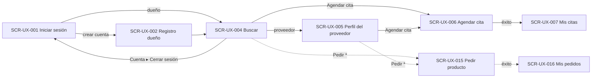

# UX Specification and Visual Design System

> **Classification legend:** **FACT** = stated in an upstream artifact or confirmed by the team · **DECISION** = decision already made upstream · **ASSUMPTION** = non-blocking interpretation used to proceed · **PROPOSAL** = design choice that still needs team review · **REQUIRES_DECISION** = open decision that affects design or implementation · **BLOCKED** = cannot be specified until a decision is made.
>
> **ID conventions:** P04 creates only `COMP-UX-`, `SCR-UX-`, `FLOW-UX-` and, for its own items, `P04-ASM-`, `P04-PROP-`, `P04-RD-` and `P04-BLK-`. IDs from v1.0 keep their meaning; new IDs continue the sequences. All other IDs (`FR-`, `NFR-`, `US-`, `AC-`, `BR-`, `EDGE-`, `DEP-`, `P02-ASM-`, `P02-Q-`, `ASSUM-`, `PRIOR-`, `P03-RISK-`, `TD-`) are upstream IDs, used with their upstream meaning. `TD-01` to `TD-20` are the team decisions of 2026-10-10 recorded in REQUIREMENTS v3.0 §1.
>
> **Language:** this document is in English. Text in quotation marks and italics, such as *"Agendar cita"*, is the Spanish interface copy (NFR-004).

---

## 1. Document Metadata and Status

| Field | Value |
|---|---|
| Product | **VetCare** (TD-02) |
| Stage | P04 — UX Design |
| Version | 2.0 |
| Generated | 2026-10-10 |
| Previous version | `history/UX_SPEC_v1.0.md` (= `UX_SPEC_V1.md`, verified by diff) |
| Sprint | `SPRINT-001` (the only sprint; `RELEASE-001`) |
| Delivery scope designed | (a) The 15 committed P0 stories: US-001, US-002, US-003, US-008, US-009, US-010, US-013, US-016, US-017, US-018, US-019, US-020, US-021, US-024 and US-034 (sign-out). (b) The **ordering package**, conditional and first in line (P1): US-027 to US-033. Its screens are designed so it can start without improvisation (TD-16). |
| Not designed | Conditional Group A (US-004, US-005, US-011, US-022, US-023, US-025, US-026) and Group B (US-006, US-007, US-012, US-014, US-015), by team decision (TD-16; P04-RD-005 resolved). |
| **Overall status** | **READY** |

### 1.1 Source Artifacts

| Artifact | Version | Status | How it was used |
|---|---|---|---|
| `REQUIREMENTS.md` + P02 `product_backlog.json` | 3.0 | READY; validation PASS_WITH_WARNINGS | Authoritative requirements, including the team decisions TD-01 to TD-20. |
| `PRIORITIZATION.md` + P03 `product_backlog.json` | 2.0 | READY; validation PASS_WITH_WARNINGS | Delivery scope: 15 committed stories, the ordering package first among conditional work. |
| `UX_SPEC_V1.md` (= UX_SPEC v1.0) | 1.0 | READY_WITH_ASSUMPTIONS; validation PASS_WITH_WARNINGS | Baseline. All v1.0 IDs are kept. |
| `SYSTEM_PROMPT.md` | — | — | Global rules. |

### 1.2 Team Decisions Applied

| Decision | Effect in v2.0 |
|---|---|
| TD-01 | All UX v1.0 assumptions (P04-ASM-001 to -017) confirmed; **all proposals P04-PROP-001 to -008 approved**: the visual direction, tokens, register, formats and accessibility target are now approved. |
| TD-02 | Wordmark and product name: *"VetCare"* (P04-RD-004 resolved). |
| TD-03, TD-05 | Sign-out in the menu of both interfaces with no confirmation (COMP-UX-021, US-034); session expiry message (MSG-SESSION). P04-RD-006 is superseded. |
| TD-04 | Password of at least 8 characters (MSG-PASSWORD; SCR-UX-002, SCR-UX-003). |
| TD-06 | Only pets of the service's species can be chosen (P04-RD-001 resolved as option A; SCR-UX-006). |
| TD-07, TD-10 | Pet species mandatory; the v1.0 option "Sin especificar" is removed; units confirmed (P04-RD-003 resolved; SCR-UX-002). |
| TD-08, TD-09 | Clinic address mandatory from sign-up and not removable; independent veterinarians offer home services only (P04-RD-002 resolved; SCR-UX-003, SCR-UX-009, SCR-UX-012). |
| TD-12, TD-13 | Ordering designed: one product per order, quantity 1–99, total shown, address per order, tabs *"Mis pedidos"* and *"Pedidos"*; stock indicator, new products available (P04-BLK-001, -002 resolved; SCR-UX-015 to SCR-UX-017). |
| TD-16 | Only the ordering package is designed beyond the committed scope (P04-RD-005 resolved). |
| TD-19 | Standing rule: new assumptions and proposals in this version (P04-ASM-018 onward, §11) are approved. |

### 1.3 Status Explanation

**READY.** Every committed story and every ordering story has screens, flows, components and states specified against one approved visual system. No upstream decision is open, every v1.0 assumption is confirmed, and every v1.0 proposal is approved. The new design choices in this version are recorded in §11 and approved by the standing rule (TD-19).

## 2. UX Objectives and Design Principles

### 2.1 Primary User Needs

| User (P01) | Need the interface must support | Source |
|---|---|---|
| Pet owner (P01-USER-001) | Find veterinary services and products from all Bogotá providers in one place, without other channels. | P01-PROB-001; FR-017; P01-SUCCESS-007 |
| Pet owner | Understand an offering at a glance: price, provider type and where the service is given. | FR-019; AC-039 |
| Pet owner | Book a one-hour appointment for one of their pets of the service's species, at the clinic or at home, with no confirmation wait. | FR-021 to FR-025; BR-014, BR-024 |
| Pet owner | Know when and where each appointment is, including cancelled ones. | FR-026; BR-035 |
| Provider: clinic or independent veterinarian (P01-USER-002, -003) | Publish its profile, working hours, services and products quickly. | FR-009 to FR-011, FR-014 |
| Provider | See what it must attend, when and where. | FR-029; P02-ASM-008 |
| Pet owner | Order one product in a chosen quantity to an address, without paying in the app, and follow the order. | FR-032, FR-034, FR-036; BR-019, BR-022 |
| Provider | See the orders to deliver, move them forward and mark products as available or not. | FR-033, FR-035, FR-037, FR-038 |
| Any user | Sign out, and be signed out after inactivity. | FR-039; NFR-005 |

### 2.2 Usability Objectives

| ID | Objective | Verifiable rule in this specification |
|---|---|---|
| UO-1 | The core journey is short. | Search → provider profile or result → booking → appointments: at most 3 screens after sign-in, and booking happens on a single screen (SCR-UX-006). |
| UO-2 | Errors are prevented first and explained second. | Controls make invalid input impossible where P02 fixes the values: species is a choice of two, hours are whole-hour selects, only offered slots are shown. Every remaining validation error names the field and the fix (§3.9). |
| UO-3 | Each account type sees only its own interface. | Two separate navigation sets (COMP-UX-011). Screens of the other type are not reachable from the navigation (FR-004, AC-013). |
| UO-4 | The interface never promises what the MVP does not do. | No copy mentions appointment confirmation, notifications, online payment or ratings (BR-014; P01-OOS-004, -007). Order screens state that payment happens outside VetCare (BR-019, TD-12). |
| UO-5 | Mobile and desktop are equal. | Every screen is specified at mobile width first and adapted at `breakpoint-md` (NFR-003). |

### 2.3 Design Principles

1. **One shared system.** Every color, size and space comes from a token in §4. Every repeated element is a component in §5. A story implementation does not create new visual values. Changes go through §12.
2. **Show only what is delivered.** Actions of Groups A and B (edit, remove, cancel or reschedule appointments) are **not rendered**; space is reserved only where noted (§6.4). The ordering screens and tabs (SCR-UX-015 to SCR-UX-017) are rendered only if the ordering package is delivered.
3. **Labels with text.** Icons always come with a visible text label. The only exception is the password visibility toggle, which has an accessible name.
4. **Status is never color-only.** Status uses a text badge (COMP-UX-009). Color only reinforces it.
5. **Plain Spanish.** Copy is short, direct and consistent (§3.9).

### 2.4 Accessibility and Responsive Considerations

- **Accessibility target — APPROVED (P04-PROP-003, TD-01):** WCAG 2.1 level AA. The rules applied in this document:
  - **Contrast:** at least 4.5:1 for text and 3:1 for UI component boundaries and focus indicators. Ratios are computed in §3.2.
  - **Focus:** visible on every interactive element, with a 2px outline in `color-primary` and a 2px offset.
  - **Keyboard:** full operation; tab order follows visual order.
  - **Forms:** every field has a programmatic label; errors are linked to their field and announced (§3.9).
  - **Touch:** targets are at least `size-control-height` (44px).
  - **Language:** the page language is declared as Spanish (`es`).
- **Responsive — FACT (NFR-003):** the product must work in Google Chrome on computers and mobile phones. Responsive rules are in §3.7; each screen states its adaptations.

---

## 3. Visual Direction

**Status: APPROVED (P04-PROP-001, TD-01).** The product name is *VetCare* (TD-02). There is no logo. If the team changes a value later, only token values change (§4); components and screens keep their references.

### 3.1 Style and Intended Perception

- **Style:** clean, light and functional. White surfaces on a very light gray page, one teal brand color, generous spacing and no decorative imagery.
- **Perception:** trustworthy and calm, like a health service; friendly but not childish; simple enough for a first-time user on a phone.
- **Why teal:** it is associated with health and care, it is different from the semantic colors (green for success, amber for warning, red for error, blue for information), and it passes AA contrast with white text.

### 3.2 Color Palette

All values are defined as tokens in §4.1. The contrast ratios below were computed with the WCAG 2.1 relative-luminance formula.

| Role | Token | Hex | Contrast | Use |
|---|---|---|---|---|
| Primary | `color-primary` | #0F766E | 5.47:1 on white (both directions) | Primary buttons, links, active navigation, selected states and focus ring. |
| Primary hover | `color-primary-hover` | #115E59 | 7.58:1 with white text | Hover and pressed state of primary elements. |
| Primary subtle | `color-primary-subtle` | #F0FDFA | `color-primary` on it: 5.25:1 | Background of a selected option. |
| Text on primary | `color-on-primary` | #FFFFFF | — | Text and icons on `color-primary`. |
| Page background | `color-bg-page` | #F9FAFB | Body text on it: 14.05:1 | Page background. |
| Surface | `color-bg-surface` | #FFFFFF | — | Cards, forms, header and navigation. |
| Muted surface | `color-bg-muted` | #F3F4F6 | Secondary text on it: 6.87:1 | Disabled fields and the neutral badge background. |
| Text, primary | `color-text-primary` | #1F2937 | 14.68:1 on white | Body text and titles. |
| Text, secondary | `color-text-secondary` | #4B5563 | 7.56:1 on white | Helper text and metadata. |
| Text, disabled | `color-text-disabled` | #9CA3AF | 2.54:1 on white | Only for disabled controls, which are exempt from contrast rules. Never for information the user needs. |
| Input border | `color-border-input` | #6B7280 | 4.83:1 on white | Borders of text fields, selects and unselected radio options. Meets the 3:1 rule. |
| Subtle border | `color-border-subtle` | #E5E7EB | Decorative | Card borders and dividers. Never the only boundary of a control. |
| Success | `color-success` / `color-success-bg` | #15803D / #F0FDF4 | 5.02:1 on white; 4.79:1 on its background | Success alerts and toasts. |
| Warning | `color-warning` / `color-warning-bg` | #B45309 / #FFFBEB | 4.84:1 on its background | Warning alerts. |
| Error | `color-error` / `color-error-bg` | #B91C1C / #FEF2F2 | 6.47:1 on white; 5.91:1 on its background | Field errors and error alerts. |
| Information | `color-info` / `color-info-bg` | #1D4ED8 / #EFF6FF | 6.16:1 on its background | Information alerts. |

**Badge colors** (text on background):

| Badge | Text / background | Ratio |
|---|---|---|
| Success | #166534 / #DCFCE7 | 6.49:1 |
| Information | #1E40AF / #DBEAFE | 7.15:1 |
| Primary | #134E4A / #CCFBF1 | 8.41:1 |
| Warning | #92400E / #FEF3C7 | 6.37:1 |
| Neutral | #374151 / #F3F4F6 | 9.37:1 |

### 3.3 Typography and Text Hierarchy

- **Font family (APPROVED, P04-PROP-007, TD-01):** the system font stack, `system-ui, -apple-system, "Segoe UI", Roboto, "Helvetica Neue", Arial, sans-serif`.
  - **Why:** no font download; it renders Spanish accents and "ñ" natively; it uses Roboto on Android Chrome and Segoe UI on Windows. This matches NFR-003 with no added dependency.
  - **Alternative if the team wants one look on all devices:** Inter, loaded from a font service. That would be a P05 decision.
- **Hierarchy:**

| Level | Size token | Weight token | Line height | Use |
|---|---|---|---|---|
| Page title (h1) | `font-size-2xl` (24px) | `font-weight-semibold` | `line-height-tight` | One per screen, in COMP-UX-019. |
| Section title (h2) | `font-size-xl` (20px) | `font-weight-semibold` | `line-height-tight` | Form sections, list groups. |
| Card title (h3) | `font-size-lg` (18px) | `font-weight-semibold` | `line-height-tight` | Offering and appointment cards. |
| Body | `font-size-md` (16px) | `font-weight-regular` | `line-height-normal` | Text, input values. |
| Label / button | `font-size-md` (16px) | `font-weight-medium` | `line-height-normal` | Field labels, buttons, header navigation links (from `breakpoint-md`). |
| Bottom tab label | `font-size-sm` (14px) | `font-weight-medium` | `line-height-normal` | Mobile bottom tab bar (below `breakpoint-md`). |
| Small | `font-size-sm` (14px) | `font-weight-regular` or `-medium` | `line-height-normal` | Helper text, error text, badges, metadata. |

- **Rules:**
  - All text uses `font-family-base`.
  - Nothing is smaller than 14px.
  - Input text is 16px on every device.
  - Use sentence case.
  - No body text is in all capitals.

### 3.4 Spacing, Sizing and Layout

- **Spacing scale:** a 4px base, with the tokens `spacing-1` (4px), `-2` (8px), `-3` (12px), `-4` (16px), `-6` (24px), `-8` (32px) and `-12` (48px). No other spacing values are used.
- **Conventions:**

| Context | Value |
|---|---|
| Page side padding | `spacing-4` on mobile, `spacing-6` from `breakpoint-md` |
| Space between page sections | `spacing-8` |
| Space between form fields | `spacing-4` |
| Label to input | `spacing-1` |
| Card padding | `spacing-4` |
| Gap between cards | `spacing-3` |
| Gap between inline buttons | `spacing-3` |

- **Sizing:**

| Element | Value |
|---|---|
| Controls (buttons, inputs, selects, chips, radio rows) | Minimum height `size-control-height` (44px) |
| Icons | `size-icon` (20px) |
| Content width | At most `size-content-max` (960px), centered |
| Forms | At most `size-form-max` (560px) |
| Header | `size-header-height` (56px) |
| Mobile bottom navigation | `size-bottom-nav-height` (64px) |

### 3.5 Borders, Radius and Elevation

| Element | Border | Radius | Shadow |
|---|---|---|---|
| Text field, select | `border-width-default` `color-border-input`; on error, `border-width-strong` `color-error` | `radius-md` | none |
| Button | none; secondary: `border-width-default` `color-primary` | `radius-md` | none |
| Radio card / slot chip | `border-width-default` `color-border-input`; when selected, `border-width-strong` `color-primary` | `radius-md` | none |
| Card | `border-width-default` `color-border-subtle` | `radius-lg` | `shadow-sm` |
| Badge | none | `radius-full` | none |
| Toast | none | `radius-md` | `shadow-md` |
| Account menu, dialog | `border-width-default` `color-border-subtle` | `radius-lg` | `shadow-md` |
| Alert | `border-width-default` in the semantic color | `radius-md` | none |

**Elevation levels:**

- **0:** page and inline elements.
- **1:** cards (`shadow-sm`).
- **2:** toasts, the account menu and the confirmation dialog (`shadow-md`). The dialog sits on a `color-overlay` backdrop.

The only modal dialog is COMP-UX-022, used to confirm cancelling an order.

### 3.6 Iconography and Images

- **Icons — APPROVED (P04-PROP-007, TD-01):** one outline icon set, at `size-icon` with about a 2px stroke, colored with `currentColor`.
  - Proposed set: Lucide (ISC license). P05 confirms how it is included.
  - Icons used: search, dog, cat, calendar, clock, map-pin, phone, mail, home (home visit), building (clinic), alert, check, eye and eye-off (password), chevrons (date navigation), user (account menu), shopping bag (orders), truck (order on its way).
- **Images:** none. No upstream requirement includes photos, avatars or uploads, so the MVP uses no images. Species uses dog and cat icons plus text.
- **Logo:** none exists. The header shows the text wordmark *"VetCare"* (TD-02).

### 3.7 Responsive Behavior

| Range | Layout |
|---|---|
| Below `breakpoint-md` (under 768px): mobile, the base design | Single column. Top header with the app wordmark only (COMP-UX-011); the page title is at the top of the content (COMP-UX-019). Account navigation is a bottom tab bar (COMP-UX-011). Primary form buttons are full width. Cards are stacked. |
| `breakpoint-md` to below `breakpoint-lg` (768–1023px) | Navigation moves into the top header as horizontal links. Content is centered at `size-content-max`. Forms are centered at `size-form-max`. Cards are in one column. |
| `breakpoint-lg` and above (1024px or more) | As above. Card lists (search results, catalog, appointments) use 2 columns. |

- **Minimum supported width:** 360px (APPROVED, part of P04-PROP-003).
- **No horizontal scrolling** at any width. The slot picker's day strip is the only horizontally scrollable element, and it also has arrow buttons.

### 3.8 Visual Hierarchy, Contrast and Readability Rules

1. **One primary button per screen region.** Other actions are secondary or tertiary.
2. **Price emphasis:** the price is shown in `font-weight-semibold`. The provider name is a link in `color-primary`.
3. **Line length:** text lines are at most about 75 characters. `size-form-max` and the card widths enforce this.
4. **Disabled controls:** they use `color-text-disabled` on `color-bg-muted`. They always come with a reason when the user needs one (for example, an ineligible pet).

### 3.9 Content and Microcopy Conventions (Spanish UI, NFR-004)

**APPROVED (P04-PROP-002, TD-01):** the register and formats below. Shared messages are defined once here; screens reference them by key.

- **Register:** informal "tú".
- **Formats (es-CO, Bogotá time, P02-ASM-007):**
  - Dates: *"lun 12 oct 2026"* in lists and *"lunes 12 de octubre"* in titles.
  - Times: 12-hour format, *"8:00 a. m."*. A slot is shown as its start time; its one-hour length is stated once in the picker.
  - Prices: Colombian pesos (P02-ASM-014), *"$ 45.000"*, with no decimals and "." as the thousands separator.
- **Required fields:** every required field has a visible marker (`*`), and a legend *"* Campo obligatorio"* appears once per form. Optional fields add *"(opcional)"* to the label.
- **Validation timing:**
  - A field is validated when it loses focus, and again on submit.
  - On submit with errors, focus moves to the first invalid field, and an error alert (COMP-UX-012) at the top of the form lists the problems as links.

**Shared message catalog:**

| Key | Spanish copy | Used when |
|---|---|---|
| MSG-REQ | *"Este campo es obligatorio."* | Any required field is empty. |
| MSG-EMAIL | *"Escribe un correo válido, por ejemplo nombre@correo.com."* | Email format invalid (P04-ASM-005). |
| MSG-PRICE | *"Escribe un precio en pesos, solo números, mayor que 0."* | Price invalid (P04-ASM-013). |
| MSG-INTEGER | *"Escribe un número entero, sin decimales."* | Pet age and height. |
| MSG-DECIMAL | *"Escribe un número; puedes usar un decimal, por ejemplo 4,5."* | Pet weight (decimal comma, es-CO). |
| MSG-PHONE | *"Usa solo números, espacios y el signo +."* | Provider phone (P04-ASM-005). |
| MSG-SLOT-GONE | *"Ese horario ya no está disponible. Elige otro."* | Booking rejected because the slot is no longer offered (EDGE-007, or it passed or left the working hours meanwhile). |
| MSG-PLACE-ADDR | *"Lugar: [dirección]"* | Where an in-clinic appointment takes place (SCR-UX-006, COMP-UX-008). |
| MSG-FORM | *"Revisa los campos marcados para continuar."* | Title of the error alert on submit. |
| MSG-NET | *"No pudimos completar la acción. Revisa tu conexión e inténtalo de nuevo."* | Network or server failure; the alert includes *"Reintentar"*. |
| MSG-LOAD | *"Cargando…"* | Accessible text of any loading indicator. |
| MSG-SAVED | *"Cambios guardados."* | Successful save (toast). |
| MSG-PASSWORD | *"La contraseña debe tener al menos 8 caracteres."* | Password shorter than 8 characters (BR-039; AC-102, AC-103). Helper text of every password field at sign-up: *"Mínimo 8 caracteres."* |
| MSG-SESSION | *"Tu sesión terminó. Inicia sesión de nuevo."* | Info alert on SCR-UX-001 after a session expires (NFR-005, AC-114). |
| MSG-QTY | *"Escribe una cantidad entre 1 y 99."* | Order quantity outside 1–99 (AC-110). |
| MSG-UNAVAILABLE | *"Este producto ya no está disponible."* | Ordering a product that became not available or was removed (AC-089, EDGE-021). |
| MSG-PAY-OUTSIDE | *"El pago se acuerda directamente con el proveedor; VetCare no procesa pagos."* | Under the total on SCR-UX-015, and as the subtitle of SCR-UX-016 (BR-019, TD-12). |
| MSG-SPECIES-ONLY | *"Este servicio es solo para [perros/gatos]."* | Reason on a disabled pet card, and in the alert when no pet matches (BR-024; AC-108, AC-109). |

**Canonical labels.** The same concept always uses the same words. The form changes only with the context:

| Concept | Badge (COMP-UX-009) | Provider form / profile | Owner choice at booking |
|---|---|---|---|
| Clinic provider | *"Clínica"* | *"Clínica veterinaria"* | — |
| Independent vet | *"Veterinario independiente"* | *"Veterinario independiente"* | — |
| Modality: clinic | *"En clínica"* | *"En mi clínica"* | *"En la clínica"* |
| Modality: home | *"A domicilio"* | *"A domicilio"* | *"A domicilio"* |
| Modality: both | *"En clínica y a domicilio"* | *"En clínica y a domicilio"* | (the owner chooses one) |
| Species | *"Perro"*, *"Gato"* | *"Perro"*, *"Gato"* | *"Perro"*, *"Gato"* |
| Appointment status | *"Programada"*, *"Cancelada"* | — | — |
| Order status (BR-023, P04-ASM-018) | *"Confirmado"* (Confirmed), *"En camino"* (Dispatched/In delivery), *"Entregado"* (Closed), *"Cancelado"* | Actions: *"Marcar como despachado"*, *"Marcar como entregado"*, *"Cancelar pedido"* | Action: *"Cancelar pedido"* |
| Product stock (BR-031) | *"No disponible"* (shown only when not available) | Switch label: *"Disponible"* | — |

**Prohibited wording:**

- *"solicitud"* and *"pendiente de confirmación"* for appointments, because booking is immediate (BR-014).
- *"pagar"* as an action in VetCare (payment happens outside the platform; MSG-PAY-OUTSIDE explains it).
- *"notificación"*.
- *"calificación"*.

---

## 4. Design Tokens

**Status: APPROVED (P04-PROP-001, TD-01)** for the values. The names and categories are the contract. This section is the **single source of truth**: components (§5) and screens (§8) reference only these names. Token names use kebab-case, `category-role[-variant]`. The format of the implementation (CSS custom properties, a theme file or another option) is decided in P05.

### 4.1 Color

| Token | Value | Intended usage |
|---|---|---|
| `color-primary` | #0F766E | Primary buttons, links, active navigation item, selected borders, focus outline. |
| `color-primary-hover` | #115E59 | Hover and pressed state of primary buttons and links. |
| `color-primary-subtle` | #F0FDFA | Background of selected radio cards, slot chips and segmented options. |
| `color-on-primary` | #FFFFFF | Text and icons on `color-primary`. |
| `color-bg-page` | #F9FAFB | Page background. |
| `color-bg-surface` | #FFFFFF | Cards, forms, header, navigation, inputs. |
| `color-bg-muted` | #F3F4F6 | Disabled controls; neutral badge background. |
| `color-text-primary` | #1F2937 | Body text, titles, input values. |
| `color-text-secondary` | #4B5563 | Helper text, metadata, inactive navigation items. |
| `color-text-disabled` | #9CA3AF | Text of disabled controls only. |
| `color-border-input` | #6B7280 | Boundaries of inputs, selects and unselected options. |
| `color-border-subtle` | #E5E7EB | Card borders, dividers. |
| `color-success` | #15803D | Success icon and border; success toast accent. |
| `color-success-bg` | #F0FDF4 | Success alert background. |
| `color-warning` | #B45309 | Warning icon and border. |
| `color-warning-bg` | #FFFBEB | Warning alert background. |
| `color-error` | #B91C1C | Error text, error borders and icons. |
| `color-error-bg` | #FEF2F2 | Error alert background. |
| `color-info` | #1D4ED8 | Information icon and border. |
| `color-info-bg` | #EFF6FF | Information alert background. |
| `color-badge-success-text` | #166534 | Success badge text (status *"Programada"*). |
| `color-badge-success-bg` | #DCFCE7 | Success badge background. |
| `color-badge-info-text` | #1E40AF | Information badge text (provider type *"Clínica"*). |
| `color-badge-info-bg` | #DBEAFE | Information badge background. |
| `color-badge-primary-text` | #134E4A | Primary badge text (provider type *"Veterinario independiente"*). |
| `color-badge-primary-bg` | #CCFBF1 | Primary badge background. |
| `color-badge-warning-text` | #92400E | Warning badge text (*"No disponible"* products). |
| `color-badge-warning-bg` | #FEF3C7 | Warning badge background. |
| `color-overlay` | rgba(17, 24, 39, 0.5) | Backdrop behind the confirmation dialog (COMP-UX-022). |
| `color-badge-neutral-text` | #374151 | Neutral badge text (species, modality, offering type, *"Cancelada"*). Background: `color-bg-muted`. |

### 4.2 Typography

| Token | Value | Intended usage |
|---|---|---|
| `font-family-base` | system-ui, -apple-system, "Segoe UI", Roboto, "Helvetica Neue", Arial, sans-serif | All text. |
| `font-size-sm` | 0.875rem (14px) | Helper, error and metadata text; badges. |
| `font-size-md` | 1rem (16px) | Body, labels, buttons, inputs. |
| `font-size-lg` | 1.125rem (18px) | Card titles; the app wordmark below `breakpoint-md`. |
| `font-size-xl` | 1.25rem (20px) | Section titles; the app wordmark from `breakpoint-md`. |
| `font-size-2xl` | 1.5rem (24px) | Page titles (COMP-UX-019). |
| `font-weight-regular` | 400 | Body text. |
| `font-weight-medium` | 500 | Labels, buttons, navigation, badges. |
| `font-weight-semibold` | 600 | Titles, prices. |
| `line-height-tight` | 1.25 | Titles. |
| `line-height-normal` | 1.5 | Body and everything else. |

### 4.3 Spacing and Size

| Token | Value | Intended usage |
|---|---|---|
| `spacing-1` | 4px | Label to input; icon to text inside badges. |
| `spacing-2` | 8px | Icon to text in buttons; gap between badges. |
| `spacing-3` | 12px | Gap between cards and between inline buttons; alert padding. |
| `spacing-4` | 16px | Card padding; gap between fields; mobile page padding. |
| `spacing-6` | 24px | Desktop page padding; padding of form sections. |
| `spacing-8` | 32px | Gap between page sections. |
| `spacing-12` | 48px | Empty-state vertical padding. |
| `size-control-height` | 44px | Minimum height of buttons, inputs, selects, chips and radio rows; minimum touch target. |
| `size-icon` | 20px | All icons. |
| `size-header-height` | 56px | Top header. |
| `size-bottom-nav-height` | 64px | Mobile bottom tab bar. |
| `size-content-max` | 960px | Maximum content width. |
| `size-form-max` | 560px | Maximum form width. |

### 4.4 Radius, Border, Shadow, Motion

| Token | Value | Intended usage |
|---|---|---|
| `radius-sm` | 4px | Corners of the focus outline on tertiary links and tabs. |
| `radius-md` | 8px | Buttons, inputs, selects, radio cards, chips, alerts, toasts. |
| `radius-lg` | 12px | Cards. |
| `radius-full` | 9999px | Badges; the switch track. |
| `border-width-default` | 1px | Default borders. |
| `border-width-strong` | 2px | Error borders, selected borders, focus outline and its offset, active-tab indicator. |
| `shadow-sm` | 0 1px 2px rgba(17, 24, 39, 0.08) | Cards. |
| `shadow-md` | 0 4px 12px rgba(17, 24, 39, 0.15) | Toasts, the account menu and the confirmation dialog. |
| `motion-duration-fast` | 150ms | Hover, focus and selection transitions. Disabled when the user prefers reduced motion. |
| `motion-delay-loading` | 300ms | Wait before a loading indicator appears, to avoid flicker. |
| `motion-duration-toast` | 5s | Time a toast stays visible. |
| `border-width-accent` | 4px | Left accent of toasts. |

### 4.5 Breakpoints

| Token | Value | Intended usage |
|---|---|---|
| `breakpoint-md` | 768px | Navigation moves from the bottom tab bar to the header; page padding becomes `spacing-6`. |
| `breakpoint-lg` | 1024px | Card lists use 2 columns. |

**Token rules:**

1. Use no raw values in components or screens.
2. A new need is first met with an existing token. If none fits, a token is added to this section through the change process in §12.
3. There are no dark-mode tokens in the MVP. No upstream requirement asks for dark mode.

---

## 5. Shared Component Library Specification

These are UI components only. They do not define backend modules, services or data entities. Each component is defined once. Screens reference the component ID and state only screen-specific behavior.

**Common interaction states:**

- **Hover:** a color change using the `-hover` token, with a `motion-duration-fast` transition.
- **Focus:** an outline of `border-width-strong` in `color-primary`, offset by the same width (`border-width-strong`), with `radius-md` corners (`radius-sm` on tertiary links and tabs); only on keyboard focus.
- **Disabled:** `color-bg-muted` background and `color-text-disabled` text; not focusable unless it has a reason to read.
- **Error:** a `border-width-strong` border in `color-error`, plus an error message (COMP-UX-002).

### COMP-UX-001 — Button

| Aspect | Specification |
|---|---|
| Purpose | Trigger an action or a navigation. |
| Used in | All screens. |
| Variants | **Primary:** `color-primary` fill and `color-on-primary` text; one per screen region. **Secondary:** `color-bg-surface` fill, a `border-width-default` `color-primary` border and `color-primary` text. **Tertiary (link):** no fill, `color-primary` text, underlined on hover. |
| Sizes | One size: height `size-control-height`, horizontal padding `spacing-4`, text `font-size-md` / `font-weight-medium`, `radius-md`. Full width below `breakpoint-md` when it is the primary action of a form. |
| States | default, hover (`color-primary-hover`), focus, disabled, **loading**. In the loading state the button keeps its width, shows a spinner (COMP-UX-015) before the label, is not clickable twice, and has `aria-busy="true"`. |
| Behavior | Form submit buttons are never disabled just to show that fields are missing. They stay enabled, and submitting shows the validation errors. This prevents a silent dead end. Exception: the search button (COMP-UX-006). |
| Accessibility | A real button element for actions and a link for navigation; the visible label is the accessible name; contrast as in §3.2. |
| Tokens | `color-primary`, `color-primary-hover`, `color-on-primary`, `color-bg-surface`, `color-bg-muted`, `color-text-disabled`, `size-control-height`, `spacing-2`, `spacing-4`, `radius-md`, `font-size-md`, `font-weight-medium`, `border-width-default`, `border-width-strong`, `motion-duration-fast` |
| Related | All SCR-UX; NFR-003, NFR-004 |

### COMP-UX-002 — Text Field

| Aspect | Specification |
|---|---|
| Purpose | Single-line text entry with label, helper text and error message. |
| Used in | SCR-UX-001, -002, -003, -006, -009, -012, -013, -015. |
| Variants | **text**; **email** (email keyboard on mobile); **password** (masked, with a show/hide toggle button labeled *"Mostrar contraseña"* / *"Ocultar contraseña"*); **tel** (phone keypad); **number** (numeric keypad, whole numbers or decimals depending on the field); **currency** (numeric keypad with a fixed *"$"* prefix, whole pesos only, shown with thousands separators after leaving the field). |
| Anatomy | Label (above; `font-size-md` / `font-weight-medium`; required marker `*`), input (height `size-control-height`, `radius-md`, `border-width-default` `color-border-input`, padding `spacing-3`), optional helper (`font-size-sm`, `color-text-secondary`), error message (`font-size-sm`, `color-error`, alert icon, below the input; it replaces the helper while shown). |
| States | default, focus, filled, error, disabled. |
| Behavior | Validation follows §3.9. The error clears as soon as the value becomes valid. The input keeps the value the user typed after a failed submit. |
| Accessibility | The label is linked to the input. The error is linked with `aria-describedby` and the input gets `aria-invalid="true"`. Required fields get `aria-required="true"`. Errors shown on submit are announced through the form alert (COMP-UX-012). |
| Tokens | `color-border-input`, `color-error`, `color-text-primary`, `color-text-secondary`, `color-bg-surface`, `color-bg-muted`, `color-text-disabled`, `size-control-height`, `spacing-1`, `spacing-3`, `radius-md`, `font-size-md`, `font-size-sm`, `font-weight-medium`, `border-width-default`, `border-width-strong` |
| Related | FR-001, FR-002, FR-003, FR-005, FR-009, FR-011, FR-014, FR-017, FR-023 |

### COMP-UX-003 — Select

| Aspect | Specification |
|---|---|
| Purpose | Choose one value from a list that is too long for radio options. |
| Used in | SCR-UX-010 (hours, inside COMP-UX-018). Reserved for any future list longer than four options. |
| Variants | **Standard**, with the browser's native dropdown so it works well on Chrome for Android. |
| States | default, focus, error, disabled. |
| Appearance | Same box, label, helper and error anatomy and tokens as COMP-UX-002, with a chevron icon at the right. |
| Accessibility | Native select element with a programmatic label. |
| Tokens | As COMP-UX-002, plus `size-icon`. |
| Related | FR-010; BR-033 |

### COMP-UX-004 — Choice Group

| Aspect | Specification |
|---|---|
| Purpose | Choose exactly one option from a small set (two to four options) with all options visible. |
| Used in | SCR-UX-001 (account type), SCR-UX-002 (pet species), SCR-UX-003 (provider type), SCR-UX-004 (species filter), SCR-UX-006 (pet, modality), SCR-UX-012 (species, modality), SCR-UX-013 (species). |
| Variants | **Segmented:** options side by side in one bordered row of equal-width segments, used for two or three short options. **Radio list:** stacked rows of a radio circle and a label, used when options need a description line. **Radio card:** a bordered card with a title and up to two lines of detail, used for the pet choice at booking. |
| States per option | default (`color-border-input` border); hover; focus; **selected** (`border-width-strong` `color-primary` border, `color-primary-subtle` background, check icon or filled circle); **disabled with reason** (`color-bg-muted`, `color-text-disabled` title, and a reason line in `color-text-secondary` that stays readable); **error** (group-level message below the group, as in COMP-UX-002). |
| Behavior | Nothing is pre-selected in a **required** group unless a screen says so, so required choices are deliberate. An **optional** group pre-selects its neutral option (none remains in v2.0: pet species is now required). When a required group is empty on submit, it shows MSG-REQ. Arrow keys move between options. |
| Accessibility | A radio group with a group label (`fieldset`/`legend` or `role="radiogroup"`). Disabled options stay readable by screen readers together with their reason. The selected state is shown by border, background and icon, not by color alone. |
| Tokens | `color-border-input`, `color-primary`, `color-primary-subtle`, `color-bg-muted`, `color-text-disabled`, `color-text-secondary`, `color-error`, `size-control-height`, `spacing-2`, `spacing-3`, `spacing-4`, `radius-md`, `border-width-default`, `border-width-strong`, `font-size-md`, `font-size-sm`, `font-weight-medium`, `motion-duration-fast` |
| Related | FR-002, FR-003, FR-005, FR-011, FR-014, FR-018, FR-022, FR-023; BR-006, BR-007, BR-024, BR-032, BR-036, BR-037 |

### COMP-UX-005 — Switch

| Aspect | Specification |
|---|---|
| Purpose | Turn a single on/off setting on or off. |
| Used in | SCR-UX-010 (*"Atiende"* for each day); SCR-UX-011 (*"Disponible"* on each product, US-033). |
| Anatomy | A track (`radius-full`; `color-primary` when on, `color-border-input` when off) with a white thumb, next to a visible text label. A status text (*"Atiende"* / *"No atiende"*) next to it changes with the state. |
| States | off, on, focus, disabled, loading (immediate mode). |
| Behavior | **Form mode** (SCR-UX-010): it takes effect in the form only; nothing is saved until the screen's save button is used. **Immediate mode** (SCR-UX-011, product availability): changing it saves at once (loading state while saving), then shows a toast; on failure it returns to its previous position and shows MSG-NET (P04-ASM-020). |
| Accessibility | `role="switch"` with `aria-checked`; label linked; the target is at least `size-control-height`. |
| Tokens | `color-primary`, `color-border-input`, `color-bg-surface`, `radius-full`, `size-control-height`, `spacing-2`, `motion-duration-fast` |
| Related | FR-010, FR-038; AC-100, AC-101 |

### COMP-UX-006 — Search Bar

| Aspect | Specification |
|---|---|
| Purpose | Text search of services and products. |
| Used in | SCR-UX-004. |
| Anatomy | COMP-UX-002 text variant with a search icon at the left and placeholder *"Busca un servicio o producto, por ejemplo: vacuna"*, followed by a COMP-UX-001 primary button *"Buscar"*. Below `breakpoint-md` the button sits to the right of the field at the same height; the label *"Buscar"* stays visible. |
| States | default, focus, filled; the button is disabled while the text is empty or only spaces (P04-ASM-006); loading while a search runs. |
| Behavior | Enter or the button submits. Leading and trailing spaces are ignored. The text stays in the field after the search. A clear button (*"Borrar búsqueda"*) appears when there is text. It empties the field but does not clear the current results. |
| Accessibility | A search landmark (`role="search"`); a visually hidden label *"Buscar servicios y productos"*. |
| Tokens | As COMP-UX-002 and COMP-UX-001. |
| Related | FR-017; US-016 |

### COMP-UX-007 — Offering Card

| Aspect | Specification |
|---|---|
| Purpose | Show one service or product in the same format everywhere. |
| Used in | SCR-UX-004 (results), SCR-UX-005 (provider profile), SCR-UX-006 (booking summary), SCR-UX-011 (provider catalog), SCR-UX-015 (order summary). |
| Content | **Title:** the offering name (`font-size-lg`, `font-weight-semibold`). **Badges** (COMP-UX-009): offering type (*"Servicio"* / *"Producto"*), species (*"Perro"* / *"Gato"*, with icon) and, for services, modality (*"En clínica"*, *"A domicilio"*, *"En clínica y a domicilio"*). **Price:** *"$ 45.000"*, `font-weight-semibold`. **Provider line** (result variant only): the provider name as a tertiary link to SCR-UX-005, followed by the provider-type badge (*"Clínica"* / *"Veterinario independiente"*). |
| Variants | **result** (SCR-UX-004): all content; actions are *"Agendar cita"* (secondary button, services only) and the provider link. **profile** (SCR-UX-005): no provider line, because the page is the provider; action *"Agendar cita"* (secondary button, services only). **summary** (SCR-UX-006): the service being booked; title as h2; provider line without link; no actions. **catalog** (SCR-UX-011): no provider line. Products show a COMP-UX-005 switch *"Disponible"* (US-033) when the ordering package is delivered. Edit and remove actions are not rendered (US-011, US-012, US-014, US-015; Groups A and B). |
| Products | **Available:** in the result and profile variants, action *"Pedir"* (secondary button) → SCR-UX-015 (US-027); there is no product detail page (P04-ASM-027). **Not available:** warning badge *"No disponible"* and no action; the product stays visible (P02-ASM-016, AC-100). If the ordering package is not delivered, products show no action. The **summary** variant also serves SCR-UX-015 (unit price, provider line without link). |
| States | default; hover (only the links and buttons react); there is no selected state. |
| Layout | Surface card: `color-bg-surface`, `border-width-default` `color-border-subtle`, `radius-lg`, `shadow-sm`, padding `spacing-4`, internal gaps `spacing-2`. On mobile the price is under the badges; from `breakpoint-md` it is aligned right on the title line. |
| Accessibility | Each card is a list item with a heading (h3) for its name. The *"Agendar cita"* and *"Pedir"* buttons have the accessible names *"Agendar cita: [nombre]"* and *"Pedir: [nombre]"*. |
| Tokens | `color-bg-surface`, `color-border-subtle`, `color-text-primary`, `color-primary`, `radius-lg`, `shadow-sm`, `spacing-2`, `spacing-4`, `font-size-lg`, `font-weight-semibold`, `border-width-default`, `breakpoint-md` |
| Related | FR-011, FR-014, FR-017, FR-019, FR-020, FR-032, FR-038; AC-039, AC-044, AC-089, AC-100; BR-002, BR-006, BR-007, BR-027, BR-030 |

### COMP-UX-008 — Appointment Card

| Aspect | Specification |
|---|---|
| Purpose | Show one appointment in the same format for both account types. |
| Used in | SCR-UX-007 (owner variant), SCR-UX-008 (provider variant). |
| Common content | **Date and time:** title line, for example *"lun 12 oct 2026 · 8:00 a. m. – 9:00 a. m."*, in `font-size-lg` / `font-weight-semibold`. **Status badge:** *"Programada"* (success) or *"Cancelada"* (neutral). **Service name.** **Modality badge.** |
| Owner variant (FR-026, AC-055) | Adds: the provider name and provider-type badge, and the pet name. Adds a **place line**: for a home visit, *"Domicilio: [dirección de la visita]"*; for an in-clinic visit, MSG-PLACE-ADDR with the clinic's address, which always exists (P04-ASM-011; BR-026, TD-08). |
| Provider variant (FR-029, AC-063) | Adds: the pet name, the owner name and, for a home visit, *"Dirección: [dirección de la visita]"* (P02-ASM-008). |
| Cancelled state | The badge *"Cancelada"*; the card keeps all its data (BR-035). The date line is in `color-text-secondary` and has no strike-through, so it stays readable. |
| Actions | None. The footer area is reserved for *"Cancelar"* and *"Reprogramar"* (US-022, US-023, US-025, US-026; conditional, not rendered). |
| Layout | Same card surface tokens as COMP-UX-007. Data rows use COMP-UX-017. |
| Accessibility | List item with an h3 that holds the date and time; the status is text, not color only. |
| Tokens | `color-bg-surface`, `color-border-subtle`, `color-text-primary`, `color-text-secondary`, `radius-lg`, `shadow-sm`, `spacing-2`, `spacing-4`, `font-size-lg`, `font-weight-semibold`, `border-width-default` |
| Related | FR-026, FR-029; AC-055, AC-056, AC-063, AC-087, AC-088; BR-035 |

### COMP-UX-009 — Badge

| Aspect | Specification |
|---|---|
| Purpose | A short, non-interactive label for a category or status. |
| Used in | COMP-UX-004, -007, -008, -020; SCR-UX-005. |
| Variants and fixed mapping | **success:** *"Programada"*. **neutral:** *"Cancelada"*, *"Servicio"*, *"Producto"*, *"Perro"*, *"Gato"*, *"En clínica"*, *"A domicilio"*, *"En clínica y a domicilio"*. **info:** *"Clínica"*. **primary:** *"Veterinario independiente"*. **warning:** *"No disponible"* (products). **Order statuses:** *"Confirmado"* (info), *"En camino"* (primary), *"Entregado"* (success), *"Cancelado"* (neutral). No other mappings may be invented. |
| Appearance | `font-size-sm`, `font-weight-medium`, padding `spacing-1` vertical and `spacing-2` horizontal, `radius-full`, an optional leading icon at `size-icon`. Colors come from the `color-badge-*` tokens (neutral background: `color-bg-muted`). |
| Accessibility | Text is always present; icons are decorative (`aria-hidden`). |
| Tokens | `color-badge-success-text`, `color-badge-success-bg`, `color-badge-info-text`, `color-badge-info-bg`, `color-badge-primary-text`, `color-badge-primary-bg`, `color-badge-warning-text`, `color-badge-warning-bg`, `color-badge-neutral-text`, `color-bg-muted`, `font-size-sm`, `font-weight-medium`, `spacing-1`, `spacing-2`, `radius-full`, `size-icon` |
| Related | BR-002, BR-007, BR-023, BR-031, BR-032, BR-035; FR-019 |

### COMP-UX-010 — Slot Picker

| Aspect | Specification |
|---|---|
| Purpose | Choose a one-hour appointment slot among those offered by the provider. |
| Used in | SCR-UX-006. |
| Anatomy | (1) A **date strip**: 7 day chips (*"lun 12"*) starting today, with *"Semana anterior"* and *"Semana siguiente"* arrow buttons; the previous arrow is disabled on the current week. (2) A **slot grid**: the start times of the selected day as chips (*"8:00 a. m."*), 3 per row on mobile and 4 per row from `breakpoint-md`. (3) A **help line**: *"Cada cita dura 1 hora. Hora de Bogotá."* |
| What is offered | Slots start on every whole hour from the day's *"Desde"* time up to one hour before its *"Hasta"* time, because an appointment lasts one hour and must fit within working hours (BR-010, BR-011). Only offered slots appear; nothing else is shown as a disabled slot. Rules applied by the data (P05 decides how):<br>• Only slots within the provider's working days and hours (BR-011, AC-046).<br>• Clinic: every slot within hours, however many bookings it already has (BR-012, AC-049).<br>• Independent veterinarian: booked slots are not shown (BR-013, AC-050).<br>• Slots whose start time has passed are not shown (P02-ASM-006, AC-051). |
| Day chip states | default; selected (`color-primary` fill, `color-on-primary` text); **no availability**: shown but disabled and **not selectable**, with the caption *"Sin horarios"* in `color-text-secondary` (6.87:1 on `color-bg-muted`, so it stays readable). This covers non-working days, fully booked days and past days; the reason is not distinguished because P02 does not need it. |
| Slot chip states | default, hover, focus, selected (as COMP-UX-004 selected), loading (the grid shows COMP-UX-015 while slots load). |
| Empty states | No day of the shown week has slots: no day is selected and the grid shows *"No hay horarios disponibles esta semana. Prueba la semana siguiente."* A selected day whose slots disappear on reload (for example after MSG-SLOT-GONE): *"No hay horarios disponibles este día. Elige otro día."* Provider with no working hours at all: the picker is replaced by an info alert (COMP-UX-012): *"Este proveedor aún no ha definido su horario de atención, por eso no es posible agendar."* (AC-026, EDGE-014). |
| Horizon | Weeks can be advanced with no upper limit (P04-ASM-009). |
| Behavior | **Initial state:** the first day with slots in the current week (today if it has slots); if none, no day is selected and the week empty message is shown. **Week change** (*"Semana anterior"* / *"Semana siguiente"*): the same rule applies to the new week; the selected slot is cleared. **Day change:** clears the selected slot. Only days with availability can be selected. |
| Accessibility | The date strip is a radio group *"Día"* and the grid is a radio group *"Hora"*. Each chip has a full accessible name, for example *"lunes 12 de octubre, 8:00 a. m. a 9:00 a. m."*. |
| Tokens | `color-primary`, `color-on-primary`, `color-primary-subtle`, `color-border-input`, `color-bg-muted`, `color-text-disabled`, `color-text-secondary`, `size-control-height`, `spacing-2`, `spacing-3`, `radius-md`, `font-size-md`, `font-size-sm`, `border-width-default`, `border-width-strong`, `breakpoint-md` |
| Related | FR-021, FR-024, FR-025; BR-010 to BR-013; AC-046, AC-049 to AC-051; EDGE-005, -006, -009, -014 |

### COMP-UX-011 — App Shell and Navigation

| Aspect | Specification |
|---|---|
| Purpose | A consistent frame for every screen and the navigation of each account type. |
| Variants | **Public** (SCR-UX-001 to -003): header with the wordmark only. **Pet owner:** tabs *"Buscar"* (SCR-UX-004), *"Mis citas"* (SCR-UX-007) and *"Mis pedidos"* (SCR-UX-016). **Provider:** tabs *"Citas"* (SCR-UX-008), *"Pedidos"* (SCR-UX-017), *"Catálogo"* (SCR-UX-011), *"Horario"* (SCR-UX-010) and *"Perfil"* (SCR-UX-009). The order tabs are rendered only if the ordering package is delivered. Signed-in variants also show the account menu (COMP-UX-021) at the right of the header. |
| Layout | Header: height `size-header-height`, `color-bg-surface`, bottom border `color-border-subtle`, wordmark at the left (`font-size-xl`, `font-weight-semibold`; `font-size-lg` below `breakpoint-md`). Below `breakpoint-md` the account navigation is a fixed bottom tab bar (height `size-bottom-nav-height`, icon above label, `font-size-sm`); page content gets bottom padding equal to that height. From `breakpoint-md`, the tabs are links in the header, right-aligned. |
| States | Tab: default (`color-text-secondary`), hover, focus, **active** (`color-primary` text and icon, plus an indicator bar of `border-width-strong`). |
| Not included | No account switcher (sign out and sign in with the other type instead). No tabs for Groups A and B; if US-005 were delivered later, *"Mis mascotas"* would need a UX increment. |
| Accessibility | Header in a `banner` landmark; tabs in a `navigation` landmark labeled *"Menú principal"*; the active tab has `aria-current="page"`; a *"Saltar al contenido"* skip link is the first focusable element. |
| Tokens | `color-bg-surface`, `color-border-subtle`, `color-text-secondary`, `color-primary`, `size-header-height`, `size-bottom-nav-height`, `size-icon`, `font-size-xl`, `font-size-lg`, `font-size-sm`, `font-weight-semibold`, `font-weight-medium`, `spacing-4`, `spacing-6`, `breakpoint-md` |
| Related | FR-004, FR-039; NFR-002, NFR-003; AC-010, AC-011, AC-013, AC-112 |

### COMP-UX-012 — Alert

| Aspect | Specification |
|---|---|
| Purpose | A persistent message inside the page: form error summaries, guidance, warnings and failures. |
| Variants | **info** (`color-info` / `color-info-bg`), **success** (`color-success` / `color-success-bg`), **warning** (`color-warning` / `color-warning-bg`), **error** (`color-error` / `color-error-bg`). Each has a matching icon, a title in `font-weight-semibold`, body text in `color-text-primary` and an optional action (a COMP-UX-001 tertiary button, for example *"Reintentar"*). |
| Layout | `border-width-default` in the semantic color, `radius-md`, padding `spacing-3`, full content width. |
| Behavior | Not dismissible; it disappears when its cause is resolved. The form error summary lists each invalid field as a link that moves focus to it. |
| Accessibility | Error alerts shown after an action have `role="alert"`; info and warning alerts present on load have no live role. |
| Tokens | `color-info`, `color-info-bg`, `color-success`, `color-success-bg`, `color-warning`, `color-warning-bg`, `color-error`, `color-error-bg`, `color-text-primary`, `border-width-default`, `radius-md`, `spacing-3`, `font-weight-semibold`, `size-icon` |
| Related | All forms; EDGE-007, EDGE-014 |

### COMP-UX-013 — Toast

| Aspect | Specification |
|---|---|
| Purpose | Short confirmation after a successful action that navigates or saves. |
| Variants | **success** only. Failures always use COMP-UX-012, so they persist. |
| Layout | `color-bg-surface`, a left accent of `border-width-accent` in `color-success`, `radius-md`, `shadow-md`, padding `spacing-3`. Bottom-center above the bottom tab bar on mobile; bottom-right from `breakpoint-md`. |
| Behavior | Disappears after `motion-duration-toast` or when its close button (*"Cerrar"*) is used; one toast at a time. |
| Accessibility | `role="status"` (polite); the timer pauses while it has hover or focus. |
| Tokens | `color-bg-surface`, `color-success`, `color-text-primary`, `radius-md`, `shadow-md`, `spacing-3`, `breakpoint-md`, `border-width-accent`, `motion-duration-toast` |
| Related | FR-009 to FR-011, FR-014, FR-022 |

### COMP-UX-014 — Empty State

| Aspect | Specification |
|---|---|
| Purpose | Explain why a list has nothing and what the user can do. |
| Anatomy | An icon (`size-icon` in `color-text-secondary`), a title (`font-size-lg`, `font-weight-semibold`), one line of explanation (`color-text-secondary`) and up to two COMP-UX-001 actions (one primary, one secondary). Centered. |
| Variants | **page** (padding `spacing-12`): a whole list or screen is empty. **compact** (padding `spacing-6`, no icon): one section inside a screen is empty. |
| Used in | SCR-UX-004, -005, -007, -008, -011, -014, -016, -017. Texts are defined per screen. On SCR-UX-014 its title is the page's h1. |
| Tokens | `color-text-secondary`, `color-text-primary`, `size-icon`, `spacing-12`, `spacing-6`, `spacing-2`, `font-size-lg`, `font-weight-semibold` |

### COMP-UX-015 — Loading Indicator

| Aspect | Specification |
|---|---|
| Purpose | Show that content or an action is in progress, the same way everywhere. |
| Used in | COMP-UX-001 (loading), COMP-UX-010, and every screen that loads data. |
| Variants | **inline spinner** (`size-icon`, in buttons and the slot grid); **section loader** (spinner plus MSG-LOAD text, centered in the area being loaded). No skeleton screens, for simplicity. |
| Behavior | Shown only if loading lasts longer than `motion-delay-loading`, to avoid flicker. The page frame and navigation stay visible. |
| Accessibility | `role="status"` with the text *"Cargando…"*; the spinner respects reduced motion (it is then shown static). |
| Tokens | `color-primary`, `color-text-secondary`, `size-icon`, `spacing-2`, `motion-delay-loading` |

### COMP-UX-016 — Form Section

| Aspect | Specification |
|---|---|
| Purpose | Group related fields under a title inside a form. |
| Used in | SCR-UX-001 (untitled), SCR-UX-002 (*"Tus datos"*, *"Tu primera mascota"*), SCR-UX-003, SCR-UX-006 (booking steps), SCR-UX-009, SCR-UX-010, SCR-UX-012, SCR-UX-013, SCR-UX-015 (*"Tu pedido"*, *"Entrega"*). |
| Variants | **titled** (default, below). **untitled:** the same card container without a `fieldset` legend, for a form with a single group whose title is already the page title (SCR-UX-001). |
| Anatomy | `fieldset` with a `legend` styled as h2 (`font-size-xl`, `font-weight-semibold`), an optional description line (`color-text-secondary`), fields separated by `spacing-4`. The section is a surface card (`color-bg-surface`, `radius-lg`, `border-width-default` `color-border-subtle`, padding `spacing-6`; padding `spacing-4` below `breakpoint-md`). |
| Tokens | `color-bg-surface`, `color-border-subtle`, `color-text-secondary`, `radius-lg`, `border-width-default`, `spacing-4`, `spacing-6`, `font-size-xl`, `font-weight-semibold` |

### COMP-UX-017 — Detail List

| Aspect | Specification |
|---|---|
| Purpose | Show read-only label/value pairs with an icon, consistently. |
| Used in | SCR-UX-005 (provider contact), SCR-UX-006 and SCR-UX-015 (inside the COMP-UX-007 summary card), SCR-UX-009 (provider type row), SCR-UX-012 (independent veterinarian modality row), SCR-UX-015 (total block), COMP-UX-008, COMP-UX-020. |
| Anatomy | Rows of an icon, a label (`color-text-secondary`, `font-size-sm`) and a value (`color-text-primary`, `font-size-md`). Phone and email values are links (P04-PROP-005). A row with no value is **omitted**, never shown empty (for example a provider address, BR-026). |
| Accessibility | A description list (`dl`). |
| Tokens | `color-text-secondary`, `color-text-primary`, `color-primary`, `font-size-sm`, `font-size-md`, `size-icon`, `spacing-2`, `spacing-3` |

### COMP-UX-018 — Day Hours Row

| Aspect | Specification |
|---|---|
| Purpose | Set whether the provider works on one day of the week and its hours. |
| Used in | SCR-UX-010 (7 rows: *"Lunes"* to *"Domingo"*). |
| Anatomy | Day name (`font-weight-medium`) · COMP-UX-005 *"Atiende"* · *"Desde"* COMP-UX-003 · *"Hasta"* COMP-UX-003. When the switch is off, both selects are hidden and the text *"No atiende"* is shown. Below `breakpoint-md` the selects go on a second line. |
| Options | *"Desde"*: whole hours from *"12:00 a. m."* to *"11:00 p. m."*. *"Hasta"*: whole hours from *"1:00 a. m."* to *"12:00 a. m. (medianoche)"*. Only whole hours are offered, so BR-033 is enforced by the control. |
| Validation | When the day is on, both selects are required (MSG-REQ). *"Hasta"* must be later than *"Desde"*: *"La hora de cierre debe ser posterior a la de apertura."* (P04-ASM-008). If a time not on the hour ever comes back from the server, the row shows *"Usa horas en punto, por ejemplo 8:00 a. m."* (AC-080, EDGE-025). |
| Tokens | As COMP-UX-003 and COMP-UX-005, plus `color-border-subtle`, `spacing-3`, `spacing-4`, `breakpoint-md` |
| Related | FR-010; BR-033; AC-025, AC-080; EDGE-025 |

### COMP-UX-019 — Page Header

| Aspect | Specification |
|---|---|
| Purpose | A consistent title area at the top of every screen's content. |
| Anatomy | An optional back link (COMP-UX-001 tertiary, chevron icon and *"Volver"*), the page title (h1, `font-size-2xl`, `font-weight-semibold`), an optional subtitle (`color-text-secondary`) and up to two actions (one primary, one secondary) at the right (from `breakpoint-md`) or stacked full width below the title (mobile). |
| Rules | Exactly one h1 per screen. The back link appears only on screens reached from another screen (SCR-UX-002, -003, -005, -006, -012, -013, -015); it returns to the previous screen. |
| Tokens | `font-size-2xl`, `font-weight-semibold`, `line-height-tight`, `color-text-primary`, `color-text-secondary`, `spacing-2`, `spacing-6`, `breakpoint-md` |

### COMP-UX-020 — Order Card

| Aspect | Specification |
|---|---|
| Purpose | Show one product order in the same format for both account types. |
| Used in | SCR-UX-016 (owner variant), SCR-UX-017 (provider variant). |
| Common content | **Title:** the product name (h3, `font-size-lg`, `font-weight-semibold`). **Status badge** (COMP-UX-009): *"Confirmado"*, *"En camino"*, *"Entregado"* or *"Cancelado"*. **Rows** (COMP-UX-017): *"Cantidad: [n]"*, *"Total: $ [precio × cantidad]"*, *"Dirección de entrega: [dirección]"*, *"Pedido el [fecha]"* (date only, P04-ASM-028). |
| Owner variant (FR-034, AC-090) | Adds the provider name and provider-type badge. Action: *"Cancelar pedido"* (COMP-UX-001 secondary) only while the status is *"Confirmado"* (BR-029, AC-096). It opens COMP-UX-022. No other action; the owner cannot change the status (AC-095). |
| Provider variant (FR-033, AC-072) | Adds the owner's name. Actions by status (BR-023, AC-092 to AC-094): *"Confirmado"* → *"Marcar como despachado"* (primary) and *"Cancelar pedido"* (secondary, opens COMP-UX-022, AC-098). *"En camino"* → *"Marcar como entregado"* (primary). *"Entregado"* and *"Cancelado"* → no actions (AC-099, EDGE-026). |
| States | default; action loading (COMP-UX-001 loading); after a successful action, the badge and actions update in place and a toast confirms (*"Pedido marcado como despachado."*, *"Pedido marcado como entregado."*, *"Pedido cancelado."*). If the action is rejected because the status already changed, an error alert *"Este pedido cambió de estado. Actualizamos la información."* appears and the card reloads. |
| Layout | Same card surface tokens as COMP-UX-007; actions in a footer row separated by `spacing-3`, full width on mobile. |
| Accessibility | List item with an h3. Action buttons include the product name in their accessible name, for example *"Marcar como despachado: [producto]"*. The status is text. |
| Tokens | `color-bg-surface`, `color-border-subtle`, `color-text-primary`, `color-text-secondary`, `radius-lg`, `shadow-sm`, `spacing-2`, `spacing-3`, `spacing-4`, `font-size-lg`, `font-weight-semibold`, `border-width-default`, `breakpoint-md` |
| Related | FR-033 to FR-037; AC-072, AC-073, AC-090 to AC-099; BR-023, BR-028, BR-029 |

### COMP-UX-021 — Account Menu

| Aspect | Specification |
|---|---|
| Purpose | Hold the sign-out action in the menu of both interfaces (TD-03, P04-ASM-024). |
| Used in | COMP-UX-011 owner and provider variants (every signed-in screen). |
| Anatomy | A COMP-UX-001 tertiary button at the right of the header, with a user icon and the visible label *"Cuenta"*. It opens a small panel (`color-bg-surface`, `border-width-default` `color-border-subtle`, `radius-lg`, `shadow-md`, padding `spacing-3`) with one line showing the account type (*"Dueño de mascota"* / *"Proveedor"*, `color-text-secondary`) and one action, *"Cerrar sesión"* (COMP-UX-001 tertiary). |
| Behavior | *"Cerrar sesión"* signs out immediately, with **no confirmation dialog** (TD-03), and shows SCR-UX-001 (AC-112). The panel closes with Escape, by clicking outside it, or by selecting the button again. |
| Accessibility | A disclosure button (`aria-expanded`, `aria-controls`). Focus moves into the panel when it opens and returns to the button when it closes. |
| Tokens | `color-bg-surface`, `color-border-subtle`, `color-text-secondary`, `radius-lg`, `shadow-md`, `spacing-3`, `border-width-default`, `size-icon`, `size-control-height` |
| Related | FR-039; BR-040; AC-112, AC-113 |

### COMP-UX-022 — Confirmation Dialog

| Aspect | Specification |
|---|---|
| Purpose | Confirm an action that cannot be undone. Used only to cancel an order (P04-ASM-019). |
| Used in | COMP-UX-020 (*"Cancelar pedido"*), on SCR-UX-016 and SCR-UX-017. |
| Anatomy | A modal panel centered on a `color-overlay` backdrop: title (h2, `font-size-xl`) *"¿Cancelar este pedido?"*; text *"El pedido quedará cancelado y no se podrá reactivar."*; buttons *"Sí, cancelar pedido"* (primary) and *"No, volver"* (secondary). Max width `size-form-max`; `radius-lg`, `shadow-md`, padding `spacing-6`. |
| Behavior | *"No, volver"*, Escape or the backdrop close it without changes. *"Sí, cancelar pedido"* shows the loading state and then closes; the card updates (COMP-UX-020). |
| Accessibility | `role="dialog"`, `aria-modal="true"`, labeled by its title; focus is trapped inside while open, starts on *"No, volver"*, and returns to the triggering button. |
| Tokens | `color-overlay`, `color-bg-surface`, `radius-lg`, `shadow-md`, `spacing-6`, `font-size-xl`, `size-form-max` |
| Related | FR-036, FR-037; AC-096, AC-098 |

---

## 6. Information Architecture and Navigation

### 6.1 Access Boundaries (FR-003, FR-004, NFR-002)

| Area | Who can reach it | Screens |
|---|---|---|
| Public | Anyone without a session | SCR-UX-001 sign-in, SCR-UX-002 owner sign-up, SCR-UX-003 provider sign-up |
| Pet owner interface | A user signed in as a pet owner | SCR-UX-004, -005, -006, -007; ordering: SCR-UX-015, -016 |
| Provider interface | A user signed in as a provider | SCR-UX-008, -009, -010, -011, -012, -013; ordering: SCR-UX-017 |
| Any signed-in user | An address of the other account type, of another user's data, or one that does not exist | SCR-UX-014 |

**Boundary rules:**

1. **Opening the app with no session**, at any address of the owner or provider interface, leads to SCR-UX-001. There is no public search or landing page. After sign-in, the user goes to the home screen of the chosen type, not back to the original address (P04-ASM-017). An unknown address with no session also leads to SCR-UX-001.
2. **A signed-in user opening SCR-UX-001, -002 or -003** is taken to the home screen of the current type. To use the other account type, the user signs out first (US-034).
3. **A signed-in user** only sees the navigation of the type they entered as. Reaching a screen of the other type, or of another user's data, shows SCR-UX-014 (AC-013, EDGE-020).
4. **Sign-out and expiry.** *"Cerrar sesión"* in the account menu (COMP-UX-021) ends the session with no confirmation and shows SCR-UX-001 (AC-112). After sign-out, protected screens, including those reached with the browser's back button, lead to SCR-UX-001 (AC-113, EDGE-031). A session also ends after 60 minutes without activity or 12 hours after sign-in (NFR-005). The next action then shows SCR-UX-001 with MSG-SESSION (AC-114, EDGE-032), and unsaved form input on the current screen is lost (P04-ASM-022).
5. **Public versus own data.** Provider profiles and offerings are visible to every signed-in owner. Owners and providers see only their own appointments and orders (NFR-002).

### 6.2 Navigation Diagram

```text
[No session]
SCR-UX-001 Iniciar sesión ─┬─ "Crear cuenta de dueño de mascota" ──► SCR-UX-002 Registro dueño ──(éxito)──► SCR-UX-004
                           ├─ "Crear cuenta de proveedor" ─────────► SCR-UX-003 Registro proveedor ─(éxito)─► SCR-UX-009
                           ├─ (entra como dueño) ──────────────────► SCR-UX-004
                           └─ (entra como proveedor) ──────────────► SCR-UX-008

[Pet owner interface]  tabs: Buscar | Mis citas | Mis pedidos*      header: Cuenta ▸ Cerrar sesión ──► SCR-UX-001
SCR-UX-004 Buscar ─┬─ provider link on a result ──► SCR-UX-005 Perfil del proveedor ─┬─ "Agendar cita" ──► SCR-UX-006
                   ├─ "Agendar cita" on a service ─────────────────────────────────┐ └─ "Pedir"* ─────────► SCR-UX-015
                   └─ "Pedir"* on an available product ──► SCR-UX-015            └──────────────────────► SCR-UX-006
SCR-UX-006 Agendar cita ──(éxito)──► SCR-UX-007 Mis citas      SCR-UX-006 ── "Volver" ──► origin (004 or 005)
SCR-UX-015 Pedir producto* ──(éxito)──► SCR-UX-016 Mis pedidos*   SCR-UX-015 ── "Volver" ──► origin (004 or 005)

[Provider interface]  tabs: Citas | Pedidos* | Catálogo | Horario | Perfil      header: Cuenta ▸ Cerrar sesión ──► SCR-UX-001
SCR-UX-008 Citas (tab, home)
SCR-UX-017 Pedidos* (tab)
SCR-UX-011 Catálogo (tab) ─┬─ "Publicar servicio" ──► SCR-UX-012 ──(éxito / Volver)──► SCR-UX-011
                           ├─ "Publicar producto" ──► SCR-UX-013 ──(éxito / Volver)──► SCR-UX-011
                           └─ switch "Disponible"* on a product (in place)
SCR-UX-010 Horario (tab)
SCR-UX-009 Perfil (tab)

[Signed in]  disallowed or unknown address ──► SCR-UX-014 ── "Ir al inicio" ──► home of the current type (004 or 008)
[No session or expired session] any address other than 001–003 ──► SCR-UX-001
* rendered only if the ordering package (US-027 to US-033) is delivered
```

### 6.3 Home Screens and Entry Points

| Event | Destination | Source |
|---|---|---|
| Sign in as a pet owner | SCR-UX-004 | AC-010 |
| Sign in as a provider | SCR-UX-008 | AC-011 |
| Pet owner sign-up succeeds | SCR-UX-004, already signed in (P04-ASM-003) | AC-001 |
| Provider sign-up succeeds | SCR-UX-009, already signed in, with the onboarding alert (P04-PROP-006) | AC-006 |
| Sign-out | SCR-UX-001, no message | AC-112 |
| Session expired | SCR-UX-001 with MSG-SESSION | AC-114 |

### 6.4 Reserved Extension Points (Not Rendered)

These points show where Groups A and B would attach, so the layout stays stable. They are **not** specifications of that work; it would need a UX increment (TD-16).

- **Owner navigation:** a tab *"Mis mascotas"* (US-005; US-004, US-006, US-007 inside it).
- **COMP-UX-008 footer:** *"Cancelar"* and *"Reprogramar"* (US-022, US-023, US-025, US-026).
- **COMP-UX-007 catalog variant action area:** edit and remove (US-011, US-012, US-014, US-015).

---

## 7. Screen Inventory

Scope values: `COMMITTED (P0)` = committed in `SPRINT-001`; `CONDITIONAL (P1, ordering)` = the ordering package, rendered only if delivered (TD-16). SCR-UX-014 supports FR-004 and NFR-002 across all screens. Sign-out (US-034) has no screen of its own: it is the account menu (COMP-UX-021) on every signed-in screen, leading to SCR-UX-001. Screen names are given in Spanish (the UI title) with an English gloss.

| Screen ID | Name | Primary user and purpose | Requirements / stories | Scope | Entry points | Main actions | Destinations | Shared components | Dependencies / decisions |
|---|---|---|---|---|---|---|---|---|---|
| SCR-UX-001 | *Iniciar sesión* (Sign in) | Any registered user; enter the interface of the chosen account type. | FR-003, FR-004, FR-039; NFR-002, NFR-005; US-003, US-034 | COMMITTED (P0) | App opened with no session; any inner address with no session (§6.1); sign-out; session expiry; links from SCR-UX-002, -003 | Choose type, enter credentials, sign in; go to sign-up | SCR-UX-004 or SCR-UX-008; SCR-UX-002; SCR-UX-003 | COMP-UX-001, -002, -004, -011, -012, -016, -019 | — |
| SCR-UX-002 | *Crear cuenta de dueño de mascota* (Owner sign-up) | New pet owner; create an account with the first pet. | FR-001, FR-005; NFR-001; US-001 | COMMITTED (P0) | SCR-UX-001 | Fill account and pet data; create account | SCR-UX-004; SCR-UX-001 (back) | COMP-UX-001, -002, -004, -011, -012, -016, -019 | TD-04, TD-07, TD-10 |
| SCR-UX-003 | *Crear cuenta de proveedor* (Provider sign-up) | New clinic or independent vet; create a provider account. | FR-002; NFR-001; US-002 | COMMITTED (P0) | SCR-UX-001 | Fill account data, provider type and, for a clinic, address; create account | SCR-UX-009; SCR-UX-001 (back) | COMP-UX-001, -002, -004, -011, -012, -016, -019 | TD-04, TD-08, TD-09 |
| SCR-UX-004 | *Buscar* (Search; owner home) | Pet owner; find services and products of all providers. | FR-017, FR-018, FR-019; US-016, US-017; FR-032 (*"Pedir"*) | COMMITTED (P0) | Owner sign-in or sign-up; tab *"Buscar"*; SCR-UX-014; SCR-UX-007 and SCR-UX-016 empty states | Search by text, filter by species, open a provider, start a booking, order a product | SCR-UX-005; SCR-UX-006; SCR-UX-015 | COMP-UX-001, -004, -006, -007, -009, -011, -012, -014, -015, -019 | — |
| SCR-UX-005 | *Perfil del proveedor* (Provider profile, owner view) | Pet owner; see a provider's details and offerings and how to reach it. | FR-020; US-018; FR-032 (*"Pedir"*) | COMMITTED (P0) | Provider link on a SCR-UX-004 result | Contact (phone, email links); start a booking; order a product | SCR-UX-006; SCR-UX-015; back to SCR-UX-004 | COMP-UX-001, -007, -009, -011, -012, -014, -015, -017, -019 | — |
| SCR-UX-006 | *Agendar cita* (Book appointment) | Pet owner; book a one-hour appointment for one pet of the service's species, at the clinic or at home. | FR-021 to FR-025; US-019, US-020 | COMMITTED (P0) | *"Agendar cita"* on a service in SCR-UX-004 or SCR-UX-005 | Choose pet, modality, address (home), day and slot; book | SCR-UX-007 (success); back to origin | COMP-UX-001, -002, -004, -009, -010, -011, -012, -013, -015, -016, -017, -019 | TD-06 |
| SCR-UX-007 | *Mis citas* (My appointments; owner) | Pet owner; see appointments with current details and status. | FR-026; NFR-002; US-021 | COMMITTED (P0) | Tab *"Mis citas"*; booking success | Read; go to search when empty | SCR-UX-004 (empty-state action) | COMP-UX-001, -008, -009, -011, -012, -013, -014, -015, -017, -019 | — |
| SCR-UX-008 | *Citas* (Appointments; provider home) | Provider; see appointments booked with it. | FR-029; NFR-002; US-024 | COMMITTED (P0) | Provider sign-in; tab *"Citas"*; SCR-UX-014 | Read; go to catalog or hours when empty | SCR-UX-011, SCR-UX-010 (empty-state actions) | COMP-UX-001, -008, -009, -011, -012, -014, -015, -017, -019 | — |
| SCR-UX-009 | *Mi perfil* (Provider profile edit) | Provider; maintain the public profile. | FR-009; US-008 | COMMITTED (P0) | Provider sign-up; tab *"Perfil"* | Edit name, phone, email, address; save | Same screen (saved) | COMP-UX-001, -002, -011, -012, -013, -016, -017, -019 | TD-08, TD-09 |
| SCR-UX-010 | *Horario de atención* (Working hours) | Provider; set working days and hours. | FR-010; US-009 | COMMITTED (P0) | Tab *"Horario"*; SCR-UX-008 empty state | Turn days on/off, set hours, save | Same screen (saved) | COMP-UX-001, -003, -005, -011, -012, -013, -016, -018, -019 | — |
| SCR-UX-011 | *Catálogo* (Provider catalog) | Provider; see its published services and products, publish new ones, mark products as available or not. | FR-011, FR-014 (list result); US-010, US-013; FR-038; US-033 (switch) | COMMITTED (P0); the availability switch is CONDITIONAL (P1, ordering) | Tab *"Catálogo"*; SCR-UX-008 empty state; return from SCR-UX-012/-013 | Publish a service; publish a product; toggle *"Disponible"* | SCR-UX-012; SCR-UX-013 | COMP-UX-001, -005, -007, -009, -011, -012, -013, -014, -015, -019 | — |
| SCR-UX-012 | *Publicar servicio* (Publish a service) | Provider; publish a service. | FR-011; US-010 | COMMITTED (P0) | SCR-UX-011 | Enter name, price, species and, for a clinic, modality; publish | SCR-UX-011 (success or back) | COMP-UX-001, -002, -004, -011, -012, -016, -019 | TD-09 |
| SCR-UX-013 | *Publicar producto* (Publish a product) | Provider; publish a product. | FR-014; US-013; AC-111 | COMMITTED (P0) | SCR-UX-011 | Enter name, price, species; publish (published as available) | SCR-UX-011 | COMP-UX-001, -002, -004, -011, -012, -016, -019 | TD-13 |
| SCR-UX-014 | *No puedes ver esta página* (Access denied / not found) | Signed-in user; explain that a page is unavailable. | FR-004; NFR-002; US-003 (AC-013) | COMMITTED (P0) | A disallowed or unknown address while signed in (§6.1) | Go to home | SCR-UX-004 or SCR-UX-008 | COMP-UX-001, -011, -014 | — |
| SCR-UX-015 | *Pedir producto* (Order a product) | Pet owner; order one available product in a quantity of 1 to 99 to an address. | FR-032; US-027 | CONDITIONAL (P1, ordering) | *"Pedir"* on an available product in SCR-UX-004 or SCR-UX-005 | Choose quantity, see total, enter address, place order | SCR-UX-016 (success); back to origin | COMP-UX-001, -002, -007, -011, -012, -013, -015, -016, -017, -019 | TD-12 |
| SCR-UX-016 | *Mis pedidos* (My orders; owner) | Pet owner; see orders and their status; cancel a confirmed order. | FR-034, FR-036; US-029, US-031 | CONDITIONAL (P1, ordering) | Tab *"Mis pedidos"*; order success | Read; cancel a confirmed order | Same screen; SCR-UX-004 (empty-state action) | COMP-UX-001, -009, -011, -012, -013, -014, -015, -017, -019, -020, -022 | TD-12 |
| SCR-UX-017 | *Pedidos* (Orders; provider) | Provider; see orders to deliver, move them forward, cancel a confirmed order. | FR-033, FR-035, FR-037; US-028, US-030, US-032 | CONDITIONAL (P1, ordering) | Tab *"Pedidos"* | Mark as dispatched, mark as delivered, cancel | Same screen | COMP-UX-001, -009, -011, -012, -013, -014, -015, -017, -019, -020, -022 | TD-12 |

**Screens deliberately not included:**

- **Forgotten password, password change and account settings:** not in any requirement.
- **Public landing page:** search requires a signed-in owner (DEP-001).
- **Pet list and pet form outside sign-up:** US-004 to US-007 are conditional and not designed (TD-16).
- **Provider public-profile preview:** not required.
- **Appointment detail and product detail pages:** the cards show all required data.

---

## 8. Screen-Level Specifications

Each screen uses COMP-UX-011 (shell) and COMP-UX-019 (page header) unless stated. Every form shows the required-field legend *"* Campo obligatorio"* once, at the top of the form (§3.9). Components are referenced by ID; only screen-specific behavior is described. Accessibility rules from §2.4 and the components apply to every screen and are not repeated.

### SCR-UX-001 — *Iniciar sesión* (Sign in)

**Acceptance criteria addressed:** AC-010, AC-011, AC-012, AC-013 (with SCR-UX-014), AC-077, AC-112 and AC-113 (destination of sign-out), AC-114 (expiry message). **Rules:** BR-001, BR-036, BR-040; EDGE-003, EDGE-031, EDGE-032.

**A. Structure and layout**

1. Public shell (COMP-UX-011).
2. COMP-UX-019, title *"Iniciar sesión"*, no back link.
3. One form card (COMP-UX-016 untitled), centered, max `size-form-max`. It contains:
   1. Account type.
   2. Email.
   3. Password.
   4. Alert area (above the fields when present): the failure alert, or the info alert MSG-SESSION after an expired session.
   5. Primary button.
4. Below the card, a *"¿No tienes cuenta?"* block with two tertiary links.

**B. Content**

| Element | Copy | Required | Component |
|---|---|---|---|
| Account type | Legend *"¿Cómo quieres entrar?"*; options *"Dueño de mascota"*, *"Proveedor"* | Yes; no default | COMP-UX-004 segmented |
| Email | *"Correo electrónico"* | Yes | COMP-UX-002 email |
| Password | *"Contraseña"* | Yes | COMP-UX-002 password |
| Submit | *"Iniciar sesión"* | — | COMP-UX-001 primary, full width on mobile |
| Links | *"Crear cuenta de dueño de mascota"*, *"Crear cuenta de proveedor"* | — | COMP-UX-001 tertiary |

**Messages:**

- Missing type: *"Elige cómo quieres entrar."*
- Missing email or password: MSG-REQ.
- Email format: MSG-EMAIL.
- Failed sign-in (AC-012, EDGE-003): error alert *"No pudimos iniciar sesión. Revisa el correo, la contraseña y el tipo de cuenta."* The message deliberately does not say which part failed, and it covers signing in as a type the user has not registered.

**C. Actions and interactions**

- **Submit:**
  1. Client validation.
  2. Button enters the loading state.
  3. On success, go to SCR-UX-004 (owner, AC-010) or SCR-UX-008 (provider, AC-011). With two accounts under one email, the type chosen decides the interface (AC-077).
  4. On failure, show the alert, keep the email and type, and clear the password.
- **Links** go to SCR-UX-002 and SCR-UX-003.

**D. States**

- **Default:** empty fields, no type selected.
- **After sign-out:** default state, no message (TD-03).
- **After session expiry:** default state plus the info alert MSG-SESSION (AC-114).
- **Loading:** the submit button.
- **Error:** field errors or the failure alert.
- **Network error:** MSG-NET alert.
- There is no empty state.

**E. Visual consistency**

- **Tokens:** `color-bg-page` behind the card.
- **Responsive:** on mobile the card has no side border and spans the content width.
- **Focus:** on load, focus goes to the account type group.

### SCR-UX-002 — *Crear cuenta de dueño de mascota* (Owner sign-up)

**Acceptance criteria addressed:** AC-001, AC-002, AC-003, AC-004, AC-074, AC-075, AC-102. AC-005 is not UX-relevant (password storage, NFR-001). **Rules:** BR-003, BR-032, BR-036, BR-037, BR-039; EDGE-001, EDGE-002, EDGE-028.

**A. Structure and layout**

1. Public shell.
2. COMP-UX-019, title *"Crear cuenta de dueño de mascota"*, back link to SCR-UX-001.
3. Form (max `size-form-max`):
   1. Error alert area.
   2. Required-field legend.
   3. COMP-UX-016 *"Tus datos"*.
   4. COMP-UX-016 *"Tu primera mascota"*.
   5. Primary button.
   6. Tertiary link *"Ya tengo cuenta. Iniciar sesión"*.

**B. Content**

*"Tus datos"*:

| Field | Label | Required | Component / validation |
|---|---|---|---|
| Name | *"Nombre"* | Yes | COMP-UX-002 text; MSG-REQ |
| Email | *"Correo electrónico"* | Yes | COMP-UX-002 email; MSG-REQ, MSG-EMAIL |
| Password | *"Contraseña"* | Yes | COMP-UX-002 password; helper *"Mínimo 8 caracteres."*; MSG-REQ, MSG-PASSWORD (BR-039, AC-102). No other rule (TD-04). |

*"Tu primera mascota"* has the description *"Necesitas registrar al menos una mascota para crear tu cuenta."* (BR-003). One pet only (P04-ASM-004).

| Field | Label | Required | Component / validation |
|---|---|---|---|
| Pet name | *"Nombre de la mascota"* | Yes (BR-037) | COMP-UX-002 text |
| Species | *"Especie"*; options *"Perro"*, *"Gato"* | Yes (BR-037, TD-07); only dog or cat (BR-032, AC-075) | COMP-UX-004 segmented, no default; missing: *"Elige la especie."* Helper: *"Algunos servicios son solo para perros o para gatos."* |
| Breed | *"Raza"* | Yes | COMP-UX-002 text, free text (P04-ASM-016) |
| Age | *"Edad (años)"* | Yes | COMP-UX-002 number, whole number of 0 or more; MSG-REQ, MSG-INTEGER. Helper: *"Si tiene menos de un año, escribe 0."* (TD-10) |
| Weight | *"Peso en kg (opcional)"* | No | COMP-UX-002 number, up to one decimal; MSG-DECIMAL (TD-10) |
| Height | *"Altura en cm (opcional)"* | No | COMP-UX-002 number, whole number; MSG-INTEGER (TD-10) |

**Messages:**

- Missing required fields, including the species: MSG-REQ on each one (AC-003).
- Password shorter than 8 characters: MSG-PASSWORD on the field (AC-102, EDGE-028).
- If the whole pet section is empty: an extra line in the error alert, *"Debes registrar al menos una mascota para crear tu cuenta."* (AC-002, EDGE-001).
- Email already used by an owner account (AC-004): error on the email field, *"Ya existe una cuenta de dueño de mascota con este correo."*, plus a link *"Iniciar sesión"*.
- An email that belongs only to a provider account is accepted (AC-074, BR-036). There is no message.

**C. Actions and interactions**

- **Submit *"Crear cuenta"*:**
  1. Client validation.
  2. Loading.
  3. On success: the account and its pet are created, the user is signed in as a pet owner (P04-ASM-003), and the app goes to SCR-UX-004 with the toast *"¡Te damos la bienvenida! Tu cuenta fue creada."* (gender-neutral)
  4. On failure: errors as above, and all entered values are kept except the password.
- **Back** returns to SCR-UX-001 without saving.

**D. States**

- **Default:** empty fields; no species selected.
- **Loading:** the button.
- **Error:** field errors and the alert, or MSG-NET.
- **Success:** navigation and toast.

**E. Visual consistency**

- Two COMP-UX-016 sections, with `spacing-8` between them.
- The button is full width on mobile.
- Numeric fields use the numeric keypad.

### SCR-UX-003 — *Crear cuenta de proveedor* (Provider sign-up)

**Acceptance criteria addressed:** AC-006, AC-007, AC-008, AC-076, AC-103, AC-104, AC-105. AC-009 is not UX-relevant (NFR-001). **Rules:** BR-001, BR-002, BR-007, BR-026, BR-036, BR-039; EDGE-002, EDGE-028.

**A. Structure and layout**

1. Public shell.
2. COMP-UX-019, title *"Crear cuenta de proveedor"*, back link to SCR-UX-001.
3. Form (max `size-form-max`):
   1. Error alert area.
   2. Legend.
   3. One COMP-UX-016 section, *"Datos de tu cuenta"*.
   4. Primary button.
   5. Sign-in link.

**B. Content**

| Field | Label | Required | Component / validation |
|---|---|---|---|
| Name | *"Nombre de la clínica o del veterinario"* | Yes | COMP-UX-002 text; MSG-REQ |
| Email | *"Correo electrónico"* | Yes | COMP-UX-002 email; MSG-REQ, MSG-EMAIL |
| Password | *"Contraseña"* | Yes | COMP-UX-002 password; helper *"Mínimo 8 caracteres."*; MSG-REQ, MSG-PASSWORD (AC-103) |
| Provider type | Legend *"¿Qué tipo de proveedor eres?"*; options: *"Clínica veterinaria"* (description *"Puedes recibir varias citas a la misma hora y ofrecer servicios en tu clínica o a domicilio."*, from BR-012, BR-007) and *"Veterinario independiente"* (description *"Recibes una cita por hora y ofreces servicios a domicilio."*, from BR-013, TD-09) | Yes; no default | COMP-UX-004 radio list; missing: *"Elige el tipo de proveedor."* (AC-007) |
| Address | *"Dirección de la clínica"*; helper *"Se mostrará en tu perfil. Podrás cambiarla, pero no borrarla."* | **Shown and required only when *"Clínica veterinaria"* is selected** (BR-026, TD-08); MSG-REQ (AC-104). Hidden for an independent veterinarian, who can add an address later in SCR-UX-009 (AC-105). | COMP-UX-002 text |

**Messages:**

- Email already used by a provider account (AC-008): *"Ya existe una cuenta de proveedor con este correo."*, plus a link *"Iniciar sesión"*.
- An email of an owner account only is accepted (AC-076).
- Password shorter than 8 characters: MSG-PASSWORD (AC-103).
- If the type changes from clinic to independent, the address field hides; its value is not sent.

**C. Actions and interactions**

- **Submit *"Crear cuenta"*:** on success, the provider account of the chosen type is created, the user is signed in as a provider (P04-ASM-003), and the app goes to SCR-UX-009 with the onboarding alert (P04-PROP-006). The failure behavior is as in SCR-UX-002.
- The provider type cannot be changed afterwards. No requirement allows it, so SCR-UX-009 shows it read-only.

**D. States**

Default, loading, error and success, as in SCR-UX-002.

**E. Visual consistency**

As SCR-UX-002. The option descriptions use `font-size-sm` / `color-text-secondary`.

### SCR-UX-004 — *Buscar* (Search; owner home)

**Acceptance criteria addressed:** AC-038, AC-039, AC-040, AC-041, AC-042, AC-043, AC-086. **Rules:** BR-006, BR-008, BR-009, BR-027, BR-032; EDGE-015; P02-ASM-013.

**A. Structure and layout**

1. Owner shell, with the tab *"Buscar"* active.
2. COMP-UX-019, title *"Buscar"*, subtitle *"Servicios y productos de veterinarias y veterinarios en Bogotá."*
3. COMP-UX-006 search bar, full content width.
4. Species filter (COMP-UX-004 segmented), labeled *"Especie"*, with the options *"Todas"* (default), *"Perro"* and *"Gato"*. It sits below the search bar and is left-aligned.
5. Results summary line, for example *"8 resultados para «vacuna»"* (`color-text-secondary`). It is announced politely when it changes.
6. Results list (COMP-UX-007, result variant): 1 column, and 2 columns from `breakpoint-lg`.

**B. Content**

- Each result shows what COMP-UX-007 defines:
  - the offering name (P02-ASM-004), type, species and price (AC-039);
  - for services, the modality (AC-039);
  - the provider name and the provider-type label (BR-002, AC-039).
  - Showing the provider name and the species is P04-ASM-007.
- Results come from all providers, with no location filter (AC-038, BR-009). The text matches names of services and products (P02-ASM-013).
- The order of results is not a UX requirement (P04-ASM-006). There is no pagination.

**C. Actions and interactions**

- **Search:** submitting text runs the search with the current species filter. The results replace the previous ones.
- **Species filter:**
  - Changing it re-applies the current search immediately. The text and the species must both match (AC-086).
  - *"Perro"* or *"Gato"* show only offerings of that species (AC-041), whatever pets the owner has (AC-042, BR-008).
  - *"Todas"* removes the filter and shows both species again (AC-043).
  - If no search has run yet, the filter choice is kept and applied to the first search.
- **Provider link** on a result goes to SCR-UX-005.
- ***"Agendar cita"*** on a service result goes to SCR-UX-006 for that service.
- ***"Pedir"*** on an available product result goes to SCR-UX-015 for that product (only if the ordering package is delivered). A product marked *"No disponible"* has no action (AC-100).
- **Returning:** coming back to this screen (back link or tab) keeps the text, the filter, the results and the scroll position within the session.

**D. States**

| State | Display |
|---|---|
| Initial (no search yet) | COMP-UX-014: title *"¿Qué necesita tu mascota?"*; text *"Escribe el nombre de un servicio o producto para ver las opciones de todos los proveedores."*; no action. |
| Loading | COMP-UX-015 section loader in the results area; the search button is loading. |
| Results | Summary line and list. |
| No results (AC-040, EDGE-015) | COMP-UX-014: title *"No encontramos resultados"*; text *"Prueba con otra palabra."* If a species filter is active, the text adds *"o quita el filtro de especie"* and an action *"Quitar filtro"* (it sets *"Todas"*). |
| Error | COMP-UX-012 error with MSG-NET and *"Reintentar"*. |

**E. Visual consistency**

- `spacing-4` between the search bar and the filter; `spacing-6` before the results.
- Cards are separated by `spacing-3`.
- On mobile the filter is full width with three equal segments.

### SCR-UX-005 — *Perfil del proveedor* (Provider profile, owner view)

**Acceptance criteria addressed:** AC-044, AC-045. **Rules:** BR-002, BR-026, BR-027, BR-030, BR-038.

**A. Structure and layout**

1. Owner shell, with the tab *"Buscar"* still active, because the profile is reached from search.
2. COMP-UX-019:
   - back link to SCR-UX-004;
   - title: the provider name;
   - subtitle area: the provider-type badge (COMP-UX-009).
3. Contact card: COMP-UX-017 inside a card.
4. Section *"Servicios"*, with a count, as a COMP-UX-007 profile-variant list.
5. Section *"Productos"*, with a count, as a COMP-UX-007 profile-variant list (*"Pedir"* on available products when ordering is delivered; *"No disponible"* badge otherwise).

From `breakpoint-lg`, the contact card spans the full content width and each offering list uses 2 columns.

**B. Content**

- **Contact rows:**
  - *"Dirección"*: always present for a clinic (TD-08); for an independent veterinarian only if it has one (AC-045, BR-026). If there is none, the row is omitted. There is no placeholder.
  - *"Teléfono"*: a call link (P04-PROP-005).
  - *"Correo"*: an email link.
  - All values come from SCR-UX-009 (BR-038).
- **Services and products:** name, species, price and, for services, modality (AC-044).
- **Working hours are not shown.** FR-020 does not include them. Availability appears at booking.

**C. Actions and interactions**

- ***"Agendar cita"*** on a service goes to SCR-UX-006.
- ***"Pedir"*** on an available product goes to SCR-UX-015.
- **Phone and email links** open the device's dialer or email app.
- **Back** returns to SCR-UX-004 with its state kept.

**D. States**

- **Loading:** COMP-UX-015 for the whole content.
- **Section without items:**
  - COMP-UX-014 compact variant.
  - Services: *"Este proveedor aún no ha publicado servicios."*
  - Products: *"Este proveedor aún no ha publicado productos."*
- **Provider not found:** SCR-UX-014.
- **Error:** MSG-NET alert.

**E. Visual consistency**

- The contact card uses the same card tokens as COMP-UX-007.
- Section titles are h2, `font-size-xl`.

### SCR-UX-006 — *Agendar cita* (Book appointment)

**Acceptance criteria addressed:** AC-046, AC-047, AC-048, AC-049, AC-050, AC-051, AC-108, AC-109 (US-019); AC-052, AC-053, AC-054 (US-020). **Rules:** BR-005, BR-007, BR-010 to BR-015, BR-024; EDGE-004 to EDGE-009, EDGE-014, EDGE-016, EDGE-030; P02-ASM-005, P02-ASM-006, P02-ASM-007.

**A. Structure and layout**

1. Owner shell.
2. COMP-UX-019, title *"Agendar cita"*, back link to the origin screen.
3. Service summary card (COMP-UX-007 summary variant; its data rows use COMP-UX-017). It shows:
   - the service name (h2);
   - the provider name and type badge;
   - the species badge;
   - the price;
   - the offered modality badge.
4. Error alert area.
5. COMP-UX-016 *"1. ¿Para qué mascota?"*
6. COMP-UX-016 *"2. ¿Dónde será la cita?"*
7. COMP-UX-016 *"3. ¿Cuándo?"*
8. Primary button *"Agendar cita"*, with the helper line *"La cita queda agendada de inmediato."* (BR-014).

The layout is one column at all widths, max `size-form-max`. The order is fixed, but the user may fill the sections in any order.

**B. Content and C. Actions and interactions (by section)**

**1. Pet (FR-022, BR-005, BR-024)**

- Uses the COMP-UX-004 radio-card variant, with one card per pet of the owner. Each card shows the pet name (title), its species and its breed.
- **Only pets of the service's species can be chosen** (TD-06, AC-108). A pet of the other species is shown **disabled with the reason** MSG-SPECIES-ONLY (for example *"Este servicio es solo para gatos."*).
- If exactly one pet can be chosen, it is pre-selected.
- Missing on submit: *"Elige una mascota."*

**2. Modality and address (FR-023, BR-007, BR-015, P02-ASM-005)**

- **Service offered only in clinic or only at home:** read-only line, *"Esta cita es en la clínica."* or *"Esta cita es a domicilio."* There is no control. Services of independent veterinarians are always home services (TD-09).
- **Service offered both ways (clinics only):** COMP-UX-004 radio list, with *"En la clínica"* and *"A domicilio"*. Nothing is pre-selected. Missing: *"Elige dónde será la cita."* (AC-054).
- **Home chosen (or the only modality):**
  - Shows COMP-UX-002 text field *"Dirección de la visita"* (required). Helper: *"Incluye barrio, torre o apartamento si aplica."*
  - Missing: MSG-REQ, and the appointment is not booked (AC-053, EDGE-008).
  - If the user switches to clinic, the field is hidden. Its value is kept on screen but not sent.
- **Clinic chosen (or the only modality):** shows the place line, MSG-PLACE-ADDR with the clinic's address, which always exists (TD-08).

**3. Day and time (FR-021, FR-024, FR-025)**

- Uses COMP-UX-010, with all of its rules (AC-046, AC-049, AC-050, AC-051).
- Missing: *"Elige un horario."*

**Submit *"Agendar cita"*:**

1. Client validation of the three sections.
2. Loading.
3. On success: the appointment is scheduled immediately, with no provider confirmation (AC-047, BR-014). The app goes to SCR-UX-007 with the toast *"Cita agendada: [día] a las [hora]."* Focus moves to the heading of the new appointment card (made programmatically focusable).
4. On failure:
   - **Slot no longer offered** (taken by another owner for an independent vet, EDGE-007; its start time passed, P02-ASM-006; or the provider's hours changed meanwhile, BR-011), for clinics and independent vets alike: error alert MSG-SLOT-GONE. The slots reload and the selection is cleared. The pet, modality and address are kept.
   - **Service no longer available:** SCR-UX-014.
   - **Network failure:** MSG-NET.

**D. States**

| State | Display |
|---|---|
| Loading | Section loaders for the pets and the slots. |
| Owner has no pets (AC-048, EDGE-004) | Sections 1 to 3 and the button are replaced by an info alert: *"Para agendar necesitas tener al menos una mascota registrada."* No link is shown, because adding a pet (US-004) is not designed. **This state is not reachable** while pet removal (US-007) is not delivered: sign-up requires a pet (BR-003). US-007 must not be delivered without US-004 (P03-RISK-008). |
| No pet of the service's species (AC-109, EDGE-030) | Section 1 shows all pets disabled, plus a warning alert: *"Ninguna de tus mascotas puede recibir este servicio."* followed by MSG-SPECIES-ONLY. Sections 2 and 3 and the button are hidden. |
| Provider has no working hours (AC-026, EDGE-014) | Section 3 shows the COMP-UX-010 info alert, and the button is hidden. |
| Selected day has no slots | COMP-UX-010 empty message. |
| Error | Alerts as above. |
| Success | Navigation and toast. |

**E. Visual consistency**

- The step numbers are part of the legend text; there are no custom step indicators.
- The summary card uses COMP-UX-007 card tokens.
- The button is full width on mobile.

### SCR-UX-007 — *Mis citas* (My appointments; owner)

**Acceptance criteria addressed:** AC-055, AC-056, AC-087. **Rules:** BR-035; NFR-002.

**A. Structure and layout**

1. Owner shell, with the tab *"Mis citas"* active.
2. COMP-UX-019, title *"Mis citas"*.
3. Group *"Próximas"*: appointments whose start time has not passed, earliest first.
4. Group *"Anteriores"*: start time has passed, most recent first (P04-ASM-010).
5. Each group is a list of COMP-UX-008 owner-variant cards: 1 column, and 2 columns from `breakpoint-lg`.

**B. Content**

- Each card shows the service, provider, pet, date and time, modality and status (AC-055), plus the place line (P04-ASM-011).
- Cancelled appointments, whoever cancelled them, stay in their group with the badge *"Cancelada"* (AC-087, BR-035).
- Only the owner's own appointments appear (NFR-002).

**C. Actions and interactions**

- Read-only in `SPRINT-001`.
- The data is loaded each time the screen opens, so changes made by the provider (for example a new time, AC-056) appear without any notification.

**D. States**

| State | Display |
|---|---|
| Loading | Section loader. |
| No appointments at all | COMP-UX-014: title *"Aún no tienes citas"*; text *"Busca un servicio para agendar tu primera cita."*; action *"Buscar servicios"* (goes to SCR-UX-004). |
| A group is empty | One line in `color-text-secondary`: *"No tienes citas próximas."* or *"No tienes citas anteriores."* |
| Error | MSG-NET alert with *"Reintentar"*. |
| Just booked | Toast from SCR-UX-006; focus on the heading of the new card. |

**E. Visual consistency**

- Group titles are h2.
- Cards are separated by `spacing-3`; groups by `spacing-8`.

### SCR-UX-008 — *Citas* (Appointments; provider home)

**Acceptance criteria addressed:** AC-063, AC-064, AC-088. **Rules:** BR-035; NFR-002; P02-ASM-008.

**A. Structure and layout**

Same as SCR-UX-007:

- provider shell, with the tab *"Citas"* active;
- title *"Citas"*;
- groups *"Próximas"* and *"Anteriores"*;
- COMP-UX-008 provider variant.

**B. Content**

- Each card shows the service, date and time, pet, owner's name, modality and status and, for home visits, the address (AC-063).
- Cancelled appointments are shown as cancelled (AC-088).
- Only this provider's appointments are listed (AC-064).

**C. Actions and interactions**

- Read-only in `SPRINT-001`.
- The data is loaded on each visit.

**D. States**

| State | Display |
|---|---|
| Loading | Section loader. |
| No appointments | COMP-UX-014: title *"Aún no tienes citas agendadas"*; text *"Para recibir citas, publica tus servicios y define tu horario de atención."*; actions *"Ir al catálogo"* (primary, SCR-UX-011) and *"Definir horario"* (secondary, SCR-UX-010). |
| A group is empty | *"No tienes citas próximas."* or *"No tienes citas anteriores."* |
| Error | MSG-NET alert. |

**E. Visual consistency**

As SCR-UX-007.

### SCR-UX-009 — *Mi perfil* (Provider profile edit)

**Acceptance criteria addressed:** AC-023, AC-024, AC-106. **Rules:** BR-025, BR-026, BR-038; EDGE-027; TD-08, TD-09.

**A. Structure and layout**

1. Provider shell, with the tab *"Perfil"* active.
2. COMP-UX-019, title *"Mi perfil"*, subtitle *"Esta información es pública para los dueños de mascotas."*
3. Onboarding alert (P04-PROP-006): info. Shown after sign-up until the profile is saved for the first time (its cause is then resolved, COMP-UX-012).
4. Form (max `size-form-max`) with one COMP-UX-016 section, *"Datos públicos"*.
5. Read-only row *"Tipo de proveedor: [Clínica veterinaria / Veterinario independiente]"* (COMP-UX-017).
6. Primary button *"Guardar cambios"*.

**B. Content**

| Field | Label | Required | Validation |
|---|---|---|---|
| Name | *"Nombre"* | Yes | MSG-REQ. Pre-filled from sign-up (P04-ASM-012). |
| Phone | *"Teléfono de contacto"* | Yes | COMP-UX-002 tel; MSG-REQ, MSG-PHONE. No rule beyond digits, spaces and "+" (P04-ASM-005). |
| Contact email | *"Correo de contacto"* | Yes | MSG-REQ, MSG-EMAIL. Pre-filled with the account email (P04-ASM-012). |
| Address (clinic) | *"Dirección de la clínica"* | Yes (BR-026, TD-08) | Pre-filled from sign-up. It can be changed but not emptied: saving it empty shows MSG-REQ and nothing is saved (AC-106, EDGE-027). Helper: *"Se mostrará en tu perfil y en las citas en la clínica."* |
| Address (independent veterinarian) | *"Dirección (opcional)"* | No (BR-026, TD-09) | Helper: *"Si quieres, escribe una dirección de referencia. Se mostrará en tu perfil."* (AC-024). |

**Onboarding alert text:** *"Completa tu perfil, define tu horario y publica tus servicios para que los dueños de mascotas puedan encontrarte y agendar contigo."*

**C. Actions and interactions**

- ***"Guardar cambios"*:**
  - On success: the toast MSG-SAVED, and the profile shows the saved data (AC-023).
  - **Independent veterinarian:** saving without an address is allowed, and the public profile then has no address row (AC-024).
  - **Clinic:** an empty address is a field error (MSG-REQ); the address can only be replaced by another one (AC-106, EDGE-027).
  - On failure: field errors or MSG-NET.
- Only one of the two address rows is rendered, according to the provider type shown in the read-only row.

**D. States**

- **Loading:** form loader.
- **Default:** fields pre-filled.
- **Error and success:** as above.

**E. Visual consistency**

Standard form layout.

### SCR-UX-010 — *Horario de atención* (Working hours)

**Acceptance criteria addressed:** AC-025, AC-026 (owner side in SCR-UX-006), AC-080, AC-081. **Rules:** BR-011, BR-033, BR-034, BR-035; EDGE-013, EDGE-014, EDGE-025; P02-ASM-010.

**A. Structure and layout**

1. Provider shell, with the tab *"Horario"* active.
2. COMP-UX-019, title *"Horario de atención"*, subtitle *"Los dueños solo podrán agendar en estos días y horas. Cada cita dura 1 hora."*
3. Info alert, only if no hours are defined: *"Aún no has definido tu horario. Mientras no lo hagas, los dueños no podrán agendar citas contigo."* (AC-026).
4. COMP-UX-016 *"Semana"*, with 7 COMP-UX-018 rows from Monday to Sunday.
5. Warning alert (P04-PROP-008): *"Si cambias tu horario, las citas próximas que queden por fuera del nuevo horario se cancelarán automáticamente y aparecerán como canceladas."* (BR-034, AC-081).
6. Primary button *"Guardar horario"*.

**B. Content**

- One range per day (P04-ASM-008), with hours that may differ by day (AC-025).
- The hours repeat every week (P02-ASM-010).

**C. Actions and interactions**

- **Toggle a day:** shows or hides its selects.
- **Save:**
  1. Row validation (COMP-UX-018).
  2. Loading.
  3. On success: the toast *"Horario guardado."* Owners are offered slots only within the saved hours (AC-025). Affected upcoming appointments are cancelled by the system (AC-081); they appear as cancelled in SCR-UX-008 and SCR-UX-007.
  4. Hours not on the hour are impossible through the controls (AC-080). The server message is defined in COMP-UX-018.
- **Leaving the screen with unsaved changes** discards them. There is no prompt; a prompt would be a new interaction not needed for the MVP.

**D. States**

- **Loading:** form loader.
- **No hours yet:** all days off, plus the info alert.
- **Error:** row errors or MSG-NET.
- **Success:** toast.

**E. Visual consistency**

- Rows are separated by `color-border-subtle` dividers.
- On mobile the selects go on a second line.

### SCR-UX-011 — *Catálogo* (Provider catalog)

**Acceptance criteria addressed:** AC-027 (the service appears in the catalog), AC-033 (the product appears in the catalog); ordering package: AC-100, AC-101, AC-111. **Rules:** BR-025, BR-030, BR-031; P02-ASM-016.

**A. Structure and layout**

1. Provider shell, with the tab *"Catálogo"* active.
2. COMP-UX-019:
   - title *"Catálogo"*;
   - subtitle *"Lo que publiques aquí aparece en tu perfil y en las búsquedas."*;
   - actions *"Publicar servicio"* (primary) and *"Publicar producto"* (secondary). They are side by side from `breakpoint-md` and stacked full width on mobile.
3. Section *"Servicios"* with a count.
4. Section *"Productos"* with a count.
5. Both sections are COMP-UX-007 catalog-variant lists.

**B. Content**

Name, type, species, price and, for services, modality. Products also show their availability when the ordering package is delivered: the switch *"Disponible"* (on) or, when off, the warning badge *"No disponible"* next to the switch.

**C. Actions and interactions**

- The two publish buttons go to SCR-UX-012 and SCR-UX-013.
- **Availability switch** (US-033; rendered only if the ordering package is delivered): COMP-UX-005 in immediate mode on each product card, labeled *"Disponible"* with status text *"Disponible"* / *"No disponible"*.
  - Turning it off saves at once; toast *"Producto marcado como no disponible."* Owners still see the product but cannot order it (AC-100, P02-ASM-016).
  - Turning it on saves at once; toast *"Producto marcado como disponible."* Owners can order it again (AC-101).
  - On failure, the switch returns to its previous position and MSG-NET appears (P04-ASM-020).
  - A newly published product appears with the switch on (AC-111).
- Services have no actions, and products have no actions other than the switch; edit and remove are not rendered (§6.4).

**D. States**

- **Loading.**
- **Empty section:** COMP-UX-014 compact variant, with *"Aún no has publicado servicios."* or *"Aún no has publicado productos."* There is no extra action; the header buttons are visible.
- **Error:** MSG-NET.
- **After publishing:** the toast comes from SCR-UX-012 or SCR-UX-013, and the new item appears in its section.

**E. Visual consistency**

Lists use 1 column, and 2 from `breakpoint-lg`.

### SCR-UX-012 — *Publicar servicio* (Publish a service)

**Acceptance criteria addressed:** AC-027, AC-028, AC-029, AC-082, AC-107. **Rules:** BR-006, BR-007, BR-025, BR-027, BR-032; EDGE-017 (cannot occur, TD-08, TD-09); P02-ASM-004, P02-ASM-014.

**A. Structure and layout**

1. Provider shell.
2. COMP-UX-019, title *"Publicar servicio"*, back link to SCR-UX-011.
3. Form (max `size-form-max`):
   1. Error alert area.
   2. Legend.
   3. One COMP-UX-016 section.
   4. Primary button *"Publicar servicio"*.

**B. Content**

| Field | Label | Required | Component / validation |
|---|---|---|---|
| Name | *"Nombre del servicio"*; placeholder *"Ej.: Consulta general"* | Yes | COMP-UX-002 text; MSG-REQ |
| Price | *"Precio"* | Yes (P02-ASM-014) | COMP-UX-002 currency; missing: MSG-REQ; invalid: MSG-PRICE (P04-ASM-013) (AC-082) |
| Species | *"¿Para qué especie es?"*; options *"Perro"*, *"Gato"* | Yes, exactly one (BR-006) | COMP-UX-004 segmented, no default; missing: *"Elige una especie."* (AC-028) |
| Modality (clinic only) | *"¿Dónde ofreces este servicio?"*; options *"En mi clínica"*, *"A domicilio"*, *"En clínica y a domicilio"* | Yes (BR-007) | COMP-UX-004 radio list, no default; missing: *"Elige dónde ofreces el servicio."* (AC-029) |
| Modality (independent veterinarian) | Read-only row (COMP-UX-017): *"Ofreces este servicio a domicilio."* | — | No control is rendered; the service is saved as home only (AC-107, BR-007, TD-09). |

**Modality by provider type (TD-08, TD-09).** A clinic always has an address, so all three options are enabled. An independent veterinarian offers home services only, so the modality control is replaced by the read-only row. EDGE-017 (no address but in-clinic service) can no longer occur.

**C. Actions and interactions**

- **Publish:**
  - On success: the service appears in the catalog, on the profile and in search results (AC-027). The app goes to SCR-UX-011 with the toast *"Servicio publicado."*
  - On failure: field errors or MSG-NET, and the values are kept.
- **Back:** returns to SCR-UX-011 without saving.

**D. States**

Default (empty), loading, error and success.

**E. Visual consistency**

Standard form.

### SCR-UX-013 — *Publicar producto* (Publish a product)

**Acceptance criteria addressed:** AC-033, AC-034, AC-084, AC-111. **Rules:** BR-006, BR-025, BR-027, BR-031, BR-032.

**A. Structure and layout**

As SCR-UX-012, with the title *"Publicar producto"* and the button *"Publicar producto"*.

**B. Content**

| Field | Label | Required | Validation |
|---|---|---|---|
| Name | *"Nombre del producto"*; placeholder *"Ej.: Concentrado para gato 2 kg"* | Yes | MSG-REQ |
| Price | *"Precio"* | Yes | MSG-REQ, MSG-PRICE (AC-084) |
| Species | *"¿Para qué especie es?"*; *"Perro"* / *"Gato"* | Yes, exactly one | *"Elige una especie."* (AC-034) |

There is no stock field: every new product is published as available (AC-111, BR-031, TD-13). Availability is changed later with the switch in SCR-UX-011 (US-033).

**C. Actions and interactions**

- **On success:** the product appears in the catalog, on the profile and in search results (AC-033). The app goes to SCR-UX-011 with the toast *"Producto publicado."*
- **Failure and back:** as in SCR-UX-012.

**D. States**

As SCR-UX-012.

**E. Visual consistency**

Standard form.

### SCR-UX-014 — *No puedes ver esta página* (Access denied / not found)

**Acceptance criteria addressed:** AC-013. **Rules:** FR-004, NFR-002; EDGE-020.

**A. Structure and layout**

- The shell of the current session type (owner or provider).
- A centered COMP-UX-014 (page variant). Exception to the §8 preamble: there is no COMP-UX-019; the COMP-UX-014 title is the screen's only h1.

**B. Content**

- Title: *"No puedes ver esta página"*.
- Text: *"La página no existe o no está disponible para tu tipo de cuenta."*
- One message covers both cases, so the screen does not reveal whether something exists.

**C. Actions and interactions**

The primary button *"Ir al inicio"* goes to SCR-UX-004 (owner) or SCR-UX-008 (provider). With no session, users never see this screen (§6.1, rule 1).

**D. States**

Static.

**E. Visual consistency**

COMP-UX-014 tokens.

### SCR-UX-015 — *Pedir producto* (Order a product)

**Scope:** CONDITIONAL (P1, ordering package). Rendered only if US-027 is delivered (TD-16). **Release slice (P04-ASM-029):** the *"Pedir"* action and this screen are shown to users only together with SCR-UX-016 (US-029) and SCR-UX-017 (US-028), so that a placed order always has a destination and the provider can see it. US-033 can be released alone.

**Acceptance criteria addressed:** AC-069, AC-070, AC-071, AC-089, AC-110. **Rules:** BR-019, BR-020, BR-021, BR-022, BR-027, BR-028, BR-030; EDGE-018, EDGE-021, EDGE-029; TD-12.

**A. Structure and layout**

1. Owner shell, with no tab active.
2. COMP-UX-019, title *"Pedir producto"*, back link to the origin (SCR-UX-004 or SCR-UX-005).
3. COMP-UX-007 summary variant: product name, species badge, unit price, provider line without link.
4. Form (max `size-form-max`):
   1. Error alert area.
   2. Legend.
   3. COMP-UX-016 section *"Tu pedido"*: quantity, then the total block.
   4. COMP-UX-016 section *"Entrega"*: delivery address.
   5. Primary button *"Hacer pedido"*, full width on mobile.

**B. Content**

| Field | Label | Required | Component / validation |
|---|---|---|---|
| Quantity | *"Cantidad"* | Yes | COMP-UX-002 number (whole numbers), default 1 (P04-ASM-021); helper *"Entre 1 y 99."*; out of range or not a whole number: MSG-QTY (AC-110, EDGE-029). |
| Delivery address | *"Dirección de entrega"*; placeholder *"Ej.: Calle 45 # 12-30, apto 301"* | Yes (BR-020) | COMP-UX-002 text, empty each time (P04-ASM-021); missing: MSG-REQ (AC-070, EDGE-018). |

**Total block** (COMP-UX-017 rows, updated as the quantity changes): *"Precio unitario: $ [precio]"*, *"Total: $ [precio × cantidad]"* (`font-size-lg`, `font-weight-semibold`), followed by MSG-PAY-OUTSIDE in `color-text-secondary` (BR-019, BR-022). When the quantity is invalid, the total shows *"—"* instead of a number.

No pet is asked for: ordering does not require a registered pet (AC-071, BR-021).

**C. Actions and interactions**

- ***"Hacer pedido"*:**
  1. Field validation (quantity, address).
  2. Loading state on the button.
  3. On success: the order is created with status *"Confirmado"* (AC-069; no request, reservation or payment step, BR-019). The app goes to SCR-UX-016 with the toast *"Pedido realizado. El proveedor lo entregará en la dirección indicada."* (P04-ASM-025).
  4. If the product became not available or was removed meanwhile: an error alert with MSG-UNAVAILABLE; the button is disabled and the back link stays (AC-089, EDGE-021).
  5. Other failures: field errors or MSG-NET; the values are kept.
- **Back:** returns to the origin without ordering.
- Delivery is arranged outside the platform; the screen shows no delivery date or tracking (BR-028).

**D. States**

| State | Display |
|---|---|
| Loading (product data) | Section loader. |
| Default | Quantity 1, total equal to the unit price, empty address. |
| Invalid quantity | MSG-QTY under the field; total *"—"*. |
| Product not available (on opening or on submit) | Warning alert MSG-UNAVAILABLE; the form is disabled; back link available. |
| Error | Field errors with MSG-FORM, or MSG-NET. |
| Success | Navigation to SCR-UX-016 with the toast. |

**E. Visual consistency**

- Same form layout as SCR-UX-006: summary card on top, then sections.
- The total uses the same price style as COMP-UX-007.

### SCR-UX-016 — *Mis pedidos* (My orders; owner)

**Scope:** CONDITIONAL (P1, ordering package). Rendered only if US-029 (and US-031 for the cancel action) is delivered.

**Acceptance criteria addressed:** AC-090, AC-091, AC-095, AC-096, AC-097; AC-085 (orders of a removed product keep their status). **Rules:** BR-023, BR-029; NFR-002; P02-ASM-011, P02-ASM-012; EDGE-022, EDGE-024.

**A. Structure and layout**

1. Owner shell, with the tab *"Mis pedidos"* active.
2. COMP-UX-019, title *"Mis pedidos"*, subtitle MSG-PAY-OUTSIDE.
3. Group *"En curso"*: orders *"Confirmado"* or *"En camino"*, most recent first (P04-ASM-023).
4. Group *"Finalizados"*: orders *"Entregado"* or *"Cancelado"*, most recent first.
5. Each group is a list of COMP-UX-020 owner-variant cards: 1 column, and 2 columns from `breakpoint-lg`.

**B. Content**

- Each card shows the product, quantity, total, delivery address, provider, order date and status (AC-090).
- Only the owner's own orders appear (AC-091, NFR-002).
- Orders of a product removed later keep their data and status (AC-085, P02-ASM-012).

**C. Actions and interactions**

- ***"Cancelar pedido"*** (US-031): only on *"Confirmado"* cards (BR-029). It opens COMP-UX-022; on confirmation the card shows *"Cancelado"*, moves to *"Finalizados"*, and the toast *"Pedido cancelado."* appears (AC-096). On *"En camino"* and *"Entregado"* cards the action is not rendered (AC-097, EDGE-022).
- If the provider changed the status meanwhile, the server rejects the cancellation and the card shows the COMP-UX-020 status-changed alert and reloads.
- The owner has no action that changes the status (AC-095, EDGE-024).
- The data is loaded each time the screen opens.

**D. States**

| State | Display |
|---|---|
| Loading | Section loader. |
| No orders at all | COMP-UX-014: title *"Aún no tienes pedidos"*; text *"Busca un producto para hacer tu primer pedido."*; action *"Buscar productos"* (goes to SCR-UX-004). |
| A group is empty | One line in `color-text-secondary`: *"No tienes pedidos en curso."* or *"No tienes pedidos finalizados."* |
| Error | MSG-NET alert with *"Reintentar"*. |
| Just ordered | Toast from SCR-UX-015; focus on the heading of the new card. |

**E. Visual consistency**

As SCR-UX-007: group titles h2, cards separated by `spacing-3`, groups by `spacing-8`.

### SCR-UX-017 — *Pedidos* (Orders; provider)

**Scope:** CONDITIONAL (P1, ordering package). Rendered only if US-028 is delivered; the status and cancel actions need US-030 and US-032.

**Acceptance criteria addressed:** AC-072, AC-073, AC-092, AC-093, AC-094, AC-098, AC-099; AC-085. **Rules:** BR-023, BR-028, BR-029; NFR-002; P02-ASM-011, P02-ASM-012, P02-ASM-015; EDGE-022, EDGE-023, EDGE-026.

**A. Structure and layout**

Same as SCR-UX-016:

- provider shell, with the tab *"Pedidos"* active;
- title *"Pedidos"*, subtitle *"Entrega los productos por tu cuenta y actualiza el estado aquí."*;
- groups *"En curso"* and *"Finalizados"* (P04-ASM-023);
- COMP-UX-020 provider variant.

**B. Content**

- Each card shows the product, quantity, total, owner's name, delivery address, order date and status (AC-072).
- Only orders placed with this provider are listed (AC-073, NFR-002).

**C. Actions and interactions**

| Card status | Actions | Result |
|---|---|---|
| *"Confirmado"* | *"Marcar como despachado"* (primary); *"Cancelar pedido"* (secondary, COMP-UX-022) | Status *"En camino"*, toast *"Pedido marcado como despachado."* (AC-092); or *"Cancelado"*, toast *"Pedido cancelado."* (AC-098) |
| *"En camino"* | *"Marcar como entregado"* (primary) | Status *"Entregado"*, card moves to *"Finalizados"*, toast *"Pedido marcado como entregado."* (AC-093) |
| *"Entregado"*, *"Cancelado"* | None | — (AC-099, EDGE-026) |

- Moving back or skipping a status is impossible through the controls (AC-094, EDGE-023); if the server rejects a change because the status changed meanwhile (for example the owner cancelled), the card shows the COMP-UX-020 status-changed alert and reloads.
- *"Marcar como despachado"* and *"Marcar como entregado"* have no confirmation: each is one step forward, and the next status is visible right away (P04-ASM-019 limits the dialog to cancellation).

**D. States**

| State | Display |
|---|---|
| Loading | Section loader. |
| No orders | COMP-UX-014: title *"Aún no tienes pedidos"*; text *"Cuando un dueño de mascota pida uno de tus productos, aparecerá aquí."*; action *"Ir al catálogo"* (SCR-UX-011). |
| A group is empty | *"No tienes pedidos en curso."* or *"No tienes pedidos finalizados."* |
| Error | MSG-NET alert. |

**E. Visual consistency**

As SCR-UX-016.

---

## 9. User Flows

Each flow lists numbered user actions (**U**) and system responses (**S**). Screens and messages are those of §8. The core journey of the MVP (P01-SUCCESS-007) is FLOW-UX-001 or FLOW-UX-003, then FLOW-UX-008, FLOW-UX-009 and FLOW-UX-010 or FLOW-UX-011, then FLOW-UX-012. FLOW-UX-015 to FLOW-UX-018 cover the ordering package (CONDITIONAL, P1) and apply only if it is delivered. FLOW-UX-019 and FLOW-UX-020 cover sign-out and session expiry (committed).



`*` Dashed arrows: ordering package, rendered only if delivered.

### FLOW-UX-001 — Pet Owner Signs Up with the First Pet

- **Goal:** create a pet owner account with one pet and enter the owner interface.
- **User:** a new pet owner.
- **Preconditions:** no session.
- **Start:** SCR-UX-001.
- **IDs:** SCR-UX-001, SCR-UX-002, SCR-UX-004; US-001; FR-001, FR-005; AC-001 to AC-004, AC-074, AC-075, AC-102.

**Steps:**

1. **U:** selects *"Crear cuenta de dueño de mascota"*. **S:** shows SCR-UX-002.
2. **U:** fills in name, email and a password of at least 8 characters.
3. **U:** fills in the pet's name, species (dog or cat), breed and age in whole years, and optionally weight (kg, one decimal) and height (whole cm) (BR-037).
4. **U:** selects *"Crear cuenta"*. **S:** validates and creates the account with the pet.
5. **S:** signs the user in as a pet owner and shows SCR-UX-004 with the welcome toast.

**Completion:** the owner is on SCR-UX-004, signed in.

**Alternatives:**

- **1a.** The user already has an account and selects *"Iniciar sesión"* → FLOW-UX-003.
- **4a.** The email belongs to a provider account → the account is created normally (AC-074).

**Errors and recovery:**

- **4b.** Required fields are missing → field errors, the error alert and focus on the first error. The user corrects them and resubmits (AC-003).
- **4c.** The pet section is empty → the alert adds *"Debes registrar al menos una mascota…"* (AC-002).
- **4d.** The email already has an owner account → email error with a sign-in link (AC-004).
- **4f.** Password shorter than 8 characters → MSG-PASSWORD (AC-102, EDGE-028).
- **4e.** Network failure → MSG-NET. The values are kept, and the user retries.

### FLOW-UX-002 — Provider Signs Up

- **Goal:** create a provider account of the right type and start setting it up.
- **User:** a new clinic or independent veterinarian.
- **Preconditions:** no session.
- **Start:** SCR-UX-001.
- **IDs:** SCR-UX-001, SCR-UX-003, SCR-UX-009; US-002; FR-002; AC-006 to AC-008, AC-076, AC-103 to AC-105.

**Steps:**

1. **U:** selects *"Crear cuenta de proveedor"*. **S:** shows SCR-UX-003.
2. **U:** fills in name, email and a password of at least 8 characters, and chooses *"Clínica veterinaria"* or *"Veterinario independiente"*.
   - **Clinic:** the field *"Dirección de la clínica"* appears and is filled in (required, AC-104).
   - **Independent veterinarian:** no address is asked for (AC-105).
3. **U:** selects *"Crear cuenta"*. **S:** creates the account, signs the user in as a provider and shows SCR-UX-009 with the onboarding alert.

**Completion:** the provider is on SCR-UX-009 and continues with FLOW-UX-004.

**Alternatives:**

- **2a.** The email belongs to an owner account → the account is created (AC-076).

**Errors and recovery:**

- **3a.** No type was chosen → *"Elige el tipo de proveedor."* (AC-007).
- **3b.** The email already has a provider account → email error with a sign-in link (AC-008).
- **3c.** Network failure → MSG-NET.
- **3d.** Clinic without an address → MSG-REQ on the address (AC-104).
- **3e.** Password shorter than 8 characters → MSG-PASSWORD (AC-103, EDGE-028).

### FLOW-UX-003 — Sign In Choosing the Account Type

- **Goal:** enter the interface of the chosen account type.
- **User:** any registered user, including a person with both account types under one email.
- **Preconditions:** no session.
- **Start:** SCR-UX-001.
- **IDs:** SCR-UX-001, SCR-UX-004, SCR-UX-008, SCR-UX-014; US-003; FR-003, FR-004; AC-010 to AC-013, AC-077.

**Steps:**

1. **U:** chooses *"Dueño de mascota"* or *"Proveedor"*.
2. **U:** enters email and password, and selects *"Iniciar sesión"*.
3. **S:** grants access and shows SCR-UX-004 (owner, AC-010) or SCR-UX-008 (provider, AC-011). With two accounts, the type chosen decides (AC-077).

**Completion:** the user is on the home screen of that type, with that type's navigation only.

**Errors and recovery:**

- **3a.** Wrong email or password, or a type the user has not registered → the generic failure alert. The password is cleared, and the user retries (AC-012).
- **3b.** No type was chosen → *"Elige cómo quieres entrar."*
- **Later.** The signed-in user opens an address of the other type → SCR-UX-014, then *"Ir al inicio"* (AC-013).
- **Later.** The signed-in user opens SCR-UX-001 → taken to the home screen of the current type (§6.1, rule 2).

**Switching type:** to enter as the other account type, the user signs out (FLOW-UX-019) and signs in again choosing the other type (AC-077).

### FLOW-UX-004 — Provider Maintains the Public Profile

- **Goal:** publish the name, phone, email and address (required for a clinic, optional for an independent veterinarian).
- **User:** a provider.
- **Preconditions:** signed in as a provider.
- **Start:** SCR-UX-009 (after sign-up or from the tab *"Perfil"*).
- **IDs:** SCR-UX-009, SCR-UX-005; US-008; FR-009; AC-023, AC-024, AC-106; EDGE-027.

**Steps:**

1. **U:** reviews the pre-filled name, contact email and (clinic) address, and enters the phone and, for an independent veterinarian, optionally an address.
2. **U:** selects *"Guardar cambios"*.
3. **S:** saves the profile and shows MSG-SAVED. Owners see the data on SCR-UX-005 (AC-023).

**Completion:** the profile is saved.

**Alternatives:**

- **1a.** Independent veterinarian with no address → saved; the public profile has no address row (AC-024).
- **1b.** Clinic changes its address → saved; the new address appears on the profile and on in-clinic appointments.

**Errors and recovery:**

- **2a.** Required field missing or email invalid → field errors.
- **2b.** Network failure → MSG-NET.
- **2c.** Clinic empties its address → MSG-REQ; nothing is saved (AC-106, EDGE-027).

### FLOW-UX-005 — Provider Sets Working Days and Hours

- **Goal:** define when owners can book.
- **User:** a provider.
- **Preconditions:** signed in as a provider.
- **Start:** SCR-UX-010.
- **IDs:** SCR-UX-010, SCR-UX-006, SCR-UX-007, SCR-UX-008; US-009; FR-010; AC-025, AC-026, AC-080, AC-081.

**Steps:**

1. **U:** for each working day, turns on *"Atiende"* and chooses *"Desde"* and *"Hasta"* in whole hours.
2. **U:** selects *"Guardar horario"*.
3. **S:** saves and shows *"Horario guardado."* Owners are offered slots only within these hours (AC-025).

**Completion:** the hours are saved.

**Alternatives:**

- **1a.** Different hours on different days → allowed (AC-025).
- **3a.** The change leaves upcoming appointments outside the hours → the system cancels them, and they appear as *"Cancelada"* in SCR-UX-008 and SCR-UX-007 (AC-081). The static warning on the screen states this before saving.

**Errors and recovery:**

- **2a.** A day is on with a missing time → MSG-REQ.
- **2b.** End not after start → the row error.
- **2c.** A server rejects a time not on the hour → the row error (AC-080).
- **2d.** Network failure → MSG-NET.

**Note:** before the first save, owners cannot book this provider (AC-026; FLOW-UX-010, error 3c).

### FLOW-UX-006 — Provider Publishes a Service

- **Goal:** publish a service that owners can find and book.
- **User:** a provider.
- **Preconditions:** signed in as a provider.
- **Start:** SCR-UX-011.
- **IDs:** SCR-UX-011, SCR-UX-012; US-010; FR-011; AC-027 to AC-029, AC-082, AC-107.

**Steps:**

1. **U:** selects *"Publicar servicio"*. **S:** shows SCR-UX-012.
2. **U:** enters the name and price, and chooses the species. A clinic also chooses where the service is offered; an independent veterinarian sees *"Ofreces este servicio a domicilio."* and chooses nothing (AC-107).
3. **U:** selects *"Publicar servicio"*.
4. **S:** publishes and returns to SCR-UX-011 with *"Servicio publicado."* The service is in the catalog, on the profile and in search (AC-027).

**Completion:** the service is listed in SCR-UX-011.

**Errors and recovery:**

- **3a.** Species missing → *"Elige una especie."* (AC-028).
- **3b.** Modality missing → its message (AC-029).
- **3c.** Price missing or invalid → MSG-REQ or MSG-PRICE (AC-082).
- **3d.** Network failure → MSG-NET.


### FLOW-UX-007 — Provider Publishes a Product

- **Goal:** publish a product that owners can find.
- **User:** a provider.
- **Preconditions:** signed in as a provider.
- **Start:** SCR-UX-011.
- **IDs:** SCR-UX-011, SCR-UX-013; US-013; FR-014; AC-033, AC-034, AC-084, AC-111.

**Steps:**

1. **U:** selects *"Publicar producto"*.
2. **U:** enters the name and price, and chooses the species.
3. **U:** publishes.
4. **S:** returns to SCR-UX-011 with *"Producto publicado."* The product is in the catalog, on the profile and in search (AC-033), published as available (AC-111).

**Completion:** the product is listed.

**Errors and recovery:**

- **3a.** Species missing → *"Elige una especie."* (AC-034).
- **3b.** Price missing or invalid (AC-084).
- **3c.** Network failure.

**Note:** owners can order products only if the ordering package is delivered (FLOW-UX-015); otherwise products are shown without an action.

### FLOW-UX-008 — Pet Owner Searches and Filters by Species

- **Goal:** find relevant services and products from all providers.
- **User:** a pet owner.
- **Preconditions:** signed in as an owner.
- **Start:** SCR-UX-004.
- **IDs:** SCR-UX-004, SCR-UX-005, SCR-UX-006; US-016, US-017; FR-017 to FR-019; AC-038 to AC-043, AC-086.

**Steps:**

1. **U:** types text, for example *"vacuna"*, and selects *"Buscar"*.
2. **S:** shows the matching results from all providers, each with its price, provider type and, for services, modality (AC-038, AC-039).
3. **U:** selects *"Gato"*. **S:** shows only the cat offerings that match the text (AC-041, AC-086).
4. **U:** selects *"Todas"*. **S:** shows both species again (AC-043).
5. **U:** opens a provider (→ FLOW-UX-009), selects *"Agendar cita"* on a service (→ FLOW-UX-010 or FLOW-UX-011) or, if the ordering package is delivered, *"Pedir"* on an available product (→ FLOW-UX-015).

**Completion:** the owner reaches SCR-UX-005 or SCR-UX-006.

**Alternatives:**

- **3a.** The owner has no cat → cat offerings are shown anyway (AC-042).
- **3b.** The filter is chosen before the first search → it is applied to the first search.

**Errors and recovery:**

- **2a.** No matches → the empty state, with *"Quitar filtro"* if a filter is active (AC-040).
- **2b.** Network failure → MSG-NET with *"Reintentar"*.

### FLOW-UX-009 — Pet Owner Views a Provider's Profile

- **Goal:** see a provider's details and offerings, and how to reach it.
- **User:** a pet owner.
- **Preconditions:** signed in as an owner; the provider appears in the results.
- **Start:** SCR-UX-004.
- **IDs:** SCR-UX-004, SCR-UX-005, SCR-UX-006; US-018; FR-020; AC-044, AC-045.

**Steps:**

1. **U:** selects the provider name on a result. **S:** shows SCR-UX-005 with the name, type, address (always for a clinic; only if given for an independent veterinarian), phone, email, and the services and products with their prices (AC-044).
2. **U:** calls or emails through the links, selects *"Agendar cita"* on a service (→ FLOW-UX-010 or FLOW-UX-011), selects *"Pedir"* on an available product (→ FLOW-UX-015, ordering package), or goes back.

**Completion:** the owner has the information or starts a booking.

**Alternatives:**

- **1a.** Independent veterinarian with no address → the profile has no address row (AC-045).
- **1b.** No services or products → the section empty states.

**Errors and recovery:**

- **1c.** The provider no longer exists → SCR-UX-014.
- **1d.** Network failure → MSG-NET.

### FLOW-UX-010 — Pet Owner Books an In-Clinic Appointment

- **Goal:** schedule a one-hour appointment for one pet at the provider's clinic.
- **User:** a pet owner.
- **Preconditions:** signed in as an owner, with at least one pet (always true in `SPRINT-001`); the service is offered by a clinic at the clinic, or both ways (independent veterinarians offer home services only, TD-09).
- **Start:** *"Agendar cita"* in SCR-UX-004 or SCR-UX-005.
- **IDs:** SCR-UX-004, SCR-UX-005, SCR-UX-006, SCR-UX-007; US-019; FR-021, FR-022, FR-024, FR-025; AC-046 to AC-051, AC-054, AC-108, AC-109.

**Steps:**

1. **S:** shows SCR-UX-006 with the service summary, the owner's pets, the modality and the slot picker for this week.
2. **U:** chooses a pet. Only pets of the service's species can be chosen; the others are disabled with MSG-SPECIES-ONLY (AC-108, TD-06).
3. **U:** if the service is offered both ways, chooses *"En la clínica"*. **S:** shows the clinic's address line, which always exists (AC-054, TD-08).
4. **U:** chooses a day. **S:** shows that day's offered slots, within working hours, with none in the past, booked slots hidden for an independent vet and still shown for a clinic (AC-046, AC-049 to AC-051).
5. **U:** chooses a slot and selects *"Agendar cita"*.
6. **S:** schedules the appointment immediately, with no confirmation (AC-047), and shows SCR-UX-007 with the toast and the new appointment as *"Programada"*. The provider sees it in SCR-UX-008.

**Completion:** the appointment appears in both parties' appointments.

**Alternatives:**

- **4a.** The day has no slots → the user chooses another day or week.
- **2a.** Only one pet of the service's species → it is pre-selected.

**Errors and recovery:**

- **5a.** Pet, modality or slot missing → the section errors.
- **5b.** The slot is no longer offered (taken meanwhile for an independent vet, EDGE-007; passed; or outside changed hours) → MSG-SLOT-GONE, the slots reload and the user picks another.
- **3c.** Provider without working hours → the info alert; booking is not possible (AC-026). The owner goes back.
- **2b.** No pet of the service's species → the warning with MSG-SPECIES-ONLY; booking is not possible (AC-109, EDGE-030). The owner goes back.
- **1a.** Owner without pets (AC-048) → the info alert. This is not reachable in `SPRINT-001`.
- **5c.** Network failure → MSG-NET; selections are kept.


### FLOW-UX-011 — Pet Owner Books a Home Visit

- **Goal:** schedule a home appointment with the visit address.
- **User:** a pet owner.
- **Preconditions:** as FLOW-UX-010; the service is offered at home, or both ways.
- **Start:** as FLOW-UX-010.
- **IDs:** SCR-UX-006, SCR-UX-007, SCR-UX-008; US-019, US-020; FR-022, FR-023; AC-052 to AC-054.

**Steps:**

1. As FLOW-UX-010, steps 1 and 2.
2. **U:** if the service is offered both ways, chooses *"A domicilio"*. **S:** shows *"Dirección de la visita"* (AC-054).
3. **U:** enters the address.
4. As FLOW-UX-010, steps 4 and 5.
5. **S:** schedules the appointment with the address. The provider sees the address in SCR-UX-008 (AC-052).

**Completion:** a home appointment with its address appears in both parties' appointments.

**Alternatives:**

- **2a.** The service is offered only at home (always the case for an independent veterinarian) → there is no modality choice; the address field is shown directly.
- **2b.** The owner switches back to *"En la clínica"* → the address field is hidden, and the flow continues as FLOW-UX-010.

**Errors and recovery:**

- **4a.** Address missing → MSG-REQ; not booked (AC-053).
- All errors of FLOW-UX-010 also apply.

### FLOW-UX-012 — Pet Owner Views Appointments

- **Goal:** know when and where each appointment is, and its status.
- **User:** a pet owner.
- **Preconditions:** signed in as an owner.
- **Start:** the tab *"Mis citas"*, or the booking success.
- **IDs:** SCR-UX-007, SCR-UX-004; US-021; FR-026; AC-055, AC-056, AC-087.

**Steps:**

1. **U:** opens *"Mis citas"*.
2. **S:** loads the current data and shows *"Próximas"* and *"Anteriores"*. Each card shows the service, provider, pet, date and time, modality, status and place (AC-055). Provider changes and cancellations are reflected (AC-056, AC-087).

**Completion:** the owner has read the appointments.

**Alternatives:**

- **2a.** No appointments → the empty state, with *"Buscar servicios"* → FLOW-UX-008.

**Errors and recovery:**

- **2b.** Network failure → MSG-NET with *"Reintentar"*.

### FLOW-UX-013 — Provider Views Scheduled Appointments

- **Goal:** know what to attend, when and where.
- **User:** a provider.
- **Preconditions:** signed in as a provider.
- **Start:** SCR-UX-008, the provider home.
- **IDs:** SCR-UX-008, SCR-UX-010, SCR-UX-011; US-024; FR-029; AC-063, AC-064, AC-088.

**Steps:**

1. **S:** after sign-in, or from the tab *"Citas"*, loads and shows the provider's own appointments, with service, date and time, pet, owner's name, modality, status and, for home visits, the address (AC-063, AC-064).
2. Cancelled appointments show *"Cancelada"* (AC-088).

**Completion:** the provider has read the appointments.

**Alternatives:**

- **1a.** No appointments → the empty state, with *"Ir al catálogo"* (→ FLOW-UX-006) and *"Definir horario"* (→ FLOW-UX-005).

**Errors and recovery:**

- **1b.** Network failure → MSG-NET.

### FLOW-UX-014 — Access to a Page That Is Not Allowed

- **Goal:** prevent the use of another account type's functions or another user's data, and recover.
- **User:** any signed-in user.
- **Preconditions:** a session exists.
- **Start:** any screen; the user opens a disallowed or unknown address (for example, a link of the other interface).
- **IDs:** SCR-UX-014, SCR-UX-004, SCR-UX-008; US-003; FR-004; NFR-002; AC-013; EDGE-020.

**Steps:**

1. **S:** shows SCR-UX-014 without revealing whether the content exists.
2. **U:** selects *"Ir al inicio"*. **S:** shows the home screen of the current type.

**Completion:** the user is back on their own home screen. There are no further errors.

### FLOW-UX-015 — Pet Owner Orders a Product (ordering package)

- **Goal:** order one product, in a quantity of 1 to 99, to an address.
- **User:** a pet owner.
- **Preconditions:** signed in as an owner; the ordering package is delivered; the product is available. No pet is needed (AC-071).
- **Start:** *"Pedir"* on a product in SCR-UX-004 or SCR-UX-005.
- **IDs:** SCR-UX-004, SCR-UX-005, SCR-UX-015, SCR-UX-016; US-027; FR-032; AC-069 to AC-071, AC-089, AC-110; BR-019 to BR-022, BR-030; EDGE-018, EDGE-021, EDGE-029.

**Steps:**

1. **U:** selects *"Pedir"* on an available product. **S:** shows SCR-UX-015 with the product summary, quantity 1 and the total.
2. **U:** changes the quantity if needed. **S:** updates the total (price × quantity) and keeps the note that payment is arranged with the provider (BR-022, MSG-PAY-OUTSIDE).
3. **U:** enters the delivery address.
4. **U:** selects *"Hacer pedido"*.
5. **S:** registers the order as *"Confirmado"* with no further step (AC-069) and shows SCR-UX-016 with the toast. The provider sees it in SCR-UX-017.

**Completion:** the order appears in both parties' order lists.

**Alternatives:**

- **1a.** The product is not available → there is no *"Pedir"* action; the card shows *"No disponible"* (AC-100).
- **1b.** The owner has no pets → the flow is the same (AC-071).

**Errors and recovery:**

- **4a.** Address missing → MSG-REQ; no order (AC-070, EDGE-018).
- **4b.** Quantity outside 1–99 or not a whole number → MSG-QTY; no order (AC-110, EDGE-029).
- **4c.** The product became not available or was removed meanwhile → MSG-UNAVAILABLE; no order (AC-089, EDGE-021). The owner goes back.
- **4d.** Network failure → MSG-NET; the values are kept.

### FLOW-UX-016 — Pet Owner Views and Cancels Orders (ordering package)

- **Goal:** follow orders and cancel one that has not been dispatched.
- **User:** a pet owner.
- **Preconditions:** signed in as an owner; the ordering package is delivered.
- **Start:** the tab *"Mis pedidos"*, or the order success.
- **IDs:** SCR-UX-016; US-029, US-031; FR-034, FR-036; AC-085, AC-090, AC-091, AC-095 to AC-097; BR-023, BR-029; EDGE-022, EDGE-024.

**Steps:**

1. **U:** opens *"Mis pedidos"*. **S:** shows *"En curso"* and *"Finalizados"*; each card has the product, quantity, total, address, provider, date and status (AC-090, AC-091).
2. **U:** selects *"Cancelar pedido"* on a *"Confirmado"* order. **S:** opens COMP-UX-022.
3. **U:** selects *"Sí, cancelar pedido"*. **S:** cancels the order; the card shows *"Cancelado"* and moves to *"Finalizados"*; toast *"Pedido cancelado."* The provider sees it as cancelled (AC-096).

**Completion:** the owner knows the status of each order; a cancelled order stays visible.

**Alternatives:**

- **2a.** The owner selects *"No, volver"* → nothing changes.
- **1a.** No orders → the empty state with *"Buscar productos"* → FLOW-UX-008.
- **1b.** The order is *"En camino"* or *"Entregado"* → there is no cancel action (AC-097, EDGE-022).

**Errors and recovery:**

- **3a.** The provider dispatched the order meanwhile → the status-changed alert; the card reloads as *"En camino"* without the cancel action (AC-097).
- **3b.** Network failure → MSG-NET; the order is unchanged.

### FLOW-UX-017 — Provider Manages Orders (ordering package)

- **Goal:** see the orders to deliver and move each one to its next status, or cancel it before dispatch.
- **User:** a provider.
- **Preconditions:** signed in as a provider; the ordering package is delivered.
- **Start:** the tab *"Pedidos"*.
- **IDs:** SCR-UX-017; US-028, US-030, US-032; FR-033, FR-035, FR-037; AC-072, AC-073, AC-092 to AC-094, AC-098, AC-099; BR-023, BR-028, BR-029; EDGE-022, EDGE-023, EDGE-026.

**Steps:**

1. **U:** opens *"Pedidos"*. **S:** shows only this provider's orders, with the product, quantity, total, owner's name, delivery address, date and status (AC-072, AC-073).
2. **U:** after handing a *"Confirmado"* order to the courier, selects *"Marcar como despachado"*. **S:** the status becomes *"En camino"*; toast (AC-092).
3. **U:** after delivery, selects *"Marcar como entregado"*. **S:** the status becomes *"Entregado"*, and the card moves to *"Finalizados"* (AC-093).

**Completion:** the order status matches the real delivery.

**Alternatives:**

- **2a.** The provider cannot deliver → selects *"Cancelar pedido"* on a *"Confirmado"* order and confirms in COMP-UX-022; the owner sees it as cancelled (AC-098).
- **1a.** No orders → the empty state with *"Ir al catálogo"*.

**Errors and recovery:**

- **2b.** The owner cancelled meanwhile → the status-changed alert; the card reloads as *"Cancelado"* with no actions (EDGE-026).
- **Any.** Moving back or skipping a status is not offered (AC-094, EDGE-023); *"Entregado"* and *"Cancelado"* orders have no actions (AC-099).
- **Any.** Network failure → MSG-NET; the status is unchanged.

### FLOW-UX-018 — Provider Marks a Product as Available or Not (ordering package)

- **Goal:** stop or resume orders of a product without removing it.
- **User:** a provider.
- **Preconditions:** signed in as a provider; the ordering package is delivered; at least one product is published.
- **Start:** SCR-UX-011.
- **IDs:** SCR-UX-011, SCR-UX-004, SCR-UX-005; US-033; FR-038; AC-100, AC-101, AC-111; BR-030, BR-031; P02-ASM-016.

**Steps:**

1. **U:** turns off *"Disponible"* on a product. **S:** saves at once; toast *"Producto marcado como no disponible."* Owners still see the product with *"No disponible"* and no *"Pedir"* action (AC-100).
2. **U:** later turns it on again. **S:** saves at once; toast *"Producto marcado como disponible."* Owners can order it (AC-101).

**Completion:** the product's availability matches the provider's stock.

**Errors and recovery:**

- **1a.** Network failure → the switch returns to its previous position, and MSG-NET appears (P04-ASM-020).

### FLOW-UX-019 — Sign Out

- **Goal:** end the session on the current device.
- **User:** any signed-in user.
- **Preconditions:** a session exists.
- **Start:** any signed-in screen.
- **IDs:** SCR-UX-001, all signed-in screens; US-034; FR-039; AC-112, AC-113; BR-040; EDGE-031.

**Steps:**

1. **U:** opens *"Cuenta"* in the header. **S:** shows the account menu (COMP-UX-021).
2. **U:** selects *"Cerrar sesión"*. **S:** ends the session with no confirmation dialog and shows SCR-UX-001 (AC-112).

**Completion:** the user is on SCR-UX-001 with no session.

**Alternatives:**

- **2a.** The user closes the menu (Escape or clicking outside) → nothing changes.

**Errors and recovery:**

- **Later.** The user goes back with the browser or opens a saved address → SCR-UX-001 (AC-113, EDGE-031).
- **2b.** Network failure while signing out → the app still removes access on the device and shows SCR-UX-001; the server session also ends by expiry (NFR-005) (P04-ASM-026).

### FLOW-UX-020 — Session Expires

- **Goal:** protect the account when the user stays idle or signed in too long, and let the user continue.
- **User:** any signed-in user.
- **Preconditions:** a session exists; 60 minutes pass without activity, or 12 hours pass since sign-in (NFR-005).
- **Start:** any signed-in screen.
- **IDs:** SCR-UX-001; US-003; NFR-005; AC-114; EDGE-032.

**Steps:**

1. **U:** performs an action (opens a screen, saves, books, orders).
2. **S:** the session has ended, so the action is not performed; shows SCR-UX-001 with the info alert MSG-SESSION (AC-114).
3. **U:** signs in again (FLOW-UX-003). **S:** shows the home screen of the chosen type (P04-ASM-017).

**Completion:** the user is signed in again.

**Errors and recovery:**

- **2a.** The action was a form submission → the input is lost and must be entered again (P04-ASM-022).

---

## 10. UX Coverage and Traceability Matrix

Scope is derived from the P03 v2.0 backlog `status` and `priority` fields. `COMMITTED (P0)` = `PLANNED` in `SPRINT-001`; `CONDITIONAL (P1, ordering)` = the ordering package, designed in this version (TD-16); `CONDITIONAL A (P2)` and `CONDITIONAL B (P3)` = the rest of Groups A and B, not designed (TD-16). No story is `BLOCKED`. The table was generated from `product_backlog.json` so that every story and requirement appears exactly once.

### 10.1 User Stories

| Requirement / story ID | Scope | Screen IDs | Flow IDs | Component IDs | Coverage status | Notes |
|---|---|---|---|---|---|---|
| US-001 Sign up as a pet owner with my first pet | COMMITTED (P0) | SCR-UX-001, SCR-UX-002, SCR-UX-004 | FLOW-UX-001 | COMP-UX-001, -002, -004, -012, -013, -016 | COVERED | AC-001 to AC-004, AC-074, AC-075, AC-102 in SCR-UX-002 (species required, TD-07; units, TD-10). AC-005 is password storage (NFR-001), not UX-relevant. |
| US-002 Sign up as a provider | COMMITTED (P0) | SCR-UX-001, SCR-UX-003, SCR-UX-009 | FLOW-UX-002 | COMP-UX-001, -002, -004, -012, -016 | COVERED | AC-006 to AC-008, AC-076, AC-103 to AC-105 in SCR-UX-003 (clinic address required, TD-08). AC-009 not UX-relevant (NFR-001). |
| US-003 Sign in to my interface | COMMITTED (P0) | SCR-UX-001, SCR-UX-004, SCR-UX-008, SCR-UX-014 | FLOW-UX-003, FLOW-UX-014, FLOW-UX-020 | COMP-UX-001, -002, -004, -011, -012 | COVERED | AC-010 to AC-013, AC-077, AC-114 (session expiry, MSG-SESSION). |
| US-004 Add a pet | CONDITIONAL A (P2) | — | — | — | NOT_COVERED | Conditional story outside the ordering package; not designed in this version by team decision (TD-16, P04-RD-005 resolved). Extension point only (§6.4). Needs a UX increment before implementation. |
| US-005 View my pets | CONDITIONAL A (P2) | — | — | — | NOT_COVERED | Conditional story outside the ordering package; not designed in this version by team decision (TD-16, P04-RD-005 resolved). Extension point only (§6.4). Needs a UX increment before implementation. |
| US-006 Edit a pet | CONDITIONAL B (P3) | — | — | — | NOT_COVERED | Conditional story outside the ordering package; not designed in this version by team decision (TD-16, P04-RD-005 resolved). Extension point only (§6.4). Needs a UX increment before implementation. |
| US-007 Remove a pet | CONDITIONAL B (P3) | — | — | — | NOT_COVERED | Conditional story outside the ordering package; not designed in this version by team decision (TD-16, P04-RD-005 resolved). Extension point only (§6.4). Needs a UX increment before implementation. |
| US-008 Maintain my public profile | COMMITTED (P0) | SCR-UX-009, SCR-UX-005 | FLOW-UX-004 | COMP-UX-001, -002, -013, -016, -017 | COVERED | AC-023, AC-024, AC-106; EDGE-027. Clinic address required and not removable; independent optional (TD-08, TD-09). |
| US-009 Set my working days and hours | COMMITTED (P0) | SCR-UX-010, SCR-UX-006 | FLOW-UX-005 | COMP-UX-003, -005, -012, -013, -018 | COVERED | AC-025, AC-026, AC-080, AC-081. Single range per day (P04-ASM-008). |
| US-010 Publish a service | COMMITTED (P0) | SCR-UX-011, SCR-UX-012 | FLOW-UX-006 | COMP-UX-002, -004, -007, -012, -013, -017 | COVERED | AC-027 to AC-029, AC-082, AC-107. Independent veterinarians: home only, read-only row (TD-09). |
| US-011 Update a service | CONDITIONAL A (P2) | — | — | — | NOT_COVERED | Conditional story outside the ordering package; not designed in this version by team decision (TD-16, P04-RD-005 resolved). Extension point only (§6.4). Needs a UX increment before implementation. |
| US-012 Remove a service | CONDITIONAL B (P3) | — | — | — | NOT_COVERED | Conditional story outside the ordering package; not designed in this version by team decision (TD-16, P04-RD-005 resolved). Extension point only (§6.4). Needs a UX increment before implementation. |
| US-013 Publish a product | COMMITTED (P0) | SCR-UX-011, SCR-UX-013 | FLOW-UX-007 | COMP-UX-002, -004, -007, -013 | COVERED | AC-033, AC-034, AC-084, AC-111 (published as available). |
| US-014 Update a product | CONDITIONAL B (P3) | — | — | — | NOT_COVERED | Conditional story outside the ordering package; not designed in this version by team decision (TD-16, P04-RD-005 resolved). Extension point only (§6.4). Needs a UX increment before implementation. |
| US-015 Remove a product | CONDITIONAL B (P3) | — | — | — | NOT_COVERED | Conditional story outside the ordering package; not designed in this version by team decision (TD-16, P04-RD-005 resolved). Extension point only (§6.4). Needs a UX increment before implementation. |
| US-016 Search services and products | COMMITTED (P0) | SCR-UX-004 | FLOW-UX-008 | COMP-UX-006, -007, -009, -014, -015 | COVERED | AC-038 to AC-040. |
| US-017 Filter by species | COMMITTED (P0) | SCR-UX-004 | FLOW-UX-008 | COMP-UX-004, -007, -014 | COVERED | AC-041 to AC-043, AC-086. |
| US-018 View a provider's profile | COMMITTED (P0) | SCR-UX-005 | FLOW-UX-009 | COMP-UX-007, -009, -014, -017 | COVERED | AC-044, AC-045. |
| US-019 Book an appointment for my pet | COMMITTED (P0) | SCR-UX-004, SCR-UX-005, SCR-UX-006, SCR-UX-007 | FLOW-UX-010 | COMP-UX-004, -010, -012, -013, -017 | COVERED | AC-046 to AC-051, AC-108, AC-109; EDGE-016, EDGE-030 (same species only, TD-06). |
| US-020 Book a home visit | COMMITTED (P0) | SCR-UX-006, SCR-UX-008 | FLOW-UX-011 | COMP-UX-002, -004 | COVERED | AC-052 to AC-054. |
| US-021 View my appointments | COMMITTED (P0) | SCR-UX-007 | FLOW-UX-012 | COMP-UX-008, -009, -014 | COVERED | AC-055, AC-056, AC-087. |
| US-022 Cancel my appointment | CONDITIONAL A (P2) | — | — | — | NOT_COVERED | Conditional story outside the ordering package; not designed in this version by team decision (TD-16, P04-RD-005 resolved). Extension point only (§6.4). Needs a UX increment before implementation. |
| US-023 Reschedule my appointment | CONDITIONAL A (P2) | — | — | — | NOT_COVERED | Conditional story outside the ordering package; not designed in this version by team decision (TD-16, P04-RD-005 resolved). Extension point only (§6.4). Needs a UX increment before implementation. |
| US-024 See my scheduled appointments | COMMITTED (P0) | SCR-UX-008 | FLOW-UX-013 | COMP-UX-008, -009, -014 | COVERED | AC-063, AC-064, AC-088. |
| US-025 Cancel an appointment as a provider | CONDITIONAL A (P2) | — | — | — | NOT_COVERED | Conditional story outside the ordering package; not designed in this version by team decision (TD-16, P04-RD-005 resolved). Extension point only (§6.4). Needs a UX increment before implementation. |
| US-026 Reschedule an appointment as a provider | CONDITIONAL A (P2) | — | — | — | NOT_COVERED | Conditional story outside the ordering package; not designed in this version by team decision (TD-16, P04-RD-005 resolved). Extension point only (§6.4). Needs a UX increment before implementation. |
| US-027 Order a product to my address | CONDITIONAL (P1, ordering) | SCR-UX-004, SCR-UX-005, SCR-UX-015, SCR-UX-016 | FLOW-UX-015 | COMP-UX-002, -007, -012, -013, -016, -017 | COVERED | AC-069 to AC-071, AC-089, AC-110; EDGE-018, EDGE-021, EDGE-029 (TD-12). |
| US-028 See the product orders placed with me | CONDITIONAL (P1, ordering) | SCR-UX-017 | FLOW-UX-017 | COMP-UX-014, -020 | COVERED | AC-072, AC-073. |
| US-029 See my orders | CONDITIONAL (P1, ordering) | SCR-UX-016 | FLOW-UX-016 | COMP-UX-014, -020 | COVERED | AC-090, AC-091; AC-085 (orders of removed products keep status). |
| US-030 Update the status of an order | CONDITIONAL (P1, ordering) | SCR-UX-017, SCR-UX-016 | FLOW-UX-017 | COMP-UX-020 | COVERED | AC-092 to AC-095; EDGE-023, EDGE-024, EDGE-026. |
| US-031 Cancel my order | CONDITIONAL (P1, ordering) | SCR-UX-016 | FLOW-UX-016 | COMP-UX-020, -022 | COVERED | AC-096, AC-097; EDGE-022 (P04-ASM-019 dialog). |
| US-032 Cancel an order as a provider | CONDITIONAL (P1, ordering) | SCR-UX-017 | FLOW-UX-017 | COMP-UX-020, -022 | COVERED | AC-098, AC-099; EDGE-022. |
| US-033 Indicate whether a product is in stock | CONDITIONAL (P1, ordering) | SCR-UX-011, SCR-UX-013, SCR-UX-004, SCR-UX-005 | FLOW-UX-018 | COMP-UX-005, -007, -009 | COVERED | AC-100, AC-101, AC-111; P02-ASM-016 (not-available products stay visible). |
| US-034 Sign out | COMMITTED (P0) | All signed-in screens, SCR-UX-001 | FLOW-UX-019 | COMP-UX-011, -021 | COVERED | AC-112, AC-113; EDGE-031 (TD-03, no confirmation). |

### 10.2 Functional and Non-Functional Requirements

| Requirement / story ID | Scope | Screen IDs | Flow IDs | Component IDs | Coverage status | Notes |
|---|---|---|---|---|---|---|
| FR-001 Pet owner sign-up | COMMITTED (P0): US-001 | SCR-UX-002 | FLOW-UX-001 | COMP-UX-002, -016 | COVERED | Password ≥ 8 characters (MSG-PASSWORD). |
| FR-002 Provider sign-up | COMMITTED (P0): US-002 | SCR-UX-003 | FLOW-UX-002 | COMP-UX-002, -004 | COVERED | Clinic address required at sign-up. |
| FR-003 Sign-in | COMMITTED (P0): US-003 | SCR-UX-001 | FLOW-UX-003 | COMP-UX-002, -004 | COVERED | — |
| FR-004 Interface by account type | COMMITTED (P0): US-003 | SCR-UX-001, SCR-UX-014 | FLOW-UX-003, FLOW-UX-014 | COMP-UX-011 | COVERED | Separate navigation per type (§6.1). |
| FR-005 Pet registration | COMMITTED (P0): US-001; CONDITIONAL A (P2): US-004 | SCR-UX-002 | FLOW-UX-001 | COMP-UX-002, -004 | PARTIALLY_COVERED | Pet registration is specified inside sign-up (US-001). Adding a pet later (US-004) is conditional and not designed (TD-16). |
| FR-006 View pets | CONDITIONAL A (P2): US-005 | — | — | — | NOT_COVERED | Only conditional stories outside the ordering package; not designed in this version (TD-16). |
| FR-007 Edit pet | CONDITIONAL B (P3): US-006 | — | — | — | NOT_COVERED | Only conditional stories outside the ordering package; not designed in this version (TD-16). |
| FR-008 Remove pet | CONDITIONAL B (P3): US-007 | — | — | — | NOT_COVERED | Only conditional stories outside the ordering package; not designed in this version (TD-16). |
| FR-009 Provider public profile | COMMITTED (P0): US-008 | SCR-UX-009, SCR-UX-005 | FLOW-UX-004 | COMP-UX-002, -017 | COVERED | Address by provider type (TD-08, TD-09). |
| FR-010 Working days and hours | COMMITTED (P0): US-009 | SCR-UX-010 | FLOW-UX-005 | COMP-UX-005, -018 | COVERED | — |
| FR-011 Publish service | COMMITTED (P0): US-010 | SCR-UX-012 | FLOW-UX-006 | COMP-UX-002, -004, -017 | COVERED | Modality by provider type. |
| FR-012 Update service | CONDITIONAL A (P2): US-011 | — | — | — | NOT_COVERED | Only conditional stories outside the ordering package; not designed in this version (TD-16). |
| FR-013 Remove service | CONDITIONAL B (P3): US-012 | — | — | — | NOT_COVERED | Only conditional stories outside the ordering package; not designed in this version (TD-16). |
| FR-014 Publish product | COMMITTED (P0): US-013 | SCR-UX-013 | FLOW-UX-007 | COMP-UX-002, -004 | COVERED | — |
| FR-015 Update product | CONDITIONAL B (P3): US-014 | — | — | — | NOT_COVERED | Only conditional stories outside the ordering package; not designed in this version (TD-16). |
| FR-016 Remove product | CONDITIONAL B (P3): US-015 | — | — | — | NOT_COVERED | Only conditional stories outside the ordering package; not designed in this version (TD-16). |
| FR-017 Search offerings | COMMITTED (P0): US-016 | SCR-UX-004 | FLOW-UX-008 | COMP-UX-006, -007 | COVERED | — |
| FR-018 Species filter | COMMITTED (P0): US-017 | SCR-UX-004 | FLOW-UX-008 | COMP-UX-004 | COVERED | — |
| FR-019 Result details | COMMITTED (P0): US-016 | SCR-UX-004 | FLOW-UX-008 | COMP-UX-007, -009 | COVERED | — |
| FR-020 View provider profile | COMMITTED (P0): US-018 | SCR-UX-005 | FLOW-UX-009 | COMP-UX-007, -017 | COVERED | — |
| FR-021 Show available slots | COMMITTED (P0): US-019 | SCR-UX-006 | FLOW-UX-010 | COMP-UX-010 | COVERED | — |
| FR-022 Book appointment | COMMITTED (P0): US-019; COMMITTED (P0): US-020 | SCR-UX-006, SCR-UX-007 | FLOW-UX-010, FLOW-UX-011 | COMP-UX-004, -010 | COVERED | Same-species pets only (TD-06). |
| FR-023 Home-visit address | COMMITTED (P0): US-020 | SCR-UX-006 | FLOW-UX-011 | COMP-UX-002, -004 | COVERED | — |
| FR-024 Clinic availability | COMMITTED (P0): US-019 | SCR-UX-006 | FLOW-UX-010 | COMP-UX-010 | COVERED | Applied by the data shown in the picker. |
| FR-025 Independent veterinarian availability | COMMITTED (P0): US-019 | SCR-UX-006 | FLOW-UX-010 | COMP-UX-010 | COVERED | Including EDGE-007 recovery. |
| FR-026 Owner views appointments | COMMITTED (P0): US-021 | SCR-UX-007 | FLOW-UX-012 | COMP-UX-008 | COVERED | — |
| FR-027 Owner cancels appointment | CONDITIONAL A (P2): US-022 | — | — | — | NOT_COVERED | Only conditional stories outside the ordering package; not designed in this version (TD-16). |
| FR-028 Owner reschedules appointment | CONDITIONAL A (P2): US-023 | — | — | — | NOT_COVERED | Only conditional stories outside the ordering package; not designed in this version (TD-16). |
| FR-029 Provider views appointments | COMMITTED (P0): US-024 | SCR-UX-008 | FLOW-UX-013 | COMP-UX-008 | COVERED | — |
| FR-030 Provider cancels appointment | CONDITIONAL A (P2): US-025 | — | — | — | NOT_COVERED | Only conditional stories outside the ordering package; not designed in this version (TD-16). |
| FR-031 Provider reschedules appointment | CONDITIONAL A (P2): US-026 | — | — | — | NOT_COVERED | Only conditional stories outside the ordering package; not designed in this version (TD-16). |
| FR-032 Order product | CONDITIONAL (P1, ordering): US-027 | SCR-UX-015 | FLOW-UX-015 | COMP-UX-002, -007, -017 | COVERED | Ordering package (P1). |
| FR-033 Provider views orders | CONDITIONAL (P1, ordering): US-028 | SCR-UX-017 | FLOW-UX-017 | COMP-UX-020 | COVERED | Ordering package (P1). |
| FR-034 Owner views orders | CONDITIONAL (P1, ordering): US-029 | SCR-UX-016 | FLOW-UX-016 | COMP-UX-020 | COVERED | Ordering package (P1). |
| FR-035 Provider updates order status | CONDITIONAL (P1, ordering): US-030 | SCR-UX-017 | FLOW-UX-017 | COMP-UX-020 | COVERED | Ordering package (P1). |
| FR-036 Owner cancels order | CONDITIONAL (P1, ordering): US-031 | SCR-UX-016 | FLOW-UX-016 | COMP-UX-020, -022 | COVERED | Ordering package (P1). |
| FR-037 Provider cancels order | CONDITIONAL (P1, ordering): US-032 | SCR-UX-017 | FLOW-UX-017 | COMP-UX-020, -022 | COVERED | Ordering package (P1). |
| FR-038 Product stock availability | CONDITIONAL (P1, ordering): US-033 | SCR-UX-011, SCR-UX-013 | FLOW-UX-018 | COMP-UX-005, -007 | COVERED | Ordering package (P1). |
| FR-039 Sign-out | COMMITTED (P0): US-034 | All signed-in screens, SCR-UX-001 | FLOW-UX-019 | COMP-UX-021 | COVERED | Sign-out, no confirmation (TD-03). |
| NFR-001 Hashed passwords | All stories (global) | SCR-UX-001 to -003 (password fields) | — | COMP-UX-002 | NOT_UX_RELEVANT | Storage of passwords is a backend concern (P05). The UI only masks password input. |
| NFR-002 Authorization and own data | All stories (global) | SCR-UX-014; all lists | FLOW-UX-014 | COMP-UX-011 | COVERED | Access boundaries §6.1; lists show only own data (SCR-UX-007, -008). Enforcement is P05. |
| NFR-003 Web, Chrome, computers and phones | All stories (global) | All | All | All | COVERED | Responsive rules §3.7 and per screen; tokens `breakpoint-md`, `breakpoint-lg`. Verification on Chrome desktop and Android is a P07 task. |
| NFR-004 Spanish interface | All stories (global) | All | All | All | COVERED | All UI copy is specified in Spanish (§3.9, §8). Register and formats: P04-PROP-002 (approved). |
| NFR-005 Session expiry | COMMITTED (P0): US-003 | SCR-UX-001 | FLOW-UX-020 | COMP-UX-012 | COVERED | MSG-SESSION on SCR-UX-001 after expiry (AC-114, EDGE-032); lost input P04-ASM-022. Timing enforced by P05. |

### 10.3 Coverage Summary

| Set | Total | COVERED | PARTIALLY_COVERED | NOT_COVERED | NOT_UX_RELEVANT |
|---|---|---|---|---|---|
| Committed user stories (`SPRINT-001`) | 15 | 15 | 0 | 0 | 0 |
| All user stories | 34 | 22 | 0 | 12 | 0 |
| Requirements touching committed scope (FR with a committed story, plus the 5 NFR) | 26 | 24 | 1 | 0 | 1 |
| Ordering package user stories (P1) | 7 | 7 | 0 | 0 | 0 |
| All requirements (39 FR + 5 NFR) | 44 | 31 | 1 | 11 | 1 |

**Every committed story and every ordering-package story maps to screens and flows.** No committed or ordering-package story is `NOT_COVERED` or `PARTIALLY_COVERED`. The only partially covered requirement touching committed scope is FR-005, because adding a pet after sign-up (US-004) is conditional and not designed. All `NOT_COVERED` rows are the rest of Groups A and B, which the team decided not to design in this version (TD-16).

---

## 11. Assumptions, Proposals, Open Decisions and Blockers

No item here assigns responsibility to a specific team member. Assignments live in PRIORITIZATION v2.0 (PRIOR-003, approved).

### 11.1 Requires Decision

**None open in v2.0.** The v1.0 items are resolved as follows:

| ID | v1.0 question | Resolution | Applied in |
|---|---|---|---|
| P04-RD-001 | Pet eligibility at booking (P02-Q-004) | **Resolved: option A.** Only pets of the service's species can be chosen (TD-06; BR-024; AC-108, AC-109). Species is now mandatory (TD-07), so the v1.0 concern about pets with no species is gone. | SCR-UX-006; COMP-UX-004; FLOW-UX-010 |
| P04-RD-002 | Address required for in-clinic services (P02-Q-009) | **Resolved.** A clinic gives its address at sign-up and cannot remove it, only change it (TD-08). An independent veterinarian offers home services only; its address is optional (TD-09). EDGE-017 can no longer occur. | SCR-UX-003, -009, -012, -006; FLOW-UX-002, -004, -006 |
| P04-RD-003 | Pet units | **Resolved:** age in whole years (0 if under one), weight in kg with one decimal, height in whole cm (TD-10). | SCR-UX-002 |
| P04-RD-004 | Product name | **Resolved:** *VetCare* (TD-02). | COMP-UX-011; all screens |
| P04-RD-005 | Design conditional work? | **Resolved:** design the ordering package only (US-027 to US-033); the rest of Groups A and B is not designed (TD-16). | SCR-UX-015 to -017; §6.4 |
| P04-RD-006 | Consequences of having no sign-out | **Superseded:** sign-out exists (TD-03, US-034) and sessions expire (TD-05, NFR-005). | COMP-UX-021; FLOW-UX-019, -020 |

### 11.2 Blocked

**None in v2.0.**

| ID | v1.0 blocker | Resolution |
|---|---|---|
| P04-BLK-001 | Product ordering (P02-Q-001) | **Resolved** by TD-12: one product per order, quantity 1–99, total shown, payment outside VetCare, address per order, tabs *"Mis pedidos"* and *"Pedidos"*. Designed in SCR-UX-015 to SCR-UX-017. |
| P04-BLK-002 | Stock (P02-Q-017) | **Resolved** by TD-13: an available / not-available indicator set by the provider; new products are available. Designed in SCR-UX-011 (switch), SCR-UX-013 and COMP-UX-007. |

### 11.3 Assumptions

**v1.0 assumptions: all CONFIRMED by the team (TD-01).** Where a later team decision changed their content, the v2.0 text applies.

| ID | Assumption (v2.0 wording) | Affected | Status |
|---|---|---|---|
| P04-ASM-001 | Interpretation of the v1.0 confirmation scope. In v2.0 every upstream input is confirmed or decided (TD-01 to TD-20), so this assumption no longer limits anything. | Whole document | CONFIRMED (TD-01); no longer needed |
| P04-ASM-002 | The designed scope follows P03. In v2.0: the 15 committed stories plus the ordering package (TD-16, PRIOR-001 and PRIOR-002 resolved). | Whole document | CONFIRMED (TD-01, TD-16) |
| P04-ASM-003 | After a successful sign-up the user enters the new account's interface directly, with no second sign-in. | SCR-UX-002, -003 | CONFIRMED (TD-01) |
| P04-ASM-004 | Sign-up registers exactly one pet; more pets are added later with US-004 (conditional, not designed). | SCR-UX-002 | CONFIRMED (TD-01) |
| P04-ASM-005 | Phones accept digits, spaces and "+"; email has a basic format check. The password rule is no longer an assumption: at least 8 characters (TD-04, BR-039). | SCR-UX-001 to -003, -009 | CONFIRMED (TD-01); password part superseded by TD-04 |
| P04-ASM-006 | Search runs only with non-empty text; results have no defined order and no pagination. | SCR-UX-004; COMP-UX-006 | CONFIRMED (TD-01) |
| P04-ASM-007 | Results also show the offering's species and its provider's name. | COMP-UX-007 | CONFIRMED (TD-01) |
| P04-ASM-008 | One continuous working range per day. | SCR-UX-010; COMP-UX-018 | CONFIRMED (TD-01) |
| P04-ASM-009 | Owners can browse slots for any future week; there is no booking horizon. | COMP-UX-010 | CONFIRMED (TD-01) |
| P04-ASM-010 | Appointments show *"Programada"* and *"Cancelada"*; past ones are grouped as *"Anteriores"* without a new status. | COMP-UX-008; SCR-UX-007, -008 | CONFIRMED (TD-01) |
| P04-ASM-011 | The owner's appointment card shows the visit address for home visits and the clinic's address for in-clinic visits; the clinic's address always exists (TD-08). | COMP-UX-008 | CONFIRMED (TD-01); "if any" removed by TD-08 |
| P04-ASM-012 | Provider name and contact email are pre-filled from sign-up and editable; the contact email is separate from the sign-in email, which does not change (ARCHITECTURE v1.0 CR-016). | SCR-UX-009 | CONFIRMED (TD-01) |
| P04-ASM-013 | Prices are whole Colombian pesos greater than 0. | SCR-UX-012, -013 | CONFIRMED (TD-01) |
| P04-ASM-014 | Lists are loaded when the screen opens; no live updates. Applies also to the order lists. | SCR-UX-006 to -008, -016, -017 | CONFIRMED (TD-01) |
| P04-ASM-015 | Appointment lists have no date filter or search. Applies also to the order lists. | SCR-UX-007, -008, -016, -017 | CONFIRMED (TD-01) |
| P04-ASM-016 | The pet's breed is free text. | SCR-UX-002 | CONFIRMED (TD-01) |
| P04-ASM-017 | Without a session, any inner address leads to SCR-UX-001 and, after sign-in, to the home of the chosen type; a signed-in user opening SCR-UX-001 to -003 goes to their home. Also after sign-out and expiry. | §6.1; SCR-UX-001 | CONFIRMED (TD-01) |

**New in v2.0: APPROVED under the standing rule (TD-19).** Each is a display or interaction choice needed to specify the new scope; none adds a role, permission, status or business rule.

| ID | Assumption | Why it matters | Affected | Status |
|---|---|---|---|---|
| P04-ASM-018 | Order statuses are shown in Spanish as *"Confirmado"* (P02 Confirmed), *"En camino"* (Dispatched/In delivery, P02-ASM-015), *"Entregado"* (Closed) and *"Cancelado"* (cancelled, P02-ASM-011). *"Entregado"* is used instead of a literal "Cerrado" because it tells the owner what happened. | One label set for both interfaces. | COMP-UX-009, -020; §3.9 | APPROVED (TD-19) |
| P04-ASM-019 | Cancelling an order asks for confirmation (COMP-UX-022), because it cannot be undone. Moving an order forward does not: each step is visible at once. Appointments and sign-out have no confirmation (BR-014, TD-03). | Prevents accidental cancellations without slowing the provider. | COMP-UX-020, -022; SCR-UX-016, -017 | APPROVED (TD-19) |
| P04-ASM-020 | The product availability switch saves immediately (no save button); on failure it returns to its previous position and shows MSG-NET. | Makes US-033 a one-tap action. | COMP-UX-005; SCR-UX-011 | APPROVED (TD-19) |
| P04-ASM-021 | The quantity starts at 1, and the delivery address starts empty on every order; no address is remembered (TD-12 asks for an address per order; no requirement stores one). | Defines the order form defaults. | SCR-UX-015 | APPROVED (TD-19) |
| P04-ASM-022 | When the session has expired, the next action is not performed and any unsaved form input on that screen is lost; the user signs in again and re-enters it. | Keeps expiry simple; no draft saving. | §6.1; FLOW-UX-020 | APPROVED (TD-19) |
| P04-ASM-023 | Order lists are grouped as *"En curso"* (Confirmado, En camino) and *"Finalizados"* (Entregado, Cancelado), most recent first. | Mirrors the appointment lists. | SCR-UX-016, -017 | APPROVED (TD-19) |
| P04-ASM-024 | The account menu is a header button *"Cuenta"* showing the account type and *"Cerrar sesión"*. | TD-03 says "in the menu"; the header has no other menu. | COMP-UX-011, -021 | APPROVED (TD-19) |
| P04-ASM-025 | After placing an order, the owner goes to *"Mis pedidos"* with a toast, as booking goes to *"Mis citas"*. | Consistent success pattern. | SCR-UX-015, -016 | APPROVED (TD-19) |
| P04-ASM-026 | If sign-out fails because of the network, the app still removes access on the device and shows SCR-UX-001; the server session ends by expiry (NFR-005). | The user's intent to leave is always honored. | COMP-UX-021; FLOW-UX-019 | APPROVED (TD-19) |
| P04-ASM-027 | Ordering starts from the product card (*"Pedir"*) in search results and on the provider profile; there is no product detail page. | Keeps ordering to one extra screen. | COMP-UX-007; SCR-UX-004, -005, -015 | APPROVED (TD-19) |
| P04-ASM-028 | Order cards show the order date only (*"Pedido el [fecha]"*), without a time. | Enough to identify an order; no new data is invented. | COMP-UX-020 | APPROVED (TD-19) |
| P04-ASM-029 | The ordering UI is released in slices: US-033 alone (switch and badge); then US-027 together with US-029 and US-028 (*"Pedir"*, SCR-UX-015, the two order tabs); then the actions of US-030, US-031 and US-032 on the order cards as each is delivered. | Without the lists, a placed order would have no destination screen and the provider would not see it. P03 orders US-033, US-027, US-029, US-028 (PRIORITIZATION §6 step 4). | SCR-UX-015 to -017; COMP-UX-007, -020; §12 | APPROVED (TD-19) |

### 11.4 Proposals

| ID | Proposal | Status |
|---|---|---|
| P04-PROP-001 | Visual direction and token values (§3, §4). | APPROVED (TD-01) |
| P04-PROP-002 | Spanish register "tú" and es-CO formats; message catalog §3.9. | APPROVED (TD-01) |
| P04-PROP-003 | WCAG 2.1 AA; minimum width 360px. | APPROVED (TD-01) |
| P04-PROP-004 | No onboarding tour beyond P04-PROP-006; no images. | APPROVED (TD-01) |
| P04-PROP-005 | Provider phone and email as call and email links. | APPROVED (TD-01) |
| P04-PROP-006 | Onboarding info alert on the provider profile after sign-up. | APPROVED (TD-01) |
| P04-PROP-007 | System font stack and one outline icon set (Lucide). | APPROVED (TD-01) |
| P04-PROP-008 | Static warning on the hours screen about automatic cancellations. | APPROVED (TD-01) |

No new proposal is introduced in v2.0. The new design choices are the components COMP-UX-020 to COMP-UX-022, the token `color-overlay`, the messages MSG-PASSWORD, MSG-SESSION, MSG-QTY, MSG-UNAVAILABLE, MSG-PAY-OUTSIDE and MSG-SPECIES-ONLY, and P04-ASM-018 to P04-ASM-029; all are approved under TD-19.

### 11.5 Decisions Taken from Upstream (Not Open)

These are FACT/DECISION items applied in this document. P05 must not reopen them:

- Product name *VetCare* (TD-02).
- Two account types, each with its own interface (BR-001); provider type shown as a label (BR-002); same email for both types (BR-036).
- Sign-out in the menu of both interfaces, no confirmation, leads to sign-in (TD-03, BR-040).
- Session ends after 60 minutes idle or 12 hours after sign-in (TD-05, NFR-005).
- Password of at least 8 characters, no other rule (TD-04, BR-039).
- Species are dog and cat only (BR-032); pet species mandatory (TD-07); units (TD-10, BR-037).
- Only pets of the service's species can be booked (TD-06, BR-024).
- Clinic address mandatory and not removable; independent veterinarians home only, address optional (TD-08, TD-09, BR-007, BR-026).
- Contact by phone and email (BR-038).
- Hours on the hour, per day (BR-033); one-hour appointments (BR-010); availability rules (BR-012, BR-013); no confirmation step (BR-014); home-visit address (BR-015); automatic cancellations (BR-034); cancelled appointments stay visible (BR-035).
- One product per order, quantity 1–99, total shown, payment outside VetCare, address per order (TD-12, BR-019 to BR-022); order statuses and who changes them (BR-023, BR-029).
- Stock indicator set by the provider; new products available; not-available products stay visible (TD-13, BR-031, P02-ASM-016).
- Text search on names, with a species filter (P02-ASM-013, FR-018); prices in Colombian pesos (P02-ASM-014); Bogotá time (P02-ASM-007).
- Spanish UI (NFR-004); Chrome on computers and phones (NFR-003).

---

## 12. Handoff to P05 and Implementation

**P05 must preserve this UX contract when it defines the technical architecture and the frontend/backend integration.** Where a technical constraint makes a UX rule impossible, P05 records the conflict and a change to this document is reviewed. P05 must not change the UX silently.

| # | Item to preserve | Where | Status |
|---|---|---|---|
| 1 | Visual direction | §3 | APPROVED (P04-PROP-001, TD-01) |
| 2 | Design tokens and naming (`category-role[-variant]`, kebab-case), the **single source of truth** for visual values; P05 chooses the format. They become the design-system package (CTR-008), written at sprint start. | §4 | APPROVED |
| 3 | Shared components COMP-UX-001 to COMP-UX-022 | §5 | Specified |
| 4 | Screen inventory SCR-UX-001 to SCR-UX-017, access boundaries and navigation | §6, §7 | Specified |
| 5 | Screen behavior, states and messages, including the message catalog | §3.9, §8 | Specified |
| 6 | User flows FLOW-UX-001 to FLOW-UX-020, including error recovery | §9 | Specified |
| 7 | Responsive rules and accessibility rules (WCAG 2.1 AA) | §2.4, §3.7 | APPROVED |
| 8 | Ordering screens and tabs rendered only if the ordering package is delivered | §2.3, §6.2, §7 | Specified |
| 9 | Requirement and story IDs per screen and flow | §7 to §10 | Traceable |

**What P05 must provide for this UX to work (needs, not designs):**

- the offered slots of a service and day, already filtered by BR-010 to BR-013 and P02-ASM-006, and a clear "slot no longer available" outcome at submit time (EDGE-007);
- distinct outcomes for "duplicate email for this account type" and "invalid credentials";
- a field-level "password too short" outcome (BR-039) and "address required" outcome for clinics, at sign-up and on profile save (BR-026);
- session creation at sign-up (P04-ASM-003); a sign-out operation (FR-039); an "expired session" outcome distinguishable from "no session", so SCR-UX-001 can show MSG-SESSION (NFR-005, AC-114);
- access denial for the other account type and for others' data (NFR-002);
- for booking: the owner's pets with their species and the service's species (BR-024), the clinic's address and the modalities offered;
- for services of independent veterinarians: the modality stored as home only without the client sending a choice (AC-107);
- for products: the availability flag in search results, provider profiles and the catalog (P02-ASM-016); a set-availability operation (FR-038);
- for orders: the product's current price for the total; a create-order operation that rejects a not-available or removed product and a quantity outside 1–99 with distinct outcomes (MSG-UNAVAILABLE, MSG-QTY); own-order lists for owners and providers; status-change and cancel operations that report "status already changed" when the order moved meanwhile (COMP-UX-020).

How P05 meets these needs is its own decision.

**Change rule for parallel development:**

1. A story implementation uses only the tokens, components and copy defined here.
2. If a story needs a visual value, component variant or message that does not exist, the developer does not invent it locally. The developer records the need, and the change is reviewed and added to this document (new version) before or alongside the code.
3. Ordering screens, tabs, the *"Pedir"* action and the availability switch are built only when the team starts the ordering package (PRIORITIZATION v2.0 §5), and are released in the slices of P04-ASM-029.
4. Groups A and B stories (§6.4) need a UX increment before implementation.

**Not defined here, by design:** API contracts, database schema, architecture, frameworks, source code and implementation tasks. They are P05 outputs (ARCHITECTURE.md, API_SPEC.yaml, DATA_MODEL.md).

---

## 13. Final Self-Review

| Check | Result | Evidence |
|---|---|---|
| Every required input was considered | Yes | §1.1: REQUIREMENTS v3.0 and its backlog, PRIORITIZATION v2.0 and its backlog, UX_SPEC v1.0 (verified by diff with the uploaded `UX_SPEC_V1.md`), SYSTEM_PROMPT. |
| Reflects P02 requirements and P03 scope | Yes | Scope from PRIORITIZATION v2.0: 15 committed stories and the ordering package (P1). Every behavior cites an FR, NFR, AC, BR, EDGE, P02-ASM or TD. |
| Limited to `SPRINT-001` | Yes | No other sprint is mentioned. Groups A and B are not designed (§6.4, §10, TD-16). |
| In-scope user-facing requirements covered | Yes | §10.3: 15 of 15 committed stories and 7 of 7 ordering stories COVERED; none partial or missing. |
| Screens and flows traceable | Yes | Every SCR-UX and FLOW-UX lists its IDs. Every acceptance criterion of the committed and ordering stories is referenced (checked by script). |
| Components and tokens consistent | Yes | One definition per component; token references checked by script against §4. |
| Screens reference the shared system | Yes | §8 references COMP-UX IDs, tokens and MSG keys. |
| No unapproved functionality | Yes | New choices are labeled P04-ASM-018 to -029 and approved under TD-19. No new role, permission, status or business rule. |
| Unknown behavior not presented as confirmed | Yes | No open decision remains upstream or here; every resolution cites its TD (§11.1, §11.2). |
| Enough detail for parallel frontend development | Yes | Tokens, components, message catalog, states per screen, change rule (§12). |
| No premature technical architecture | Yes | §12 lists needs, not APIs or schemas. |
| Assumptions, proposals, blockers explicit | Yes | §11. |

**Residual notes (they do not hide a status problem):**

1. Groups A and B are not designed; a UX increment is needed if any of them is started (TD-16).
2. The visual system was approved without a visual mock-up review; the first screens built in the sprint are the practical check.
3. P00 and P01 were not regenerated after TD-02 to TD-13; REQUIREMENTS v3.0 records the drift, and this document follows REQUIREMENTS v3.0.

**Same-AI limitation:** this specification and its validation (`UX_SPEC_VALIDATION.md`) were produced by the same AI assistant. A team member should review the new ordering screens (SCR-UX-015 to -017) and the sign-out menu before implementation.

**Status: READY.**
