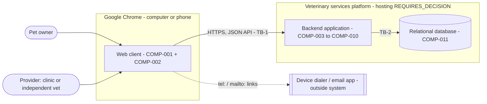
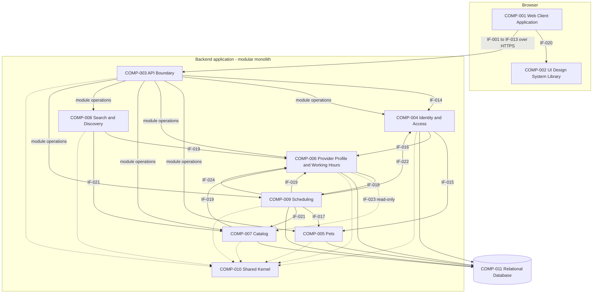
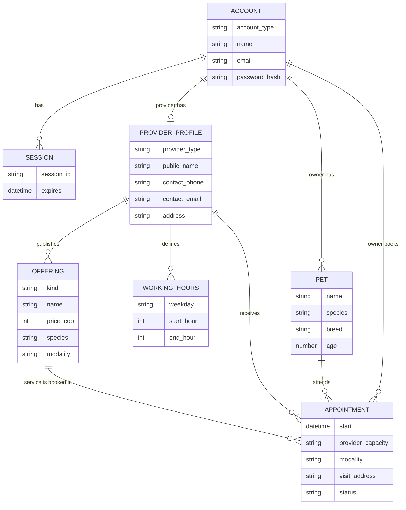
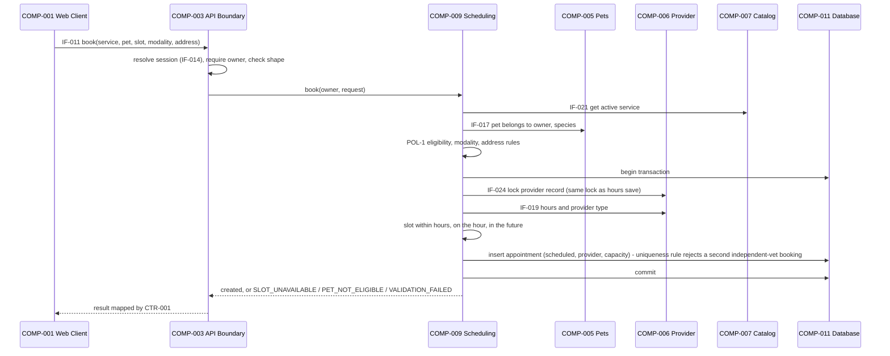

# Software Architecture

> **Labels:**
> - **FACT** — stated in an input artifact or confirmed by the team.
> - **ASSUMPTION** — temporary premise used to proceed.
> - **UNKNOWN** — not established by the inputs.
> - **PROPOSAL** — recommended option, not approved.
> - **REQUIRES_DECISION** — the team must decide.
> - **BLOCKED** — prevents a reliable decision or safe progression.
>
> **ADR statuses:**
> - `ACCEPTED` — established by the inputs or approved by the team.
> - `PROPOSED` — a P05 recommendation.
> - `REQUIRES_DECISION` — the team must decide.
>
> **ID conventions.** P05 creates these identifiers:
>
> | Prefix | Meaning |
> |---|---|
> | `COMP-` | Architecture components. They are not the UX components `COMP-UX-`. |
> | `IF-` | Interfaces |
> | `DATA-` | Data concepts |
> | `ADR-` | Decisions |
> | `P05-RISK-` | Risks. The P05 prefix avoids a clash with P00's risk IDs, which use the plain RISK prefix with numbers 001 to 011. |
> | `CR-` | Constraints |
> | `CTR-` | Shared contracts |
> | `DRV-` | Architectural drivers (§3) |
> | `TB-` | Trust boundaries (§4.3) |
> | `POL-` | Isolated business-rule policies (ADR-012) |
> | `P05-ASM-`, `P05-UNK-`, `P05-RD-` | Consolidated items in §16 |
>
> All other IDs come from upstream and keep their upstream meaning.

---

## 1. Document Metadata

| Field | Value |
|---|---|
| Stage | P05 — Architecture |
| Version | 1.0 |
| Generated | 2026-10-10 |
| Sprint | `SPRINT-001` (single sprint, `RELEASE-001`) |
| **Architecture status** | **READY_WITH_ASSUMPTIONS** |

### 1.1 Inputs Reviewed

| Input | Version / status | Integrity check | Role |
|---|---|---|---|
| `REQUIREMENTS_v2.md` = `artifacts/02_requirements/REQUIREMENTS.md` | 2.0, READY_WITH_ASSUMPTIONS | Identical (diff) | Requirements, rules, quality constraints |
| `PRIORITIZATION_V1.md` = `artifacts/03_planning/PRIORITIZATION.md` | 1.0, READY_WITH_ASSUMPTIONS | Identical (diff) | Delivery scope and planning decisions |
| `product_backlog_priori_v1.json` = `artifacts/03_planning/product_backlog.json` | 3.0 (P03) | Identical (diff) | **Authoritative backlog**: IDs, status, priority, dependencies. The P02 backlog is not used. |
| `UX_SPEC_V1.md` = `artifacts/04_ux/UX_SPEC.md` | 1.0, READY_WITH_ASSUMPTIONS | Identical (diff) | Screens, flows, components, tokens, UX constraints |
| `artifacts/04_ux/UX_SPEC_VALIDATION.md` | PASS_WITH_WARNINGS; P05 readiness READY_WITH_CONDITIONS | Readable | UX findings and conditions for P05 |
| `SYSTEM_PROMPT.md` | — | — | Global rules |

**Context only (not a required input):** `PROJECT_CONTEXT.md` (P00) is used for one fact. ANS-Q012: the team has no required technologies, no hosting constraints and no existing infrastructure. Nothing else is taken from it.

### 1.2 Team Confirmation Applied

**FACT (team statement, 2026-10-10):** "All of the assumptions in UX_SPEC_V1.md are 100% confirmed and approved by the team."

**How it is applied (P05-ASM-001):**

- **Confirmed:** the UX assumptions **P04-ASM-001 to P04-ASM-017** (UX_SPEC §11.3). They are treated as **confirmed** in this document.
- **Already confirmed earlier:** the P03 assumptions ASSUM-001 to ASSUM-008, which include the P02 assumptions P02-ASM-001, -002 and -004 to -016.

**Not covered, because they are not assumptions:**

- **UX proposals:** P04-PROP-001 to -008, including the visual direction. They stay **PROPOSAL**.
- **UX open decisions:** P04-RD-001 to -006. They stay **REQUIRES_DECISION**:
  - P04-RD-001 = P02-Q-004 (species eligibility at booking);
  - P04-RD-002 = P02-Q-009 (address for in-clinic services);
  - P04-RD-003 (pet units);
  - P04-RD-004 (product name);
  - P04-RD-005 (conditional UX);
  - P04-RD-006 (no-sign-out consequences).
- **UX blockers:** P04-BLK-001 and P04-BLK-002. They stay **BLOCKED**.
- **P03 decisions:** PRIOR-001 to PRIOR-004. They remain as P03 recorded them.

### 1.3 Summary

The architecture is a **modular monolith**: one backend application with internal modules, one relational database, and a browser single-page client that implements the UX design system. The client and the backend communicate through a small HTTP API. All of this is **PROPOSED** (ADR-002 to ADR-005).

- **Backend modules (6):** Identity and Access; Pets; Provider Profile and Working Hours; Catalog; Search and Discovery; Scheduling. A shared kernel holds the clock, time zone and error model.
- **Data:** each module owns its data. Cross-module needs go through defined internal interfaces.
- **Booking integrity:**
  - an independent veterinarian gets at most one appointment per slot (BR-013);
  - working-hours changes cancel the appointments they affect (BR-034);
  - both are enforced atomically in the backend (ADR-010).
- **Undecided rules:** pet eligibility (P02-Q-004) and the in-clinic address rule (P02-Q-009) are isolated as policies with defined option sets (ADR-012).
- **Technology:** **no stack has been approved** (ADR-003, REQUIRES_DECISION). The architecture holds for any mainstream web stack.

**Status rationale: READY_WITH_ASSUMPTIONS.** The structure, boundaries, data ownership, interfaces and invariants are defined for the 14 committed stories, and no blocker prevents P06 planning. Implementation depends on decisions that are still open:

| Decision | Must be made before |
|---|---|
| Technology stack (ADR-003) and hosting (ADR-014) | Any coding starts |
| P02-Q-004 | US-019 |
| P02-Q-009 | US-010 and US-008 |
| Pet units (P04-RD-003) | Fixing the pet data definition (US-001) |
| Session lifetime | US-003 is finalized |

See §16 and §17.

---

## 2. Architectural Scope

### 2.1 MVP Capabilities Covered

The architecture covers the **14 committed stories of `SPRINT-001`** (PRIORITIZATION §5.1; backlog `status: PLANNED`). It is the same scope the UX designed (P04-ASM-002, now confirmed).

| Capability | Stories | Requirements |
|---|---|---|
| Accounts and access | US-001, US-002, US-003 | FR-001 to FR-004, FR-005 (first pet); NFR-001, NFR-002 |
| Provider profile and working hours | US-008, US-009 | FR-009, FR-010 |
| Catalog publishing | US-010, US-013 | FR-011, FR-014 |
| Search and discovery | US-016, US-017, US-018 | FR-017 to FR-020 |
| Appointment booking | US-019, US-020 | FR-021 to FR-025 |
| Appointment viewing | US-021, US-024 | FR-026, FR-029 |
| Platform and language (all stories) | — | NFR-003, NFR-004 |

### 2.2 Deferred, Conditional or Blocked Work That Affects Boundaries

These items are **not designed** as implementation scope. They are listed only where the architecture must not close the door on them, and none of them adds a component or interface now.

| Item | P03 status | Architectural implication |
|---|---|---|
| US-004 to US-007 (pet add, list, edit and remove) | CONDITIONAL (A: US-004, US-005; B: US-006, US-007) | The Pets module (COMP-005) owns pets, so these extend it. Removal must cancel upcoming appointments (BR-034) and keep history (CR-018). |
| US-011, US-012, US-014, US-015 (update and remove offerings) | CONDITIONAL | They extend Catalog (COMP-007). Removal must be logical, because appointments reference services (CR-018). |
| US-022, US-023, US-025, US-026 (cancel and reschedule) | CONDITIONAL A | They extend Scheduling (COMP-009) with status transitions. They reuse the availability rules (BR-018). |
| US-027 to US-033 (ordering, order status, stock) | US-027, US-033 BLOCKED (P02-Q-001, P02-Q-017); US-028 to US-032 CONDITIONAL B | No ordering module, data or interface now (CR-013). An Ordering module would be added beside Catalog when unblocked. |

### 2.3 Scope Limitations

- **Not covered:** no requirement for payments, notifications, ratings, administration, real-time tracking or a location filter (P01 Out of Scope, REQUIREMENTS §2.1). The architecture adds no support for them.
- **Conditional stories:** PRIOR-001 (approve the committed scope) and PRIOR-002 (what happens to unfinished conditional work) are still open in P03. **PROPOSAL** (not a P03 gate): if conditional stories enter the sprint, they should first get UX (P04-RD-005, undecided) and then a light architecture check against §6 and §8.

---

## 3. Architectural Drivers

| ID | Driver | Source | Architectural implication |
|---|---|---|---|
| DRV-01 | Two account types with separate interfaces. The same email can hold one account of each type, and the type is chosen at sign-in. | BR-001, BR-036, FR-003, FR-004; P02-ASM-002 | Accounts are keyed by (email, type). A session is bound to one account. Every backend operation is authorized by account type (ADR-009, ADR-007, CR-001). |
| DRV-02 | Users access only their own data, except public profiles and offerings and data shared between the two parties of an appointment. | NFR-002; AC-013, AC-018, AC-064; EDGE-020 | Server-side authorization in every module. Ownership checks on every resource. A uniform "not found" outcome for forbidden resources (CR-006, UX SCR-UX-014). |
| DRV-03 | Passwords are hashed, never stored in plain text; the method is decided in P05. | NFR-001; AC-005, AC-009 | ADR-006. |
| DRV-04 | Booking rules: one-hour slots within working hours; clinic unlimited, independent vet one per slot; no confirmation; no past slots; Bogotá time. | BR-010 to BR-014; FR-021 to FR-025; P02-ASM-006, -007; AC-046 to AC-051 | Availability is computed on the server. Uniqueness is enforced atomically. A single clock and time zone (ADR-008, ADR-010). |
| DRV-05 | Automatic cancellation when working hours change; cancelled appointments stay visible. | BR-034, BR-035; AC-081, AC-087, AC-088 | The hours change and the cancellations happen in one transaction. There is no physical deletion (CR-009, CR-010). |
| DRV-06 | Two booking and publishing rules are undecided. | P02-Q-004 (BR-024, EDGE-016), P02-Q-009 (EDGE-017); P04-RD-001, -002; UX_SPEC_VALIDATION §7.8 condition 2 | The rules are isolated as replaceable policies; the structure does not change with the decision (ADR-012). |
| DRV-07 | Parallel development by a small team in a three-day sprint, with proposed backend + interface pairs per story. | PRIORITIZATION §6, §7 (assignments PROPOSED), P03-RISK-001, P03-RISK-004; ASSUM-001 | Few deployables. Contracts are agreed before parallel work (§15). A modular backend lets modules be built independently. |
| DRV-08 | One shared design system (tokens and components) across all screens. | UX_SPEC §4, §5, §12; UX_SPEC_VALIDATION criterion "Parallel-development consistency" | A single token source and a shared UI component library in the client (COMP-002, CR-012). |
| DRV-09 | Web only: Chrome on computers and phones; Spanish UI. | NFR-003, NFR-004 | A responsive web client; no native apps (ADR-001). Copy lives in the client; the backend returns codes (ADR-011). |
| DRV-10 | Prices are mandatory, in Colombian pesos, whole numbers greater than 0. | BR-027; P02-ASM-014; P04-ASM-013 | Money is an integer number of pesos (CR-011). |
| DRV-11 | Search on offering names with a species filter; all providers, no location filter. | FR-017, FR-018; BR-008, BR-009; P02-ASM-013; P04-ASM-006, -007 | Search queries active offerings joined with provider name and type. No geo features. |
| DRV-12 | Deployment for demonstration; no hosting constraints. | PRIORITIZATION §6 step 7, DEP-017; P00 ANS-Q012 (context) | One environment, one deployable. The hosting provider REQUIRES_DECISION (ADR-014). |
| DRV-13 | Performance, availability, backup and privacy targets. | REQUIREMENTS §2.1: "No basis for: performance or availability targets, or privacy requirements beyond password hashing" | **UNKNOWN.** None is invented (§9.3). |

---

## 4. System Context

### 4.1 Boundary

**Inside the system:**

- the web client, which runs in the user's browser;
- the backend application;
- the database.

**Outside the system:**

- the users;
- their browsers and devices;
- phone calls and emails that owners start from a provider's contact links (P04-PROP-005); they leave the system;
- deliveries and payments, which are outside the MVP.

### 4.2 Actors and External Dependencies

| Actor / dependency | Type | Interaction | Status |
|---|---|---|---|
| Pet owner (P01-USER-001) | Human actor | Signs up with a pet; searches; views profiles; books; views own appointments | FACT |
| Provider: veterinary clinic (P01-USER-002) or independent veterinarian (P01-USER-003) | Human actor | Signs up; maintains profile, hours and catalog; views own appointments | FACT |
| Google Chrome on a computer or phone | Client platform | Runs the web client | FACT (NFR-003) |
| Hosting / runtime environment | Infrastructure | Runs the backend and the database; serves the client over HTTPS | **REQUIRES_DECISION** (ADR-014). No provider is assumed. |
| Device dialer and email app | Outside the system | Opened by call and email links on SCR-UX-005 | PROPOSAL (P04-PROP-005); no integration |
| Font and icon assets | Static assets | System font stack (no download); one icon set | PROPOSAL (P04-PROP-007); bundled with the client, no runtime service |

**There is no third-party service integration**: no email, SMS, maps, payment or analytics. None is required by the inputs.

### 4.3 Trust Boundaries

| Boundary | Between | Rule |
|---|---|---|
| TB-1 | Browser (untrusted) ↔ backend | All input is untrusted and validated on the server (CR-003). Credentials and the session identifier travel only over HTTPS (ADR-007, ADR-014; §9.1). The client's hiding of controls is never authorization (CR-001). |
| TB-2 | Backend ↔ database | Only the backend reaches the database. Credentials are configuration secrets, not stored in code (CR-019). |
| TB-3 | Session context inside the backend | Every request is resolved to (account ID, account type) before any module runs. Modules trust only that context, never IDs supplied by the client for "who I am" (CR-001). |

### 4.4 Context Diagram

---

## 5. Architectural Style and Rationale

### 5.1 Selected Style (PROPOSED)

**A client-server modular monolith:**

- **One backend deployable**, organized into **business modules with explicit internal interfaces and data ownership**.
- **One relational database.**
- **A single-page web client** that consumes a JSON-over-HTTPS API and implements the UX design system.
- **Deployment:** the backend also serves the built client from the **same origin** (ADR-014).

### 5.2 Justification

1. **Proportionate.**
   - 14 stories, two user types, no integrations and no scale or availability targets (DRV-13) do not justify distribution.
   - One deployable and one database keep the CI/CD and deployment work small. That work must fit in the same three days as implementation (P03-RISK-001).
2. **Parallel work.**
   - P03 proposes backend and interface pairs per story (PRIORITIZATION §7).
   - A client and an API with agreed contracts (§15) let frontend and backend proceed in parallel.
   - Separate modules let the backend members proposed in PRIORITIZATION §7 work on different modules without touching each other's code.
3. **Integrity.**
   - The rules that matter most (one appointment per slot for independent vets; automatic cancellation on hours changes) need **transactions across entities**.
   - These are simple in one process with one relational database and hard across services.
4. **UX fit.** The UX needs client-side state:
   - search state kept on back navigation (SCR-UX-004);
   - interactive slot picking (COMP-UX-010);
   - toasts after navigation (COMP-UX-013).

   A single-page client supports these directly.

### 5.3 Alternatives Considered

| Alternative | Benefits | Costs | Fit | Decision |
|---|---|---|---|---|
| **A. Modular monolith + SPA client (selected)** | Simple deployment; transactions; clear frontend/backend split | Two code areas (client, backend) and an API contract to keep in sync | Good | PROPOSED |
| B. Server-rendered monolith (pages built on the server) | One code area; no separate API; simplest security model | Weaker split between Frontend and Backend roles; interactive pieces (slot picker, kept search state) need extra client scripting | Acceptable | Rejected: weaker support for parallel frontend/backend work (DRV-07) |
| C. Microservices or separate services per domain | Independent scaling and deployment | Distributed transactions for booking; more infrastructure and CI/CD; no requirement justifies it | Poor | Rejected |
| D. Backend-as-a-service (hosted auth and database with rules in the client or in database policies) | Less backend code | Puts booking integrity and authorization into a third-party rules language; a new external dependency not supported by the inputs; Backend roles under-used | Poor | Rejected |

### 5.4 Confirmed Decisions Versus Proposals

| Confirmed by the inputs (ACCEPTED) | Proposed by P05 (PROPOSED) | Requires a team decision |
|---|---|---|
| Responsive web application for Chrome on computers and phones; Spanish UI (NFR-003, NFR-004) — ADR-001 | Modular monolith (ADR-002); SPA + JSON API (ADR-004); single relational database (ADR-005) | Technology stack (ADR-003) |
| Passwords hashed (NFR-001) | Hashing algorithm (ADR-006) | Hosting provider (ADR-014) |
| No sign-out (AVISO-R1, via P02-Q-015) | Server-side sessions in a secure cookie (ADR-007) | Session lifetime (ADR-007) |
| Bogotá time (P02-ASM-007); prices in Colombian pesos (P02-ASM-014) | Time and money handling (ADR-008) | P02-Q-004, P02-Q-009 rules (ADR-012) |
| UX contract: tokens and components as single source (UX_SPEC §12) | Its implementation (ADR-013) | Pet units (P04-RD-003) |

---

## 6. Component Architecture

### 6.1 Component Inventory

| ID | Component | Kind | Purpose |
|---|---|---|---|
| COMP-001 | Web Client Application | Client | Screens SCR-UX-001 to SCR-UX-014, routing and access guards per account type, calls to the API, client-side validation for usability, es-CO formatting. |
| COMP-002 | UI Design System Library | Client (shared) | Design tokens (UX_SPEC §4) and UI components COMP-UX-001 to COMP-UX-019, the message catalog and canonical labels (§3.9). |
| COMP-003 | API Boundary | Backend (cross-cutting) | HTTP entry point. Resolves the session to (account ID, type), enforces the role per operation, parses and validates the request shape, maps module outcomes to the error contract (CTR-001). |
| COMP-004 | Identity and Access | Backend module | Accounts, sign-up orchestration, sign-in, sessions, password hashing. |
| COMP-005 | Pets | Backend module | The owner's pets: creation (at sign-up in `SPRINT-001`), listing for booking, eligibility data. |
| COMP-006 | Provider Profile and Working Hours | Backend module | Provider profile (type, public name, contact, address) and the weekly working hours. |
| COMP-007 | Catalog | Backend module | Services and products: publish, list own, expose active offerings. |
| COMP-008 | Search and Discovery | Backend module (read-only) | Text search with species filter over active offerings; public provider profile view. |
| COMP-009 | Scheduling | Backend module | Slot availability, booking, appointment views for both parties, automatic cancellation. |
| COMP-010 | Shared Kernel | Backend library | Clock and Bogotá time zone, money type, enumerations, error outcomes, transaction helper. No business rules. |
| COMP-011 | Relational Database | Data store | Persists all data. Each table set is owned by one module (§8). |

### 6.2 Component Details

#### COMP-001 — Web Client Application

| Aspect | Specification |
|---|---|
| Responsibilities | Implement SCR-UX-001 to SCR-UX-014 and FLOW-UX-001 to FLOW-UX-014 exactly as specified. Route by session account type: owner tabs and provider tabs (COMP-UX-011). Redirect to SCR-UX-001 when there is no session; redirect a signed-in user away from the public screens (UX_SPEC §6.1; P04-ASM-017). Show SCR-UX-014 when the API reports NOT_FOUND (CTR-001, CR-006). Validate on the client for usability only (CR-003). Map API error codes to the UX message catalog (ADR-011). Format dates, times and prices in es-CO and Bogotá time (P04-PROP-002). Keep search state while navigating back within the session. |
| Outside its boundary | Authorization decisions; business-rule enforcement (slot validity, uniqueness, eligibility); password handling beyond sending it over HTTPS; defining any visual value (that belongs to COMP-002). |
| Supports | All 14 committed stories; NFR-003, NFR-004 |
| Data | No persistent data. Transient UI state only. Browser storage is not used for business data. |
| Consumes | IF-001 to IF-013 (API), IF-020 (design system) |
| Dependencies | COMP-002, COMP-003 (over HTTPS) |
| Invariants | CR-001, CR-003, CR-012 |

#### COMP-002 — UI Design System Library

| Aspect | Specification |
|---|---|
| Responsibilities | Implement the 67 design tokens of UX_SPEC §4 **in one source file** (format per stack, ADR-013). Implement COMP-UX-001 to COMP-UX-019 with their variants, states and accessibility behavior. Hold the message catalog (MSG-*) and the canonical labels of UX_SPEC §3.9. Apply the responsive rules (`breakpoint-md`, `breakpoint-lg`). |
| Outside its boundary | Screen logic, data fetching, business rules. |
| Supports | UX_SPEC §3 to §5, §12; NFR-003, NFR-004 |
| Data | Tokens, component definitions, copy catalog (static). |
| Exposes | IF-020 |
| Dependencies | None (leaf). Changes follow the UX change rule (UX_SPEC §12). |
| Invariants | CR-012 |

#### COMP-003 — API Boundary

| Aspect | Specification |
|---|---|
| Responsibilities | Receive HTTPS requests. Resolve the session cookie to a session context through COMP-004 (IF-014). Reject unauthenticated calls to protected operations. Enforce the role required by each operation: owner-only, provider-only or public sign-up/sign-in. Validate the request shape: types, required fields, enumerations. Call exactly one module operation. Translate outcomes to the error contract (CTR-001). Never return stack traces or internal messages (CR-005). |
| Outside its boundary | Business rules and data ownership checks inside modules; these remain the modules' job (defense in depth, CR-001). |
| Supports | NFR-002; FR-004; AC-013; EDGE-020 |
| Data | None owned. |
| Exposes | IF-001 to IF-013 |
| Consumes | IF-014 and the module operations |
| Dependencies | COMP-004 to COMP-010 |

#### COMP-004 — Identity and Access

| Aspect | Specification |
|---|---|
| Responsibilities | **Sign-up of an owner:** create the owner account **and** its first pet atomically, through COMP-005 (IF-015) (BR-003, AC-001, AC-002). **Sign-up of a provider:** create the provider account **and** its profile with name and type atomically, through COMP-006 (IF-016) (AC-006). Enforce one account per (email, type); allow the same email for the other type (BR-036, AC-004, AC-008, AC-074, AC-076). Hash passwords (ADR-006). **Sign-in** by email, password and chosen type, with a generic failure outcome (AC-010 to AC-012, AC-077). Create a session at sign-up and at sign-in (P04-ASM-003). Resolve sessions (IF-014) and expire them (ADR-007). |
| Outside its boundary | Pet and profile data (owned by COMP-005 and COMP-006); sign-out (excluded, AVISO-R1); password reset (no requirement). |
| Supports | US-001, US-002, US-003; FR-001 to FR-004; NFR-001, NFR-002 |
| Data | DATA-001 Account, DATA-002 Session |
| Exposes | IF-001, IF-002, IF-003, IF-014, IF-022 |
| Consumes | IF-015 (COMP-005), IF-016 (COMP-006) |
| Invariants | CR-004, CR-016, CR-017 |

#### COMP-005 — Pets

| Aspect | Specification |
|---|---|
| Responsibilities | Create a pet for an owner account, used at sign-up: required name, age and breed; optional species (dog or cat), weight and height (BR-032, BR-037, AC-003, AC-075). List an owner's pets for booking (IF-009). Answer ownership and species questions for Scheduling (IF-017). |
| Outside its boundary | Standalone add, list, edit and remove screens and operations (US-004 to US-007, conditional); eligibility policy decisions (COMP-009, ADR-012). |
| Supports | US-001 (first pet), US-019 (pet choice); FR-005, FR-022 |
| Data | DATA-003 Pet |
| Exposes | IF-009, IF-015, IF-017 (including pets by ID, for appointment views) |
| Dependencies | COMP-010 |
| Open | Units of age, weight and height (P04-RD-003, REQUIRES_DECISION) |

#### COMP-006 — Provider Profile and Working Hours

| Aspect | Specification |
|---|---|
| Responsibilities | Create the profile at provider sign-up, with name and immutable provider type (BR-002). Read and update the profile: public name, contact phone, contact email, optional address (FR-009, BR-026, BR-038, AC-023, AC-024). Read and replace the weekly working hours: one range per weekday, whole hours, end after start (FR-010, BR-033, P04-ASM-008, AC-025, AC-080). **On an hours change**, call Scheduling in the **same transaction** to cancel upcoming appointments outside the new hours (IF-018; BR-034, AC-081). Expose provider facts (type, hours, address, phone, name) to Search and Scheduling (IF-019). |
| Outside its boundary | Appointment data (COMP-009); offerings (COMP-007). |
| Supports | US-002 (profile creation), US-008, US-009, US-018, US-019 |
| Data | DATA-004 Provider Profile, DATA-005 Working Hours |
| Exposes | IF-004, IF-005, IF-016, IF-019, IF-024 |
| Consumes | IF-018 (COMP-009); IF-023 (COMP-007, only for the POL-2 option A sub-rule) |
| Open | P02-Q-009 option A: whether the address can be removed while in-clinic services exist (ADR-012, policy POL-2) |

#### COMP-007 — Catalog

| Aspect | Specification |
|---|---|
| Responsibilities | Publish a service: name, price, exactly one species, modality (FR-011, BR-006, BR-007, AC-027 to AC-029, AC-082). Publish a product: name, price, exactly one species (FR-014, AC-033, AC-034, AC-084). Validate price as whole pesos greater than 0 (CR-011). Apply the in-clinic address policy POL-2 at publish (ADR-012). List the provider's own offerings (SCR-UX-011). Expose active offerings to Search and Scheduling (IF-021). |
| Outside its boundary | Search ranking and text matching (COMP-008); stock and ordering (blocked, CR-013); update and removal (conditional). |
| Supports | US-010, US-013, US-016, US-018, US-019 |
| Data | DATA-006 Offering |
| Exposes | IF-006, IF-021, IF-023 |
| Consumes | IF-019 (address presence for POL-2) |

#### COMP-008 — Search and Discovery

| Aspect | Specification |
|---|---|
| Responsibilities | Text search over the names of active offerings of all providers, with an optional species filter; the text and the species both apply (FR-017, FR-018, BR-008, BR-009, P02-ASM-013, AC-038, AC-041 to AC-043, AC-086). Return the result data needed by the result card (FR-019, AC-039, P04-ASM-007). Return a provider's public profile with its offerings (FR-020, AC-044, AC-045). |
| Outside its boundary | Writing any data. Location filtering (excluded, BR-009). Ordering of results (not a UX requirement, P04-ASM-006). |
| Supports | US-016, US-017, US-018 |
| Data | None owned (read-only over DATA-006 and DATA-004 through IF-021 and IF-019) |
| Exposes | IF-007, IF-008 |

#### COMP-009 — Scheduling

| Aspect | Specification |
|---|---|
| Responsibilities | **Compute offered slots** for a service and a week: whole-hour starts within the provider's hours for that weekday; up to one hour before the closing hour; in the future in Bogotá time; for independent vets, excluding slots with a scheduled appointment; for clinics, not excluding them (FR-021, FR-024, FR-025, BR-010 to BR-013, P02-ASM-006, AC-046, AC-049 to AC-051, AC-026). **Book:**<ul><li>validate that the service is active;</li><li>validate that the pet belongs to the owner, and its eligibility (POL-1, ADR-012);</li><li>validate the modality offered and chosen (P02-ASM-005, AC-054);</li><li>require the visit address for home visits (BR-015, AC-053);</li><li>re-check that the slot is still offered;</li><li>enforce one appointment per independent-vet slot atomically (ADR-010, EDGE-007);</li><li>create the appointment as scheduled, with no confirmation (BR-014, AC-047).</li></ul>**List appointments** for the owner (AC-055, AC-056, AC-087) and for the provider (AC-063, AC-064, AC-088), including cancelled ones (BR-035). **Cancel** upcoming appointments outside new hours when asked by COMP-006 (IF-018). |
| Outside its boundary | Working-hours storage (COMP-006); offering data (COMP-007); pet data (COMP-005); cancel and reschedule by users (conditional US-022, US-023, US-025, US-026). |
| Supports | US-009 (auto-cancel), US-019, US-020, US-021, US-024 |
| Data | DATA-007 Appointment |
| Exposes | IF-010, IF-011, IF-012, IF-013, IF-018 |
| Consumes | IF-017, IF-019, IF-021, IF-022, IF-024 |
| Invariants | CR-007 to CR-010, CR-014 |

#### COMP-010 — Shared Kernel

| Aspect | Specification |
|---|---|
| Content | **Clock:** "now" in the Bogotá time zone (ADR-008), injectable for tests. **Money:** whole pesos. **Enumerations:** account type, provider type, species, modality, appointment status. **Outcome and error codes:** CTR-001. **Transaction helper.** |
| Outside its boundary | Any business rule or data ownership. |
| Dependencies | None. |

#### COMP-011 — Relational Database

| Aspect | Specification |
|---|---|
| Responsibilities | Persist DATA-001 to DATA-007. Provide transactions and uniqueness constraints used by CR-008, CR-009 and CR-017. |
| Constraint | Accessed only by the backend. Each module reads and writes only its own data; it may read another module's data only through that module's interface (CR-002). |
| Status | Relational model PROPOSED (ADR-005); product REQUIRES_DECISION (ADR-003). |

### 6.3 Component Diagram

**Reading the diagram:**

- Arrows point from the caller to the provider. (The interface tables in §7 list "provider → consumer", the opposite direction.)
- Solid arrows are allowed calls, labeled with their interface or, from COMP-003, "module operations" (one per external interface).
- The dashed labeled arrow IF-023 is a read-only query used only under POL-2 option A.
- Unlabeled dashed arrows are uses of the shared kernel.
- COMP-008 has no arrow to the database: it reads only through IF-019 and IF-021. Its queries may be implemented as read-only queries **defined and owned by** COMP-006 and COMP-007 (CR-002).

---

## 7. Interfaces and Interaction Rules

All interfaces are conceptual.

- **Client ↔ backend (IF-001 to IF-013):** a JSON-over-HTTPS API (ADR-004, PROPOSED).
- **Endpoint paths, verbs and exact field names:** not fixed here. They are agreed as shared contracts (§15) before dependent stories are implemented in parallel.
- **Internal interfaces (IF-014 to IF-024):** in-process calls between backend modules.
- **Common outcomes:** every protected interface returns UNAUTHENTICATED without a valid session, and NOT_FOUND when it is called by the other account type or for another user's resource (CR-006, AC-013). These outcomes are not repeated in each row.

### 7.1 Client–Backend Interfaces

| ID | Provider → consumer | Purpose | Conceptual information exchanged | Authorization and validation | Failure outcomes (CTR-001) | Related |
|---|---|---|---|---|---|---|
| IF-001 | COMP-003/COMP-004 → COMP-001 | **Sign up**: owner with first pet; provider with type. Creates a session (P04-ASM-003). | Owner: name, email, password, pet (name, species optional, breed, age, weight optional, height optional). Provider: name, email, password, provider type. Returns: session established, account type. | Public (no session). Server validates all required fields, email format, enumerations; one account per (email, type). | VALIDATION_FAILED (per field); DUPLICATE_ACCOUNT_FOR_TYPE; UNEXPECTED | US-001, US-002; FR-001, FR-002, FR-005; AC-001 to AC-004, AC-006 to AC-008, AC-074 to AC-076; SCR-UX-002, -003 |
| IF-002 | COMP-003/COMP-004 → COMP-001 | **Sign in** choosing the account type. | Email, password, account type → session established, account type. | Public. | INVALID_CREDENTIALS (one generic outcome for wrong email, wrong password or unregistered type); VALIDATION_FAILED; UNEXPECTED | US-003; FR-003; AC-010 to AC-012, AC-077; SCR-UX-001 |
| IF-003 | COMP-003/COMP-004 → COMP-001 | **Session context** ("who am I") for routing. | Account type; or "no session". (The UX shell shows no user name.) | Any caller. No session → "no session" result (not an error), so the client can route to SCR-UX-001. | UNEXPECTED | US-003; FR-004; UX_SPEC §6.1 |
| IF-004 | COMP-003/COMP-006 → COMP-001 | **Own provider profile**: read and save. | Public name, contact phone, contact email, address (optional), provider type (read-only), profile-completed flag (phone saved at least once; drives the SCR-UX-009 onboarding alert). | Provider session only; own profile only. Name, phone and email required; phone characters (P04-ASM-005); email format; POL-2 sub-rule (ADR-012). | VALIDATION_FAILED; CLINIC_ADDRESS_REQUIRED (only if P02-Q-009 option A and the sub-rule applies) | US-008; FR-009; AC-023, AC-024; SCR-UX-009 |
| IF-005 | COMP-003/COMP-006 → COMP-001 | **Own working hours**: read and replace the week. | For each weekday: works yes/no, start hour, end hour (whole hours). Result of a save: saved; the cancellations happen server-side (BR-034). | Provider session only. Whole hours; end after start; at most one range per weekday (BR-033, P04-ASM-008). | VALIDATION_FAILED (NOT_ON_THE_HOUR, END_NOT_AFTER_START, REQUIRED) | US-009; FR-010; AC-025, AC-080, AC-081; SCR-UX-010 |
| IF-006 | COMP-003/COMP-007 → COMP-001 | **Own catalog**: list own offerings; publish a service; publish a product. | Offering: kind, name, price (whole pesos), species, modality (services only). | Provider session only; the provider is taken from the session, never from input. Required fields; price > 0; exactly one species; modality required for services; POL-2 at publish. | VALIDATION_FAILED; CLINIC_ADDRESS_REQUIRED (POL-2 option A) | US-010, US-013; FR-011, FR-014; AC-027 to AC-029, AC-033, AC-034, AC-082, AC-084; SCR-UX-011 to -013 |
| IF-007 | COMP-003/COMP-008 → COMP-001 | **Search** offerings. | Input: text (non-empty after trimming, P04-ASM-006), species filter (all, dog or cat). Output per result: offering ID, kind, name, species, price, modality (services), provider ID, provider name, provider type. | Owner session only. Text required. | VALIDATION_FAILED; UNEXPECTED. Zero results is a normal empty result, not an error (AC-040). | US-016, US-017; FR-017 to FR-019; AC-038 to AC-043, AC-086; SCR-UX-004 |
| IF-008 | COMP-003/COMP-008 → COMP-001 | **Provider public profile.** | Name, type, address (absent if none), phone (absent if never saved), contact email, services and products with prices, species and modality. | Owner session only. | NOT_FOUND | US-018; FR-020; AC-044, AC-045; SCR-UX-005 |
| IF-009 | COMP-003/COMP-005 → COMP-001 | **Own pets for booking.** | For each pet: ID, name, species (or none), breed. The eligibility for a given service comes from IF-010 (see that row). | Owner session only; own pets only. | — | US-019; FR-022; BR-005; SCR-UX-006 section 1 |
| IF-010 | COMP-003/COMP-009 → COMP-001 | **Booking context and offered slots** for one service and one week. | Input: service ID, week start (optional; default = the current Bogotá week). Output: the server's current Bogotá date and time (so the client does not rely on the device clock); service summary (name, provider name and type, species, price, offered modality, provider address and phone if present); an eligibility result under POL-1 for each of the owner's pet IDs (eligible / not eligible with reason / eligible with warning); offered slot starts per day (Bogotá time); a flag when the provider has no working hours (AC-026); a flag when the owner has no pets (AC-048). The pet names and details come from IF-009. | Owner session only. Service must exist. | NOT_FOUND (service unavailable → SCR-UX-014) | US-019, US-020; FR-021, FR-024, FR-025; AC-026, AC-046, AC-048 to AC-051; COMP-UX-010; SCR-UX-006 |
| IF-011 | COMP-003/COMP-009 → COMP-001 | **Book** an appointment. | Service ID, pet ID, slot start, chosen modality (if the service offers both), visit address (home). Returns the created appointment (for the toast and focus). | Owner session only. The server re-validates **everything** (§6.2 COMP-009). | VALIDATION_FAILED (address, modality, missing fields); SLOT_UNAVAILABLE (EDGE-007, passed start, outside hours — one outcome, MSG-SLOT-GONE); PET_NOT_ELIGIBLE (POL-1); NO_PETS (AC-048); NOT_FOUND (service or pet not found or not owned) | US-019, US-020; FR-022, FR-023; AC-047, AC-052 to AC-054; EDGE-004, -007, -008, -009; FLOW-UX-010, -011 |
| IF-012 | COMP-003/COMP-009 → COMP-001 | **Owner's appointments.** | For each appointment: ID, start and end, status (scheduled / cancelled), upcoming flag (start after the server's Bogotá "now"; drives the grouping), service name, modality, pet name, provider name and type, place (visit address for home; provider address or "none" for clinic), provider phone (if present, for MSG-PLACE-NONE). | Owner session only; own appointments only. | — | US-021; FR-026; AC-055, AC-056, AC-087; P04-ASM-011; SCR-UX-007 |
| IF-013 | COMP-003/COMP-009 → COMP-001 | **Provider's appointments.** | For each appointment: ID, start and end, status, upcoming flag, service name, modality, pet name, owner name, visit address (home). No owner email or phone is exposed. | Provider session only; own appointments only. | — | US-024; FR-029; AC-063, AC-064, AC-088; P02-ASM-008; SCR-UX-008 |

### 7.2 Internal Interfaces

| ID | Provider → consumer | Purpose | Information | Rules | Related |
|---|---|---|---|---|---|
| IF-014 | COMP-004 → COMP-003 | Resolve the session | Session identifier → (account ID, account type), or none. Expired sessions resolve to none. | The only way any module learns "who". | NFR-002; ADR-007 |
| IF-015 | COMP-005 → COMP-004 | Create the first pet inside the owner sign-up transaction | Owner account ID, pet data → pet created, or a validation outcome | Runs in the caller's transaction: account and pet are created together or not at all (CR-017) | US-001; BR-003; AC-002 |
| IF-016 | COMP-006 → COMP-004 | Create the provider profile inside the provider sign-up transaction | Provider account ID, name, provider type, contact email (= sign-up email, P04-ASM-012) | Same transaction (CR-017) | US-002; BR-002 |
| IF-017 | COMP-005 → COMP-009 | Pet facts | Pet ID, owner ID → belongs (yes/no), species (or none); list of an owner's pets; pet names by ID (for appointment views of either party) | Read-only | US-019, US-021, US-024; BR-005, BR-024 |
| IF-018 | COMP-009 → COMP-006 | Cancel the appointments outside new hours | Provider ID, new weekly hours, "now" → number cancelled | Runs inside the hours-update transaction. Cancels only **upcoming scheduled** appointments whose slot no longer fits (BR-034, CR-009). | US-009; AC-081; EDGE-013 |
| IF-019 | COMP-006 → COMP-007, COMP-008, COMP-009 | Provider facts | Provider ID → name, type, phone, contact email, address (if any), weekly hours | Read-only | FR-019, FR-020, FR-021; BR-012, BR-013 |
| IF-020 | COMP-002 → COMP-001 | Design system | Tokens, COMP-UX components, message catalog, labels | Screens use only these (CR-012) | UX_SPEC §4, §5, §12 |
| IF-021 | COMP-007 → COMP-008, COMP-009 | Active offerings | Search over names with a species filter; get an offering by ID (kind, provider, species, modality, price, name); list a provider's active offerings (for the public profile, IF-008) | Read-only. Owned queries live in COMP-007 (CR-002). | FR-017, FR-018, FR-020, FR-021 |
| IF-022 | COMP-004 → COMP-009 | Account names | Account ID → name (the owner's name for provider appointment views) | Read-only; never exposes email or the password hash | US-024; AC-063 |
| IF-023 | COMP-007 → COMP-006 | In-clinic service presence | Provider ID → whether it has services with modality clinic or both | Read-only. Used only if P02-Q-009 option A adopts the address-removal sub-rule (POL-2). | US-008; EDGE-017 |
| IF-024 | COMP-006 → COMP-009 | Provider serialization | Within the caller's transaction, lock the provider's profile record (owned by COMP-006). The hours save in COMP-006 takes the same lock. | Used only inside the booking transaction; this realizes CR-009 | US-009, US-019; BR-013, BR-034 |

### 7.3 Dependency Rules

**Allowed:**

- COMP-001 → COMP-002, and COMP-001 → COMP-003 (over HTTPS only).
- COMP-003 → any backend module and COMP-010.
- **Commands** (calls that change another module's data), exactly three:
  - COMP-004 → COMP-005 (IF-015) and COMP-004 → COMP-006 (IF-016), only inside sign-up;
  - COMP-006 → COMP-009 (IF-018), only inside the hours save.
- **Coordination call:** COMP-009 → COMP-006 (IF-024). It takes the provider lock inside the booking transaction and changes no data.
- **Read-only queries:**
  - COMP-007, COMP-008 and COMP-009 → COMP-006 (IF-019);
  - COMP-008 and COMP-009 → COMP-007 (IF-021); COMP-006 → COMP-007 (IF-023, POL-2 option A only);
  - COMP-009 → COMP-005 (IF-017);
  - COMP-009 → COMP-004 (IF-022).
- Every backend module → COMP-010.
- Data-owning modules → COMP-011, for their own data only.

**Prohibited (CR-015):**

- The client accessing the database or any backend module except through COMP-003.
- Any module writing another module's data.
- Within one operation (one request or one transaction), a chain of calls that includes more than one command. The rule applies per operation, not to the static dependency graph: sign-up uses only IF-015 or IF-016, and the hours save uses only IF-018. Read-only queries and IF-024 may form static cycles (for example COMP-006 → COMP-009 → COMP-007 → COMP-006), because they change no data.
- Any new cross-module command without an architecture change.
- COMP-010 depending on any module.
- Business rules in COMP-003 or COMP-001 that are not also enforced in a module.

### 7.4 Error Contract (CTR-001, ADR-011)

**Each failure returns:**

- a stable outcome code from the closed list below;
- for VALIDATION_FAILED, a list of the fields concerned (field names agreed in the CTR contracts), each with a reason code: REQUIRED, INVALID_FORMAT, OUT_OF_RANGE, NOT_ON_THE_HOUR or END_NOT_AFTER_START.

**The backend never returns:**

- Spanish copy;
- stack traces;
- whether an email or resource exists, except for DUPLICATE_ACCOUNT_FOR_TYPE, which the UX requires (SCR-UX-002 and SCR-UX-003; see P05-RISK-007).

The client maps each code to a message from the UX catalog (UX_SPEC §3.9):

| Outcome code | Client behavior (UX reference) |
|---|---|
| VALIDATION_FAILED | Field errors and form alert (MSG-REQ, MSG-EMAIL, MSG-PRICE, MSG-INTEGER, MSG-DECIMAL, MSG-PHONE, MSG-FORM; COMP-UX-018 messages) |
| DUPLICATE_ACCOUNT_FOR_TYPE | Email field error with sign-in link (SCR-UX-002, -003) |
| INVALID_CREDENTIALS | Generic sign-in alert (SCR-UX-001) |
| UNAUTHENTICATED | Route to SCR-UX-001 (P04-ASM-017) |
| NOT_FOUND | SCR-UX-014 (also used for resources of other users or of the other account type, CR-006) |
| SLOT_UNAVAILABLE | MSG-SLOT-GONE; reload the slots (SCR-UX-006) |
| PET_NOT_ELIGIBLE | Section 1 error in SCR-UX-006 (only reachable if the client and server rules diverge) |
| NO_PETS | Info alert in SCR-UX-006 (AC-048) |
| CLINIC_ADDRESS_REQUIRED | Option-A message in SCR-UX-012 / SCR-UX-009 (P04-RD-002) |
| UNEXPECTED | MSG-NET with "Reintentar" |

---

## 8. Conceptual Data Architecture

### 8.1 Data Concepts

| ID | Entity | Purpose | Conceptual information | Relationships | Owner | Integrity, lifecycle and access | Related |
|---|---|---|---|---|---|---|---|
| DATA-001 | Account | A sign-in identity of one type | Account type (owner or provider), name, email, password hash, creation time | 1 Account (owner) – N Pets; 1 Account (provider) – 1 Provider Profile; 1 Account – N Sessions | COMP-004 | Unique (email, account type) (BR-036, P02-ASM-002). Each account has its own password. The email cannot be changed in the MVP (CR-016). The hash is never exposed (CR-004). There is no deletion requirement. | FR-001 to FR-003; NFR-001 |
| DATA-002 | Session | A signed-in session bound to one account | Session identifier (secret, random), account, creation time, last-use time | N Sessions – 1 Account | COMP-004 | Created at sign-up and sign-in. Expires per ADR-007: idle and absolute expiry, with values PROPOSED and pending approval (P05-RD-003). There is no sign-out (AVISO-R1). | FR-003, FR-004; NFR-002 |
| DATA-003 | Pet | An owner's animal | Name, species (dog, cat or none), breed, age, weight (optional), height (optional) | N Pets – 1 owner Account; 1 Pet – N Appointments | COMP-005 | Name, age and breed are required (BR-037). Species is in {dog, cat} or absent (BR-032). **Units of age, weight and height: REQUIRES_DECISION (P04-RD-003)**; until decided, the UX proposal is used (whole years, kg with one decimal, whole cm). Breed is free text (P04-ASM-016). Visible only to its owner, and its name to the provider of its appointments. | FR-005; US-001 |
| DATA-004 | Provider Profile | The public identity of a provider | Provider type (clinic or independent, fixed at sign-up), public name, contact phone (absent until first save), contact email, address (optional) | 1 – 1 provider Account; 1 – N Offerings; 1 – N Working Hours; 1 – N Appointments (stored directly on the appointment, DATA-007) | COMP-006 | Type immutable (no requirement to change it). Name, phone and email are required when saved (FR-009). Address optional (BR-026). Contact email is separate from the sign-in email (P04-ASM-012, CR-016). Readable by every signed-in owner (public). | FR-002, FR-009, FR-020 |
| DATA-005 | Working Hours | One weekday's hours of a provider | Weekday, start hour, end hour | N – 1 Provider Profile | COMP-006 | At most one range per weekday (P04-ASM-008). Whole hours; end after start; within the day (BR-033). The weekly pattern repeats (P02-ASM-010). Replaced as a whole week on save. A change triggers BR-034 cancellations in the same transaction (CR-009). | FR-010; US-009 |
| DATA-006 | Offering | A service or a product published by a provider | Kind (service or product), name, price (whole pesos > 0), species (dog or cat), modality (services only: clinic, home or both) | N – 1 Provider Profile; 1 service – N Appointments | COMP-007 | Exactly one species (BR-006). Modality required for services and absent for products. Price mandatory (P02-ASM-014). POL-2 applies at publish. **No removal and no stock in `SPRINT-001`**. A later removal must be logical (CR-018). Readable by every signed-in owner. | FR-011, FR-014, FR-017 to FR-020 |
| DATA-007 | Appointment | A booking of one service, for one pet, in one hour | Owner account, pet, service (offering of kind service), provider (copied from the service at booking), provider capacity (clinic or independent, copied from the immutable provider type), start (whole hour, Bogotá), end (= start + 1 hour), chosen modality (clinic or home), visit address (home only), status (scheduled or cancelled), creation time | N – 1 Account (owner); N – 1 Pet; N – 1 Offering (service); N – 1 Provider Profile | COMP-009 | Created as **scheduled** (BR-014). For an independent vet, at most one **scheduled** appointment per provider and start (BR-013, CR-008): enforced as a uniqueness rule on (provider, start) limited to appointments that are scheduled **and** whose provider capacity is independent, so clinics stay unlimited (BR-012). Start in the future at booking (P02-ASM-006). Address required if home (BR-015). Status changes only scheduled → cancelled in `SPRINT-001` (automatic, BR-034). Never deleted (BR-035, CR-010). Visible to its owner and to its provider only (NFR-002). | FR-021 to FR-026, FR-029 |

**Not modeled (by design):**

- orders, order status and stock (US-027 to US-033: blocked or conditional);
- who cancelled an appointment (not required: AC-087 and AC-088 only require "shown as cancelled");
- administrators (none exist).

### 8.2 Conceptual Data Diagram

**Notes on the diagram:**

- It shows conceptual attributes only, with no keys, column types or schema.
- `PET` also has an optional weight and height (DATA-003). They are omitted for brevity.
- `APPOINTMENT` stores its provider and the provider's capacity directly, so the integrity rule can be declared on the appointment data alone (ADR-010).

### 8.3 Principal Data Flows

| Flow | Creates / modifies | Validates | Exposes |
|---|---|---|---|
| **Owner sign-up** (FLOW-UX-001) | COMP-004 creates the Account, COMP-005 creates the Pet (IF-015) and COMP-004 creates the Session, in one transaction | COMP-003 checks the shape; COMP-004 checks (email, type) uniqueness; COMP-005 checks the pet fields | Session to the client (IF-001) |
| **Provider sign-up** (FLOW-UX-002) | Account, Provider Profile (IF-016) and Session, in one transaction | COMP-004, COMP-006 | IF-001 |
| **Sign-in** (FLOW-UX-003) | Session | COMP-004 checks the hash, chosen type and generic failure | IF-002, IF-003 |
| **Profile save** (FLOW-UX-004) | Provider Profile | COMP-006 checks the fields and POL-2 | IF-004; public through IF-008 |
| **Hours save** (FLOW-UX-005) | Working Hours replaced; upcoming Appointments outside the hours set to cancelled (IF-018), in **one transaction**, holding the provider lock (IF-024, CR-009) | COMP-006 checks the hours; COMP-009 selects the affected appointments | IF-005; the effects are visible through IF-012, IF-013 and IF-010 |
| **Publish** (FLOW-UX-006, -007) | Offering | COMP-007 checks the fields and POL-2 | IF-006; through IF-021 to search and booking |
| **Search and profile** (FLOW-UX-008, -009) | — | COMP-008 checks the input | IF-007, IF-008 |
| **Book** (FLOW-UX-010, -011) | Appointment, in a transaction holding the provider lock (IF-024), with the uniqueness rule (CR-008, CR-009) | COMP-009 checks everything listed in §6.2, with POL-1 | IF-011; IF-012 and IF-013 afterwards |
| **View appointments** (FLOW-UX-012, -013) | — | COMP-009 applies the ownership filter; names come from IF-017, IF-022 and IF-019 | IF-012, IF-013 (loaded on each open, P04-ASM-014) |

### 8.4 Booking Sequence (Integrity-Critical)

### 8.5 Data Rules Summary

- **Ownership:** exactly one module writes each entity (table in §8.1; CR-002).
- **Consistency:** each multi-entity write is one transaction:
  - sign-up (CR-017);
  - hours save with cancellations (CR-009);
  - booking (CR-008).
- **Persistence:** all business data lives in COMP-011. The client keeps no business data.
- **Missing data decisions:**
  - pet units (P04-RD-003);
  - session lifetime (ADR-007);
  - whether appointments should copy service or pet details at booking time. This only matters once editing stories (US-006, US-011) enter. It is UNKNOWN (P05-UNK-003).

---

## 9. Security and Quality Architecture

### 9.1 Required Controls (Derived from the Inputs)

| Concern | Source | Architectural response | Responsible |
|---|---|---|---|
| **Password storage** | NFR-001; AC-005, AC-009 | Adaptive one-way hashing with a per-password salt (ADR-006). Passwords are never logged, returned or stored in plain text (CR-004). | COMP-004 |
| **Authentication** | FR-003; P02-ASM-001 | Email + password + chosen type. A generic failure outcome. A session is created only on success (ADR-007). | COMP-004 |
| **Session handling** | FR-004; AVISO-R1 (no sign-out) | A random, unguessable session identifier kept on the server. Sent in a cookie marked HttpOnly, Secure and SameSite=Lax. Bound to one account. Expires per ADR-007 (PROPOSAL: 60 minutes idle, 12 hours absolute). | COMP-004, COMP-003 |
| **Transport security** | Required by the session design (Secure cookie) and by sending credentials (NFR-001, NFR-002) | HTTPS for every request (ADR-014). | Deployment |
| **Cross-site request forgery** | NFR-002 with cookie sessions: a forged request could, for example, change a provider's hours and cancel appointments (BR-034) | Every state-changing operation accepts only same-origin requests: SameSite=Lax cookie **plus** an Origin-header check or an anti-forgery token (CR-021). | COMP-003 |
| **Logging without sensitive data** | NFR-001 (no plain-text passwords); NFR-002 | Logs carry outcome codes, operation names and IDs only; never passwords, session identifiers, emails, phones or addresses (CR-020). | Backend |
| **Authorization** | NFR-002; AC-013, AC-018, AC-064; EDGE-020 | (1) Role check per operation in COMP-003. (2) An ownership check on every resource inside the owning module. (3) The identity comes from the session context only (TB-3). (4) A uniform NOT_FOUND for forbidden resources (CR-006). The client's guards are for usability only (CR-001). | COMP-003, every module |
| **Input validation** | REQUIREMENTS §7 business rules; UX validation rules | The server enforces every rule, whatever the client did (CR-003). Shape is checked in COMP-003 and rules in the modules. | COMP-003, modules |
| **Data integrity** | BR-013, BR-034, BR-035, BR-003 | Transactions and uniqueness (§8.5); no physical deletion of appointments (CR-010). | COMP-009, COMP-004, COMP-011 |
| **Spanish UI, Chrome on computers and phones** | NFR-003, NFR-004 | Responsive client built with the shared design system; all copy in the client (ADR-011, ADR-013). | COMP-001, COMP-002 |

### 9.2 Recommended Controls (PROPOSAL; Not Required by the Inputs)

| Control | Why | Notes |
|---|---|---|
| Output encoding: never render user text as HTML | Names, breeds, addresses and service names are user input | Use the client framework's default escaping. |
| Throttling of repeated failed sign-ins | Guessing of passwords | Not required. Add it if the chosen stack makes it cheap. |
| Content Security Policy and basic security headers | Defense in depth | Low cost with same-origin deployment. |
| Minimum password length | No password policy exists (P04-ASM-005, confirmed), so very weak passwords are accepted | Adding a rule changes the UX (a new message). It REQUIRES_DECISION by the team (P05-RD-009). |

### 9.3 Quality Attributes Without Targets (UNKNOWN)

| Attribute | Status | Architectural stance |
|---|---|---|
| Performance and response times | UNKNOWN (REQUIREMENTS §2.1: no basis) | No target is invented. With small data, indexed lookups on the search text and the (provider, start) pair are enough. Revisit if a target is set. |
| Availability and uptime | UNKNOWN | One environment for the demonstration (DEP-017). No redundancy. |
| Backup and recovery | UNKNOWN; no requirement | REQUIRES_DECISION (P05-RD-006). Recommendation: at least a backup before the demonstration if real users' data is entered. |
| Observability | No requirement | Error logs only (§9.2). |
| Privacy and personal data | REQUIREMENTS §2.1: no privacy requirement beyond password hashing (A-P01Q-015) | Names, emails, phones and addresses are personal data. Their exposure is minimized by design: an owner's email and phone are never exposed to providers (IF-013), and only the public provider data is shown to owners. **No legal compliance is claimed.** Applicable regulation is UNKNOWN (P05-UNK-002). |

### 9.4 Testing and Maintainability

- **Business rules live in the backend modules**, behind module operations that can be tested without HTTP. The clock is injectable (COMP-010), so time-dependent rules can be tested deterministically: past slots (P02-ASM-006), automatic cancellation and the Bogotá time zone.
- **Acceptance tests (P07)** follow the committed acceptance criteria. Each interface lists its acceptance criteria in §7.1.
- **Integrity rules get explicit tests:**
  - concurrent booking of an independent vet's slot (EDGE-007);
  - an hours change while booking;
  - sign-up atomicity (AC-002).
- **Maintainability:** the module boundaries (§6) and the dependency rules (§7.3) keep later conditional stories inside one module each (§2.2).

---

## 10. UX and Design-System Alignment

### 10.1 Screens and Flows

| Screen (UX_SPEC) | Flows | Client (COMP-001) responsibilities | Backend interfaces | Data |
|---|---|---|---|---|
| SCR-UX-001 Sign in | FLOW-UX-003 | Type choice, client validation, routing by type, redirect if already signed in | IF-002, IF-003 | DATA-001, DATA-002 |
| SCR-UX-002 Owner sign-up | FLOW-UX-001 | Two-section form; keep values on error; map DUPLICATE_ACCOUNT_FOR_TYPE | IF-001 | DATA-001, DATA-003 |
| SCR-UX-003 Provider sign-up | FLOW-UX-002 | Form; route to SCR-UX-009 with the onboarding alert | IF-001 | DATA-001, DATA-004 |
| SCR-UX-004 Search | FLOW-UX-008 | Search state kept in the session; species filter re-runs the search; empty, no-results and error states | IF-007 | DATA-006, DATA-004 |
| SCR-UX-005 Provider profile | FLOW-UX-009 | Omit absent rows; call and email links | IF-008 | DATA-004, DATA-006 |
| SCR-UX-006 Book | FLOW-UX-010, -011 | Pet cards (from IF-009) with the eligibility state from IF-010; modality and address; slot picker starting at the server's Bogotá date; map SLOT_UNAVAILABLE and the other outcomes | IF-009, IF-010, IF-011 | DATA-003, -005, -006, -007 |
| SCR-UX-007 My appointments | FLOW-UX-012 | Group into upcoming and earlier using the server's upcoming flag; focus on the new card | IF-012 | DATA-007 (+ names from DATA-003, -004, -006) |
| SCR-UX-008 Provider appointments | FLOW-UX-013 | Same grouping; empty-state actions | IF-013 | DATA-007 (+ DATA-001 owner name, DATA-003 pet name) |
| SCR-UX-009 My profile | FLOW-UX-004 | Pre-filled form; onboarding alert while the profile-completed flag is false | IF-004 | DATA-004 |
| SCR-UX-010 Working hours | FLOW-UX-005 | 7 day rows; static warning; save the whole week | IF-005 | DATA-005 (+ DATA-007 effects) |
| SCR-UX-011 Catalog | FLOW-UX-006, -007 | Two lists; publish buttons | IF-006 | DATA-006 |
| SCR-UX-012 / SCR-UX-013 Publish | FLOW-UX-006, -007 | Forms; POL-2 option states (service only) | IF-006, IF-004 (address presence) | DATA-006 |
| SCR-UX-014 Not available | FLOW-UX-014 | Shown for NOT_FOUND and for unknown routes while signed in | — | — |

**UX_SPEC §12 needs and how they are met:**

| UX need (UX_SPEC §12) | Met by |
|---|---|
| Offered slots already filtered by BR-010 to BR-013 and P02-ASM-006 | IF-010 (computed by COMP-009) |
| A clear "slot no longer available" outcome | SLOT_UNAVAILABLE in IF-011 |
| Distinct outcomes for "duplicate email for this type" and "invalid credentials" | DUPLICATE_ACCOUNT_FOR_TYPE (IF-001) and INVALID_CREDENTIALS (IF-002) |
| A session created at sign-up | IF-001 (P04-ASM-003) |
| Access denial for the other type and for others' data | COMP-003 role check, module ownership checks, NOT_FOUND (CR-006) |
| The provider's address and phone available to the booking screen | IF-010 service summary |

### 10.2 Shared Components and Design Tokens

- **COMP-002 implements the whole UX design system once.** It holds:
  - the 67 tokens in one source file;
  - COMP-UX-001 to COMP-UX-019;
  - the message catalog and canonical labels.
- **Screens in COMP-001 import from COMP-002 only.** They define no colors, sizes, spacing or copy of their own (CR-012).
- **Changes follow UX_SPEC §12:** they are recorded and reviewed first, never introduced inside a story.
- **The visual direction is still a PROPOSAL (P04-PROP-001; UX_SPEC_VALIDATION P04-VAL-002).** The single token file makes a later change of values a one-file change (ADR-013).
- **No UI framework or component library is mandated here.** That choice is part of ADR-003.

### 10.3 States, Accessibility and Responsive Behavior

| UX state | Architectural support |
|---|---|
| Loading | Every API call is asynchronous. COMP-UX-015 appears after `motion-delay-loading`. |
| Empty | The API returns empty lists as normal results, not errors (IF-007, IF-012, IF-013). |
| Validation | Field-level reason codes (CTR-001) map to MSG-* keys. |
| Success | The created resource is returned (IF-011) for toasts and focus. |
| Error | Closed outcome list mapped to UX messages (§7.4). |

**Accessibility and responsive behavior** belong to COMP-001 and COMP-002, following UX_SPEC §2.4 and §3.7. The WCAG 2.1 AA target is a PROPOSAL (P04-PROP-003). The architecture adds no constraint against it.

### 10.4 UX Dependencies, Gaps and Validation Findings

| UX item | Status | Architectural handling |
|---|---|---|
| P04-RD-001 = P02-Q-004 (pet eligibility) — P04-VAL-001 | REQUIRES_DECISION | POL-1 in COMP-009, exposed through IF-010 (eligibility per pet) and enforced in IF-011. Options A, B and C fit without structural change (ADR-012). **US-019 and US-020 (same booking operation) must not be finished until decided** (CR-014). |
| P04-RD-002 = P02-Q-009 (address for in-clinic services) — P04-VAL-001 | REQUIRES_DECISION | POL-2 in COMP-007 (publish) and COMP-006 (address-removal sub-rule, through IF-023). Options A and B fit (ADR-012). **US-010 and, under option A, US-008 wait for the decision.** |
| P04-RD-003 pet units — P04-VAL-005 | REQUIRES_DECISION | DATA-003 stores numbers. The units fix their meaning. Decide before the pet data definition is fixed (§15.4). |
| P04-RD-004 product name — P04-VAL-002 | REQUIRES_DECISION | A text placeholder in COMP-002. No architectural impact. |
| P04-RD-005 conditional UX — P04-VAL-003 | REQUIRES_DECISION | Conditional stories extend existing modules (§2.2). No component is created for them now. |
| P04-RD-006 no sign-out — P04-VAL-006 | REQUIRES_DECISION (acknowledgement) | ADR-007: a session lifetime must be set, because a session never ends by user action. |
| P04-PROP-001 visual direction — P04-VAL-002 | PROPOSAL | ADR-013: values in one token source. |
| P04-VAL-007 text-only specification | Advisory | The first implemented screens become the reference (§15.2). |
| P04-BLK-001, -002 (ordering, stock) | BLOCKED | No module, data or interface (CR-013). |

**No conflict was found between UX_SPEC and the requirements or planning that the architecture must resolve.** The architecture introduces no screen or flow.

---

## 11. Architectural Decision Records

### 11.1 ADR Inventory

| ID | Title | Status |
|---|---|---|
| ADR-001 | Responsive web application for Google Chrome (computers and phones), Spanish UI | ACCEPTED |
| ADR-002 | Modular monolith with module-owned data | PROPOSED |
| ADR-003 | Technology stack | REQUIRES_DECISION |
| ADR-004 | Single-page web client with a JSON-over-HTTPS API | PROPOSED |
| ADR-005 | One relational database | PROPOSED |
| ADR-006 | Password hashing algorithm | PROPOSED |
| ADR-007 | Server-side sessions bound to one account; session lifetime | PROPOSED |
| ADR-008 | Time and money handling | PROPOSED (rules from inputs ACCEPTED) |
| ADR-009 | Account model: one account per (email, type) | PROPOSED (rule ACCEPTED) |
| ADR-010 | Availability computed on the server; booking integrity | PROPOSED |
| ADR-011 | Error contract with stable codes; copy only in the client | PROPOSED |
| ADR-012 | Undecided rules as isolated policies (POL-1, POL-2) | PROPOSED (structure); REQUIRES_DECISION (rules) |
| ADR-013 | Design system as a single shared client library | PROPOSED |
| ADR-014 | Deployment: one deployable, same origin, HTTPS; hosting provider | PROPOSED (topology); REQUIRES_DECISION (provider) |
| ADR-015 | Services and products as one Offering concept | PROPOSED |

### 11.2 Decisions

#### ADR-001 — Responsive web application for Chrome, Spanish UI — ACCEPTED

| Aspect | Content |
|---|---|
| Context | The team requires a web product that works in Google Chrome on computers and phones, in Spanish (A-P02Q-014). |
| Decision | One responsive web client. No native apps. Chrome on desktop and Android/iOS phones is the compatibility target; other browsers are not tested. |
| Consequences | Tests target Chrome only (P07). The responsive rules of UX_SPEC §3.7 apply. |
| Related | NFR-003, NFR-004; COMP-001, COMP-002 |

#### ADR-002 — Modular monolith with module-owned data — PROPOSED

| Aspect | Content |
|---|---|
| Context | 14 stories, a small team, three days that also cover testing and CI/CD, and transactional booking rules (DRV-04, DRV-05, DRV-07). |
| Options | Modular monolith; server-rendered monolith; microservices; backend-as-a-service (§5.3). |
| Decision | One backend deployable with modules COMP-004 to COMP-009 and a shared kernel. Each module owns its data and exposes internal interfaces (§7.2). |
| Rationale | It is the simplest structure that keeps the work parallel and the integrity rules transactional. |
| Consequences | Module discipline relies on code review and the CR-002 and CR-015 rules, not on process isolation. Lower operational cost. |
| Related | All COMP; CR-002, CR-015 |

#### ADR-003 — Technology stack — REQUIRES_DECISION

| Aspect | Content |
|---|---|
| Context | No input approves a language, framework, database product or hosting. P00 ANS-Q012 (context) states that none is required. The team's skills beyond role labels are UNKNOWN (ASSUM-005). |
| Options | **Option 1:** one language end to end (for example TypeScript in the client and on a Node.js backend), with a relational database. One language for Frontend and Backend roles; shared enumeration and contract types. **Option 2:** a client framework plus a backend in a language the Backend members already know (for example Python, Java or C#), with a relational database. Uses the existing backend skills; contracts are kept in sync across two languages. Both options support every other ADR. |
| Selection criteria | (1) What most of the team already knows, because there is no time to learn in a three-day sprint (P03-RISK-001). (2) Built-in support for password hashing, server-side sessions, transactions and anti-forgery protection. (3) Easy deployment to the chosen host (ADR-014). (4) A mainstream client framework with an accessible component approach. |
| Recommendation | Choose by criterion 1. **No option is selected by this document.** |
| Consequences | Coding cannot start until this is decided: it is the first item of sprint step 0. |
| Related | All components; P05-RISK-001 |

#### ADR-004 — Single-page web client with a JSON-over-HTTPS API — PROPOSED

| Aspect | Content |
|---|---|
| Context | UX interactions such as the slot picker, kept search state and post-navigation toasts (UX_SPEC §8), and the Frontend/Backend split (DRV-07). |
| Options | SPA + API; server-rendered pages (§5.3, B). |
| Decision | The client is a single-page application that talks to the backend through a JSON API over HTTPS. Endpoint names and fields are agreed through CTR-001 to CTR-008 (§15.3). |
| Consequences | An API contract must be agreed before parallel work. The client handles routing guards (usability only). |
| Related | COMP-001, COMP-003; IF-001 to IF-013 |

#### ADR-005 — One relational database — PROPOSED

| Aspect | Content |
|---|---|
| Context | The data is relational (§8.2) and needs uniqueness and multi-entity transactions (CR-008, CR-009, CR-017). |
| Options | A relational database; a document store. |
| Decision | One relational database with transactions and unique constraints. The product is part of ADR-003 (for example PostgreSQL, MySQL or SQLite for the demonstration). |
| Consequences | The integrity rules can be declared and enforced in one place. The schema is designed in P06 from §8. |
| Related | COMP-011; DATA-001 to DATA-007 |

#### ADR-006 — Password hashing — PROPOSED

| Aspect | Content |
|---|---|
| Context | NFR-001 requires hashed passwords and leaves the method to P05. |
| Options | Argon2id; bcrypt; fast hashes such as SHA-256 (rejected, because they are unsuitable for passwords). |
| Decision | Argon2id with the library's recommended parameters. bcrypt is acceptable if the chosen stack lacks a maintained Argon2 library. Each hash has its own salt (built into both algorithms). |
| Consequences | Sign-in takes slightly longer by design. Hashes are never exposed (CR-004). |
| Related | NFR-001; COMP-004; DATA-001; AC-005, AC-009 |

#### ADR-007 — Server-side sessions bound to one account — PROPOSED

| Aspect | Content |
|---|---|
| Context | Sign-in chooses one account type (BR-036). There is no sign-out (AVISO-R1). The UX needs a session at sign-up (P04-ASM-003). P04-RD-006 asks P05 to define the session duration. |
| Options | Server-side session identifier in a cookie; self-contained signed tokens. |
| Decision | A server-side session record (DATA-002) referenced by a random identifier in an HttpOnly, Secure, SameSite=Lax cookie. Each session belongs to one account, so one type. |
| Rationale | It is simple, and a session can be ended on the server, for example at expiry or if it is compromised. Signed tokens cannot be revoked without extra infrastructure. |
| Session lifetime | **PROPOSAL:** a session ends after **60 minutes without use** (idle expiry) or **12 hours after sign-in** (absolute expiry), whichever comes first. Both are configuration values. **Why:** without sign-out, expiry is the only way a session ends, which matters on shared phones (P04-RD-006). Short idle expiry limits that exposure, and 12 hours covers a working day for providers. **These are design parameters proposed by P05, not quality targets from the inputs.** The team approves them or chooses other values (P05-RD-003). After expiry, the next call returns UNAUTHENTICATED and the client routes to SCR-UX-001. |
| Consequences | A session store is needed (the same database). A user with two account types needs a different browser session to use the other type (UX_SPEC §6.1, P04-ASM-017). |
| Related | FR-003, FR-004; NFR-002; COMP-004, COMP-003; P05-RISK-006 |

#### ADR-008 — Time and money handling — PROPOSED (rules ACCEPTED)

| Aspect | Content |
|---|---|
| Context | All times are Bogotá local time (P02-ASM-007). Slots are whole hours (BR-010, BR-033). Prices are in Colombian pesos (P02-ASM-014), whole numbers greater than 0 (P04-ASM-013). |
| Decision | **Time:** points in time are stored unambiguously (UTC or with an offset). All slot, weekday and "now" calculations use the named zone **America/Bogota** through COMP-010, never the server's local zone. The API carries date-times in ISO 8601 with offset (CTR-008). **Money:** prices are whole numbers of pesos. There are no decimals and no currency field (single currency). |
| Consequences | Results do not depend on where the server is hosted (P05-RISK-005). Formatting for display is done in the client (P04-PROP-002). |
| Related | COMP-010; CR-007, CR-011 |

#### ADR-009 — Account model — PROPOSED (rule ACCEPTED)

| Aspect | Content |
|---|---|
| Context | The same email can hold one owner account and one provider account (BR-036; P02-ASM-002 confirmed). Each is created at its own sign-up with its own password (AC-074, AC-076). |
| Options | (a) One account record per (email, type), each with its own password. (b) One person record with roles and a single password. |
| Decision | (a). Unique (email, type). |
| Rationale | It matches the stories literally: two independent sign-ups and no shared password. It also simplifies authorization (type = account). Option (b) would need a rule for which password applies, and no input defines one. |
| Consequences | The same person may have two passwords. Changing an email is not supported (no requirement; CR-016). |
| Related | FR-001 to FR-003; DATA-001; COMP-004 |

#### ADR-010 — Server-side availability and booking integrity — PROPOSED

| Aspect | Content |
|---|---|
| Context | The rules for offered slots (BR-010 to BR-013, P02-ASM-006) and concurrent bookings (EDGE-007); automatic cancellation (BR-034). |
| Decision | COMP-009 computes the offered slots on demand from the hours and the existing scheduled appointments. **Serialization:** booking and hours saves for the same provider both lock that provider's profile record, owned by COMP-006, through IF-024 in the booking transaction and directly in the hours save. **Uniqueness:** each appointment stores its provider and the provider's capacity (copied from the immutable provider type). A database uniqueness rule on (provider, start), limited to appointments that are scheduled **and** of independent capacity, guarantees BR-013, while clinic appointments are never constrained (BR-012). **Hours saves** cancel the affected appointments in the same transaction. |
| Consequences | No pre-generated slot table. A race between two owners yields one success and one SLOT_UNAVAILABLE. If the chosen database cannot express a conditional uniqueness rule, P06 uses an equivalent check under the provider lock. |
| Related | FR-021, FR-024, FR-025; BR-013, BR-034; CR-008, CR-009; P05-RISK-004 |

#### ADR-011 — Error contract with stable codes; copy in the client — PROPOSED

| Aspect | Content |
|---|---|
| Context | The UX defines all Spanish messages in one catalog (UX_SPEC §3.9). SCR-UX-014 must not reveal whether something exists. |
| Decision | The backend returns the closed outcome list of §7.4 with field reason codes. The client maps them to MSG-* keys. The backend sends no user-facing text. |
| Consequences | Messages stay consistent across stories, and the copy can change without backend changes. The outcome list is a shared contract (CTR-001). |
| Related | COMP-003, COMP-001, COMP-002; CR-005, CR-006 |

#### ADR-012 — Undecided rules as isolated policies — PROPOSED (structure); REQUIRES_DECISION (rules)

| Aspect | Content |
|---|---|
| Context | P02-Q-004 and P02-Q-009 are unanswered. UX_SPEC specifies every option, and UX_SPEC_VALIDATION §7.8 condition 2 asks P05 to support them without restructuring. |
| Decision | **POL-1 — Pet eligibility (owned by COMP-009):** input (pet species or none, service species) → eligible / not eligible (reason) / eligible with warning. The options are A (only matching), B (warn) and C (allow). It is applied in IF-010 (per-pet result) and IF-011 (enforcement). **POL-2 — In-clinic address (owned by COMP-007, sub-rule in COMP-006):** option A: publishing a clinic or both-modality service requires a profile address, and the address-removal sub-rule is still REQUIRES_DECISION; option B: no restriction. |
| Rule | Only the policy body changes when the team decides. **The policies are implemented only after the decision** (CR-014). Until then, US-019 and US-010 are not finished. |
| Consequences | No layout or data change between options. Interfaces stay the same; IF-023 exists only to serve POL-2 option A's sub-rule. POL-1 applies to every booking, so it affects US-020 as well as US-019. Under POL-1 option A, owners whose pets have no species cannot book (UX_SPEC P04-RD-001 note). |
| Related | BR-024; EDGE-016, EDGE-017; US-019, US-020, US-010, US-008; IF-023; P05-RISK-002 |

#### ADR-013 — Design system as a single shared client library — PROPOSED

| Aspect | Content |
|---|---|
| Context | UX_SPEC §4 and §12 require one source of truth for tokens and components. The visual values are unapproved (P04-PROP-001). |
| Decision | COMP-002 holds the tokens in **one** source file. Its format follows the client stack, for example CSS custom properties or a theme object. It also holds the COMP-UX components and the copy catalog. Screens depend on it and never on raw values. |
| Consequences | Building it is the first frontend task: it is a dependency of every screen. A value change is a one-file change. |
| Related | COMP-002; CR-012; UX_SPEC §12 |

#### ADR-014 — Deployment topology — PROPOSED; hosting REQUIRES_DECISION

| Aspect | Content |
|---|---|
| Context | One demonstration environment (PRIORITIZATION §6 step 7, DEP-017); no hosting constraints (P00 ANS-Q012, context); the DevOps role exists; the provider is UNKNOWN. |
| Decision | One deployable backend that also serves the built client from the same origin, one database, HTTPS, and configuration and secrets supplied by the environment (CR-019). |
| Hosting provider | **REQUIRES_DECISION (P05-RD-002).** It should be chosen together with ADR-003. |
| Consequences | Same origin avoids cross-origin configuration and simplifies cookies and anti-forgery. The details belong to P08. |
| Related | DEP-017; COMP-011; P05-RISK-008 |

#### ADR-015 — Services and products as one Offering concept — PROPOSED

| Aspect | Content |
|---|---|
| Context | Search returns services and products together (FR-017). The profile and catalog list both (FR-020). The two share name, price and species, and differ only by modality, plus stock and orders later. |
| Options | One Offering with a kind; two separate entities. |
| Decision | One concept, DATA-006, with kind, where modality applies to services only. |
| Consequences | One search query. When ordering and stock are unblocked, product-only attributes (stock) attach to kind = product. If they grow, splitting later is local to COMP-007. |
| Related | FR-011, FR-014, FR-017; DATA-006; COMP-007 |

---

## 12. Architectural Risks and Open Issues

Likelihood is given only where an input supports it. Otherwise it is UNKNOWN.

| ID | Description | Cause / uncertainty | Impact | Likelihood | Mitigation / next action | Related |
|---|---|---|---|---|---|---|
| P05-RISK-001 | Stack and environment setup consume the sprint | No stack is approved (ADR-003); the sprint is three days that also cover testing and CI/CD | Committed stories not finished | UNKNOWN. Capacity risk rated high impact in P03-RISK-001. | Decide ADR-003 and ADR-014 before the sprint; prepare the skeleton (§15.1) in step 0 | ADR-003, ADR-014; P03-RISK-001 |
| P05-RISK-002 | Booking or publishing built before the rules are decided | P02-Q-004, P02-Q-009 open | Rework of US-019 and US-010; divergent behavior | UNKNOWN | Decide in step 0 (DEP-011); CR-014 | ADR-012; US-019, US-010, US-008 |
| P05-RISK-003 | Contract drift between client and backend during parallel work | Separate developers on each side | Integration failures at the end of the sprint | UNKNOWN | Agree CTR-001 to CTR-008 before parallel work; integrate continuously | §15.3; ADR-004 |
| P05-RISK-004 | Double booking of an independent vet's slot | Concurrent requests (EDGE-007) | BR-013 violated | UNKNOWN | ADR-010 database-level guarantee; a concurrency test | CR-008 |
| P05-RISK-005 | Wrong slots because of the server time zone | The host runs in another zone | Wrong availability, past slots offered | UNKNOWN | ADR-008: America/Bogota through COMP-010; tests with an injected clock | CR-007 |
| P05-RISK-006 | Sessions never end on shared devices | No sign-out (AVISO-R1); the session lifetime is only proposed | Another person using the device can act as the user | UNKNOWN | Decide P05-RD-003; the team acknowledges P04-RD-006 | ADR-007 |
| P05-RISK-007 | Account existence revealed by sign-up | The UX shows "an account of this type already exists" (SCR-UX-002, -003), a confirmed UX choice | An attacker can learn which emails are registered | UNKNOWN | Accepted by the UX design. Sign-in stays generic (INVALID_CREDENTIALS). The team may revisit. | IF-001; ADR-011 |
| P05-RISK-008 | No demonstration environment in time | Hosting undecided (DEP-017) | No delivery demonstration | UNKNOWN | Decide P05-RD-002 with ADR-003; deploy the skeleton on day 1 | ADR-014 |
| P05-RISK-009 | The pet data definition changes after the units decision | P04-RD-003 open | Rework of the US-001 pet fields | UNKNOWN | Decide before P06 fixes the schema | DATA-003 |
| P05-RISK-010 | Personal data with no backup or privacy policy | No requirement (DRV-13) | Data loss; unclear handling of real users' data | UNKNOWN | Use test data for the demonstration, or decide P05-RD-006 | §9.3 |
| P05-RISK-011 | Architecture generated and validated by the same AI | Process | Blind spots | UNKNOWN | An independent reviewer agent was used before issue (§18); human review recommended | — |

---

## 13. Architectural Constraints and Invariants

| ID | Constraint | Applies to | Source |
|---|---|---|---|
| CR-001 | Every backend operation derives the caller from the session context (IF-014) and checks the role and the resource ownership on the server. Hiding a UI control is never authorization. | COMP-003, all modules | NFR-002; AC-013; EDGE-020 |
| CR-002 | Each entity is written only by its owning module (§8.1). Other modules read it only through the owner's interfaces or read queries the owner defines. | Backend, COMP-011 | ADR-002 |
| CR-003 | Client input is untrusted. Every business rule is enforced on the server. Client validation is a usability copy only. | COMP-001, COMP-003, modules | Prompt rules; BR list |
| CR-004 | Passwords are hashed per ADR-006. They are never logged, returned or stored in plain text. | COMP-004 | NFR-001 |
| CR-005 | The backend returns only the outcome codes of CTR-001: no internal messages, no stack traces, no user-facing copy. | COMP-003 | ADR-011 |
| CR-006 | A resource of another user, or of the other account type, produces the same outcome as a nonexistent one (NOT_FOUND). | COMP-003, modules | UX SCR-UX-014; NFR-002 |
| CR-007 | All time calculations use America/Bogota through COMP-010. Slots start on whole hours and last one hour. | COMP-009, COMP-006 | P02-ASM-007; BR-010, BR-033 |
| CR-008 | For an independent veterinarian, at most one scheduled appointment exists per start time. For a clinic, there is no limit. This is enforced atomically. | COMP-009, COMP-011 | BR-012, BR-013; EDGE-007 |
| CR-009 | Booking and working-hours saves for the same provider are serialized by the same lock on the provider's profile record (IF-024). The cancellations caused by an hours change happen in the same transaction. | COMP-006, COMP-009 | BR-011, BR-034 |
| CR-010 | Appointments are never deleted. Cancelled ones stay visible to both parties. | COMP-009 | BR-035 |
| CR-011 | Prices are whole Colombian pesos greater than 0. | COMP-007 | P02-ASM-014; P04-ASM-013 |
| CR-012 | Screens use only COMP-002 tokens, components and copy. Changes follow the UX_SPEC §12 change rule. | COMP-001, COMP-002 | UX_SPEC §4, §12 |
| CR-013 | No ordering, order or stock capability is implemented, and products expose no order action, until US-027 and US-033 are unblocked and designed. | All | P04-BLK-001, -002; PRIORITIZATION §5.5 |
| CR-014 | POL-1 and POL-2 are implemented only after the team decides P02-Q-004 and P02-Q-009. No developer picks an option. | COMP-009, COMP-007, COMP-006 | ADR-012; UX_SPEC §12 rule 3 |
| CR-015 | Only the dependencies in §7.3 are allowed. | All | ADR-002 |
| CR-016 | The sign-in email of an account cannot be changed in the MVP. The provider's contact email is a separate attribute. | COMP-004, COMP-006 | P04-ASM-012; ADR-009 |
| CR-017 | Sign-up creates the account with its first pet (owner) or its profile (provider), and its session, atomically. | COMP-004, -005, -006 | BR-003; AC-002 |
| CR-018 | Records referenced by appointments (pets, services) are never physically deleted. Future removal stories use logical removal. | COMP-005, COMP-007 | BR-035; §2.2 |
| CR-019 | Secrets (database credentials, keys) are supplied by the environment and never stored in the source repository. | Deployment | §9 |
| CR-020 | Logs carry no passwords, session identifiers, emails, phones or addresses. | Backend | §9.1; NFR-001, NFR-002 |
| CR-021 | Every state-changing operation accepts only same-origin requests: SameSite=Lax session cookie plus an Origin check or an anti-forgery token. | COMP-003 | §9.1; NFR-002 |

---

## 14. Traceability Matrix

### 14.1 Backlog Items (P03 backlog)

Status values: `SUPPORTED` = the architecture provides the components, interfaces and data. `SUPPORTED_PENDING_DECISION` = supported structurally, with a rule still undecided. `EXTENSION_ONLY` = conditional, not designed; the owning module is named. `NOT_DESIGNED_BLOCKED` = blocked upstream.

| Backlog item | Scope (P03) | Components | Interfaces / data | Decisions / constraints | Status / gaps |
|---|---|---|---|---|---|
| US-001 Sign up as a pet owner with my first pet | COMMITTED (P0) | COMP-001, -002, -003, -004, -005 | IF-001, IF-015; DATA-001, -002, -003 | ADR-006, -007, -009; CR-004, CR-017 | SUPPORTED. Pet units open (P04-RD-003). |
| US-002 Sign up as a provider | COMMITTED (P0) | COMP-001, -003, -004, -006 | IF-001, IF-016; DATA-001, -002, -004 | ADR-006, -009; CR-017 | SUPPORTED |
| US-003 Sign in to my interface | COMMITTED (P0) | COMP-001, -003, -004 | IF-002, IF-003, IF-014; DATA-001, -002 | ADR-007, -009; CR-001, CR-006 | SUPPORTED. Session lifetime open (P05-RD-003). |
| US-004 Add a pet | CONDITIONAL (P1) | — | — | — | EXTENSION_ONLY: would extend COMP-005; PROPOSAL: design its UX first (P04-RD-005). |
| US-005 View my pets | CONDITIONAL (P1) | — | — | — | EXTENSION_ONLY: would extend COMP-005; PROPOSAL: design its UX first (P04-RD-005). |
| US-006 Edit a pet | CONDITIONAL (P2) | — | — | — | EXTENSION_ONLY: would extend COMP-005; PROPOSAL: design its UX first (P04-RD-005). |
| US-007 Remove a pet | CONDITIONAL (P2) | — | — | CR-018 | EXTENSION_ONLY: would extend COMP-005; PROPOSAL: design its UX first (P04-RD-005). |
| US-008 Maintain my public profile | COMMITTED (P0) | COMP-001, -003, -006, -007 | IF-004, IF-023; DATA-004 | ADR-012 (POL-2 sub-rule); CR-016 | SUPPORTED_PENDING_DECISION: P02-Q-009 option A sub-rule (P05-RD-005). |
| US-009 Set my working days and hours | COMMITTED (P0) | COMP-001, -003, -006, -009 | IF-005, IF-018, IF-024; DATA-005, -007 | ADR-010; CR-007, CR-009, CR-021 | SUPPORTED |
| US-010 Publish a service | COMMITTED (P0) | COMP-001, -003, -007, -006 | IF-006, IF-019; DATA-006 | ADR-012 (POL-2), ADR-015; CR-011, CR-014 | SUPPORTED_PENDING_DECISION: P02-Q-009 (P05-RD-005). |
| US-011 Update a service | CONDITIONAL (P1) | — | — | — | EXTENSION_ONLY: would extend COMP-007; PROPOSAL: design its UX first (P04-RD-005). |
| US-012 Remove a service | CONDITIONAL (P2) | — | — | CR-018 | EXTENSION_ONLY: would extend COMP-007; PROPOSAL: design its UX first (P04-RD-005). |
| US-013 Publish a product | COMMITTED (P0) | COMP-001, -003, -007 | IF-006; DATA-006 | ADR-015; CR-011, CR-013 | SUPPORTED. No stock (CR-013). |
| US-014 Update a product | CONDITIONAL (P2) | — | — | — | EXTENSION_ONLY: would extend COMP-007; PROPOSAL: design its UX first (P04-RD-005). |
| US-015 Remove a product | CONDITIONAL (P2) | — | — | CR-018 | EXTENSION_ONLY: would extend COMP-007; PROPOSAL: design its UX first (P04-RD-005). |
| US-016 Search services and products | COMMITTED (P0) | COMP-001, -003, -008, -007, -006 | IF-007, IF-021, IF-019; DATA-006, -004 | ADR-015 | SUPPORTED |
| US-017 Filter by species | COMMITTED (P0) | COMP-001, -003, -008 | IF-007, IF-021; DATA-006 | — | SUPPORTED |
| US-018 View a provider's profile | COMMITTED (P0) | COMP-001, -003, -008, -006, -007 | IF-008, IF-019, IF-021; DATA-004, -006 | — | SUPPORTED |
| US-019 Book an appointment for my pet | COMMITTED (P0) | COMP-001, -002, -003, -009, -005, -006, -007 | IF-009, IF-010, IF-011, IF-017, IF-019, IF-021, IF-024; DATA-007 | ADR-008, -010, -012 (POL-1); CR-007, CR-008, CR-009, CR-014 | SUPPORTED_PENDING_DECISION: P02-Q-004 (P05-RD-004). |
| US-020 Book a home visit | COMMITTED (P0) | COMP-001, -003, -009 | IF-010, IF-011; DATA-007 | ADR-010, ADR-012 (POL-1) | SUPPORTED_PENDING_DECISION: the booking operation applies POL-1, P02-Q-004 (P05-RD-004). |
| US-021 View my appointments | COMMITTED (P0) | COMP-001, -003, -009 | IF-012, IF-017, IF-019; DATA-007 | CR-001, CR-010 | SUPPORTED |
| US-022 Cancel my appointment | CONDITIONAL (P1) | — | — | — | EXTENSION_ONLY: would extend COMP-009; PROPOSAL: design its UX first (P04-RD-005). |
| US-023 Reschedule my appointment | CONDITIONAL (P1) | — | — | — | EXTENSION_ONLY: would extend COMP-009; PROPOSAL: design its UX first (P04-RD-005). |
| US-024 See my scheduled appointments | COMMITTED (P0) | COMP-001, -003, -009 | IF-013, IF-017, IF-022; DATA-007 | CR-001, CR-010 | SUPPORTED |
| US-025 Cancel an appointment as a provider | CONDITIONAL (P1) | — | — | — | EXTENSION_ONLY: would extend COMP-009; PROPOSAL: design its UX first (P04-RD-005). |
| US-026 Reschedule an appointment as a provider | CONDITIONAL (P1) | — | — | — | EXTENSION_ONLY: would extend COMP-009; PROPOSAL: design its UX first (P04-RD-005). |
| US-027 Order a product to my address | BLOCKED | — | — | CR-013 | NOT_DESIGNED_BLOCKED (P02-Q-001). |
| US-028 See the product orders placed with me | CONDITIONAL (P2) | — | — | CR-013 | EXTENSION_ONLY: would extend new Ordering module (not designed); PROPOSAL: design its UX first (P04-RD-005). |
| US-029 See my orders | CONDITIONAL (P2) | — | — | CR-013 | EXTENSION_ONLY: would extend new Ordering module (not designed); PROPOSAL: design its UX first (P04-RD-005). |
| US-030 Update the status of an order | CONDITIONAL (P2) | — | — | CR-013 | EXTENSION_ONLY: would extend new Ordering module (not designed); PROPOSAL: design its UX first (P04-RD-005). |
| US-031 Cancel my order | CONDITIONAL (P2) | — | — | CR-013 | EXTENSION_ONLY: would extend new Ordering module (not designed); PROPOSAL: design its UX first (P04-RD-005). |
| US-032 Cancel an order as a provider | CONDITIONAL (P2) | — | — | CR-013 | EXTENSION_ONLY: would extend new Ordering module (not designed); PROPOSAL: design its UX first (P04-RD-005). |
| US-033 Indicate whether a product is in stock | BLOCKED | — | — | CR-013 | NOT_DESIGNED_BLOCKED (P02-Q-017). |

### 14.2 Requirements

| Requirement | Stories (P03 scope) | Components | Interfaces / data | Decisions / constraints | Status |
|---|---|---|---|---|---|
| FR-001 Pet owner sign-up | US-001 COMMITTED (P0) | COMP-004, -005 | IF-001, IF-015; DATA-001, -003 | CR-017 | SUPPORTED |
| FR-002 Provider sign-up | US-002 COMMITTED (P0) | COMP-004, -006 | IF-001, IF-016; DATA-001, -004 | ADR-009 | SUPPORTED |
| FR-003 Sign-in | US-003 COMMITTED (P0) | COMP-004 | IF-002; DATA-002 | ADR-007, -009 | SUPPORTED |
| FR-004 Interface by account type | US-003 COMMITTED (P0) | COMP-003, -001 | IF-003, IF-014 | CR-001, CR-006 | SUPPORTED |
| FR-005 Pet registration | US-001 COMMITTED (P0); US-004 CONDITIONAL (P1) | COMP-005 | IF-015; DATA-003 | P04-RD-003 open | SUPPORTED (first pet only; US-004 conditional) |
| FR-006 View pets | US-005 CONDITIONAL (P1) | — | — | — | EXTENSION_ONLY |
| FR-007 Edit pet | US-006 CONDITIONAL (P2) | — | — | — | EXTENSION_ONLY |
| FR-008 Remove pet | US-007 CONDITIONAL (P2) | — | — | — | EXTENSION_ONLY |
| FR-009 Provider public profile | US-008 COMMITTED (P0) | COMP-006 | IF-004; DATA-004 | ADR-012 POL-2 | SUPPORTED_PENDING_DECISION |
| FR-010 Working days and hours | US-009 COMMITTED (P0) | COMP-006, -009 | IF-005, IF-018; DATA-005 | CR-009 | SUPPORTED |
| FR-011 Publish service | US-010 COMMITTED (P0) | COMP-007 | IF-006; DATA-006 | ADR-012, -015; CR-011 | SUPPORTED_PENDING_DECISION |
| FR-012 Update service | US-011 CONDITIONAL (P1) | — | — | — | EXTENSION_ONLY |
| FR-013 Remove service | US-012 CONDITIONAL (P2) | — | — | — | EXTENSION_ONLY |
| FR-014 Publish product | US-013 COMMITTED (P0) | COMP-007 | IF-006; DATA-006 | ADR-015; CR-011 | SUPPORTED |
| FR-015 Update product | US-014 CONDITIONAL (P2) | — | — | — | EXTENSION_ONLY |
| FR-016 Remove product | US-015 CONDITIONAL (P2) | — | — | — | EXTENSION_ONLY |
| FR-017 Search offerings | US-016 COMMITTED (P0) | COMP-008, -007 | IF-007, IF-021 | ADR-015 | SUPPORTED |
| FR-018 Species filter | US-017 COMMITTED (P0) | COMP-008 | IF-007 | — | SUPPORTED |
| FR-019 Result details | US-016 COMMITTED (P0) | COMP-008, -006 | IF-007, IF-019 | — | SUPPORTED |
| FR-020 View provider profile | US-018 COMMITTED (P0) | COMP-008 | IF-008, IF-021, IF-019 | — | SUPPORTED |
| FR-021 Show available slots | US-019 COMMITTED (P0) | COMP-009 | IF-010 | ADR-010; CR-007 | SUPPORTED |
| FR-022 Book appointment | US-019 COMMITTED (P0); US-020 COMMITTED (P0) | COMP-009, -005 | IF-011, IF-017; DATA-007 | ADR-012 POL-1 | SUPPORTED_PENDING_DECISION |
| FR-023 Home-visit address | US-020 COMMITTED (P0) | COMP-009 | IF-011 | — | SUPPORTED |
| FR-024 Clinic availability | US-019 COMMITTED (P0) | COMP-009 | IF-010, IF-011 | CR-008 | SUPPORTED |
| FR-025 Independent veterinarian availability | US-019 COMMITTED (P0) | COMP-009, -011 | IF-010, IF-011 | ADR-010; CR-008 | SUPPORTED |
| FR-026 Owner views appointments | US-021 COMMITTED (P0) | COMP-009 | IF-012, IF-017, IF-019 | CR-010 | SUPPORTED |
| FR-027 Owner cancels appointment | US-022 CONDITIONAL (P1) | — | — | — | EXTENSION_ONLY |
| FR-028 Owner reschedules appointment | US-023 CONDITIONAL (P1) | — | — | — | EXTENSION_ONLY |
| FR-029 Provider views appointments | US-024 COMMITTED (P0) | COMP-009 | IF-013, IF-017, IF-022 | CR-010 | SUPPORTED |
| FR-030 Provider cancels appointment | US-025 CONDITIONAL (P1) | — | — | — | EXTENSION_ONLY |
| FR-031 Provider reschedules appointment | US-026 CONDITIONAL (P1) | — | — | — | EXTENSION_ONLY |
| FR-032 Order product | US-027 BLOCKED | — | — | CR-013 | NOT_DESIGNED_BLOCKED |
| FR-033 Provider views orders | US-028 CONDITIONAL (P2) | — | — | CR-013 | EXTENSION_ONLY |
| FR-034 Owner views orders | US-029 CONDITIONAL (P2) | — | — | CR-013 | EXTENSION_ONLY |
| FR-035 Provider updates order status | US-030 CONDITIONAL (P2) | — | — | CR-013 | EXTENSION_ONLY |
| FR-036 Owner cancels order | US-031 CONDITIONAL (P2) | — | — | CR-013 | EXTENSION_ONLY |
| FR-037 Provider cancels order | US-032 CONDITIONAL (P2) | — | — | CR-013 | EXTENSION_ONLY |
| FR-038 Product stock availability | US-033 BLOCKED | — | — | CR-013 | NOT_DESIGNED_BLOCKED |
| NFR-001 Hashed passwords | All | COMP-004 | DATA-001 | ADR-006; CR-004 | SUPPORTED |
| NFR-002 Authorization and own data | All | COMP-003, all modules | IF-014 | CR-001, CR-002, CR-006 | SUPPORTED |
| NFR-003 Web, Chrome, computers and phones | All | COMP-001, COMP-002 | IF-020 | ADR-001, ADR-004, ADR-013 | SUPPORTED. Verification in P07. |
| NFR-004 Spanish UI | All | COMP-001, COMP-002 | IF-020 | ADR-001, ADR-011 | SUPPORTED |

### 14.3 Traceability Summary

| Set | Total | Supported | Supported, pending decision | Extension only (conditional) | Not designed (blocked) |
|---|---|---|---|---|---|
| Committed stories (`SPRINT-001`) | 14 | 10 | 4 (US-008, US-010, US-019, US-020) | 0 | 0 |
| All backlog items | 33 | 10 | 4 | 17 | 2 |
| Requirements (38 FR + 4 NFR) | 42 | 21 | 3 (FR-009, FR-011, FR-022) | 16 | 2 (FR-032, FR-038) |

**Every committed story and every requirement it carries maps to at least one component and interface.** The unresolved mappings are explicit:

- **Four stories pending two decisions:** P02-Q-004 (US-019, US-020) and P02-Q-009 (US-010, US-008).
- **Conditional and blocked work:** not designed, as in P03 and UX_SPEC.

The tables were generated from `product_backlog.json` and `REQUIREMENTS.md`, so every ID appears exactly once.

---

## 15. Implementation Guidance and Parallelization

### 15.1 Prerequisites (Sprint Step 0, Before Parallel Work)

| # | Item | Why | Blocks |
|---|---|---|---|
| 1 | Decide the stack (ADR-003) and the hosting (ADR-014) | Nothing can be built without them | Everything |
| 2 | Agree the shared contracts CTR-001 to CTR-008 (§15.3) | Client and backend are built in parallel | All client–backend pairs |
| 3 | Create the skeleton: backend with empty modules and the dependency rules, the database, the session plumbing (COMP-003, COMP-004 core), the COMP-010 clock; the client shell (COMP-UX-011 navigation, routing) and COMP-002 tokens; deployed once to the target environment | Every story builds on it; it also tests deployment early (P05-RISK-008) | Every story |
| 4 | Decide P02-Q-004 and P02-Q-009 (DEP-011) | POL-1 and POL-2 (CR-014) | US-019, US-020, US-010, US-008 (option A) |
| 5 | Decide the pet units (P04-RD-003) and the session lifetime (P05-RD-003) | Data definition; session configuration | US-001 data, US-003 |

### 15.2 Component Boundaries Suitable for Independent Work

| Work area | Components | Stories | Depends on |
|---|---|---|---|
| Identity and sign-up/sign-in | COMP-004 (+ the IF-015 and IF-016 calls), screens SCR-UX-001 to -003 | US-001, US-002, US-003 | Skeleton; the create operations of COMP-005 and COMP-006 (small) |
| Provider profile and hours | COMP-006, screens SCR-UX-009, -010 | US-008, US-009 | Skeleton; IF-018 from Scheduling (for AC-081) |
| Catalog | COMP-007, screens SCR-UX-011 to -013 | US-010, US-013 | Skeleton; IF-019 (address presence) |
| Search and profile view | COMP-008, screens SCR-UX-004, -005 | US-016, US-017, US-018 | IF-021 (Catalog) and IF-019 (Provider): **agree their shape first** |
| Scheduling | COMP-009, screens SCR-UX-006 to -008 | US-019, US-020, US-021, US-024 | IF-017, IF-019, IF-021, IF-022, IF-024; POL-1 decision. On the critical path (P03-RISK-002). |
| Design system | COMP-002 | All screens | Tokens and components first. The first form, list and booking screens are reviewed as the visual reference (P04-VAL-007). |

Each work area can be developed and tested against its module interface with test data. That includes the read interfaces of other modules, so long as their shape is agreed.

### 15.3 Minimum Shared Contracts

These must be written down, at the level of operations, fields, types and outcome codes, before dependent work proceeds in parallel. Their exact format is free, for example a short markdown contract or an API description file.

| ID | Contract | Covers | Needed by |
|---|---|---|---|
| CTR-001 | Error and validation outcome format; the closed outcome list (§7.4); field reason codes | All interfaces | Everyone |
| CTR-002 | Authentication and session: sign-up and sign-in operations, session cookie behavior, session context (IF-003), unauthenticated behavior | IF-001 to IF-003, IF-014 | All stories |
| CTR-003 | Shared value formats: date-time (ISO 8601 with offset, Bogotá), weekday names, whole-hour values (0–24, where 24 is the midnight end of a day, COMP-UX-018), price (whole pesos), enumerations (account type, provider type, species, modality, appointment status) | All | Everyone |
| CTR-004 | Provider profile and working hours | IF-004, IF-005, IF-019 | US-008, US-009, US-018, US-019 |
| CTR-005 | Offering: catalog list and publish, search result, public provider profile | IF-006, IF-007, IF-008, IF-021 | US-010, US-013, US-016 to US-018, US-019 |
| CTR-006 | Booking context, slots and booking request and result, including POL-1 result values | IF-009, IF-010, IF-011, IF-017 | US-019, US-020 |
| CTR-007 | Appointment views for the owner and for the provider | IF-012, IF-013 | US-021, US-024 |
| CTR-008 | Design-system package: token names and component names, matching UX_SPEC §4 and §5 | IF-020 | All screens |

### 15.4 Decisions That Must Be Resolved Before Dependent Work

| Decision | Before |
|---|---|
| ADR-003 stack; ADR-014 hosting | Any implementation |
| P02-Q-004 (POL-1) | Finishing US-019 and US-020 (one booking operation) |
| P02-Q-009 (POL-2) | US-010 implementation (and US-008 if option A) |
| P04-RD-003 pet units | Fixing the pet data definition for US-001 |
| P05-RD-003 approve the proposed session lifetime (ADR-007) | Finalizing US-003 |
| P04-RD-005 / PRIOR-001, PRIOR-002 | Starting any conditional story (**PROPOSAL**, not a P03 gate) |

### 15.5 Implementation Freedoms (Intentionally Left Open)

- Folder and code structure inside each module, so long as the module boundaries and CR-015 are kept.
- Endpoint paths and HTTP verbs, within the agreed contracts.
- The database schema, indexes and migration tool, derived from §8 and keeping CR-002, CR-008 and CR-017.
- The client state-management approach, and the token file format (ADR-013).
- Search matching details beyond P02-ASM-013. **PROPOSAL:** case-insensitive substring matching, and accent-insensitive matching if the stack makes it simple (Spanish names).
- Test tooling.

---

## 16. Assumptions, Proposals and Required Decisions

| ID | Type | Item | Impact | Section | Resolution |
|---|---|---|---|---|---|
| P05-ASM-001 | ASSUMPTION | The team's confirmation covers the UX assumptions P04-ASM-001 to -017. It does not cover P04-PROP or P04-RD items, P04-BLK, P02-Q questions or PRIOR decisions. | It defines what is treated as confirmed. | §1.2 | Team confirms the reading |
| P05-ASM-002 | ASSUMPTION | The data volumes of an academic MVP are small, so simple indexed queries meet the UX needs without caching or search infrastructure. | If volumes are large, search needs revisiting. | §9.3 | Revisit if a target is set |
| P05-ASM-003 | ASSUMPTION | One demonstration environment is enough for SPRINT-001 (PRIORITIZATION §6 step 7). | No staging environment. | ADR-014 | DevOps confirms |
| P05-UNK-001 | UNKNOWN | Performance, availability and recovery targets | No targets are set or invented | §9.3 | Team sets targets only if needed |
| P05-UNK-002 | UNKNOWN | Personal-data regulation applicable to the project | No compliance is claimed | §9.3 | Team or course staff clarify |
| P05-UNK-003 | UNKNOWN | Whether appointments should show the pet and service data as at booking time or as they are now. This only matters when edit stories (US-006, US-011) enter. | A possible data change later | §8.5 | Decide with those stories |
| ADR-002, -004, -005, -006, -007, -008, -009, -010, -011, -012, -013, -014, -015 | PROPOSAL | The architecture's structural and technical recommendations | The team should approve them before or at sprint step 0. Rejecting ADR-002, -004 or -005 would change the architecture. | §11 | Team review |
| P05-RD-001 | REQUIRES_DECISION | Technology stack (ADR-003) | Blocks all implementation | §11 | Team, before the sprint |
| P05-RD-002 | REQUIRES_DECISION | Hosting provider and environment (ADR-014) | Blocks deployment and the demonstration | §11 | Team, before the sprint |
| P05-RD-003 | REQUIRES_DECISION | Approve the proposed session lifetime (ADR-007: 60 minutes idle, 12 hours absolute) or set other values | Security on shared devices; US-003 configuration | §11 | Team |
| P05-RD-004 | REQUIRES_DECISION | P02-Q-004 = P04-RD-001 (POL-1) | US-019, US-020 | ADR-012 | Team, sprint step 0 |
| P05-RD-005 | REQUIRES_DECISION | P02-Q-009 = P04-RD-002 (POL-2, including the address-removal sub-rule) | US-010; US-008 under option A | ADR-012 | Team, sprint step 0 |
| P05-RD-006 | REQUIRES_DECISION | Backups and whether real personal data is used in the demonstration | Data loss and privacy | §9.3 | Team |
| P05-RD-007 | REQUIRES_DECISION | Pet units (P04-RD-003) | DATA-003 definition | §8.1 | Team, before P06 fixes the data |
| P05-RD-008 | REQUIRES_DECISION | Conditional work: PRIOR-001, PRIOR-002, P04-RD-005 | Whether more modules need extension design | §2.2 | Team |
| P05-RD-009 | REQUIRES_DECISION | Whether to add a minimum password length (a UX change) | Weak passwords accepted otherwise | §9.2 | Team |

**Carried, not decided here:**

- P04-RD-004 (product name);
- P04-RD-006 (acknowledging the consequences of no sign-out);
- P04-PROP-001 to -008 (UX proposals);
- P04-BLK-001 and -002 (ordering and stock).

---

## 17. Limitations and Next Steps

### 17.1 What This Architecture Intentionally Does Not Specify

- Endpoint paths, request and response schemas, and transport details beyond JSON over HTTPS. They are the CTR contracts, agreed in sprint step 0.
- The physical database schema, indexes and migrations (P06).
- Frameworks, libraries and the hosting provider (ADR-003, ADR-014).
- Code structure inside modules, and CI/CD pipelines (P06, P08).
- Designs for conditional and blocked stories (§2.2).

### 17.2 Details Required Before Dependent Stories

| Detail | Required before |
|---|---|
| CTR-001 to CTR-008 | Parallel client and backend work |
| POL-1 and POL-2 rule bodies | US-019, US-020, US-010 (and US-008 under option A) |
| Pet units | The US-001 data definition |
| Session lifetime | Finalizing US-003 |

### 17.3 Most Important Next Actions

1. The team reviews and approves the PROPOSED ADRs, and decides ADR-003 and ADR-014.
2. The team decides P02-Q-004 and P02-Q-009.
3. The team writes CTR-001 to CTR-008 and builds and deploys the skeleton (§15.1).
4. P06 derives the schema from §8 and implements stories inside the module boundaries.

---

## 18. Self-Review

| Check | Result | Evidence |
|---|---|---|
| Scope alignment | Yes | Only the 14 committed stories are designed (§2.1). Conditional and blocked work is extension-only or excluded (§2.2, CR-013). No new requirement is added. |
| Requirements and backlog traceability | Yes, with explicit gaps | §14, generated from the P03 backlog. Four committed stories are pending two decisions. Every upstream ID cited exists (checked by script). |
| UX consistency | Yes | Every SCR-UX screen maps to interfaces and data (§10.1). Every UX_SPEC §12 need is met. Every UX validation finding is handled (§10.4). No screen or flow is added. |
| Component and data ownership clarity | Yes | Each entity has one owning module (§8.1). Dependencies are limited (§7.3). |
| Interface and dependency clarity | Yes | 24 interfaces with provider, consumer, information, rules and failures. Three cross-module commands only (§7.3). The contracts to agree are listed (§15.3). |
| Security and quality | Yes | Required controls trace to NFR-001 and NFR-002 and the business rules. Recommended controls are labeled. No targets or compliance claims are invented (§9). |
| Decision status and unresolved issues | Yes | Only ADR-001 is ACCEPTED, from NFR-003 and NFR-004. The stack and hosting are REQUIRES_DECISION; the session lifetime is a PROPOSAL awaiting approval. The rest is PROPOSED (§11, §16). |
| Suitability for MVP implementation | Yes | One deployable, one database, no external services, and a step-0 plan (§15). |

**Pre-issue review:** an independent reviewer agent (a separate AI instance that did not draft this document) checked it against the inputs before issue. It found no critical defects, 2 high, 3 medium and 6 low. The issues were:

- the booking-integrity mechanism (provider capacity on the appointment; one shared lock);
- missing read interfaces (IF-022 to IF-024);
- the provider phone in owner appointments;
- protection against cross-site request forgery as a required control;
- a proposed session lifetime;
- control-status consistency, the diagram labels and the dependency-cycle rule;
- US-020's pending status, planning citations, a risk-ID clash with P00, and remaining details (midnight encoding, the onboarding flag, server time).

All were addressed in this version 1.0.

**Same-AI limitation:** this document was generated by the AI assistant. Human review by the team is recommended, especially of the PROPOSED ADRs.

**Status: READY_WITH_ASSUMPTIONS.**
