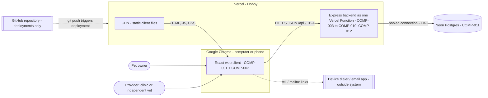
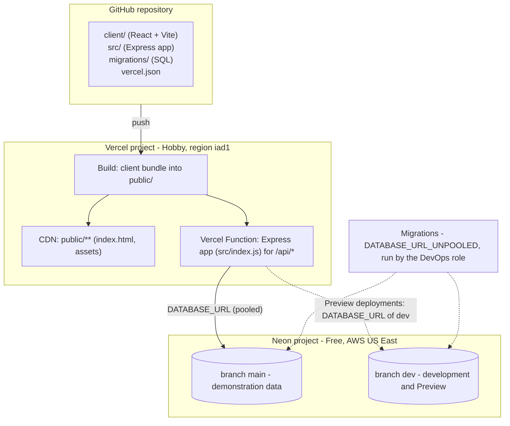
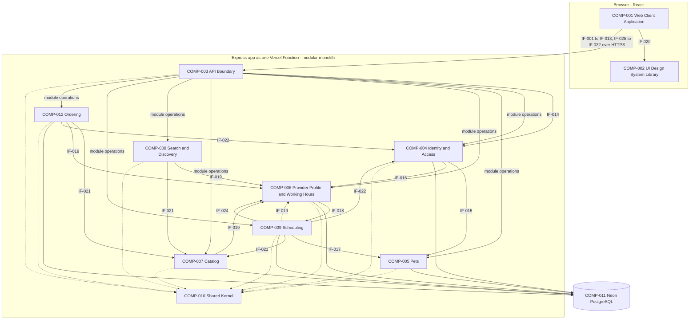
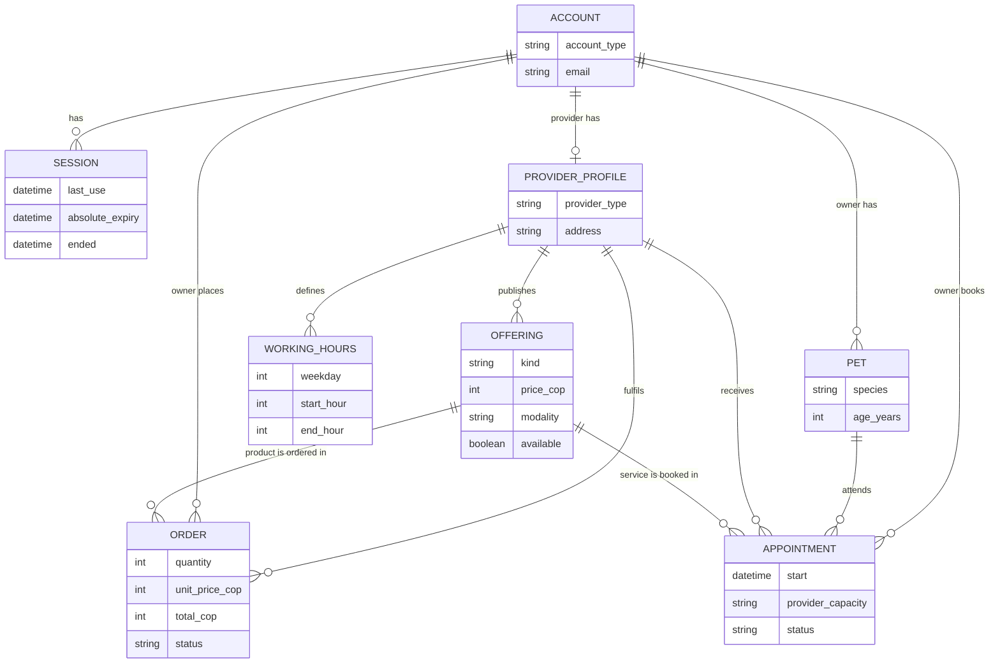
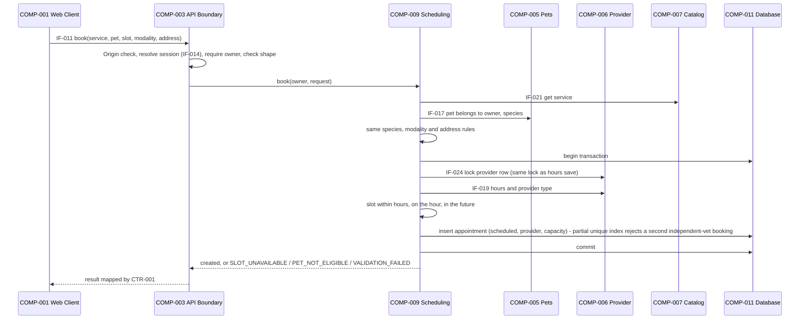
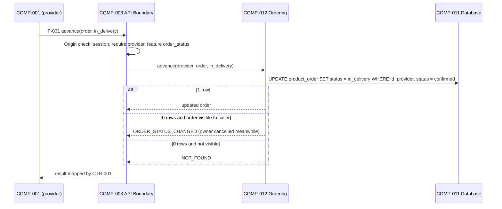

# Software Architecture

> **Labels:**
> - **FACT** — stated in an input artifact, confirmed by the team, or taken from official vendor documentation (cited in §17.4).
> - **ASSUMPTION** — temporary premise used to proceed.
> - **UNKNOWN** — not established by the inputs.
> - **PROPOSAL** — recommended option, not approved.
> - **REQUIRES_DECISION** — the team must decide.
> - **BLOCKED** — prevents a reliable decision or safe progression.
>
> **ADR statuses:**
> - `ACCEPTED` — established by the inputs or approved by the team. In v2.0 the basis is always named: an upstream fact, TD-01 (v1.0 recommendations approved), TD-14 (stack and hosting), or TD-19 (the standing rule that approves new proposals of this cascade).
> - `PROPOSED` — a P05 recommendation not yet approved.
> - `REQUIRES_DECISION` — the team must decide.
>
> **ID conventions.** P05 creates these identifiers. IDs from v1.0 keep their meaning; new ones continue the sequences. Retired IDs stay listed with the word RETIRED.
>
> | Prefix | Meaning |
> |---|---|
> | `COMP-` | Architecture components. They are not the UX components `COMP-UX-`. |
> | `IF-` | Interfaces |
> | `DATA-` | Data concepts |
> | `ADR-` | Decisions |
> | `P05-RISK-` | Risks. The P05 prefix avoids a clash with P00's risk IDs, which use the plain RISK prefix with numbers 001 to 011. |
> | `CR-` | Constraints |
> | `CTR-` | Shared contracts |
> | `DRV-` | Architectural drivers (§3) |
> | `TB-` | Trust boundaries (§4.3) |
> | `POL-` | Isolated business-rule policies (ADR-012); resolved in v2.0 |
> | `P05-ASM-`, `P05-UNK-`, `P05-RD-` | Consolidated items in §16 |
>
> All other IDs come from upstream and keep their upstream meaning. `TD-01` to `TD-20` are the team decisions of 2026-10-10 recorded in REQUIREMENTS v3.0 §1.

---

## 1. Document Metadata

| Field | Value |
|---|---|
| Stage | P05 — Architecture |
| Version | 2.0 |
| Previous version | `history/ARCHITECTURE_v1.0.md` (READY_WITH_ASSUMPTIONS; validation PASS_WITH_WARNINGS) |
| Generated | 2026-10-10 |
| Product | **VetCare** (TD-02) |
| Sprint | `SPRINT-001` (single sprint, `RELEASE-001`) |
| Companion outputs | `API_SPEC.yaml` v1.0 (OpenAPI 3.1; contracts CTR-001 to CTR-007 and CTR-009) and `DATA_MODEL.md` v1.0 (PostgreSQL), both required by TD-20 |
| **Architecture status** | **READY** |

### 1.1 Inputs Reviewed

| Input | Version / status | Role |
|---|---|---|
| `artifacts/02_requirements/REQUIREMENTS.md` | 3.0, READY; validation PASS_WITH_WARNINGS | Requirements, rules, quality constraints; team decisions TD-01 to TD-20 (§1) |
| `artifacts/03_planning/PRIORITIZATION.md` | 2.0, READY; validation PASS_WITH_WARNINGS | Delivery scope: 15 committed stories; the ordering package first among conditional work |
| `artifacts/03_planning/product_backlog.json` | 2.0 (P03) | **Authoritative backlog**: IDs, status, priority, dependencies. The P02 backlog is not used. |
| `artifacts/04_ux/UX_SPEC.md` | 2.0, READY | Screens SCR-UX-001 to -017, flows FLOW-UX-001 to -020, components COMP-UX-001 to -022, tokens |
| `artifacts/04_ux/UX_SPEC_VALIDATION.md` | 2.0, PASS_WITH_WARNINGS; P05 readiness READY_WITH_CONDITIONS (COND-UX-1, COND-UX-2) | UX findings and conditions for P05 |
| `history/ARCHITECTURE_v1.0.md` | 1.0 | Baseline; all v1.0 IDs are kept |
| `SYSTEM_PROMPT.md` | — | Global rules |

**Official vendor documentation** was read for the hosting decision (Vercel, Neon). Every hosting statement marked FACT cites it (§17.4).

### 1.2 Team Decisions Applied

| Decision | Effect in v2.0 |
|---|---|
| TD-01 | All v1.0 assumptions confirmed and v1.0 recommendations approved: ADR-002 and ADR-004 to ADR-015 are **ACCEPTED** (the decided parts of ADR-012 and ADR-014 are updated by later TDs). |
| TD-03, TD-05 | Sign-out interface IF-025; session expiry of 60 minutes idle and 12 hours absolute is fixed (ADR-007; P05-RD-003 resolved). |
| TD-04 | Password minimum 8 characters (CTR-001 reason TOO_SHORT; P05-RD-009 resolved). |
| TD-06, TD-07 | POL-1 resolved: only pets of the service's species; species mandatory (ADR-012; P05-RD-004 resolved). |
| TD-08, TD-09 | POL-2 resolved: clinic address mandatory and not removable; independent veterinarians home only (ADR-012; P05-RD-005 resolved; IF-023 retired). |
| TD-10 | Pet units fixed (DATA-003; P05-RD-007 resolved). |
| TD-11 | No personal-data regulation applies; no backups; no real data in the demonstration (P05-UNK-002, P05-RD-006 resolved). |
| TD-12, TD-13 | Ordering and stock enter the architecture: COMP-012 Ordering, DATA-008 Order, IF-026 to IF-032, CTR-009 (ADR-016). |
| TD-14 | **Stack:** React, Node.js with Express, PostgreSQL. **Hosting:** Vercel (Hobby) plus Neon (Postgres, Free) through the Vercel Marketplace. Vercel and Neon accounts managed by Fonseca. Repository on GitHub. ADR-003 and ADR-014 are ACCEPTED (P05-RD-001, -002 resolved). |
| TD-15 | CTR-001 to CTR-007 are written in API_SPEC.yaml; CTR-008 is written at sprint start. |
| TD-16 | Scope: 15 committed stories, then the ordering package; the rest of Groups A and B is extension-only (P05-RD-008 resolved). |
| TD-19 | New P05 assumptions and proposals in this version are approved; each is recorded (§16). |
| TD-20 | API_SPEC.yaml and DATA_MODEL.md are P05 outputs. This overrides the P05 prompt's restriction on complete API specifications and database schemas. |

### 1.3 Summary

VetCare is a **modular monolith** with a single-page client:

- **Client:** a React single-page application served as static files by Vercel's CDN.
- **Backend:** one Express application, deployed by Vercel as a single Vercel Function under `/api`.
- **Database:** one PostgreSQL database on Neon.

Client and backend share one origin and talk through the JSON API in API_SPEC.yaml (ADR-002 to ADR-005, ADR-014).

- **Backend modules (7):** Identity and Access; Pets; Provider Profile and Working Hours; Catalog; Search and Discovery; Scheduling; **Ordering** (new). A shared kernel holds the clock, time zone, error model and feature switches.
- **Data:** each module owns its tables (DATA_MODEL.md). Cross-module needs go through defined internal interfaces.
- **Integrity:**
  - one appointment per independent-veterinarian slot (database partial unique index plus a provider lock);
  - hours changes cancel the appointments they affect, in the same transaction;
  - order status changes are conditional updates, so they cannot go backwards, skip a step or overwrite a concurrent change.
- **Sessions:** server-side, in a secure cookie. They end at sign-out, after 60 minutes idle or 12 hours after sign-in (TD-03, TD-05; NFR-005).
- **Ordering release:** controlled by feature switches per release slice (ADR-017), as UX_SPEC P04-ASM-029 requires.

**Status rationale: READY.** Every committed story and every ordering-package story has components, interfaces, data and constraints. Every v1.0 decision is resolved by a TD. The contracts and the schema exist as files, and both were checked mechanically: API_SPEC.yaml against the official OpenAPI 3.1 schema, the DDL on PostgreSQL 16 (§18). The remaining unknowns are performance targets and appointment snapshots (P05-UNK-001, -003); neither blocks implementation. The new P05 choices are approved under TD-19 and listed in §16. The assumptions verified at the step-0 skeleton deployment (P05-ASM-012) have documented fallbacks.

---

## 2. Architectural Scope

### 2.1 MVP Capabilities Covered

| Capability | Stories | Requirements | Scope |
|---|---|---|---|
| Accounts, access, sign-out, session expiry | US-001, US-002, US-003, US-034 | FR-001 to FR-004, FR-005 (first pet), FR-039; NFR-001, NFR-002, NFR-005 | Committed |
| Provider profile and working hours | US-008, US-009 | FR-009, FR-010 | Committed |
| Catalog publishing | US-010, US-013 | FR-011, FR-014 | Committed |
| Search and discovery | US-016, US-017, US-018 | FR-017 to FR-020 | Committed |
| Appointment booking | US-019, US-020 | FR-021 to FR-025 | Committed |
| Appointment viewing | US-021, US-024 | FR-026, FR-029 | Committed |
| **Stock indicator** | US-033 | FR-038 | Ordering package (P1, conditional) |
| **Product ordering and order management** | US-027 to US-032 | FR-032 to FR-037 | Ordering package (P1, conditional) |
| Platform and language (all stories) | — | NFR-003, NFR-004 | — |

The ordering package is designed in full, because the team decided it is the first conditional work (TD-16) and UX_SPEC v2.0 designs its screens. It is released only through its feature switches (ADR-017), so the committed scope never depends on it.

### 2.2 Conditional Work That Affects Boundaries (Extension Only)

These items are **not designed** as implementation scope (TD-16). They are listed only where the architecture must not close the door on them. None adds a component or interface now.

| Item | P03 status | Architectural implication |
|---|---|---|
| US-004 to US-007 (add, list, edit and remove pets) | CONDITIONAL (P2: US-004, US-005; P3: US-006, US-007) | Extend COMP-005. Removal must cancel upcoming appointments (BR-034) and keep history: a logical `removed_at`, never a DELETE (CR-018; DATA_MODEL §9). |
| US-011, US-012, US-014, US-015 (update and remove offerings) | CONDITIONAL (P2, P3) | Extend COMP-007. Removal is logical, because appointments and orders reference offerings (CR-018). Orders keep their captured unit price (AC-085). |
| US-022, US-023, US-025, US-026 (cancel and reschedule appointments) | CONDITIONAL (P2) | Extend COMP-009 with status transitions under the same provider lock and unique index (BR-018). |

### 2.3 Scope Limitations

- **Not covered:** payments, notifications, ratings, administration, delivery logistics, real-time updates, location filters (P01 out of scope; BR-019, BR-028). The architecture adds no support for them.
- **Not designed here:** UX for Groups A and B (TD-16); CTR-008 design-system package (written at sprint start, TD-15); CI/CD pipelines (P08).

---

## 3. Architectural Drivers

| ID | Driver | Source | Architectural implication |
|---|---|---|---|
| DRV-01 | Two account types with separate interfaces. The same email can hold one account of each type, and the type is chosen at sign-in. | BR-001, BR-036, FR-003, FR-004; P02-ASM-002 | Accounts are keyed by (email, type). A session is bound to one account. Every operation is authorized by account type (ADR-009, ADR-007, CR-001). |
| DRV-02 | Users access only their own data, except public profiles and offerings and data shared between the two parties of an appointment or order. | NFR-002; AC-013, AC-018, AC-064, AC-073, AC-091; EDGE-020 | Server-side authorization in every module; ownership checks on every resource; a uniform NOT_FOUND for forbidden resources (CR-006, SCR-UX-014). |
| DRV-03 | Passwords are hashed, at least 8 characters, no other rule. | NFR-001; BR-039; AC-005, AC-009, AC-102, AC-103 | ADR-006; CTR-001 reason TOO_SHORT. |
| DRV-04 | Booking rules: one-hour slots within working hours; clinic unlimited, independent veterinarian one per slot; no confirmation; no past slots; Bogotá time; same-species pets only. | BR-010 to BR-014, BR-024; FR-021 to FR-025; P02-ASM-006, -007; TD-06 | Availability computed on the server; uniqueness enforced by the database; one clock and time zone (ADR-008, ADR-010). |
| DRV-05 | Automatic cancellation when working hours change; cancelled appointments stay visible. | BR-034, BR-035; AC-081, AC-087, AC-088 | Hours change and cancellations in one transaction; no physical deletion (CR-009, CR-010). |
| DRV-06 | Provider type decides address and modality: clinic address mandatory and not removable; independent veterinarians home only. | TD-08, TD-09; BR-007, BR-026; AC-104 to AC-107 | Enforced in COMP-006 and COMP-007 and by database constraints (ADR-012 resolved; DATA_MODEL §6.1). |
| DRV-07 | Parallel development by a small team in a three-day sprint. | PRIORITIZATION §6, §7 (assignments approved, TD-17); P03-RISK-001; ASSUM-001; TD-18 | Few deployables; contracts written before parallel work (API_SPEC.yaml); modules built independently (§15). |
| DRV-08 | One shared design system (tokens and components) across all screens. | UX_SPEC §4, §5, §12 | A single token source and a shared UI component library in the client (COMP-002, CR-012). |
| DRV-09 | Web only: Chrome on computers and phones; Spanish UI. | NFR-003, NFR-004 | A responsive React client; copy lives in the client; the backend returns codes (ADR-001, ADR-011). |
| DRV-10 | Prices are mandatory, in Colombian pesos, whole numbers greater than 0. Order totals are price × quantity. | BR-022, BR-027; P02-ASM-014; P04-ASM-013; TD-12 | Integer money; totals computed by the database from a captured unit price (CR-011; DATA_MODEL §5.8). |
| DRV-11 | Search on offering names with a species filter; all providers; no location filter. | FR-017, FR-018; BR-008, BR-009; P02-ASM-013 | Read-only queries over active offerings; accent-insensitive matching without extensions (P05-ASM-009). |
| DRV-12 | Hosting is decided: Vercel Hobby plus Neon Free, accounts managed by one team member, repository on GitHub. | TD-14; vendor documentation (§17.4) | Serverless adaptation of the monolith (ADR-014): static client on the CDN, Express as one function, pooled database connections, collaboration limits of Hobby (P05-RISK-012). |
| DRV-13 | Performance and availability targets do not exist. No regulation, backups or real data. | REQUIREMENTS §2.1; TD-11 | No targets are invented (P05-UNK-001). Demonstration data is fictitious. |
| DRV-14 | Orders: one product, quantity 1–99, address per order; statuses Confirmed → Dispatched/In delivery → Closed, forward only, provider only; cancel only before dispatch; not-available products cannot be ordered. | TD-12, TD-13; BR-019 to BR-023, BR-029 to BR-031; FR-032 to FR-038 | A dedicated module with conditional updates and a captured price (ADR-016). |
| DRV-15 | Sign-out from the menu of both interfaces; sessions end after 60 minutes idle or 12 hours; the UX distinguishes an expired session from no session. | TD-03, TD-05; FR-039; NFR-005; AC-112 to AC-114; UX_SPEC §12 (COND-UX-1) | Server-side session end; SESSION_EXPIRED outcome (ADR-007). |
| DRV-16 | The ordering UI is released in slices and only if delivered. | UX_SPEC P04-ASM-029; UX_SPEC_VALIDATION COND-UX-2 | Feature switches, one per slice, controlled by the backend and exposed to the client (ADR-017). |

---

## 4. System Context

### 4.1 Boundary

**Inside the system:**

- the React web client, served by Vercel's CDN and running in the user's browser;
- the Express backend, running as one Vercel Function;
- the PostgreSQL database on Neon.

**Outside the system:**

- the users, their browsers and devices;
- calls and emails started from a provider's contact links (P04-PROP-005);
- deliveries and payments, handled between owner and provider (BR-019, BR-028);
- the GitHub repository and the Vercel and Neon accounts, which belong to the development process, not to the runtime.

### 4.2 Actors and External Dependencies

| Actor / dependency | Type | Interaction | Status |
|---|---|---|---|
| Pet owner (P01-USER-001) | Human actor | Signs up with a pet; searches; views profiles; books; views appointments; orders products and follows orders; signs out | FACT |
| Provider: clinic (P01-USER-002) or independent veterinarian (P01-USER-003) | Human actor | Signs up; maintains profile, hours and catalog; marks product availability; views appointments; manages orders; signs out | FACT |
| Google Chrome on a computer or phone | Client platform | Runs the web client | FACT (NFR-003) |
| Vercel (Hobby plan) | Hosting platform | CDN for the static client; runs the Express backend as a Vercel Function; HTTPS; environment variables; deployments from GitHub | FACT (TD-14) |
| Neon (Postgres, Free plan) through the Vercel Marketplace | Managed database | Stores all data; connection strings injected into the Vercel project | FACT (TD-14) |
| GitHub | Source repository | Triggers Vercel deployments | FACT (TD-14) |
| Device dialer and email app | Outside the system | Opened by call and email links on SCR-UX-005 | FACT (P04-PROP-005, approved TD-01); no integration |

**There is no third-party service integration** at runtime other than the hosting platform and the database: no email, SMS, maps, payment or analytics.

### 4.3 Trust Boundaries

| Boundary | Between | Rule |
|---|---|---|
| TB-1 | Browser (untrusted) ↔ backend function | All input is untrusted and validated on the server (CR-003). Traffic is HTTPS only (Vercel). State-changing requests must come from the application's origin (CR-021). Hiding a control is never authorization (CR-001). |
| TB-2 | Backend function ↔ Neon database | Only the backend reaches the database, with credentials injected as environment variables by the integration and never stored in the repository (CR-019). |
| TB-3 | Session context inside the backend | Every request is resolved to (account ID, account type) before any module runs. Modules trust only that context, never IDs supplied by the client for "who I am" (CR-001). |

### 4.4 Context Diagram

---

## 5. Architectural Style and Rationale

### 5.1 Selected Style (ACCEPTED: TD-01, TD-14)

**A client-server modular monolith on a serverless host:**

- **One backend deployable:** an Express application organized into **business modules with explicit internal interfaces and data ownership**. Vercel runs it as a single Vercel Function.
- **One relational database:** PostgreSQL on Neon.
- **A single-page web client** built with React. Its static files are served by Vercel's CDN from the **same origin** as the API.

### 5.2 Justification

1. **Proportionate.** 34 stories (22 designed), two user types and no integrations or scale targets do not justify distribution. One deployable and one database keep setup small inside a three-day sprint (P03-RISK-001).
2. **Parallel work.** The API contract (API_SPEC.yaml) and the schema (DATA_MODEL.md) are written before coding, so frontend and backend work proceeds in parallel (PRIORITIZATION §7).
3. **Integrity.** Booking, hours changes and order status changes need transactions and constraints. These are simple with one relational database.
4. **UX fit.** The UX needs client-side state: search kept on back navigation, slot picking, toasts after navigation, an immediate availability switch and a confirmation dialog. A single-page client supports these directly.
5. **Hosting fit (FACT, Vercel docs).** Express is a supported zero-configuration backend on Vercel, and the whole application becomes one Vercel Function. That matches one deployable. Static assets in `public/` are served by the CDN.

### 5.3 Alternatives Considered

| Alternative | Benefits | Costs | Fit | Decision |
|---|---|---|---|---|
| **A. Modular monolith + SPA client (selected)** | Simple deployment; transactions; clear frontend/backend split | An API contract to keep in sync (mitigated by API_SPEC.yaml) | Good | ACCEPTED (TD-01) |
| B. Server-rendered monolith | One code area; no separate API | Weaker frontend/backend split; interactive pieces need extra scripting | Acceptable | Rejected in v1.0 (DRV-07) |
| C. Microservices | Independent scaling | Distributed transactions; more infrastructure; no requirement justifies it | Poor | Rejected |
| D. Backend-as-a-service | Less backend code | Integrity and authorization in a third-party rules language; Backend roles under-used | Poor | Rejected |
| E. Two Vercel projects (client and API on different origins) | Independent deploys | Cross-site cookies on different `vercel.app` subdomains need `SameSite=None` and CORS; more CSRF surface | Poor | Rejected; kept only as a fallback through a same-origin rewrite (P05-ASM-012) |

### 5.4 Confirmed Decisions

| Decision | Basis |
|---|---|
| Responsive web application for Chrome; Spanish UI (ADR-001) | NFR-003, NFR-004 |
| Modular monolith, SPA + JSON API, one relational database, password hashing, sessions, time and money, account model, booking integrity, error contract, design-system library, Offering concept (ADR-002, ADR-004 to ADR-011, ADR-013, ADR-015) | TD-01 |
| React, Node.js with Express, PostgreSQL (ADR-003) | TD-14 |
| Vercel Hobby + Neon Free through the Vercel Marketplace; GitHub (ADR-014) | TD-14 |
| Same-species pets; clinic address; independent home only (ADR-012) | TD-06 to TD-09 |
| Session lifetime 60 minutes idle / 12 hours absolute; sign-out (ADR-007) | TD-03, TD-05 |
| Ordering module (ADR-016), feature switches (ADR-017), contracts and schema as files (ADR-018) and the P05-ASM items of §16 | TD-19 (new P05 proposals approved); TD-15, TD-20 |

### 5.5 Deployment View

| Element | Rule | Status |
|---|---|---|
| Static client | The React build output is placed in `public/`. Vercel serves `public/**` from its CDN; `express.static()` is ignored on Vercel. | FACT (Vercel Express docs); P05-ASM-012 |
| Backend | The Express app is exported from one of the entry files Vercel detects (for example `src/index.js`) and becomes a single Vercel Function. All API routes are under `/api`. | FACT (Vercel Express docs); P05-ASM-019 |
| Deep links | Client routes such as `/mis-citas` must return the client entry page. A `vercel.json` rewrite sends non-`/api` paths to `/index.html` (the documented SPA rewrite). **If** the rewrite does not combine with the Express function as expected at the step-0 deployment, the client uses hash-based routing, which needs no server support. | ASSUMPTION verified at step 0 (P05-ASM-012) |
| Region | Vercel Functions run in Washington, D.C. (`iad1`) by default for new projects, and Hobby allows a single region. The Neon project is created in the AWS US East region, near the function. | FACT (Vercel docs); P05-ASM-013 |
| Database branches | Neon branch `main` for the deployed demonstration; branch `dev` for development and Preview deployments, set through environment variables scoped per Vercel environment. | P05-ASM-016 |
| Environment variables | `DATABASE_URL` (pooled) and `DATABASE_URL_UNPOOLED` (direct), injected by the Neon integration; `APP_ORIGIN`; `FEATURES`; `SESSION_IDLE_MINUTES` = 60; `SESSION_ABSOLUTE_HOURS` = 12. | FACT for the first two (Neon docs); rest P05-ASM-010, P05-ASM-017 |
| Migrations | Plain SQL files (Appendix A of DATA_MODEL.md as the first one), applied with the direct connection by the DevOps role before the deployment that needs them; never during the build. | P05-ASM-015 |
| Repository | **Public on GitHub**, because the Hobby plan deploys commits from a private repository only when the commit author is the owner of the Hobby team; collaboration is free for public repositories. If the team keeps it private, every deployed commit must be authored by the account owner (Fonseca, TD-14). | FACT (Vercel docs); P05-ASM-011 |

---

## 6. Component Architecture

### 6.1 Component Inventory

| ID | Component | Kind | Purpose |
|---|---|---|---|
| COMP-001 | Web Client Application | Client (React) | Screens SCR-UX-001 to SCR-UX-017, routing and access guards per account type, the account menu and sign-out, calls to the API, client-side validation for usability, es-CO formatting, rendering of ordering UI by feature switch. |
| COMP-002 | UI Design System Library | Client (shared) | Design tokens (UX_SPEC §4) and UI components COMP-UX-001 to COMP-UX-022, the message catalog and canonical labels (UX_SPEC §3.9). |
| COMP-003 | API Boundary | Backend (cross-cutting) | Express routing under `/api`. Resolves the session, enforces the role per operation, checks the same-origin rule and feature switches, validates the request shape against API_SPEC.yaml, maps module outcomes to CTR-001, and holds the final JSON error handler. |
| COMP-004 | Identity and Access | Backend module | Accounts, sign-up orchestration, sign-in, sign-out, sessions and their expiry, password hashing. |
| COMP-005 | Pets | Backend module | The owner's pets: creation at sign-up, listing for booking, species and ownership facts. |
| COMP-006 | Provider Profile and Working Hours | Backend module | Provider profile (type, public name, contact, address) and the weekly working hours. |
| COMP-007 | Catalog | Backend module | Services and products: publish, list own, product availability, offering facts for search, scheduling and ordering. |
| COMP-008 | Search and Discovery | Backend module (read-only) | Text search with species filter over offerings; public provider profile view. |
| COMP-009 | Scheduling | Backend module | Slot availability, booking, appointment views for both parties, automatic cancellation. |
| COMP-010 | Shared Kernel | Backend library | Clock and Bogotá time zone, money type, enumerations, outcome codes, transaction helper, configuration (feature switches, session lifetimes). No business rules. |
| COMP-011 | Relational Database | Data store | PostgreSQL on Neon. Each table is owned by one module (DATA_MODEL.md). |
| COMP-012 | Ordering | Backend module (new) | Product orders: place, list for owner and provider, advance status, cancel. |

### 6.2 Component Details

#### COMP-001 — Web Client Application

| Aspect | Specification |
|---|---|
| Responsibilities | Implement SCR-UX-001 to SCR-UX-017 and FLOW-UX-001 to FLOW-UX-020 as specified. Route by session account type (owner and provider tabs, COMP-UX-011). At start-up and after each UNAUTHENTICATED or SESSION_EXPIRED outcome, read the session state (IF-003). `none` routes to SCR-UX-001; `expired` routes to SCR-UX-001 with MSG-SESSION (AC-114). A signed-in user is redirected away from the public screens (P04-ASM-017). Sign-out from the account menu (COMP-UX-021) with no confirmation; route to SCR-UX-001 even if the call fails (IF-025; P04-ASM-026). Render ordering UI (tabs, *"Pedir"*, the availability switch, order actions) only for the switches in the session context's `features` (ADR-017). Show SCR-UX-014 for NOT_FOUND (CR-006). Validate on the client for usability only (CR-003). Set `maxlength` on text inputs to the API limits (P05-ASM-004). Map API outcome and reason codes to the UX message catalog (ADR-011, §7.4). Format dates, times and prices in es-CO and Bogotá time (P04-PROP-002). Keep search state while navigating back within the session. |
| Outside its boundary | Authorization; business-rule enforcement (slot validity, uniqueness, species, order transitions); defining any visual value (COMP-002). |
| Supports | All committed and ordering-package stories; NFR-003, NFR-004 |
| Data | No persistent data. Browser storage is not used for business data or session tokens (the session cookie is HttpOnly). |
| Consumes | IF-001 to IF-013, IF-025 to IF-032 (API); IF-020 (design system) |
| Dependencies | COMP-002; COMP-003 over HTTPS |
| Technology | React (TD-14); Vite as build tool and React Router for routing (P05-ASM-014). |
| Invariants | CR-001, CR-003, CR-012, CR-023 |

#### COMP-002 — UI Design System Library

| Aspect | Specification |
|---|---|
| Responsibilities | Implement the 68 design tokens of UX_SPEC §4 **in one source file** (CSS custom properties, ADR-013). Implement COMP-UX-001 to COMP-UX-022 with their variants, states and accessibility behavior. Hold the message catalog (MSG-*) and canonical labels of UX_SPEC §3.9, including the order-status labels (P04-ASM-018). Apply the responsive rules. |
| Outside its boundary | Screen logic, data fetching, business rules. |
| Supports | UX_SPEC §3 to §5, §12; NFR-003, NFR-004 |
| Exposes | IF-020 |
| Dependencies | None (leaf). Its package contract is CTR-008, written at sprint start (TD-15). |
| Invariants | CR-012 |

#### COMP-003 — API Boundary

| Aspect | Specification |
|---|---|
| Responsibilities | Mount all routes under `/api` in the Express application (P05-ASM-019). For every non-GET request, reject a missing or foreign `Origin` header, or a body that is not JSON, with FORBIDDEN_ORIGIN (CR-021, P05-ASM-017). Resolve the session cookie through COMP-004 (IF-014): **active**, **none** or **expired**. Protected operations get UNAUTHENTICATED (none) or SESSION_EXPIRED (expired). Enforce the role required by each operation (owner-only, provider-only or public). Return NOT_FOUND for operations whose feature switch is off (ADR-017, CR-023). Validate the request shape: types, required fields, enumerations, lengths, as in API_SPEC.yaml. Call exactly one module operation and translate its outcome to CTR-001 with the HTTP status of API_SPEC.yaml (P05-ASM-018). End the middleware chain with an error handler that returns UNEXPECTED as JSON and never a stack trace or Express's default error page (CR-005, CR-025). |
| Outside its boundary | Business rules and resource-ownership checks; those remain in the modules (defense in depth, CR-001). |
| Supports | NFR-002, NFR-005; FR-004; AC-013; EDGE-020 |
| Exposes | IF-001 to IF-013, IF-025 to IF-032 |
| Consumes | IF-014 and the module operations |
| Dependencies | COMP-004 to COMP-010, COMP-012 |

#### COMP-004 — Identity and Access

| Aspect | Specification |
|---|---|
| Responsibilities | **Owner sign-up:** create the owner account and its first pet atomically, through COMP-005 (IF-015) (BR-003, AC-001, AC-002). **Provider sign-up:** create the provider account and its profile (name, type, and the address for a clinic) atomically, through COMP-006 (IF-016) (AC-006, AC-104, AC-105). One account per (email, type); the same email is allowed for the other type (BR-036). Emails are normalized (P05-ASM-006). Passwords of at least 8 characters (BR-039), hashed with Argon2id (ADR-006). **Sign-in** by email, password and chosen type, with one generic failure (AC-010 to AC-012, AC-077). Create a session at sign-up and sign-in (P04-ASM-003): a random token in the cookie and only its hash stored (P05-ASM-007). **Sign-out** (IF-025): end the session and clear the cookie (FR-039, AC-112, AC-113). **Resolve** sessions (IF-014). A session ends 60 minutes after its last use or 12 hours after sign-in (NFR-005). Each authenticated request updates the last use. |
| Outside its boundary | Pet and profile data (COMP-005, COMP-006); password reset and account settings (no requirement). |
| Supports | US-001, US-002, US-003, US-034; FR-001 to FR-004, FR-039; NFR-001, NFR-002, NFR-005 |
| Data | DATA-001 Account, DATA-002 Session |
| Exposes | IF-001, IF-002, IF-003, IF-014, IF-022, IF-025 |
| Consumes | IF-015 (COMP-005), IF-016 (COMP-006) |
| Invariants | CR-004, CR-016, CR-017 |

#### COMP-005 — Pets

| Aspect | Specification |
|---|---|
| Responsibilities | Create a pet for an owner account at sign-up. Name, species (dog or cat), breed and age in whole years are required; weight in kg with at most one decimal and height in whole cm are optional (BR-032, BR-037; TD-07, TD-10). List an owner's pets (IF-009). Answer ownership, species and name questions for Scheduling (IF-017). |
| Outside its boundary | Add, list, edit and remove screens and operations (US-004 to US-007, extension only). |
| Supports | US-001 (first pet), US-019 (pet choice); FR-005, FR-022 |
| Data | DATA-003 Pet |
| Exposes | IF-009, IF-015, IF-017 |
| Dependencies | COMP-010 |

#### COMP-006 — Provider Profile and Working Hours

| Aspect | Specification |
|---|---|
| Responsibilities | Create the profile at provider sign-up, with name, immutable provider type (BR-002) and, for a clinic, the address (TD-08). Read and update the profile: public name, contact phone, contact email, address (FR-009, BR-038). A clinic's address can be changed but never cleared (AC-106, EDGE-027); an independent veterinarian's address is optional (AC-024). Read and replace the weekly working hours: one range per weekday, whole hours, end after start (FR-010, BR-033, AC-025, AC-080). **On an hours change**, call Scheduling in the same transaction to cancel the upcoming appointments outside the new hours (IF-018; BR-034, AC-081), holding the provider lock (IF-024). Expose provider facts (type, hours, address, phone, name) to Catalog, Search, Scheduling and Ordering (IF-019). |
| Outside its boundary | Appointment data (COMP-009); offerings (COMP-007). |
| Supports | US-002 (profile creation), US-008, US-009, US-018, US-019 |
| Data | DATA-004 Provider Profile, DATA-005 Working Hours |
| Exposes | IF-004, IF-005, IF-016, IF-019, IF-024 |
| Consumes | IF-018 (COMP-009) |

#### COMP-007 — Catalog

| Aspect | Specification |
|---|---|
| Responsibilities | Publish a service: name, price, exactly one species, and modality (FR-011, BR-006, BR-007, AC-027 to AC-029, AC-082). For an independent veterinarian the modality is always home: the client sends none or `home`, and any other value is rejected (TD-09, AC-107). Publish a product: name, price, one species; it is published as available (FR-014, AC-033, AC-034, AC-084, AC-111). Validate price as whole pesos greater than 0 (CR-011). **Set a product's availability** (IF-026; FR-038, AC-100, AC-101). A not-available product stays visible (P02-ASM-016). List the provider's own offerings (SCR-UX-011). Expose offering facts, including product availability and price, to Search, Scheduling and Ordering (IF-021). |
| Outside its boundary | Text matching (COMP-008); orders (COMP-012); update and removal of offerings (extension only). |
| Supports | US-010, US-013, US-033, US-016, US-018, US-019, US-027 |
| Data | DATA-006 Offering |
| Exposes | IF-006, IF-021, IF-026 |
| Consumes | IF-019 (provider type, to apply the modality rule) |

#### COMP-008 — Search and Discovery

| Aspect | Specification |
|---|---|
| Responsibilities | Text search over the names of offerings of all providers, case- and accent-insensitive, with an optional species filter; text and species both apply (FR-017, FR-018, BR-008, BR-009, P02-ASM-013, P05-ASM-009; AC-038, AC-041 to AC-043, AC-086). Return the result data for the card, including `available` for products (FR-019, AC-039, P04-ASM-007, P02-ASM-016). Return a provider's public profile with its offerings (FR-020, AC-044, AC-045). |
| Outside its boundary | Writing data; location filtering (BR-009); result ordering (P04-ASM-006). |
| Supports | US-016, US-017, US-018 |
| Data | None owned (read-only through IF-021 and IF-019) |
| Exposes | IF-007, IF-008 |

#### COMP-009 — Scheduling

| Aspect | Specification |
|---|---|
| Responsibilities | **Compute offered slots** for a service and a week: whole-hour starts within the provider's hours for that Bogotá weekday, up to one hour before closing, in the future; for independent veterinarians, excluding slots with a scheduled appointment; for clinics, not excluding them (FR-021, FR-024, FR-025, BR-010 to BR-013, P02-ASM-006; AC-026, AC-046, AC-049 to AC-051). **List eligible pets:** the owner's pets whose species equals the service's species (TD-06, BR-024, AC-108, AC-109). **Book:** validate that the service exists; the pet belongs to the owner and has the service's species (PET_NOT_ELIGIBLE); the modality (P02-ASM-005, AC-054; an independent veterinarian's services are home only); the visit address for home visits (BR-015, AC-053); then, under the provider lock (IF-024), re-check the slot and insert the appointment as scheduled with no confirmation (BR-014, AC-047). The partial unique index rejects a second booking of an independent veterinarian's slot (ADR-010, EDGE-007). **List appointments** for the owner (AC-055, AC-056, AC-087) and the provider (AC-063, AC-064, AC-088), including cancelled ones (BR-035). **Cancel** upcoming appointments outside new hours when COMP-006 asks (IF-018). |
| Outside its boundary | Working-hours storage (COMP-006); offering data (COMP-007); pet data (COMP-005); user cancel and reschedule (extension only). |
| Supports | US-009 (auto-cancel), US-019, US-020, US-021, US-024 |
| Data | DATA-007 Appointment |
| Exposes | IF-010, IF-011, IF-012, IF-013, IF-018 |
| Consumes | IF-017, IF-019, IF-021, IF-022, IF-024 |
| Invariants | CR-007 to CR-010 |

#### COMP-010 — Shared Kernel

| Aspect | Specification |
|---|---|
| Content | **Clock:** "now" in America/Bogota, injectable for tests (ADR-008). **Money:** whole pesos. **Enumerations** (the API codes of CTR-003). **Outcome and reason codes** (CTR-001). **Transaction helper:** runs a function on one pooled connection inside BEGIN/COMMIT (CR-024). **Configuration:** feature switches from `FEATURES` (ADR-017); session lifetimes; application origin. |
| Outside its boundary | Business rules and data ownership. |
| Dependencies | None. |

#### COMP-011 — Relational Database

| Aspect | Specification |
|---|---|
| Responsibilities | Persist DATA-001 to DATA-008 in the tables of DATA_MODEL.md. Provide the transactions, row locks, unique indexes and constraints used by CR-008, CR-009, CR-017 and CR-022. |
| Constraint | Accessed only by the backend, through the pooled connection string; migrations use the direct string (CR-024). Each module reads and writes only its own tables, and reads another module's data only through that module's interface or read queries (CR-002). |
| Technology | PostgreSQL on Neon, Free plan (TD-14). |

#### COMP-012 — Ordering

| Aspect | Specification |
|---|---|
| Responsibilities | **Place an order** (IF-028): quantity 1 to 99 (AC-110), delivery address required (AC-070); in one transaction, read the product with a share lock through IF-021, reject a not-available or missing product with PRODUCT_UNAVAILABLE (AC-089, BR-030), capture its price, and insert the order as `confirmed` (AC-069, BR-019). No pet is required (AC-071). **Order context** for the order form (IF-027). **List orders** for the owner (IF-029; AC-090, AC-091) and the provider (IF-030; AC-072, AC-073), most recent first, including cancelled and orders of later-removed products (AC-085, P02-ASM-012). **Advance status** by the provider (IF-031): `confirmed` → `in_delivery` → `closed`, one step, never back (AC-092 to AC-094). **Cancel** by the owner or the provider while `confirmed` (IF-032; AC-096 to AC-099). Every status change is a conditional update on the expected current status. Zero rows means NOT_FOUND (not the caller's order) or ORDER_STATUS_CHANGED (the status moved meanwhile) (CR-022). |
| Outside its boundary | Product data and availability (COMP-007); payment and delivery logistics (BR-019, BR-028). |
| Supports | US-027 to US-032; FR-032 to FR-037 |
| Data | DATA-008 Order |
| Exposes | IF-027 to IF-032 |
| Consumes | IF-021 (product facts, in its transaction), IF-019 (provider name and type), IF-022 (owner name for the provider's view) |
| Invariants | CR-022, CR-023 |

### 6.3 Component Diagram

**Reading the diagram:**

- Arrows point from the caller to the provider of the interface. The interface tables in §7 list "provider → consumer".
- Solid arrows are allowed calls. From COMP-003 they are "module operations", one per external interface.
- Dashed arrows are uses of the shared kernel.
- COMP-008 has no arrow to the database; it reads through IF-019 and IF-021, which may be read queries **defined and owned by** COMP-006 and COMP-007 (CR-002).
- IF-023 is retired (§7.2), so v1.0's dashed COMP-006 → COMP-007 arrow is gone.

---

## 7. Interfaces and Interaction Rules

- **Client ↔ backend (IF-001 to IF-013, IF-025 to IF-032):** JSON over HTTPS under `/api`. **Paths, methods, fields, types, status codes and outcomes are specified in API_SPEC.yaml** (TD-15, TD-20). Each operation there names its interface (`x-vetcare-interface`). This section keeps the architectural view: provider, consumer, purpose, rules.
- **Internal interfaces (IF-014 to IF-024):** in-process calls between modules of the Express application.
- **Common outcomes:** every protected interface returns UNAUTHENTICATED without a session, SESSION_EXPIRED after expiry, and NOT_FOUND when called by the other account type, for another user's resource, or while its feature switch is off (CR-006, CR-023). Every state-changing interface returns FORBIDDEN_ORIGIN for cross-origin requests (CR-021). These outcomes are not repeated per row.

### 7.1 Client–Backend Interfaces

| ID | Provider → consumer | Purpose (API_SPEC operation) | Conceptual information | Authorization and validation | Specific outcomes (CTR-001) | Related |
|---|---|---|---|---|---|---|
| IF-001 | COMP-003/COMP-004 → COMP-001 | **Sign up** (`signUpOwner`, `signUpProvider`). Creates a session (P04-ASM-003). | Owner: name, email, password, first pet (name, species, breed, age; optional weight, height). Provider: name, email, password, provider type, address (required for a clinic). Returns the session context. | Public. Password ≥ 8; species required; clinic address required; one account per (email, type). | VALIDATION_FAILED (REQUIRED, INVALID_FORMAT, TOO_SHORT, OUT_OF_RANGE, TOO_LONG); DUPLICATE_ACCOUNT_FOR_TYPE | US-001, US-002; FR-001, FR-002, FR-005; AC-001 to AC-004, AC-006 to AC-008, AC-074 to AC-076, AC-102 to AC-105 |
| IF-002 | COMP-003/COMP-004 → COMP-001 | **Sign in** (`signIn`) choosing the account type. | Email, password, account type → session context. | Public. | INVALID_CREDENTIALS (generic); VALIDATION_FAILED | US-003; FR-003; AC-010 to AC-012, AC-077 |
| IF-003 | COMP-003/COMP-004 → COMP-001 | **Session state** (`getSession`) for routing. | `active` (with account type), `none`, or `expired`; enabled feature switches. | Public; never an error for a missing session. | — | US-003; FR-004; NFR-005; AC-114; UX_SPEC §6.1 |
| IF-004 | COMP-003/COMP-006 → COMP-001 | **Own provider profile** (`getOwnProviderProfile`, `updateOwnProviderProfile`). | Public name, phone, contact email, address, provider type (read-only), profile-completed flag (onboarding alert). | Provider only; own profile. Clinic address cannot be null (REQUIRED). Phone characters (P04-ASM-005). | VALIDATION_FAILED | US-008; FR-009; AC-023, AC-024, AC-106; EDGE-027; SCR-UX-009 |
| IF-005 | COMP-003/COMP-006 → COMP-001 | **Own working hours** (`getWorkingHours`, `replaceWorkingHours`). | Seven days: works, start hour, end hour. Cancellations happen on the server (BR-034). | Provider only. Whole hours; end after start; one range per weekday. | VALIDATION_FAILED (NOT_ON_THE_HOUR, END_NOT_AFTER_START, REQUIRED) | US-009; FR-010; AC-025, AC-080, AC-081; SCR-UX-010 |
| IF-006 | COMP-003/COMP-007 → COMP-001 | **Own catalog** (`listOwnOfferings`, `publishService`, `publishProduct`). | Offering: kind, name, price, species, modality (services) or availability (products). | Provider only; provider taken from the session. Price > 0; one species; modality required for clinics, home only for independent veterinarians. | VALIDATION_FAILED (incl. NOT_ALLOWED) | US-010, US-013; FR-011, FR-014; AC-027 to AC-029, AC-033, AC-034, AC-082, AC-084, AC-107, AC-111; SCR-UX-011 to -013 |
| IF-007 | COMP-003/COMP-008 → COMP-001 | **Search** (`searchOfferings`). | Text and species filter → results with offering data, product availability and provider reference. | Owner only. Text non-empty after trimming. | VALIDATION_FAILED; empty result is normal (AC-040) | US-016, US-017; FR-017 to FR-019; AC-038 to AC-043, AC-086; SCR-UX-004 |
| IF-008 | COMP-003/COMP-008 → COMP-001 | **Provider public profile** (`getPublicProviderProfile`). | Name, type, address (always for a clinic), phone (once saved), email, services and products (with availability). | Owner only. | NOT_FOUND | US-018; FR-020; AC-044, AC-045; SCR-UX-005 |
| IF-009 | COMP-003/COMP-005 → COMP-001 | **Own pets** (`listOwnPets`). | ID, name, species, breed. | Owner only; own pets. | — | US-019; FR-022; BR-005; SCR-UX-006 |
| IF-010 | COMP-003/COMP-009 → COMP-001 | **Booking context and slots** (`getBookingContext`). | Server "now" (Bogotá); service summary with provider and clinic address; eligible pet IDs (same species); flags for no pets and no hours; seven days of offered slot starts. | Owner only. | NOT_FOUND | US-019, US-020; FR-021, FR-024, FR-025; AC-026, AC-046, AC-048 to AC-051, AC-108, AC-109 |
| IF-011 | COMP-003/COMP-009 → COMP-001 | **Book** (`bookAppointment`). | Service, pet, slot start, chosen modality (if both), visit address (home) → created appointment. | Owner only. The server re-validates everything (§6.2). | VALIDATION_FAILED; SLOT_UNAVAILABLE; PET_NOT_ELIGIBLE; NO_PETS; NOT_FOUND | US-019, US-020; FR-022, FR-023; AC-047, AC-052 to AC-054, AC-108, AC-109; EDGE-004, -007 to -009, -016, -030 |
| IF-012 | COMP-003/COMP-009 → COMP-001 | **Owner's appointments** (`listOwnerAppointments`). | Start, end, status, upcoming flag, service, modality, pet, provider (name, type, phone), place (visit address, or the clinic's address). | Owner only; own appointments. | — | US-021; FR-026; AC-055, AC-056, AC-087; P04-ASM-011 |
| IF-013 | COMP-003/COMP-009 → COMP-001 | **Provider's appointments** (`listProviderAppointments`). | Start, end, status, upcoming flag, service, modality, pet, owner's name, visit address (home). No owner email or phone. | Provider only; own appointments. | — | US-024; FR-029; AC-063, AC-064, AC-088; P02-ASM-008 |
| IF-025 | COMP-003/COMP-004 → COMP-001 | **Sign out** (`signOut`). | Ends the session; clears the cookie. Idempotent. | Public (works without a session). | — | US-034; FR-039; BR-040; AC-112, AC-113; EDGE-031 |
| IF-026 | COMP-003/COMP-007 → COMP-001 | **Set product availability** (`setProductAvailability`). Feature `stock`. | Available yes/no → updated product. | Provider only; own product. | VALIDATION_FAILED; NOT_FOUND | US-033; FR-038; AC-100, AC-101 |
| IF-027 | COMP-003/COMP-012 → COMP-001 | **Order context** (`getOrderContext`). Feature `orders`. | Product (name, species, price, availability) and provider reference. | Owner only. | NOT_FOUND | US-027; FR-032; SCR-UX-015 |
| IF-028 | COMP-003/COMP-012 → COMP-001 | **Place order** (`placeOrder`). Feature `orders`. | Product, quantity, delivery address → created order with unit price and total. | Owner only. Quantity 1–99; address required. | VALIDATION_FAILED (OUT_OF_RANGE, REQUIRED); PRODUCT_UNAVAILABLE; NOT_FOUND | US-027; FR-032; AC-069 to AC-071, AC-089, AC-110; EDGE-018, -021, -029 |
| IF-029 | COMP-003/COMP-012 → COMP-001 | **Owner's orders** (`listOwnerOrders`). Feature `orders`. | Product, quantity, unit price, total, address, status, date, provider. | Owner only; own orders. | — | US-029; FR-034; AC-085, AC-090, AC-091 |
| IF-030 | COMP-003/COMP-012 → COMP-001 | **Provider's orders** (`listProviderOrders`). Feature `orders`. | Same, with the owner's name instead of the provider. | Provider only; own orders. | — | US-028; FR-033; AC-072, AC-073, AC-085 |
| IF-031 | COMP-003/COMP-012 → COMP-001 | **Advance order status** (`advanceOrderStatus`). Feature `order_status`. | Target status `in_delivery` or `closed` → updated order. | Provider only; own order; one step forward only. | ORDER_STATUS_CHANGED; VALIDATION_FAILED; NOT_FOUND | US-030; FR-035; AC-092 to AC-095; EDGE-023, -024, -026 |
| IF-032 | COMP-003/COMP-012 → COMP-001 | **Cancel order** (`cancelOwnOrder`, `cancelProviderOrder`). Features `order_cancel_owner`, `order_cancel_provider`. | → cancelled order. | Owner or provider of the order; only while `confirmed`. | ORDER_STATUS_CHANGED; NOT_FOUND | US-031, US-032; FR-036, FR-037; AC-096 to AC-099; EDGE-022 |

### 7.2 Internal Interfaces

| ID | Provider → consumer | Purpose | Information | Rules | Related |
|---|---|---|---|---|---|
| IF-014 | COMP-004 → COMP-003 | Resolve the session | Cookie token → active (account ID, account type), none, or expired. Updates the last use of an active session. | The only way any module learns "who". | NFR-002, NFR-005; ADR-007 |
| IF-015 | COMP-005 → COMP-004 | Create the first pet inside the owner sign-up transaction | Owner account ID, pet data → pet, or a validation outcome | Caller's transaction (CR-017) | US-001; BR-003; AC-002 |
| IF-016 | COMP-006 → COMP-004 | Create the provider profile inside the provider sign-up transaction | Provider account ID, name, type, contact email (= sign-up email, P04-ASM-012), address (clinic) | Caller's transaction (CR-017) | US-002; BR-002, BR-026 |
| IF-017 | COMP-005 → COMP-009 | Pet facts | Pet and owner → belongs, species; an owner's pets; pet names by ID | Read-only | US-019, US-021, US-024; BR-005, BR-024 |
| IF-018 | COMP-009 → COMP-006 | Cancel the appointments outside new hours | Provider, new hours, "now" → number cancelled | Inside the hours-update transaction; only upcoming scheduled appointments (BR-034, CR-009) | US-009; AC-081; EDGE-013 |
| IF-019 | COMP-006 → COMP-007, COMP-008, COMP-009, COMP-012 | Provider facts | Provider → name, type, phone, contact email, address, weekly hours | Read-only | FR-019, FR-020, FR-021, FR-033; BR-007, BR-012, BR-013 |
| IF-020 | COMP-002 → COMP-001 | Design system | Tokens, COMP-UX components, messages, labels | Screens use only these (CR-012) | UX_SPEC §4, §5, §12 |
| IF-021 | COMP-007 → COMP-008, COMP-009, COMP-012 | Offering facts | Search over names with species filter; offering by ID (kind, provider, species, modality, price, availability, name); a provider's offerings. For COMP-012: the product row read with a share lock in the caller's transaction. | Read-only. Queries owned by COMP-007 (CR-002). | FR-017, FR-018, FR-020, FR-021, FR-032, FR-038 |
| IF-022 | COMP-004 → COMP-009, COMP-012 | Account names | Account ID → name | Read-only; never email or password hash | US-024, US-028; AC-063, AC-072 |
| IF-023 | — | **RETIRED in v2.0.** In-clinic service presence existed only for POL-2 option A's address-removal sub-rule. TD-08 makes a clinic's address non-removable, so the rule and the interface are no longer needed. | — | — | — |
| IF-024 | COMP-006 → COMP-009 | Provider serialization | Lock the provider's profile row (`FOR UPDATE`) inside the caller's transaction; the hours save takes the same lock. | Booking transaction only; realizes CR-009 | US-009, US-019; BR-013, BR-034 |

### 7.3 Dependency Rules

**Allowed:**

- COMP-001 → COMP-002; COMP-001 → COMP-003 (HTTPS only).
- COMP-003 → any backend module and COMP-010.
- **Commands** (calls that change another module's data), exactly three:
  - COMP-004 → COMP-005 (IF-015) and COMP-004 → COMP-006 (IF-016), only inside sign-up;
  - COMP-006 → COMP-009 (IF-018), only inside the hours save.
- **Coordination call:** COMP-009 → COMP-006 (IF-024), the provider lock; it changes no data.
- **Read-only queries:**
  - COMP-007, COMP-008, COMP-009, COMP-012 → COMP-006 (IF-019);
  - COMP-008, COMP-009, COMP-012 → COMP-007 (IF-021);
  - COMP-009 → COMP-005 (IF-017);
  - COMP-009, COMP-012 → COMP-004 (IF-022).
- Every backend module → COMP-010.
- Data-owning modules → COMP-011, for their own tables only.

**Prohibited (CR-015):**

- The client accessing the database or any module except through COMP-003.
- Any module writing another module's tables. In particular, COMP-012 never updates `offering`, and COMP-007 never reads or writes `product_order`.
- Within one operation, a chain of calls with more than one command. Read-only queries and IF-024 may form static cycles because they change no data.
- Any new cross-module command without an architecture change.
- COMP-010 depending on any module.
- Business rules in COMP-003 or COMP-001 that are not also enforced in a module.

### 7.4 Error Contract (CTR-001, ADR-011)

The full contract (schemas and HTTP statuses) is in API_SPEC.yaml (`ErrorResponse`, `OutcomeCode`, `ReasonCode`). The client maps each code to the UX catalog:

| Outcome code | HTTP | Client behavior (UX reference) |
|---|---|---|
| VALIDATION_FAILED | 422 | Field errors and form alert. Reasons: REQUIRED → MSG-REQ (or the field's choice message); INVALID_FORMAT → MSG-EMAIL, MSG-PHONE, MSG-INTEGER, MSG-DECIMAL; OUT_OF_RANGE → MSG-PRICE, MSG-QTY; TOO_SHORT → MSG-PASSWORD; NOT_ON_THE_HOUR, END_NOT_AFTER_START → COMP-UX-018 messages; TOO_LONG and NOT_ALLOWED → prevented by the UI (input `maxlength`; no clinic options for independent veterinarians), MSG-FORM if they occur. |
| DUPLICATE_ACCOUNT_FOR_TYPE | 409 | Email field error with sign-in link (SCR-UX-002, -003) |
| INVALID_CREDENTIALS | 401 | Generic sign-in alert (SCR-UX-001) |
| UNAUTHENTICATED | 401 | SCR-UX-001, no message (P04-ASM-017) |
| SESSION_EXPIRED | 401 | SCR-UX-001 with MSG-SESSION; unsaved input lost (AC-114, P04-ASM-022) |
| FORBIDDEN_ORIGIN | 403 | MSG-NET (not reachable from the real client) |
| NOT_FOUND | 404 | SCR-UX-014 (also other users' resources, the other type, disabled features; CR-006) |
| SLOT_UNAVAILABLE | 409 | MSG-SLOT-GONE; reload the slots (SCR-UX-006) |
| PET_NOT_ELIGIBLE | 422 | MSG-SPECIES-ONLY in section 1 of SCR-UX-006 (only reachable if the data changed meanwhile) |
| NO_PETS | 422 | Info alert of SCR-UX-006 (AC-048) |
| PRODUCT_UNAVAILABLE | 409 | MSG-UNAVAILABLE on SCR-UX-015 (AC-089) |
| ORDER_STATUS_CHANGED | 409 | COMP-UX-020 status-changed alert; reload the card |
| UNEXPECTED | 500 | MSG-NET with *"Reintentar"* |

v1.0's CLINIC_ADDRESS_REQUIRED is **removed**. A clinic always has an address (TD-08), and an empty address is VALIDATION_FAILED / REQUIRED.

---

## 8. Conceptual Data Architecture

The logical and physical model, with every table, column, type, key, constraint and index, is in **DATA_MODEL.md** (TD-20). This section keeps the conceptual view and the ownership rules.

### 8.1 Data Concepts

| ID | Entity | Purpose | Conceptual information | Relationships | Owner | Integrity, lifecycle and access | Table | Related |
|---|---|---|---|---|---|---|---|---|
| DATA-001 | Account | A sign-in identity of one type | Account type, name, email, password hash, creation time | Owner account – N Pets, N Orders; provider account – 1 Provider Profile; N Sessions | COMP-004 | Unique (email, type) (BR-036). Email normalized and not changeable (CR-016). Hash never exposed (CR-004). | `account` | FR-001 to FR-003; NFR-001 |
| DATA-002 | Session | A signed-in session bound to one account | Hash of the session token, account, creation, last use, absolute expiry, end time | N – 1 Account | COMP-004 | Created at sign-up and sign-in. Ends at sign-out (FR-039), after 60 minutes without use or 12 hours after sign-in (NFR-005). An ended session resolves to "none"; an expired one to "expired". | `session` | FR-003, FR-004, FR-039; NFR-002, NFR-005 |
| DATA-003 | Pet | An owner's animal | Name, species (dog or cat), breed, age (whole years), weight (kg, one decimal, optional), height (whole cm, optional) | N – 1 owner Account; 1 – N Appointments | COMP-005 | All of name, species, breed and age required (BR-037, TD-07, TD-10). Visible to its owner, and its name to the provider of its appointments. | `pet` | FR-005; US-001 |
| DATA-004 | Provider Profile | The public identity of a provider | Provider type (fixed), public name, contact phone (absent until the first save), contact email, address | 1 – 1 provider Account; 1 – N Offerings, Working Hours, Appointments, Orders | COMP-006 | Type immutable (BR-002). A clinic always has an address; an independent veterinarian may not (BR-026, TD-08, TD-09). Contact email separate from the sign-in email (CR-016). Public to signed-in owners. | `provider_profile` | FR-002, FR-009, FR-020 |
| DATA-005 | Working Hours | One weekday's hours of a provider | Weekday, start hour, end hour | N – 1 Provider Profile | COMP-006 | One range per weekday; whole hours; end after start (BR-033). The week is replaced as a whole on save. A change triggers BR-034 cancellations in the same transaction (CR-009). | `working_hours` | FR-010; US-009 |
| DATA-006 | Offering | A service or a product published by a provider | Kind, name, price (whole pesos > 0), species, modality (services: clinic, home or both), availability (products: yes/no) | N – 1 Provider Profile; a service – N Appointments; a product – N Orders | COMP-007 | Exactly one species (BR-006). An independent veterinarian's services are home only (TD-09). A new product is available (TD-13, BR-031). A not-available product stays visible and cannot be ordered (P02-ASM-016, BR-030). No removal in the designed scope; future removal is logical (CR-018). | `offering` | FR-011, FR-014, FR-017 to FR-020, FR-038 |
| DATA-007 | Appointment | A booking of one service, for one pet, in one hour | Owner, pet, service, provider, provider capacity (copied from the type), start (whole hour), chosen modality, visit address (home), status (scheduled, cancelled), creation and cancellation times | N – 1 owner Account, Pet, Offering (service), Provider Profile | COMP-009 | Created as scheduled (BR-014). **At most one scheduled appointment per start for an independent veterinarian**, enforced by a partial unique index; clinics unlimited (BR-012, BR-013, CR-008). Never deleted (BR-035, CR-010). Visible to its owner and its provider only. | `appointment` | FR-021 to FR-026, FR-029 |
| DATA-008 | Order | One product ordered by an owner (**new**) | Owner, product, provider, quantity (1–99), unit price at ordering time, total (= unit price × quantity), delivery address, status (confirmed, in delivery, closed, cancelled), placement and status-change times | N – 1 owner Account; N – 1 Offering (product); N – 1 Provider Profile | COMP-012 | Created as confirmed (BR-019). One product per order (BR-022). Status moves forward one step, provider only; cancel only while confirmed; cancelled and closed are final (BR-023, BR-029, P02-ASM-011). Keeps its status and price if the product is later removed (P02-ASM-012). Never deleted. Visible to its owner and its provider only (NFR-002). | `product_order` | FR-032 to FR-037 |

**Not modeled (by design):** who cancelled an appointment or order (only "shown as cancelled" is required); payment and delivery tracking (BR-019, BR-028); administrators.

### 8.2 Conceptual Data Diagram

The diagram shows a few conceptual attributes per entity; DATA_MODEL.md §5 has the full columns and types.

### 8.3 Principal Data Flows

| Flow | Creates / modifies | Validates | Exposes |
|---|---|---|---|
| **Owner sign-up** (FLOW-UX-001) | Account, Pet (IF-015) and Session in one transaction | COMP-003 shape; COMP-004 uniqueness and password; COMP-005 pet fields | IF-001 |
| **Provider sign-up** (FLOW-UX-002) | Account, Provider Profile with address for a clinic (IF-016) and Session in one transaction | COMP-004, COMP-006 | IF-001 |
| **Sign-in** (FLOW-UX-003) | Session | COMP-004 | IF-002, IF-003 |
| **Sign-out** (FLOW-UX-019) | Session ended | — | IF-025 |
| **Session expiry** (FLOW-UX-020) | — (read time) | COMP-004 compares last use and absolute expiry with "now" | IF-003, SESSION_EXPIRED |
| **Profile save** (FLOW-UX-004) | Provider Profile | COMP-006 fields; clinic address not empty | IF-004; public through IF-008 |
| **Hours save** (FLOW-UX-005) | Working Hours replaced; affected upcoming Appointments cancelled (IF-018); one transaction under the provider lock (IF-024) | COMP-006, COMP-009 | IF-005; effects through IF-010, IF-012, IF-013 |
| **Publish** (FLOW-UX-006, -007) | Offering (products available) | COMP-007 fields and modality rule | IF-006; IF-021 |
| **Availability** (FLOW-UX-018) | Offering availability | COMP-007 ownership | IF-026; visible through IF-007, IF-008, IF-027 |
| **Search and profile** (FLOW-UX-008, -009) | — | COMP-008 input | IF-007, IF-008 |
| **Book** (FLOW-UX-010, -011) | Appointment under the provider lock and the unique index (CR-008, CR-009) | COMP-009, including same species | IF-011 |
| **View appointments** (FLOW-UX-012, -013) | — | COMP-009 ownership filter | IF-012, IF-013 |
| **Order** (FLOW-UX-015) | Order, with the product read under a share lock and its price captured | COMP-012 quantity, address, availability | IF-028; IF-029, IF-030 |
| **Manage orders** (FLOW-UX-016, -017) | Order status via conditional update | COMP-012 role, ownership, expected status | IF-031, IF-032 |

### 8.4 Booking Sequence (Integrity-Critical)

### 8.5 Order Status Sequence (Integrity-Critical)

### 8.6 Data Rules Summary

- **Ownership:** exactly one module writes each table (§8.1; CR-002).
- **Consistency:** each multi-entity write is one transaction: sign-up (CR-017); hours save with cancellations (CR-009); booking (CR-008); placing an order (CR-022).
- **Persistence:** all business data lives in COMP-011. The client keeps no business data.
- **Verified:** DATA_MODEL.md Appendix B records 32 rejection tests, a concurrency test of double booking, and the conditional order update, run on PostgreSQL 16.
- **Remaining unknown:** whether appointments should show pet and service data as they were at booking time. This only matters once edit stories (US-006, US-011) enter (P05-UNK-003). Orders already capture the unit price (P05-ASM-008).

---

## 9. Security and Quality Architecture

### 9.1 Required Controls (Derived from the Inputs)

| Concern | Source | Architectural response | Responsible |
|---|---|---|---|
| **Password storage** | NFR-001; AC-005, AC-009 | Argon2id with a per-password salt (ADR-006). Passwords never logged, returned or stored in plain text (CR-004). | COMP-004 |
| **Password policy** | BR-039; AC-102, AC-103 | At least 8 characters, no other rule; TOO_SHORT. | COMP-004 |
| **Authentication** | FR-003; P02-ASM-001 | Email + password + chosen type; one generic failure; a session only on success (ADR-007). | COMP-004 |
| **Session handling** | FR-004, FR-039; NFR-005; AC-112 to AC-114 | Random token of at least 32 bytes in the cookie `vetcare_session` (HttpOnly, Secure, SameSite=Lax, Path=/). Only its SHA-256 hash is stored. Ends at sign-out, 60 minutes after last use, or 12 hours after sign-in. Expired sessions are reported as SESSION_EXPIRED. | COMP-004, COMP-003 |
| **Transport security** | Secure cookie; credentials in transit | HTTPS on Vercel for the client and the API. | Hosting |
| **Cross-site request forgery** | NFR-002 with cookie sessions | Every state-changing request needs the application's `Origin` (`APP_ORIGIN`) and a JSON body type, plus the SameSite=Lax cookie (CR-021, P05-ASM-017). | COMP-003 |
| **Authorization** | NFR-002; AC-013, AC-018, AC-064, AC-073, AC-091; EDGE-020 | Role check per operation (COMP-003); ownership check in every module; identity only from the session (TB-3); uniform NOT_FOUND (CR-006). Client guards are for usability (CR-001). | COMP-003, every module |
| **Input validation** | REQUIREMENTS §7 rules; API_SPEC.yaml | The server enforces every rule (CR-003); the database enforces the row-level rules again (DATA_MODEL §6.1). | COMP-003, modules, COMP-011 |
| **Data integrity** | BR-013, BR-034, BR-035, BR-003, BR-022, BR-023, BR-029 | Transactions, row locks, partial unique index, conditional updates, no physical deletion (§8.6). | COMP-009, COMP-012, COMP-004, COMP-011 |
| **Logging without sensitive data** | NFR-001, NFR-002 | Logs carry outcome codes, operation names and IDs only; never passwords, tokens, emails, phones or addresses (CR-020). | Backend |
| **Error exposure** | CR-005 | A final Express error handler returns UNEXPECTED as JSON. Vercel's documentation warns that Express renders its own error pages and can leave the function in an undefined state unless errors are handled (CR-025). | COMP-003 |
| **Secrets** | TB-2 | Connection strings come from the Neon integration's environment variables; nothing secret in the repository, which is public (CR-019, P05-ASM-011). | Hosting, DevOps role |

### 9.2 Recommended Controls (PROPOSAL; Not Required by the Inputs)

| Control | Why | Notes |
|---|---|---|
| Output encoding | User text (names, breeds, addresses) | React escapes text by default; never use raw HTML injection. |
| Throttling of failed sign-ins | Password guessing | Not required; add only if cheap. |
| Security headers (Content-Security-Policy, X-Content-Type-Options) | Defense in depth | Low cost through `vercel.json` headers. |
| Dependency hygiene | Public repository | Keep `npm audit` clean before the demonstration. |

### 9.3 Quality Attributes Without Targets

| Attribute | Status | Architectural stance |
|---|---|---|
| Performance and response times | UNKNOWN (P05-UNK-001) | No target is invented. Indexed queries suffice for demonstration data (P05-ASM-002). The first request after 5 idle minutes waits for Neon's compute to resume (FACT, Neon docs); a warm-up request before the demonstration is recommended. |
| Availability | UNKNOWN | One production environment (P05-ASM-003). Vercel Hobby limits are far above a demonstration's needs. If they were exceeded, the feature pauses until 30 days have passed (FACT, Vercel docs) (P05-RISK-015). |
| Backup and recovery | **Decided: none** (TD-11) | Fictitious data only. Neon's default 6-hour restore window on Free exists but is not relied on. |
| Observability | No requirement | Error logs only. Hobby keeps runtime logs for 1 hour (FACT, Vercel docs), so issues are reproduced locally (P05-RISK-018). |
| Privacy and personal data | **Decided:** no regulation applies (TD-11); no real data in the demonstration | Exposure still minimized by design: no owner email or phone to providers (IF-013, IF-030); only public provider data to owners. |

### 9.4 Testing and Maintainability

- **Business rules live in the modules** behind operations that can be tested without HTTP. The clock is injectable (COMP-010).
- **Contract tests:** each API response in tests is validated against API_SPEC.yaml schemas, so client and backend cannot drift (CR-026).
- **Integrity tests:**
  - concurrent booking of an independent-veterinarian slot (EDGE-007), as in DATA_MODEL Appendix B;
  - an hours change while booking;
  - sign-up atomicity (AC-002);
  - an order status change racing a cancellation (ORDER_STATUS_CHANGED);
  - ordering a product that was just marked not available.
- **Acceptance tests (P07)** follow the acceptance criteria listed per interface in §7.1.
- **Maintainability:** conditional stories stay inside one module each (§2.2).

---

## 10. UX and Design-System Alignment

### 10.1 Screens and Flows

| Screen (UX_SPEC v2.0) | Flows | Client (COMP-001) responsibilities | Backend interfaces | Data |
|---|---|---|---|---|
| SCR-UX-001 Sign in | FLOW-UX-003, -019, -020 | Type choice; routing by type; MSG-SESSION when the session state is `expired`; no message after sign-out | IF-002, IF-003 | DATA-001, -002 |
| SCR-UX-002 Owner sign-up | FLOW-UX-001 | Two-section form; required species; units; password helper; map DUPLICATE_ACCOUNT_FOR_TYPE and TOO_SHORT | IF-001 | DATA-001, -003 |
| SCR-UX-003 Provider sign-up | FLOW-UX-002 | Clinic address field shown and required only for a clinic; route to SCR-UX-009 with the onboarding alert | IF-001 | DATA-001, -004 |
| SCR-UX-004 Search | FLOW-UX-008 | Search state kept; species filter; *"Pedir"* on available products, *"No disponible"* badge otherwise (feature `orders`) | IF-007 | DATA-006, -004 |
| SCR-UX-005 Provider profile | FLOW-UX-009 | Omit absent rows (independent address, phone); *"Pedir"* as above | IF-008 | DATA-004, -006 |
| SCR-UX-006 Book | FLOW-UX-010, -011 | Pet cards with species eligibility from IF-010 (MSG-SPECIES-ONLY; no-match state); modality and address; slot picker from the server date; outcome mapping | IF-009, IF-010, IF-011 | DATA-003, -005, -006, -007 |
| SCR-UX-007 My appointments | FLOW-UX-012 | Group by the server's upcoming flag; place line with the clinic address | IF-012 | DATA-007 |
| SCR-UX-008 Provider appointments | FLOW-UX-013 | Same grouping; empty-state actions | IF-013 | DATA-007 |
| SCR-UX-009 My profile | FLOW-UX-004 | One address row per provider type; clinic address cannot be emptied (REQUIRED) | IF-004 | DATA-004 |
| SCR-UX-010 Working hours | FLOW-UX-005 | Seven rows; static warning; save the whole week | IF-005 | DATA-005 (+ DATA-007 effects) |
| SCR-UX-011 Catalog | FLOW-UX-006, -007, -018 | Two lists; availability switch in immediate mode, reverting on failure (feature `stock`) | IF-006, IF-026 | DATA-006 |
| SCR-UX-012 / SCR-UX-013 Publish | FLOW-UX-006, -007 | Modality radio only for clinics; read-only home row for independent veterinarians; products published as available | IF-006, IF-004 (provider type) | DATA-006 |
| SCR-UX-014 Not available | FLOW-UX-014 | Shown for NOT_FOUND and unknown routes while signed in | — | — |
| SCR-UX-015 Order product | FLOW-UX-015 | Quantity 1–99 with live total; address; MSG-PAY-OUTSIDE; MSG-UNAVAILABLE; success → SCR-UX-016 (feature `orders`) | IF-027, IF-028 | DATA-006, -008 |
| SCR-UX-016 My orders | FLOW-UX-016 | Groups *"En curso"* / *"Finalizados"*; cancel with COMP-UX-022 (feature `order_cancel_owner`); status-changed alert | IF-029, IF-032 | DATA-008 |
| SCR-UX-017 Orders (provider) | FLOW-UX-017 | Actions by status (features `order_status`, `order_cancel_provider`); status-changed alert | IF-030, IF-031, IF-032 | DATA-008 |
| Account menu (COMP-UX-021) on every signed-in screen | FLOW-UX-019 | *"Cerrar sesión"* with no confirmation; always lands on SCR-UX-001 | IF-025 | DATA-002 |

**UX_SPEC v2.0 §12 needs and how they are met (COND-UX-1):**

| UX need (UX_SPEC §12) | Met by (API_SPEC.yaml) |
|---|---|
| Offered slots already filtered; "slot no longer available" at submit | IF-010 `days[].slots`; SLOT_UNAVAILABLE in IF-011 |
| Distinct "duplicate email for this type" and "invalid credentials" | DUPLICATE_ACCOUNT_FOR_TYPE (409), INVALID_CREDENTIALS (401) |
| Field-level "password too short"; "address required" for clinics at sign-up and on profile save | VALIDATION_FAILED with TOO_SHORT / REQUIRED on `password` / `address`; schema `if/then` on ProviderSignUpRequest |
| Session at sign-up; sign-out; "expired" distinguishable from "no session" | IF-001 sets the cookie; IF-025; SESSION_EXPIRED and IF-003 `state: expired` |
| Access denial for the other type and others' data | Role check, ownership checks, NOT_FOUND (CR-006) |
| Booking: pets with species, service species, clinic address, modalities | IF-009, IF-010 (`eligiblePetIds`, `service.species`, `provider.address`, `modality`) |
| Independent veterinarians' services stored as home without a client choice | IF-006: `modality` optional for them; NOT_ALLOWED otherwise (AC-107) |
| Product availability in results, profiles and catalog; set-availability operation | `available` in SearchResult, PublicProviderProfile, CatalogProduct; IF-026 |
| Orders: current price for the total; distinct unavailable and quantity outcomes; own lists; "status already changed" | IF-027 `priceCop`; PRODUCT_UNAVAILABLE, OUT_OF_RANGE (MSG-QTY); IF-029, IF-030; ORDER_STATUS_CHANGED |

### 10.2 Shared Components and Design Tokens

- **COMP-002 implements the whole UX design system once:** the 68 tokens in one CSS custom-property file (ADR-013), COMP-UX-001 to COMP-UX-022, the message catalog and the canonical labels.
- **Screens in COMP-001 import from COMP-002 only** (CR-012). Changes follow UX_SPEC §12.
- **The visual direction is approved** (P04-PROP-001, TD-01). Its package contract CTR-008 is written at sprint start (TD-15).

### 10.3 States, Accessibility and Responsive Behavior

| UX state | Architectural support |
|---|---|
| Loading | Every API call is asynchronous; COMP-UX-015 after `motion-delay-loading`. |
| Empty | Empty lists are normal results (IF-007, IF-012, IF-013, IF-029, IF-030). |
| Validation | Reason codes (CTR-001) map to MSG-* keys (§7.4). |
| Success | Created or updated resources are returned (IF-011, IF-026, IF-028, IF-031, IF-032) for toasts, focus and in-place card updates. |
| Immediate switch | IF-026 returns the saved state; on failure the switch reverts (P04-ASM-020). |
| Error | Closed outcome list (§7.4). |
| Session expired | SESSION_EXPIRED from any protected call; IF-003 on start-up. |

Accessibility and responsive behavior belong to COMP-001 and COMP-002, following UX_SPEC §2.4 and §3.7 (WCAG 2.1 AA, approved). The architecture adds no constraint against them.

### 10.4 UX Dependencies, Gaps and Validation Findings

| UX item | Status | Architectural handling |
|---|---|---|
| COND-UX-1 (P04-VAL-004): distinct outcomes in API_SPEC | Met | §10.1 table; checked in ARCHITECTURE_VALIDATION v2.0. |
| COND-UX-2 (P04-VAL-003): how the ordering UI is enabled per release slice | Met | ADR-017: switches `stock`, `orders`, `order_status`, `order_cancel_owner`, `order_cancel_provider`, set in `FEATURES` and exposed by IF-003. |
| P04-VAL-002 / P04-ASM-029: US-027 released together with US-028 and US-029 | Met | One switch, `orders`, covers IF-027 to IF-030; IF-031 and IF-032 have their own switches. |
| P04-VAL-005: no rendered mock-up | Advisory | The first built screens are the visual check (§15.2). |
| P04-VAL-001, -006 | Process notes | No architectural action. |
| v1.0 items P04-RD-001 to -006, P04-BLK-001, -002 | Resolved upstream | ADR-012 resolved; ordering designed (ADR-016); sign-out and expiry (ADR-007). |

**No conflict was found between UX_SPEC v2.0 and the requirements or planning.** The architecture adds no screen or flow.

---

## 11. Architectural Decision Records

### 11.1 ADR Inventory

| ID | Title | Status |
|---|---|---|
| ADR-001 | Responsive web application for Google Chrome (computers and phones), Spanish UI | ACCEPTED |
| ADR-002 | Modular monolith with module-owned data | ACCEPTED |
| ADR-003 | Technology stack: React, Node.js with Express, PostgreSQL | ACCEPTED |
| ADR-004 | Single-page web client with a JSON-over-HTTPS API | ACCEPTED |
| ADR-005 | One relational database (PostgreSQL) | ACCEPTED |
| ADR-006 | Password hashing with Argon2id | ACCEPTED |
| ADR-007 | Server-side sessions; sign-out; 60-minute idle and 12-hour absolute expiry | ACCEPTED |
| ADR-008 | Time and money handling | ACCEPTED |
| ADR-009 | Account model: one account per (email, type) | ACCEPTED |
| ADR-010 | Availability computed on the server; booking integrity | ACCEPTED |
| ADR-011 | Error contract with stable codes; copy only in the client | ACCEPTED |
| ADR-012 | Former undecided rules (POL-1, POL-2), now resolved | ACCEPTED |
| ADR-013 | Design system as a single shared client library | ACCEPTED |
| ADR-014 | Deployment on Vercel (Hobby) with Neon (Free); same origin | ACCEPTED |
| ADR-015 | Services and products as one Offering concept | ACCEPTED |
| ADR-016 | Ordering as its own module with conditional status updates | ACCEPTED |
| ADR-017 | Feature switches per ordering release slice | ACCEPTED |
| ADR-018 | Contracts and schema as versioned files (API_SPEC.yaml, DATA_MODEL.md, SQL migrations) | ACCEPTED |

### 11.2 Decisions

#### ADR-001 — Responsive web application for Chrome, Spanish UI — ACCEPTED

| Aspect | Content |
|---|---|
| Basis | NFR-003, NFR-004 (A-P02Q-014). |
| Decision | One responsive web client. No native apps. Chrome on computers and Android/iOS phones is the compatibility target. |
| Consequences | Tests target Chrome only (P07). |
| Related | COMP-001, COMP-002 |

#### ADR-002 — Modular monolith with module-owned data — ACCEPTED

| Aspect | Content |
|---|---|
| Basis | TD-01 (v1.0 recommendation approved). |
| Decision | One backend deployable with modules COMP-004 to COMP-009 and COMP-012 and a shared kernel. Each module owns its tables and exposes internal interfaces (§7.2). |
| Consequences | Module discipline relies on review and CR-002, CR-015, not on process isolation. On Vercel the whole application is one function (ADR-014). |
| Related | All COMP; CR-002, CR-015 |

#### ADR-003 — Technology stack — ACCEPTED

| Aspect | Content |
|---|---|
| Basis | TD-14 (v1.0 REQUIRES_DECISION resolved; P05-RD-001). |
| Decision | **Client:** React. **Backend:** Node.js with Express. **Database:** PostgreSQL. |
| Complementary choices (TD-19) | Vite as the client build tool and React Router for client routing (P05-ASM-014). Database access with the `pg` (node-postgres) driver and plain SQL; no ORM, so the partial unique index and composite keys stay explicit (P05-ASM-015). JavaScript or TypeScript is the team's choice and does not affect any contract (§15.5). |
| Consequences | One language (JavaScript or TypeScript) across client and backend. Enumerations can be shared, but API_SPEC.yaml remains the contract. |
| Related | All components; P05-RISK-001 |

#### ADR-004 — Single-page web client with a JSON-over-HTTPS API — ACCEPTED

| Aspect | Content |
|---|---|
| Basis | TD-01. |
| Decision | A React SPA calls the JSON API under `/api`. The API is specified in API_SPEC.yaml (ADR-018). |
| Consequences | Contracts are written before parallel work; the client enforces routing guards for usability only. |
| Related | COMP-001, COMP-003 |

#### ADR-005 — One relational database (PostgreSQL) — ACCEPTED

| Aspect | Content |
|---|---|
| Basis | TD-01 (relational), TD-14 (PostgreSQL). |
| Decision | One PostgreSQL database on Neon with transactions, row locks, unique and partial unique indexes, composite foreign keys and CHECK constraints (DATA_MODEL.md). |
| Consequences | The integrity rules are declared once and tested (DATA_MODEL Appendix B). |
| Related | COMP-011; DATA-001 to DATA-008 |

#### ADR-006 — Password hashing with Argon2id — ACCEPTED

| Aspect | Content |
|---|---|
| Basis | NFR-001; TD-01. |
| Decision | Argon2id with the library's recommended parameters. bcrypt is the fallback if the Argon2 library fails to build on Vercel's Node.js runtime (checked at step 0). |
| Consequences | Sign-in takes slightly longer by design. Hashes are never exposed (CR-004). |
| Related | COMP-004; DATA-001 |

#### ADR-007 — Server-side sessions; sign-out; expiry — ACCEPTED

| Aspect | Content |
|---|---|
| Basis | TD-01 (server-side sessions), TD-03 (sign-out), TD-05 (60 minutes idle, 12 hours absolute; P05-RD-003 resolved). |
| Decision | A random token in the `vetcare_session` cookie (HttpOnly, Secure, SameSite=Lax, Path=/, Max-Age 12 hours) refers to a session row that stores only the token's hash (P05-ASM-007). Each session belongs to one account, so to one type. **Sign-out** (IF-025) sets the end time and clears the cookie. **Expiry:** idle = last use + 60 minutes; absolute = sign-in + 12 hours. **Resolution:** unknown or ended → "none" (UNAUTHENTICATED); not ended but past expiry → "expired" (SESSION_EXPIRED). |
| Rationale | Server-side sessions can be ended at sign-out and expiry; the hash protects tokens if the database is read. Sessions in the database also work with Vercel Functions, where no in-memory state is shared between instances. |
| Consequences | One extra row write per authenticated request (last use). This is acceptable at demonstration volume. A person with both account types signs out to switch type (FLOW-UX-003). |
| Related | FR-003, FR-004, FR-039; NFR-002, NFR-005; COMP-004, COMP-003 |

#### ADR-008 — Time and money handling — ACCEPTED

| Aspect | Content |
|---|---|
| Basis | P02-ASM-007, P02-ASM-014, P04-ASM-013; TD-01. |
| Decision | **Time:** `timestamptz` storage; all weekday, hour and "now" logic in America/Bogota through COMP-010 or `AT TIME ZONE` in SQL; the database session time zone is never changed, because the pooled connections do not allow session `SET` (CR-024); the API uses ISO 8601 with offset (CTR-003). **Money:** whole pesos; order totals computed by the database (`bigint`). |
| Consequences | Results do not depend on the function's region (P05-RISK-005). |
| Related | COMP-010; CR-007, CR-011 |

#### ADR-009 — Account model — ACCEPTED

| Aspect | Content |
|---|---|
| Basis | BR-036; P02-ASM-002; TD-01. |
| Decision | One account per (email, type), each with its own password; normalized email (P05-ASM-006). |
| Consequences | The same person may have two passwords; email changes are not supported (CR-016). |
| Related | DATA-001; COMP-004 |

#### ADR-010 — Server-side availability and booking integrity — ACCEPTED

| Aspect | Content |
|---|---|
| Basis | TD-01. |
| Decision | Slots are computed on demand. Booking and hours saves for a provider lock the same provider row (IF-024). The appointment stores the provider's capacity, and the partial unique index `appointment_independent_slot_uq` on (provider, start), restricted to scheduled appointments of independent veterinarians, guarantees BR-013 while clinics stay unlimited (BR-012). |
| Verification | Concurrency test on PostgreSQL 16: the second of two simultaneous bookings waited on the lock and then failed on the index (DATA_MODEL Appendix B). |
| Related | FR-021, FR-024, FR-025; BR-013, BR-034; CR-008, CR-009 |

#### ADR-011 — Error contract with stable codes; copy in the client — ACCEPTED

| Aspect | Content |
|---|---|
| Basis | TD-01. |
| Decision | The closed outcome list and reason codes of §7.4, specified in API_SPEC.yaml. v2.0 adds SESSION_EXPIRED, FORBIDDEN_ORIGIN, PRODUCT_UNAVAILABLE, ORDER_STATUS_CHANGED and the reasons TOO_SHORT, TOO_LONG and NOT_ALLOWED, and removes CLINIC_ADDRESS_REQUIRED. |
| Related | COMP-003, COMP-001, COMP-002; CR-005, CR-006 |

#### ADR-012 — Former undecided rules (POL-1, POL-2) — ACCEPTED (resolved)

| Aspect | Content |
|---|---|
| Basis | TD-06, TD-07 (POL-1); TD-08, TD-09 (POL-2). P05-RD-004 and P05-RD-005 are resolved. |
| Decision | **POL-1, pet eligibility (COMP-009):** a pet is eligible only if its species equals the service's species. Species is always present (TD-07). IF-010 returns the eligible pet IDs, and IF-011 enforces the rule (PET_NOT_ELIGIBLE). **POL-2, address and modality (COMP-006, COMP-007):** a clinic's address is required at sign-up and can never be cleared; an independent veterinarian offers home services only and its address is optional. Enforced in the modules and by the database constraints `clinic_address_required` and `independent_home_only`. |
| Consequences | CR-014 and IF-023 are retired. EDGE-017 cannot occur. |
| Related | BR-007, BR-024, BR-026; US-008, US-010, US-019, US-020 |

#### ADR-013 — Design system as a single shared client library — ACCEPTED

| Aspect | Content |
|---|---|
| Basis | TD-01; UX_SPEC §12. |
| Decision | COMP-002 holds the tokens in one CSS custom-property file, the COMP-UX components and the copy catalog. Its package contract is CTR-008, written at sprint start (TD-15). |
| Related | COMP-002; CR-012 |

#### ADR-014 — Deployment on Vercel with Neon; same origin — ACCEPTED

| Aspect | Content |
|---|---|
| Basis | TD-14 (P05-RD-002 resolved); TD-01 (same-origin topology). |
| Facts used (vendor documentation, §17.4) | An Express application on Vercel becomes **a single Vercel Function**; static assets go in `public/**` and are served by the CDN; `express.static()` is ignored. Vercel Postgres is no longer available; Postgres is added through Marketplace integrations such as Neon, which inject `DATABASE_URL` (pooled) and `DATABASE_URL_UNPOOLED`. Hobby is free, for non-commercial personal use, with no team collaboration features, a single function region (default `iad1`), a 300-second function maximum and 1 hour of runtime logs. On Hobby, private-repository deployments require the commit author to be the owner. Neon Free: 1 GB storage and 100 CU-hours per project; compute scales to zero after 5 minutes; pooled connections run PgBouncer in transaction mode without session-level features. |
| Decision | One Vercel project from the GitHub repository. The React build goes to `public/`. The Express app is exported from a Vercel-detected entry file and serves `/api/*`. A `vercel.json` rewrite serves the client for deep links (fallback: hash routing; P05-ASM-012). The Neon project is in AWS US East, near `iad1` (P05-ASM-013), with a `main` branch for the demonstration and a `dev` branch for development and Preview (P05-ASM-016). The repository is public (P05-ASM-011). Fonseca manages the Vercel and Neon accounts (TD-14). |
| Consequences | Same origin keeps SameSite=Lax cookies and the Origin check simple. Express needs a final JSON error handler (CR-025). Database code follows the pooled-connection rules (CR-024). The account owner is the only person who can change project settings on Hobby (P05-RISK-019). |
| Related | DRV-12; COMP-003, COMP-011; P05-RISK-008, -012 to -016, -018, -019 |

#### ADR-015 — Services and products as one Offering concept — ACCEPTED

| Aspect | Content |
|---|---|
| Basis | TD-01. |
| Decision | One Offering (DATA-006) with a kind. Modality applies to services, availability to products (TD-13), with a database check that each kind has exactly its own field. |
| Related | FR-011, FR-014, FR-017, FR-038; DATA-006; COMP-007 |

#### ADR-016 — Ordering as its own module with conditional status updates — ACCEPTED (TD-19)

| Aspect | Content |
|---|---|
| Context | TD-12 and TD-13 define ordering and stock; UX_SPEC v2.0 designs SCR-UX-015 to -017. v1.0 planned "an Ordering module beside Catalog when unblocked". |
| Options | (a) A new module COMP-012 that owns orders and reads product facts from Catalog. (b) Orders inside Catalog. |
| Decision | (a). COMP-012 owns DATA-008. Availability stays with the product in COMP-007 (IF-026). Placing an order reads the product with a share lock, so a concurrent "not available" change cannot be skipped, and captures the unit price (P05-ASM-008). Status changes and cancellations are **conditional updates** on the expected current status (CR-022). |
| Rationale | Orders have their own lifecycle and two actors; keeping them out of Catalog preserves single ownership. Conditional updates give forward-only, no-skip and race safety without locks. |
| Consequences | One more module, built by the pairs approved in PRIORITIZATION v2.0 (TD-17). |
| Related | US-027 to US-033; FR-032 to FR-038; IF-026 to IF-032; DATA-008 |

#### ADR-017 — Feature switches per ordering release slice — ACCEPTED (TD-19)

| Aspect | Content |
|---|---|
| Context | The ordering package is conditional and released in slices (P04-ASM-029); UX_SPEC_VALIDATION COND-UX-2 asks how the UI knows what is delivered. |
| Decision | The backend reads `FEATURES`, a comma-separated list of `stock`, `orders`, `order_status`, `order_cancel_owner` and `order_cancel_provider`, through COMP-010. COMP-003 returns NOT_FOUND for operations of a disabled slice (`x-vetcare-feature` in API_SPEC.yaml). IF-001, IF-002 and IF-003 return the enabled list, and COMP-001 renders the matching UI. **One source of truth, no client rebuild.** |
| Consequences | Releasing a slice means changing one environment variable and redeploying. A partially built slice is never visible. `orders` enables US-027, US-028 and US-029 together. |
| Related | CR-023; IF-003, IF-026 to IF-032; P04-ASM-029 |

#### ADR-018 — Contracts and schema as versioned files — ACCEPTED (TD-15, TD-20)

| Aspect | Content |
|---|---|
| Basis | TD-15 (contracts in API_SPEC.yaml), TD-20 (API_SPEC.yaml and DATA_MODEL.md as P05 outputs), TD-19 (CTR-009 for orders). |
| Decision | API_SPEC.yaml (OpenAPI 3.1) is the written form of CTR-001 to CTR-007 and CTR-009. DATA_MODEL.md, with its DDL, is the schema. Both live in the repository. The DDL is the first SQL migration. Changes go through review, and a new version of the file is part of the same change (CR-026). |
| Verification | API_SPEC.yaml validates against the official OpenAPI 3.1 JSON Schemas. The DDL ran on PostgreSQL 16 with the integrity tests (§18). |
| Related | §15.3; CR-026 |

---

## 12. Architectural Risks and Open Issues

Likelihood is given only where supported; otherwise it is UNKNOWN.

| ID | Description | Cause / uncertainty | Impact | Likelihood | Mitigation / next action | Status | Related |
|---|---|---|---|---|---|---|---|
| P05-RISK-001 | Environment setup consumes sprint time | Three days that also cover testing and CI/CD | Committed stories not finished | UNKNOWN (P03-RISK-001 rates the capacity risk high-impact) | Stack and hosting decided; skeleton deployed in step 0 (§15.1); contracts already written | OPEN, mitigated | ADR-003, ADR-014 |
| P05-RISK-002 | Booking or publishing built before rules were decided | v1.0 open questions | Rework | — | Rules decided (TD-06 to TD-09) | CLOSED | ADR-012 |
| P05-RISK-003 | Contract drift between client and backend | Parallel work | Integration failures | UNKNOWN | API_SPEC.yaml; contract tests (§9.4, CR-026) | OPEN, mitigated | ADR-018 |
| P05-RISK-004 | Double booking of an independent veterinarian's slot | Concurrent requests (EDGE-007) | BR-013 violated | — | Partial unique index + lock, tested (ADR-010) | MITIGATED | CR-008 |
| P05-RISK-005 | Wrong slots because of the server time zone | The function runs in `iad1` (UTC-based) | Wrong availability | UNKNOWN | America/Bogota in COMP-010; no session `SET` (ADR-008, CR-024) | MITIGATED | CR-007 |
| P05-RISK-006 | Sessions never end on shared devices | v1.0 had no sign-out | Another person acts as the user | — | Sign-out and expiry (TD-03, TD-05) | CLOSED | ADR-007 |
| P05-RISK-007 | Account existence revealed by sign-up | The UX shows "an account of this type already exists" | Email enumeration | UNKNOWN | Accepted by the UX design; sign-in stays generic | ACCEPTED | IF-001 |
| P05-RISK-008 | No demonstration environment in time | v1.0 hosting undecided | No demonstration | UNKNOWN | Vercel + Neon decided; deploy the skeleton on day 1 | OPEN, mitigated | ADR-014 |
| P05-RISK-009 | Pet data definition changes after the units decision | v1.0 open units | Rework | — | Units decided (TD-10) | CLOSED | DATA-003 |
| P05-RISK-010 | Personal data without a policy | v1.0 unknown regulation | Unclear handling | — | No regulation applies; fictitious data only (TD-11) | CLOSED | §9.3 |
| P05-RISK-011 | Architecture generated and validated by the same AI | Process | Blind spots | UNKNOWN | Mechanical checks (§18); human review of ADR-014 and ADR-016 recommended | OPEN | — |
| P05-RISK-012 | Team members' commits do not deploy | Hobby deploys private-repository commits only from the owner (FACT, Vercel docs) | Blocked deployments during the sprint | High if the repository is private | Public repository (P05-ASM-011). If kept private, only owner-authored commits deploy. | MITIGATED by P05-ASM-011 | ADR-014 |
| P05-RISK-013 | Deep links fail, or static files are not served alongside the Express function | Combination of Express zero-configuration and SPA rewrites not verified | Reloading a client route shows an error | UNKNOWN | Verify at the step-0 deployment; fallback to hash routing (P05-ASM-012) | OPEN | ADR-014 |
| P05-RISK-014 | Slow first request during the demonstration | Neon compute scales to zero after 5 minutes (FACT) | A visibly slow first action | UNKNOWN | Open the app shortly before presenting | MITIGATED | §9.3 |
| P05-RISK-015 | Hobby usage limits exceeded | Free-tier limits; exceeding a limit pauses the feature until 30 days have passed (FACT) | Demonstration unavailable | UNKNOWN; demonstration traffic is far below the limits | No load tests against production; monitor usage | OPEN | ADR-014 |
| P05-RISK-016 | Database code uses features the pooler does not support | `SET`, session advisory locks, SQL `PREPARE` (FACT, Neon docs) | Wrong time zone or failed locks | UNKNOWN | CR-024; DATA_MODEL §8 | MITIGATED | ADR-008 |
| P05-RISK-017 | A partially built ordering slice becomes visible | Conditional work in progress | Broken flows in the demonstration | UNKNOWN | Feature switches (ADR-017) | MITIGATED | P04-ASM-029 |
| P05-RISK-018 | Short log retention hampers debugging | Hobby keeps runtime logs for 1 hour (FACT) | Slower diagnosis | UNKNOWN | Reproduce locally against the `dev` branch; outcome codes in responses | ACCEPTED | §9.3 |
| P05-RISK-019 | One person controls the hosting accounts | Hobby has no team collaboration features (FACT); accounts managed by Fonseca (TD-14) | Configuration changes wait for one person | UNKNOWN | Write the environment variables and the deployment steps in the repository (no secrets); plan configuration in step 0 | OPEN | ADR-014 |

---

## 13. Architectural Constraints and Invariants

| ID | Constraint | Applies to | Source |
|---|---|---|---|
| CR-001 | Every operation derives the caller from the session (IF-014) and checks role and ownership on the server. Hiding a control is never authorization. | COMP-003, all modules | NFR-002; AC-013; EDGE-020 |
| CR-002 | Each table is written only by its owning module. Others read it only through the owner's interfaces or read queries the owner defines. | Backend, COMP-011 | ADR-002 |
| CR-003 | Client input is untrusted. Every rule is enforced on the server; client validation is a usability copy. | COMP-001, COMP-003, modules | Prompt rules |
| CR-004 | Passwords are hashed per ADR-006; never logged, returned or stored in plain text. | COMP-004 | NFR-001 |
| CR-005 | The backend returns only CTR-001 outcomes: no internal messages, stack traces or user-facing copy. | COMP-003 | ADR-011 |
| CR-006 | A resource of another user, of the other account type, or of a disabled feature produces NOT_FOUND, like a nonexistent one. | COMP-003, modules | SCR-UX-014; NFR-002 |
| CR-007 | All time calculations use America/Bogota through COMP-010. Slots start on whole hours and last one hour. | COMP-009, COMP-006 | P02-ASM-007; BR-010, BR-033 |
| CR-008 | For an independent veterinarian, at most one scheduled appointment per start, enforced by the partial unique index; clinics have no limit. | COMP-009, COMP-011 | BR-012, BR-013; EDGE-007 |
| CR-009 | Booking and hours saves for a provider take the same provider-row lock (IF-024); cancellations caused by an hours change are in the same transaction. | COMP-006, COMP-009 | BR-011, BR-034 |
| CR-010 | Appointments and orders are never deleted; cancelled ones stay visible to both parties. | COMP-009, COMP-012 | BR-035; P02-ASM-011 |
| CR-011 | Prices are whole pesos greater than 0; totals are computed from the captured unit price. | COMP-007, COMP-012 | P02-ASM-014; P04-ASM-013; BR-022 |
| CR-012 | Screens use only COMP-002 tokens, components and copy; changes follow UX_SPEC §12. | COMP-001, COMP-002 | UX_SPEC §4, §12 |
| CR-013 | **Revised in v2.0.** Ordering and stock exist only inside COMP-012 and COMP-007's availability. Products expose an order action only when the `orders` switch is on and the product is available. | All | TD-12, TD-13; P04-ASM-029 |
| CR-014 | **RETIRED in v2.0.** "POL-1 and POL-2 implemented only after the decision": the decisions are made (ADR-012). | — | — |
| CR-015 | Only the dependencies in §7.3 are allowed. | All | ADR-002 |
| CR-016 | An account's sign-in email cannot change; the provider's contact email is separate. | COMP-004, COMP-006 | P04-ASM-012 |
| CR-017 | Sign-up creates the account with its first pet or its profile, and its session, atomically. | COMP-004, -005, -006 | BR-003; AC-002 |
| CR-018 | Rows referenced by appointments or orders (pets, offerings) are never physically deleted; future removal is logical. | COMP-005, COMP-007 | BR-035; P02-ASM-012 |
| CR-019 | Secrets come from environment variables; nothing secret is stored in the (public) repository. | Deployment | §9.1 |
| CR-020 | Logs carry no passwords, session tokens, emails, phones or addresses. | Backend | NFR-001, NFR-002 |
| CR-021 | Every state-changing request is accepted only with the application's `Origin` and a JSON body type, with the SameSite=Lax cookie. | COMP-003 | NFR-002 |
| CR-022 | Order status changes are conditional updates on the expected current status. Only `confirmed` → `in_delivery` → `closed` (provider) and `confirmed` → `cancelled` (owner or provider) exist. `closed` and `cancelled` are final. | COMP-012 | BR-023, BR-029; P02-ASM-011 |
| CR-023 | An operation of a disabled feature slice returns NOT_FOUND, and the client renders no UI for it. | COMP-003, COMP-001 | ADR-017 |
| CR-024 | The application connects with `DATABASE_URL` (pooled). Migrations use `DATABASE_URL_UNPOOLED`. No session-level `SET`, `LISTEN`, SQL `PREPARE` or session advisory locks; transactions run on one checked-out connection. | Backend, deployment | Neon docs; ADR-008 |
| CR-025 | The Express app must not rely on `express.static()` or in-memory state across requests, and ends with a JSON error handler. | COMP-003 | Vercel docs; ADR-014 |
| CR-026 | API_SPEC.yaml and DATA_MODEL.md are the contract and the schema. The implementation matches them, and changes update them in the same change (contract tests, §9.4). | All | ADR-018; TD-15, TD-20 |

---

## 14. Traceability Matrix

### 14.1 Backlog Items (P03 backlog v2.0)

Status values: `SUPPORTED` = the architecture provides the components, interfaces and data, and API_SPEC.yaml and DATA_MODEL.md specify them. `SUPPORTED (switch)` = the same, released through a feature switch (ADR-017). `EXTENSION_ONLY` = conditional and not designed (TD-16); the owning module is named.

| Backlog item | Scope (P03) | Components | Interfaces / data | Decisions / constraints | Status / gaps |
|---|---|---|---|---|---|
| US-001 Sign up as a pet owner with my first pet | COMMITTED (P0) | COMP-001, -002, -003, -004, -005 | IF-001, IF-015; DATA-001, -002, -003 | ADR-006, -007, -009; CR-004, CR-017 | SUPPORTED |
| US-002 Sign up as a provider | COMMITTED (P0) | COMP-001, -003, -004, -006 | IF-001, IF-016; DATA-001, -002, -004 | ADR-006, -009, -012; CR-017 | SUPPORTED |
| US-003 Sign in to my interface | COMMITTED (P0) | COMP-001, -003, -004 | IF-002, IF-003, IF-014; DATA-001, -002 | ADR-007, -009; CR-001, CR-006 | SUPPORTED |
| US-004 Add a pet | CONDITIONAL (P2) | — | — | — | EXTENSION_ONLY: would extend COMP-005; needs UX first (TD-16). |
| US-005 View my pets | CONDITIONAL (P2) | — | — | — | EXTENSION_ONLY: would extend COMP-005; needs UX first (TD-16). |
| US-006 Edit a pet | CONDITIONAL (P3) | — | — | — | EXTENSION_ONLY: would extend COMP-005; needs UX first (TD-16). |
| US-007 Remove a pet | CONDITIONAL (P3) | — | — | CR-018 | EXTENSION_ONLY: would extend COMP-005; needs UX first (TD-16). |
| US-008 Maintain my public profile | COMMITTED (P0) | COMP-001, -003, -006 | IF-004; DATA-004 | ADR-012; CR-016 | SUPPORTED |
| US-009 Set my working days and hours | COMMITTED (P0) | COMP-001, -003, -006, -009 | IF-005, IF-018, IF-024; DATA-005, -007 | ADR-010; CR-007, CR-009, CR-021 | SUPPORTED |
| US-010 Publish a service | COMMITTED (P0) | COMP-001, -003, -007, -006 | IF-006, IF-019; DATA-006 | ADR-012, -015; CR-011 | SUPPORTED |
| US-011 Update a service | CONDITIONAL (P2) | — | — | — | EXTENSION_ONLY: would extend COMP-007; needs UX first (TD-16). |
| US-012 Remove a service | CONDITIONAL (P3) | — | — | CR-018 | EXTENSION_ONLY: would extend COMP-007; needs UX first (TD-16). |
| US-013 Publish a product | COMMITTED (P0) | COMP-001, -003, -007 | IF-006; DATA-006 | ADR-015; CR-011, CR-013 | SUPPORTED |
| US-014 Update a product | CONDITIONAL (P3) | — | — | — | EXTENSION_ONLY: would extend COMP-007; needs UX first (TD-16). |
| US-015 Remove a product | CONDITIONAL (P3) | — | — | CR-018 | EXTENSION_ONLY: would extend COMP-007; needs UX first (TD-16). |
| US-016 Search services and products | COMMITTED (P0) | COMP-001, -003, -008, -007, -006 | IF-007, IF-021, IF-019; DATA-006, -004 | ADR-015 | SUPPORTED |
| US-017 Filter by species | COMMITTED (P0) | COMP-001, -003, -008 | IF-007, IF-021; DATA-006 | — | SUPPORTED |
| US-018 View a provider's profile | COMMITTED (P0) | COMP-001, -003, -008, -006, -007 | IF-008, IF-019, IF-021; DATA-004, -006 | — | SUPPORTED |
| US-019 Book an appointment for my pet | COMMITTED (P0) | COMP-001, -002, -003, -009, -005, -006, -007 | IF-009, IF-010, IF-011, IF-017, IF-019, IF-021, IF-024; DATA-007 | ADR-008, -010, -012; CR-007, CR-008, CR-009 | SUPPORTED |
| US-020 Book a home visit | COMMITTED (P0) | COMP-001, -003, -009 | IF-010, IF-011; DATA-007 | ADR-010, -012 | SUPPORTED |
| US-021 View my appointments | COMMITTED (P0) | COMP-001, -003, -009 | IF-012, IF-017, IF-019; DATA-007 | CR-001, CR-010 | SUPPORTED |
| US-022 Cancel my appointment | CONDITIONAL (P2) | — | — | — | EXTENSION_ONLY: would extend COMP-009; needs UX first (TD-16). |
| US-023 Reschedule my appointment | CONDITIONAL (P2) | — | — | — | EXTENSION_ONLY: would extend COMP-009; needs UX first (TD-16). |
| US-024 See my scheduled appointments | COMMITTED (P0) | COMP-001, -003, -009 | IF-013, IF-017, IF-022; DATA-007 | CR-001, CR-010 | SUPPORTED |
| US-025 Cancel an appointment as a provider | CONDITIONAL (P2) | — | — | — | EXTENSION_ONLY: would extend COMP-009; needs UX first (TD-16). |
| US-026 Reschedule an appointment as a provider | CONDITIONAL (P2) | — | — | — | EXTENSION_ONLY: would extend COMP-009; needs UX first (TD-16). |
| US-027 Order a product to my address | CONDITIONAL (P1, ordering) | COMP-001, -003, -012, -007, -006 | IF-027, IF-028, IF-021, IF-019; DATA-008, -006 | ADR-016, -017; CR-011, CR-013, CR-022 | SUPPORTED (switch) |
| US-028 See the product orders placed with me | CONDITIONAL (P1, ordering) | COMP-001, -003, -012, -004 | IF-030, IF-022; DATA-008 | ADR-016, -017; CR-001 | SUPPORTED (switch) |
| US-029 See my orders | CONDITIONAL (P1, ordering) | COMP-001, -003, -012, -006 | IF-029, IF-019; DATA-008 | ADR-016, -017; CR-001 | SUPPORTED (switch) |
| US-030 Update the status of an order | CONDITIONAL (P1, ordering) | COMP-001, -003, -012 | IF-031; DATA-008 | ADR-016, -017; CR-022 | SUPPORTED (switch) |
| US-031 Cancel my order | CONDITIONAL (P1, ordering) | COMP-001, -003, -012 | IF-032; DATA-008 | ADR-016, -017; CR-022 | SUPPORTED (switch) |
| US-032 Cancel an order as a provider | CONDITIONAL (P1, ordering) | COMP-001, -003, -012 | IF-032; DATA-008 | ADR-016, -017; CR-022 | SUPPORTED (switch) |
| US-033 Indicate whether a product is in stock | CONDITIONAL (P1, ordering) | COMP-001, -003, -007 | IF-026; DATA-006 | ADR-015, -017; CR-013 | SUPPORTED (switch) |
| US-034 Sign out | COMMITTED (P0) | COMP-001, -002, -003, -004 | IF-025, IF-014; DATA-002 | ADR-007; CR-021 | SUPPORTED |

### 14.2 Requirements

| Requirement | Stories (P03 scope) | Components | Interfaces / data | Decisions / constraints | Status |
|---|---|---|---|---|---|
| FR-001 Pet owner sign-up | US-001 COMMITTED (P0) | COMP-004, -005 | IF-001, IF-015; DATA-001, -003 | CR-017 | SUPPORTED |
| FR-002 Provider sign-up | US-002 COMMITTED (P0) | COMP-004, -006 | IF-001, IF-016; DATA-001, -004 | ADR-009, -012 | SUPPORTED |
| FR-003 Sign-in | US-003 COMMITTED (P0) | COMP-004 | IF-002; DATA-002 | ADR-007, -009 | SUPPORTED |
| FR-004 Interface by account type | US-003 COMMITTED (P0) | COMP-003, -001 | IF-003, IF-014 | CR-001, CR-006 | SUPPORTED |
| FR-005 Pet registration | US-001 COMMITTED (P0); US-004 CONDITIONAL (P2) | COMP-005 | IF-015; DATA-003 | — | SUPPORTED (first pet only; US-004 extension only) |
| FR-006 View pets | US-005 CONDITIONAL (P2) | — | — | — | EXTENSION_ONLY |
| FR-007 Edit pet | US-006 CONDITIONAL (P3) | — | — | — | EXTENSION_ONLY |
| FR-008 Remove pet | US-007 CONDITIONAL (P3) | — | — | — | EXTENSION_ONLY |
| FR-009 Provider public profile | US-008 COMMITTED (P0) | COMP-006 | IF-004; DATA-004 | ADR-012 | SUPPORTED |
| FR-010 Working days and hours | US-009 COMMITTED (P0) | COMP-006, -009 | IF-005, IF-018; DATA-005 | CR-009 | SUPPORTED |
| FR-011 Publish service | US-010 COMMITTED (P0) | COMP-007 | IF-006; DATA-006 | ADR-012, -015; CR-011 | SUPPORTED |
| FR-012 Update service | US-011 CONDITIONAL (P2) | — | — | — | EXTENSION_ONLY |
| FR-013 Remove service | US-012 CONDITIONAL (P3) | — | — | — | EXTENSION_ONLY |
| FR-014 Publish product | US-013 COMMITTED (P0) | COMP-007 | IF-006; DATA-006 | ADR-015; CR-011 | SUPPORTED |
| FR-015 Update product | US-014 CONDITIONAL (P3) | — | — | — | EXTENSION_ONLY |
| FR-016 Remove product | US-015 CONDITIONAL (P3) | — | — | — | EXTENSION_ONLY |
| FR-017 Search offerings | US-016 COMMITTED (P0) | COMP-008, -007 | IF-007, IF-021 | ADR-015 | SUPPORTED |
| FR-018 Species filter | US-017 COMMITTED (P0) | COMP-008 | IF-007 | — | SUPPORTED |
| FR-019 Result details | US-016 COMMITTED (P0) | COMP-008, -006 | IF-007, IF-019 | — | SUPPORTED |
| FR-020 View provider profile | US-018 COMMITTED (P0) | COMP-008 | IF-008, IF-021, IF-019 | — | SUPPORTED |
| FR-021 Show available slots | US-019 COMMITTED (P0) | COMP-009 | IF-010 | ADR-010; CR-007 | SUPPORTED |
| FR-022 Book appointment | US-019 COMMITTED (P0); US-020 COMMITTED (P0) | COMP-009, -005 | IF-011, IF-017; DATA-007 | ADR-012 | SUPPORTED |
| FR-023 Home-visit address | US-020 COMMITTED (P0) | COMP-009 | IF-011 | — | SUPPORTED |
| FR-024 Clinic availability | US-019 COMMITTED (P0) | COMP-009 | IF-010, IF-011 | CR-008 | SUPPORTED |
| FR-025 Independent veterinarian availability | US-019 COMMITTED (P0) | COMP-009, -011 | IF-010, IF-011 | ADR-010; CR-008 | SUPPORTED |
| FR-026 Owner views appointments | US-021 COMMITTED (P0) | COMP-009 | IF-012, IF-017, IF-019 | CR-010 | SUPPORTED |
| FR-027 Owner cancels appointment | US-022 CONDITIONAL (P2) | — | — | — | EXTENSION_ONLY |
| FR-028 Owner reschedules appointment | US-023 CONDITIONAL (P2) | — | — | — | EXTENSION_ONLY |
| FR-029 Provider views appointments | US-024 COMMITTED (P0) | COMP-009 | IF-013, IF-017, IF-022 | CR-010 | SUPPORTED |
| FR-030 Provider cancels appointment | US-025 CONDITIONAL (P2) | — | — | — | EXTENSION_ONLY |
| FR-031 Provider reschedules appointment | US-026 CONDITIONAL (P2) | — | — | — | EXTENSION_ONLY |
| FR-032 Order product | US-027 CONDITIONAL (P1, ordering) | COMP-012, -007 | IF-027, IF-028, IF-021; DATA-008 | ADR-016; CR-011, CR-022 | SUPPORTED (switch) |
| FR-033 Provider views orders | US-028 CONDITIONAL (P1, ordering) | COMP-012 | IF-030; DATA-008 | ADR-016 | SUPPORTED (switch) |
| FR-034 Owner views orders | US-029 CONDITIONAL (P1, ordering) | COMP-012 | IF-029; DATA-008 | ADR-016 | SUPPORTED (switch) |
| FR-035 Provider updates order status | US-030 CONDITIONAL (P1, ordering) | COMP-012 | IF-031; DATA-008 | CR-022 | SUPPORTED (switch) |
| FR-036 Owner cancels order | US-031 CONDITIONAL (P1, ordering) | COMP-012 | IF-032; DATA-008 | CR-022 | SUPPORTED (switch) |
| FR-037 Provider cancels order | US-032 CONDITIONAL (P1, ordering) | COMP-012 | IF-032; DATA-008 | CR-022 | SUPPORTED (switch) |
| FR-038 Product stock availability | US-033 CONDITIONAL (P1, ordering) | COMP-007 | IF-026, IF-021; DATA-006 | ADR-015; CR-013 | SUPPORTED (switch) |
| FR-039 Sign-out | US-034 COMMITTED (P0) | COMP-004, -001 | IF-025; DATA-002 | ADR-007 | SUPPORTED |
| NFR-001 Hashed passwords | All | COMP-004 | DATA-001 | ADR-006; CR-004 | SUPPORTED |
| NFR-002 Authorization and own data | All | COMP-003, all modules | IF-014 | CR-001, CR-002, CR-006 | SUPPORTED |
| NFR-003 Web, Chrome, computers and phones | All | COMP-001, COMP-002 | IF-020 | ADR-001, ADR-004, ADR-013 | SUPPORTED. Verification in P07. |
| NFR-004 Spanish UI | All | COMP-001, COMP-002 | IF-020 | ADR-001, ADR-011 | SUPPORTED |
| NFR-005 Session expiry | US-003 | COMP-004, COMP-003, COMP-001 | IF-003, IF-014; DATA-002 | ADR-007 | SUPPORTED |

### 14.3 Traceability Summary

| Set | Total | Supported | Supported (switch) | Extension only |
|---|---|---|---|---|
| Committed stories (`SPRINT-001`) | 15 | 15 | 0 | 0 |
| Ordering package (P1) | 7 | 0 | 7 | 0 |
| All backlog items | 34 | 15 | 7 | 12 |
| Requirements (39 FR + 5 NFR) | 44 | 26 | 7 | 11 |

**Every committed story and every ordering-package story, and every requirement they carry, maps to components, interfaces, data and, through API_SPEC.yaml and DATA_MODEL.md, to concrete operations and tables.** No mapping is pending a decision. The extension-only items are the rest of Groups A and B, not designed by team decision (TD-16). The tables were generated from `product_backlog.json` and `REQUIREMENTS.md`, so every ID appears exactly once.

---

## 15. Implementation Guidance and Parallelization

### 15.1 Prerequisites (Sprint Step 0, Before Parallel Work)

| # | Item | Why | Blocks |
|---|---|---|---|
| 1 | Create the GitHub repository (public, P05-ASM-011), the Vercel project and the Neon integration with branches `main` and `dev`; set the environment variables (§5.5). The accounts are managed by Fonseca (TD-14). | Hosting and database must exist | Everything |
| 2 | Apply DATA_MODEL.md Appendix A as the first migration on both branches, with the direct connection | Every module needs its tables | All backend work |
| 3 | Build and deploy the **skeleton**: Express app with COMP-003 (Origin check, session resolution, feature switches, error handler), COMP-004 sign-up, sign-in, sign-out and session, COMP-010; the React shell (COMP-UX-011, routing, account menu) and the COMP-002 tokens. Verify on the deployed URL: `/api` routes; static files; a deep link reload (P05-ASM-012); the Secure cookie; an Argon2 hash (ADR-006); a query through `DATABASE_URL`. | Every story builds on it, and it tests the Vercel assumptions early (P05-RISK-008, P05-RISK-013) | Every story |
| 4 | Write CTR-008, the design-system package contract (TD-15) | Screens depend on COMP-002 | All screens |
| 5 | Set `FEATURES` to empty in production | The ordering package is conditional (ADR-017) | Ordering release |

No product decision is pending (all v1.0 RDs are resolved, §16).

### 15.2 Component Boundaries Suitable for Independent Work

| Work area | Components | Stories | Depends on |
|---|---|---|---|
| Identity, sign-up/sign-in/sign-out, sessions | COMP-004 (with IF-015, IF-016), COMP-003 core; SCR-UX-001 to -003; COMP-UX-021 | US-001, US-002, US-003, US-034 | Skeleton |
| Provider profile and hours | COMP-006; SCR-UX-009, -010 | US-008, US-009 | Skeleton; IF-018 from Scheduling (for AC-081) |
| Catalog and availability | COMP-007; SCR-UX-011 to -013 | US-010, US-013, US-033 | Skeleton; IF-019 |
| Search and profile view | COMP-008; SCR-UX-004, -005 | US-016, US-017, US-018 | IF-021, IF-019 (shapes in API_SPEC.yaml) |
| Scheduling | COMP-009; SCR-UX-006 to -008 | US-019, US-020, US-021, US-024 | IF-017, IF-019, IF-021, IF-022, IF-024. On the critical path (P03-RISK-002). |
| Ordering | COMP-012; SCR-UX-015 to -017 | US-027 to US-032 | IF-021, IF-019, IF-022; behind switches (ADR-017) |
| Design system | COMP-002 | All screens | CTR-008. The first form, list and booking screens are the visual reference (P04-VAL-005). |

Each work area can be developed and tested against its module interface and the API_SPEC.yaml schemas with test data, including the read interfaces of other modules.

### 15.3 Shared Contracts

| ID | Contract | Covers | Where it is written | Needed by |
|---|---|---|---|---|
| CTR-001 | Error and validation outcomes; reason codes; HTTP statuses | All interfaces | API_SPEC.yaml (`ErrorResponse`, `OutcomeCode`, `ReasonCode`, `components.responses`) | Everyone |
| CTR-002 | Authentication, session and sign-out: operations, cookie, session state, expiry outcomes | IF-001 to IF-003, IF-014, IF-025 | API_SPEC.yaml (tag "Auth and session") | All stories |
| CTR-003 | Shared formats: date-time with offset, local date, weekday 1–7, whole hours 0–24, money, enumerations, features | All | API_SPEC.yaml (shared schemas) | Everyone |
| CTR-004 | Provider profile and working hours | IF-004, IF-005, IF-019 | API_SPEC.yaml | US-008, US-009, US-018, US-019 |
| CTR-005 | Offerings: catalog, publish, availability, search result, public profile | IF-006 to IF-008, IF-021, IF-026 | API_SPEC.yaml | US-010, US-013, US-016 to US-019, US-033 |
| CTR-006 | Booking context, slots, booking request and result | IF-009 to IF-011, IF-017 | API_SPEC.yaml | US-019, US-020 |
| CTR-007 | Appointment views for owner and provider | IF-012, IF-013 | API_SPEC.yaml | US-021, US-024 |
| CTR-008 | Design-system package: token and component names matching UX_SPEC §4 and §5 | IF-020 | Written at sprint start (TD-15) | All screens |
| CTR-009 | Orders: context, place, lists, advance, cancel (**new**, TD-19) | IF-027 to IF-032 | API_SPEC.yaml (tag "Orders") | US-027 to US-032 |

The physical schema behind the interfaces is DATA_MODEL.md. Internal interfaces (IF-014 to IF-024) are module functions; their inputs and outputs follow the same field names and enumerations as API_SPEC.yaml.

### 15.4 Decisions That Must Be Resolved Before Dependent Work

**None.** Every v1.0 decision is resolved (§16.3). The only verification still pending is the step-0 deployment check of P05-ASM-012 (deep links and static files on Vercel), and it has a defined fallback.

### 15.5 Implementation Freedoms (Intentionally Left Open)

- JavaScript or TypeScript, and the folder structure inside each module, so long as CR-015 is kept.
- Libraries for validation, password hashing (Argon2id per ADR-006) and HTTP within Express.
- The migration runner, provided it applies plain SQL with the direct connection (P05-ASM-015).
- Client state management; component file structure inside COMP-002.
- Test tooling.

---

## 16. Assumptions, Proposals and Required Decisions

### 16.1 Assumptions

The v1.0 assumptions are CONFIRMED by TD-01. The new ones (004 to 019) are P05 choices approved under the standing rule TD-19.

| ID | Type | Item | Impact | Section | Status |
|---|---|---|---|---|---|
| P05-ASM-001 | ASSUMPTION | v1.0 reading of the team confirmation | Superseded by TD-01 to TD-20 | §1.2 | CONFIRMED (TD-01) |
| P05-ASM-002 | ASSUMPTION | Demonstration data volumes are small; indexed queries suffice | Search would need revisiting at scale | §9.3 | CONFIRMED (TD-01) |
| P05-ASM-003 | ASSUMPTION | One production environment (plus a `dev` database branch) is enough | No staging | §5.5 | CONFIRMED (TD-01) |
| P05-ASM-004 | ASSUMPTION | Text limits: names 120 (pet name and breed 80), email 254, phone 30, address 300, password 128; inputs use `maxlength` | No UX message needed for TOO_LONG | DATA_MODEL §3 | APPROVED (TD-19) |
| P05-ASM-005 | ASSUMPTION | UUID identifiers | IDs reveal no counts (CR-006) | DATA_MODEL §3 | APPROVED (TD-19) |
| P05-ASM-006 | ASSUMPTION | Emails stored lowercased and trimmed; sign-up and sign-in normalize the same way | `Ana@x.co` and `ana@x.co` are the same account | DATA_MODEL §5.1 | APPROVED (TD-19) |
| P05-ASM-007 | ASSUMPTION | Session token of at least 32 random bytes; only its SHA-256 hash stored; ended and expired rows may be deleted | Database reads do not expose usable tokens | ADR-007 | APPROVED (TD-19) |
| P05-ASM-008 | ASSUMPTION | Orders capture the unit price at ordering time | The total does not change later (AC-085) | ADR-016 | APPROVED (TD-19) |
| P05-ASM-009 | ASSUMPTION | Accent-insensitive search with `translate(lower(...))` on á, é, í, ó, ú, ü; ñ stays distinct | *"vacúna"* finds *"vacuna"* | DATA_MODEL §11 | APPROVED (TD-19) |
| P05-ASM-010 | PROPOSAL | Feature switches in `FEATURES`, exposed in the session context | One switch per release slice | ADR-017 | APPROVED (TD-19) |
| P05-ASM-011 | PROPOSAL | Public GitHub repository | All members' commits deploy on Hobby; code is visible publicly; no secrets in it. If the team prefers private, only owner-authored commits deploy. | §5.5; P05-RISK-012 | APPROVED (TD-19) |
| P05-ASM-012 | ASSUMPTION | Vercel topology: React build in `public/`, Express for `/api/*`, SPA rewrite for deep links; fallback to hash routing | Verified at the step-0 deployment | §5.5; P05-RISK-013 | APPROVED (TD-19); to verify |
| P05-ASM-013 | PROPOSAL | Function region `iad1` (Vercel default) and Neon in AWS US East | Low function-to-database latency | §5.5 | APPROVED (TD-19) |
| P05-ASM-014 | PROPOSAL | Vite and React Router for the client | Standard React SPA tooling; documented by Vercel | ADR-003 | APPROVED (TD-19) |
| P05-ASM-015 | PROPOSAL | `pg` driver with plain SQL; SQL migrations applied with the direct connection by the DevOps role, not during the build | Schema features stay explicit | ADR-003; §5.5 | APPROVED (TD-19) |
| P05-ASM-016 | PROPOSAL | Neon branches `main` (production) and `dev` (development and Preview deployments) | Preview tests never touch demonstration data | §5.5 | APPROVED (TD-19) |
| P05-ASM-017 | PROPOSAL | CSRF rule: `Origin` equal to `APP_ORIGIN` and JSON body type on state-changing requests | Implements CR-021 without tokens | §9.1 | APPROVED (TD-19) |
| P05-ASM-018 | PROPOSAL | HTTP status per outcome code (§7.4) and camelCase JSON fields | Uniform client handling | API_SPEC.yaml | APPROVED (TD-19) |
| P05-ASM-019 | PROPOSAL | All API routes under `/api`; Express exported from a Vercel-detected entry file | Clear split between static and API paths | §5.5 | APPROVED (TD-19) |

### 16.2 Unknowns

| ID | Item | Impact | Status |
|---|---|---|---|
| P05-UNK-001 | Performance, availability and recovery targets | None are set or invented | OPEN, non-blocking |
| P05-UNK-002 | Applicable personal-data regulation | — | RESOLVED: none applies (TD-11) |
| P05-UNK-003 | Whether appointments should show pet and service data as at booking time | Matters only when edit stories (US-006, US-011) enter | OPEN, non-blocking |

### 16.3 Required Decisions

**None open.** The v1.0 items are resolved:

| ID | v1.0 decision | Resolution |
|---|---|---|
| P05-RD-001 | Technology stack (ADR-003) | React, Node.js with Express, PostgreSQL (TD-14) |
| P05-RD-002 | Hosting (ADR-014) | Vercel Hobby + Neon Free via the Vercel Marketplace; GitHub; accounts by Fonseca (TD-14) |
| P05-RD-003 | Session lifetime | 60 minutes idle, 12 hours absolute (TD-05) |
| P05-RD-004 | P02-Q-004 (POL-1) | Same species only (TD-06) |
| P05-RD-005 | P02-Q-009 (POL-2) | Clinic address mandatory and not removable; independent veterinarians home only (TD-08, TD-09) |
| P05-RD-006 | Backups and real data | No backups; no real data (TD-11) |
| P05-RD-007 | Pet units | Whole years; kg with one decimal; whole cm (TD-10) |
| P05-RD-008 | Conditional work | Ordering package designed; rest extension-only (TD-16) |
| P05-RD-009 | Minimum password length | 8 characters (TD-04) |

**Proposals:** all v1.0 PROPOSED ADRs are ACCEPTED (TD-01), and the v2.0 ones are ACCEPTED under TD-19 (§11.1). Rejecting P05-ASM-011 (public repository) is the team choice with the largest effect: it would require all deployed commits to be authored by the account owner.

---

## 17. Limitations and Next Steps

### 17.1 What This Architecture Intentionally Does Not Specify

- Code structure inside modules, and libraries beyond §11 (§15.5).
- CI/CD pipelines and automated migration runs (P08).
- UX and data for Groups A and B (TD-16; extension points in §2.2 and DATA_MODEL §9).
- CTR-008, the design-system package contract (sprint start, TD-15).

### 17.2 Details Required Before Dependent Stories

| Detail | Required before | Status |
|---|---|---|
| API_SPEC.yaml (CTR-001 to CTR-007, CTR-009) | Parallel client and backend work | Done (v1.0) |
| DATA_MODEL.md and the first migration | Backend work | Done (v1.0) |
| CTR-008 | Screens | At sprint start |
| Step-0 deployment checks (P05-ASM-012, ADR-006 library) | Stories that rely on deep links | At step 0 |

### 17.3 Most Important Next Actions

1. Create the Vercel project, the Neon integration and the public repository; apply the migration; deploy the skeleton and run the step-0 checks (§15.1).
2. Write CTR-008 and build COMP-002.
3. Implement the committed stories inside the module boundaries, validating responses against API_SPEC.yaml.
4. Turn on the ordering switches slice by slice only when each slice is done (ADR-017).

### 17.4 Sources (Official Vendor Documentation)

- [Vercel — Express on Vercel](https://vercel.com/docs/frameworks/backend/express)
- [Vercel — Hobby Plan](https://vercel.com/docs/plans/hobby)
- [Vercel — Troubleshoot project collaboration](https://vercel.com/docs/deployments/troubleshoot-project-collaboration)
- [Vercel — Configuring regions for Vercel Functions](https://vercel.com/docs/functions/configuring-functions/region)
- [Vercel — Vite on Vercel (SPA rewrites)](https://vercel.com/docs/frameworks/frontend/vite)
- [Vercel — Postgres on Vercel](https://vercel.com/docs/postgres)
- [Neon — Vercel-managed integration](https://neon.com/docs/guides/vercel-managed-integration)
- [Neon — Connection pooling](https://neon.com/docs/connect/connection-pooling)
- [Neon — Plans](https://neon.com/docs/introduction/plans)

---

## 18. Self-Review

| Check | Result | Evidence |
|---|---|---|
| Scope alignment | Yes | 15 committed and 7 ordering-package stories are designed (§2.1); the rest of Groups A and B is extension-only (§2.2, TD-16). No new requirement is added. |
| Requirements and backlog traceability | Yes | §14, generated from the P03 backlog v2.0: 15 committed SUPPORTED; 7 ordering SUPPORTED (switch); 12 EXTENSION_ONLY. Every upstream ID cited exists (checked by script). |
| UX consistency | Yes | Every SCR-UX-001 to -017 maps to interfaces and data (§10.1). Every UX_SPEC §12 need is met (COND-UX-1), and COND-UX-2 is met by ADR-017. No screen or flow is added. |
| Component and data ownership clarity | Yes | Each table has one owning module (§8.1, DATA_MODEL §4.1). Dependencies are limited (§7.3). |
| Interface and dependency clarity | Yes | 21 client–backend interfaces in API_SPEC.yaml (27 operations) and 10 active internal interfaces (IF-023 retired); three cross-module commands only. |
| Security and quality | Yes | Required controls trace to NFR-001, NFR-002, NFR-005, BR-039 and the business rules. Recommended controls are labeled. Targets that are not established are not invented (§9). |
| Decision status and unresolved issues | Yes | All ADRs ACCEPTED, each with its basis (TD-01, TD-14, TD-19, or an upstream fact). No RD open. Two non-blocking unknowns. One assumption is verified at step 0, with a fallback. |
| Suitability for MVP implementation | Yes | One deployable, one database, no external services beyond the host; contracts and schema written; step-0 plan (§15.1). |
| API_SPEC.yaml valid OpenAPI 3.1 | Yes | Validated with the official OpenAPI 3.1 JSON Schemas (`schema` and `schema-base`, from the OAI repository) plus 26 payload cases. A sanity test confirmed that the validator detects injected errors. Details in ARCHITECTURE_VALIDATION v2.0. |
| DATA_MODEL.md executable | Yes | The DDL ran on PostgreSQL 16.15. 32 forbidden writes were rejected, and the concurrent double booking was rejected (DATA_MODEL Appendix B). |
| Vendor facts | Yes | Every hosting FACT cites official Vercel or Neon documentation read on 2026-10-10 (§17.4). |

**Same-AI limitation:** this document, API_SPEC.yaml, DATA_MODEL.md and their validation were produced by the same AI assistant. The mechanical checks reduce that limitation but do not remove it. Human review is recommended, especially of ADR-014 (hosting), ADR-016 (ordering) and P05-ASM-011 (public repository).

**Status: READY.**
