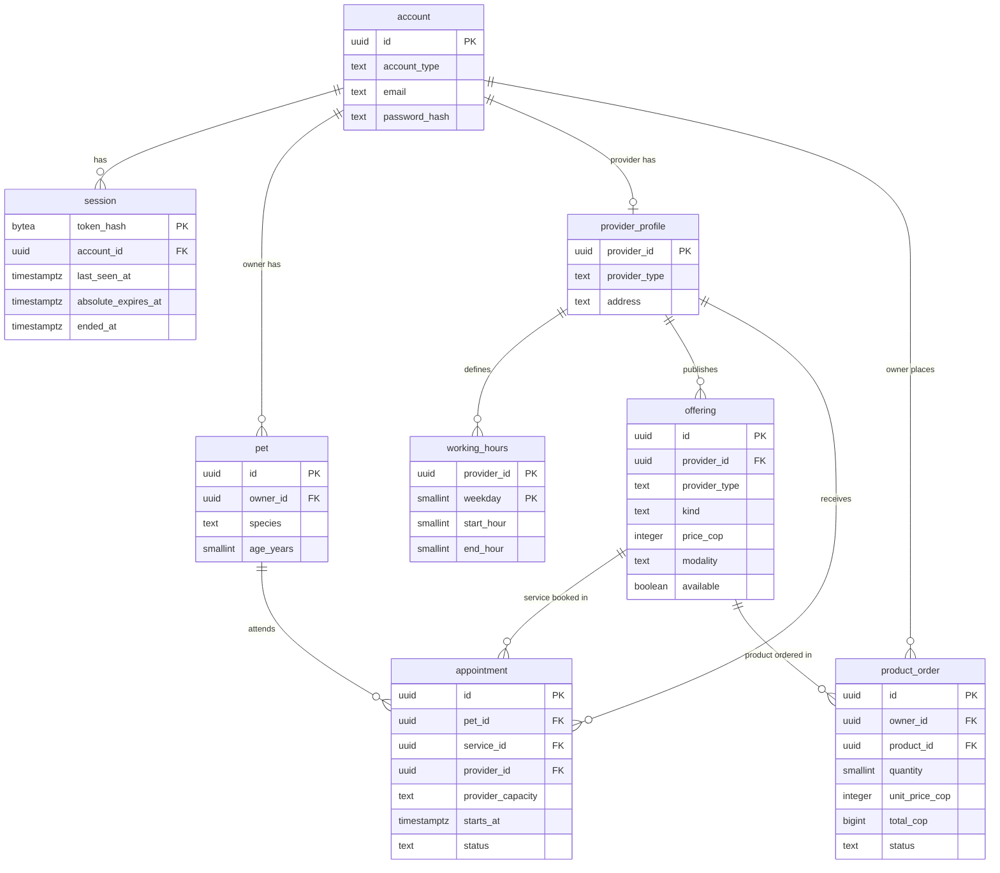

# VetCare Data Model

> **Labels:** FACT, DECISION, ASSUMPTION, PROPOSAL, REQUIRES_DECISION, BLOCKED (SYSTEM_PROMPT).
>
> Upstream IDs keep their meaning. P05 IDs (`DATA-`, `COMP-`, `IF-`, `CR-`, `ADR-`, `P05-ASM-`) are defined in ARCHITECTURE.md v2.0. This document adds no new ID prefix. Tables and constraints are named in `snake_case`.

---

## 1. Document Metadata

| Field | Value |
|---|---|
| Stage | P05 — Architecture (additional output required by TD-20) |
| Document | `artifacts/05_architecture/DATA_MODEL.md` |
| Version | 1.0 (first issue) |
| Generated | 2026-10-10 |
| Database | PostgreSQL on Neon (Free plan), reached through the Vercel Marketplace integration (TD-14; ARCHITECTURE ADR-005, ADR-014) |
| Derived from | ARCHITECTURE.md v2.0 §8 (conceptual model DATA-001 to DATA-008); REQUIREMENTS v3.0; UX_SPEC v2.0 |
| **Status** | **READY** |

**Status rationale.** Every conceptual entity has a table with keys, types, constraints and indexes. Every integrity rule that can be stated on one row or one unique key is declared in the schema, and the rest is assigned to a module in §6.2. The DDL in Appendix A was executed on PostgreSQL 16.15. Thirty-two rejection tests and four behavior checks passed (Appendix B).

**Team decision applied:** TD-20 requires this document. It overrides the P05 prompt's restriction on complete database schemas for this stage. The prompt's other rules still apply: no invented attributes, traceability, and visible assumptions.

---

## 2. Scope

| In scope | Not in scope |
|---|---|
| The data of the 15 committed stories and of the ordering package (US-027 to US-033). | Columns for Groups A and B (pet edit and removal, service and product edit and removal, appointment cancel and reschedule by users). They extend these tables later (§9). |
| Sessions for sign-in, sign-out and expiry (FR-039, NFR-005). | Migration tool, seed scripts, ORM models (implementation freedom, ARCHITECTURE §15.5). |
| Constraints and indexes for the integrity rules (CR-008, CR-009, BR-013, BR-026, BR-007, BR-022, BR-031). | Backups and restore procedures: none, by team decision TD-11. |

---

## 3. Conventions

| Topic | Rule | Source |
|---|---|---|
| Identifiers | `uuid` primary keys generated by the database (`gen_random_uuid()`, built into PostgreSQL 13 and later). Random identifiers do not reveal counts or the existence of other users' records, which supports the uniform NOT_FOUND outcome. | CR-006; P05-ASM-005 |
| Enumerations | `text` columns with `CHECK (... IN (...))`, not `ENUM` types, so a value can be added with one constraint change. The values are the API codes in API_SPEC.yaml. | CTR-003 |
| Time | Points in time are `timestamptz`. All calendar logic (weekday, hour, "now") uses the named zone `America/Bogota` in the application (COMP-010) or with `AT TIME ZONE 'America/Bogota'` in SQL. The connection's session time zone is never changed, because Neon's pooled connections do not support session-level `SET` (§8). | P02-ASM-007; ADR-008; CR-007 |
| Money | Whole Colombian pesos in `integer` (prices) and `bigint` (order totals). There are no decimals and no currency column. | P02-ASM-014; P04-ASM-013; CR-011 |
| Pet units | Age `smallint` whole years (0 if under one); weight `numeric(4,1)` kg; height `smallint` whole cm. | TD-10; BR-037 |
| Text limits | Upper length limits protect storage and layout. No requirement sets them, so they are P05 values: names 120 characters (pet name and breed 80), email 254, phone 30, address 300. The client sets the same `maxlength` on its inputs, so users never reach a server error for length. | P05-ASM-004 |
| Deletion | No row is physically deleted in the designed scope. Appointments and orders keep their history (BR-035, P02-ASM-011, P02-ASM-012). | CR-010, CR-018 |
| Ownership | Each table is written only by its owning module (§4). | CR-002 |

---

## 4. Logical Model

### 4.1 Entity-to-Table Map

| Conceptual entity (ARCHITECTURE §8) | Table | Owning module | Main rules carried by the schema |
|---|---|---|---|
| DATA-001 Account | `account` | COMP-004 Identity and Access | Unique (email, account type): BR-036, P02-ASM-002. Normalized email. |
| DATA-002 Session | `session` | COMP-004 | Token stored only as a hash; absolute expiry; sign-out end time (NFR-005, FR-039). |
| DATA-003 Pet | `pet` | COMP-005 Pets | Owner must be an owner account. Species required, dog or cat (TD-07, BR-032). Units (TD-10). |
| DATA-004 Provider Profile | `provider_profile` | COMP-006 Provider Profile and Working Hours | Profile only for a provider account. A clinic always has an address (TD-08, BR-026). Phone characters (P04-ASM-005). |
| DATA-005 Working Hours | `working_hours` | COMP-006 | One range per weekday; whole hours; end after start (BR-033, P04-ASM-008). |
| DATA-006 Offering | `offering` | COMP-007 Catalog | Kind-specific fields (modality for services, availability for products: TD-13, BR-031). An independent veterinarian's services are home only (TD-09, BR-007). Price > 0. |
| DATA-007 Appointment | `appointment` | COMP-009 Scheduling | Pet belongs to the owner. Service belongs to the provider and is a service. Whole-hour start. Home visit needs an address. **Conditional uniqueness for independent veterinarians** (BR-013, CR-008). |
| DATA-008 Order | `product_order` | COMP-012 Ordering | One product, quantity 1 to 99, unit price captured, total = price × quantity, address required, four statuses (TD-12, BR-022, BR-023). |

The table is named `product_order` because `order` is a reserved word in SQL.

### 4.2 Logical Diagram



`appointment` also references its owner, which is checked through the pet. `product_order` also references the provider, which is checked through the product. The diagram omits those edges and some columns to stay readable; §5 is complete.

### 4.3 Copied Columns That Carry Integrity

Three columns copy a value from a parent row so that a rule can be declared on one row, with a composite foreign key guaranteeing the copy is correct:

| Column | Copied from | Why |
|---|---|---|
| `offering.provider_type` | `provider_profile.provider_type` | `independent_home_only`: an independent veterinarian cannot publish a clinic or both-modality service (TD-09). |
| `appointment.provider_capacity` | `provider_profile.provider_type` | The partial unique index applies only to independent veterinarians (BR-013), and clinics stay unlimited (BR-012). |
| `product_order.unit_price_cop` | `offering.price_cop` at ordering time | The total shown before ordering stays the total of the order, even if a later story changes the price (AC-069, AC-085, P02-ASM-012). This is not a foreign key; it is a deliberate snapshot (P05-ASM-008). |

The provider type is immutable (BR-002; no story changes it), so the first two copies can never become stale. The constant columns `owner_type`, `account_type`, `service_kind` and `product_kind` exist only to make the composite foreign keys check the parent's type, for example that a pet's owner is an owner account.

---

## 5. Physical Model

Types are PostgreSQL types. "Check" lists the column-level and table-level constraints. The authoritative text is the DDL in Appendix A.

### 5.1 `account` (DATA-001)

| Column | Type | Null | Default | Check / key | Source |
|---|---|---|---|---|---|
| `id` | uuid | no | `gen_random_uuid()` | PK | — |
| `account_type` | text | no | — | `owner` or `provider` | BR-001 |
| `name` | text | no | — | not blank; ≤ 120 | FR-001, FR-002 |
| `email` | text | no | — | lowercase and trimmed; ≤ 254; contains `@` after the first character | FR-001, FR-002; P05-ASM-006 |
| `password_hash` | text | no | — | Argon2id encoded hash (ADR-006); never selected by read queries other than sign-in | NFR-001; CR-004 |
| `created_at` | timestamptz | no | `now()` | — | — |

Keys: `account_email_type_uq` UNIQUE (`email`, `account_type`) — BR-036, AC-004, AC-008, AC-074, AC-076. `account_id_type_uq` UNIQUE (`id`, `account_type`), the target of the type-checking foreign keys.

### 5.2 `session` (DATA-002)

| Column | Type | Null | Default | Check / key | Source |
|---|---|---|---|---|---|
| `token_hash` | bytea | no | — | PK; exactly 32 bytes (SHA-256 of the random cookie token) | ADR-007; P05-ASM-007 |
| `account_id` | uuid | no | — | FK → `account(id)` | — |
| `created_at` | timestamptz | no | `now()` | — | — |
| `last_seen_at` | timestamptz | no | `now()` | Updated on each authenticated request; idle expiry = `last_seen_at` + 60 minutes | NFR-005 (TD-05) |
| `absolute_expires_at` | timestamptz | no | — | = `created_at` + 12 hours, set by COMP-004; must be after `created_at` | NFR-005 (TD-05) |
| `ended_at` | timestamptz | yes | — | Set by sign-out | FR-039; AC-112, AC-113 |

Index: `session_account_idx` (`account_id`).

**Resolution rule (COMP-004, IF-014):** a cookie whose hash is not found, or whose row has `ended_at` set, resolves to **no session** (UNAUTHENTICATED). A row that exists without `ended_at` but whose idle or absolute expiry has passed resolves to **expired** (SESSION_EXPIRED; the client shows MSG-SESSION). The raw token is never stored, so a database read does not reveal usable cookies.

### 5.3 `pet` (DATA-003)

| Column | Type | Null | Default | Check / key | Source |
|---|---|---|---|---|---|
| `id` | uuid | no | `gen_random_uuid()` | PK | — |
| `owner_id` | uuid | no | — | FK (`owner_id`, `owner_type`) → `account(id, account_type)` | FR-005; NFR-002 |
| `owner_type` | text | no | `'owner'` | = `owner` | — |
| `name` | text | no | — | not blank; ≤ 80 | BR-037 |
| `species` | text | no | — | `dog` or `cat` | TD-07; BR-032, BR-037 |
| `breed` | text | no | — | not blank; ≤ 80; free text | BR-037; P04-ASM-016 |
| `age_years` | smallint | no | — | ≥ 0 | TD-10 |
| `weight_kg` | numeric(4,1) | yes | — | > 0 | TD-10 |
| `height_cm` | smallint | yes | — | > 0 | TD-10 |
| `created_at` | timestamptz | no | `now()` | — | — |

Keys: `pet_id_owner_uq` UNIQUE (`id`, `owner_id`), the target of the appointment's pet-ownership foreign key. Index: `pet_owner_idx` (`owner_id`).

`numeric(4,1)` rounds a value with more decimals instead of rejecting it, so COMP-005 rejects more than one decimal before writing (VALIDATION_FAILED, MSG-DECIMAL).

### 5.4 `provider_profile` (DATA-004)

| Column | Type | Null | Default | Check / key | Source |
|---|---|---|---|---|---|
| `provider_id` | uuid | no | — | PK; FK (`provider_id`, `account_type`) → `account(id, account_type)` | FR-002 |
| `account_type` | text | no | `'provider'` | = `provider` | — |
| `provider_type` | text | no | — | `clinic` or `independent`; immutable | BR-002 |
| `public_name` | text | no | — | not blank; ≤ 120 | FR-009 |
| `contact_phone` | text | yes | — | digits, spaces and `+` only; at least one digit; ≤ 30. Null until the first profile save; the onboarding alert uses "phone is null". | BR-038; P04-ASM-005; P04-PROP-006 |
| `contact_email` | text | no | — | ≤ 254; contains `@`. Separate from the sign-in email. | BR-038; CR-016; P04-ASM-012 |
| `address` | text | yes | — | if present: not blank, ≤ 300 | BR-026 |
| `updated_at` | timestamptz | no | `now()` | — | — |

Keys and table checks: `provider_id_type_uq` UNIQUE (`provider_id`, `provider_type`). **`clinic_address_required`**: a clinic's address is never null, which is how "a clinic can change its address but never remove it" (TD-08, AC-104, AC-106, EDGE-027) is enforced in the database. An independent veterinarian's address may be null (TD-09, AC-024, AC-105).

### 5.5 `working_hours` (DATA-005)

| Column | Type | Null | Check / key | Source |
|---|---|---|---|---|
| `provider_id` | uuid | no | FK → `provider_profile`; part of PK | FR-010 |
| `weekday` | smallint | no | 1 to 7, ISO 8601 (1 = Monday); part of PK | P02-ASM-010 |
| `start_hour` | smallint | no | 0 to 23 | BR-033 |
| `end_hour` | smallint | no | 1 to 24 (24 = midnight at the end of the day, COMP-UX-018); > `start_hour` | BR-033; P04-ASM-008 |

A day without a row is a day off. The primary key (`provider_id`, `weekday`) allows one range per weekday. A save replaces the provider's rows in one transaction with the cancellations of BR-034 (§7).

### 5.6 `offering` (DATA-006)

| Column | Type | Null | Default | Check / key | Source |
|---|---|---|---|---|---|
| `id` | uuid | no | `gen_random_uuid()` | PK | — |
| `provider_id` | uuid | no | — | FK (`provider_id`, `provider_type`) → `provider_profile` | FR-011, FR-014 |
| `provider_type` | text | no | — | copy of the provider type (§4.3) | TD-09 |
| `kind` | text | no | — | `service` or `product` | ADR-015 |
| `name` | text | no | — | not blank; ≤ 120 | P02-ASM-004 |
| `price_cop` | integer | no | — | > 0 | P02-ASM-014; P04-ASM-013 |
| `species` | text | no | — | `dog` or `cat` | BR-006 |
| `modality` | text | services only | — | `clinic`, `home` or `both` | BR-007 |
| `available` | boolean | products only | — | the API sets `true` at publish | TD-13; BR-031; AC-111 |
| `created_at` | timestamptz | no | `now()` | — | — |

Table checks:

- **`offering_kind_fields`:** a service has a modality and no availability; a product has an availability and no modality.
- **`independent_home_only`:** a service of an independent veterinarian has modality `home` (TD-09, AC-107).
- **`offering_id_provider_kind_uq`:** UNIQUE (`id`, `provider_id`, `kind`), the target of the appointment and order foreign keys. They check that a booked offering is a service of that provider and that an ordered offering is a product of that provider.

Index: `offering_provider_idx` (`provider_id`, `kind`), for the catalog (SCR-UX-011) and the public profile (SCR-UX-005).

### 5.7 `appointment` (DATA-007)

| Column | Type | Null | Default | Check / key | Source |
|---|---|---|---|---|---|
| `id` | uuid | no | `gen_random_uuid()` | PK | — |
| `owner_id` | uuid | no | — | with `pet_id`: FK → `pet(id, owner_id)` | FR-022; NFR-002 |
| `pet_id` | uuid | no | — | (see above) | BR-005 |
| `service_id` | uuid | no | — | with `provider_id`, `service_kind`: FK → `offering(id, provider_id, kind)` | FR-021 |
| `service_kind` | text | no | `'service'` | = `service` | — |
| `provider_id` | uuid | no | — | with `provider_capacity`: FK → `provider_profile(provider_id, provider_type)` | — |
| `provider_capacity` | text | no | — | `clinic` or `independent` (§4.3) | BR-012, BR-013 |
| `starts_at` | timestamptz | no | — | on a whole hour: `extract(epoch FROM starts_at)::bigint % 3600 = 0` | BR-010 |
| `modality` | text | no | — | `clinic` or `home` | FR-023; BR-007 |
| `visit_address` | text | home only | — | not blank, ≤ 300 | BR-015; AC-053 |
| `status` | text | no | `'scheduled'` | `scheduled` or `cancelled` | BR-014, BR-035 |
| `created_at` | timestamptz | no | `now()` | — | — |
| `cancelled_at` | timestamptz | yes | — | set exactly when the status is `cancelled` | BR-034 |

The end of an appointment is always `starts_at + 1 hour` (BR-010). It is computed, not stored.

Table checks: `appointment_home_address` (a home visit has an address, a clinic visit has none); `appointment_independent_home_only` (an independent veterinarian's appointments are at home, TD-09); `appointment_cancel_time`.

**Conditional uniqueness for independent veterinarians (BR-013, CR-008, EDGE-007):**

```sql
CREATE UNIQUE INDEX appointment_independent_slot_uq
  ON appointment (provider_id, starts_at)
  WHERE status = 'scheduled' AND provider_capacity = 'independent';
```

- Two scheduled appointments of the same independent veterinarian at the same start are impossible, even under concurrent requests. The second insert fails with SQLSTATE 23505, which COMP-009 maps to SLOT_UNAVAILABLE.
- Clinic rows never enter the index, so a clinic accepts several appointments per hour (BR-012).
- A cancelled appointment leaves the index, so its slot can be booked again (tested, Appendix B).

**Whole-hour check:** because Bogotá's UTC offset is a whole number of hours (−05:00), a start on a whole UTC hour is also on a whole local hour.

Indexes: `appointment_owner_idx` (`owner_id`, `starts_at`) for SCR-UX-007; `appointment_provider_idx` (`provider_id`, `starts_at`) for SCR-UX-008, slot computation and hours-change cancellations.

### 5.8 `product_order` (DATA-008)

| Column | Type | Null | Default | Check / key | Source |
|---|---|---|---|---|---|
| `id` | uuid | no | `gen_random_uuid()` | PK | — |
| `owner_id` | uuid | no | — | with `owner_type`: FK → `account(id, account_type)` | FR-032; NFR-002 |
| `owner_type` | text | no | `'owner'` | = `owner` | — |
| `product_id` | uuid | no | — | with `provider_id`, `product_kind`: FK → `offering(id, provider_id, kind)` | FR-032 |
| `product_kind` | text | no | `'product'` | = `product` | BR-022 |
| `provider_id` | uuid | no | — | (see above) | FR-033 |
| `quantity` | smallint | no | — | 1 to 99 | TD-12; BR-022; AC-110 |
| `unit_price_cop` | integer | no | — | > 0; the product price when the order was placed (§4.3) | TD-12 |
| `total_cop` | bigint | generated | `unit_price_cop × quantity`, stored | read-only | TD-12; BR-022 |
| `delivery_address` | text | no | — | not blank; ≤ 300 | BR-020; AC-070 |
| `status` | text | no | `'confirmed'` | `confirmed`, `in_delivery`, `closed`, `cancelled` | BR-023; P02-ASM-015; P02-ASM-011 |
| `placed_at` | timestamptz | no | `now()` | — | AC-069 |
| `status_changed_at` | timestamptz | no | `now()` | — | — |

Status codes map to the UX labels as follows (P04-ASM-018): `confirmed` → *"Confirmado"*, `in_delivery` → *"En camino"*, `closed` → *"Entregado"*, `cancelled` → *"Cancelado"*.

Indexes: `product_order_owner_idx` (`owner_id`, `placed_at DESC`) for SCR-UX-016; `product_order_provider_idx` (`provider_id`, `placed_at DESC`) for SCR-UX-017.

---

## 6. Integrity Rules

### 6.1 Rules Enforced by the Schema

| Rule | Constraint |
|---|---|
| One account per (email, type); same email allowed for the other type (BR-036) | `account_email_type_uq` |
| A pet belongs to an owner account; a profile to a provider account; an order to an owner account (BR-001, NFR-002) | type-checking composite FKs |
| Pet species required, dog or cat (TD-07, BR-032) | `pet.species` NOT NULL + CHECK |
| Clinic address mandatory and not removable (TD-08, BR-026) | `clinic_address_required` |
| Independent veterinarians: home services only (TD-09, BR-007) | `independent_home_only`, `appointment_independent_home_only` |
| One range per weekday, whole hours, end after start (BR-033) | PK and CHECKs of `working_hours` |
| Exactly one species per offering; price > 0 (BR-006, P04-ASM-013) | CHECKs of `offering` |
| Products have availability, services have modality (TD-13, BR-031) | `offering_kind_fields` |
| A booked offering is a service of that provider; the pet is the owner's (FR-022, NFR-002) | composite FKs of `appointment` |
| One scheduled appointment per independent-veterinarian slot (BR-013) | `appointment_independent_slot_uq` |
| Whole-hour starts (BR-010) | CHECK on `starts_at` |
| Home visits have an address (BR-015) | `appointment_home_address` |
| An ordered offering is a product of that provider; quantity 1–99; address required; total = price × quantity (TD-12, BR-020, BR-022) | FK, CHECKs and generated column of `product_order` |
| No physical deletion (BR-035, CR-010) | Not a constraint. The application issues no DELETE on these tables (CR-018), and foreign keys block deleting referenced parents. |

### 6.2 Rules Enforced by the Owning Module (Not Expressible as a Row Constraint)

| Rule | Module | How |
|---|---|---|
| Pet species equals the service species (TD-06, BR-024, AC-108, AC-109) | COMP-009 | Checked in the booking transaction; PET_NOT_ELIGIBLE. Pets and services cannot change species in the designed scope, so the check cannot be invalidated later. |
| Slot within the provider's hours for that Bogotá weekday; start in the future (BR-011, P02-ASM-006) | COMP-009 | Under the provider lock (§7.1); SLOT_UNAVAILABLE. |
| Hours change cancels upcoming scheduled appointments outside the new hours (BR-034) | COMP-006 → COMP-009 (IF-018) | Same transaction as the hours save (§7.2). |
| Sign-up creates the account with its first pet or its profile, and the session, atomically (BR-003, CR-017) | COMP-004 | One transaction. |
| Ordering only an available product, at its current price (BR-030, AC-089) | COMP-012 | The product row is read `FOR SHARE` in the order transaction (§7.3); PRODUCT_UNAVAILABLE. |
| Order status moves one step forward, and only the provider moves it; cancel only while `confirmed` (BR-023, BR-029, AC-094, AC-097, AC-099) | COMP-012 | Conditional update (§7.4); ORDER_STATUS_CHANGED. |
| Sessions expire (NFR-005) | COMP-004 | Resolution rule in §5.2. |
| Password of at least 8 characters (BR-039) | COMP-004 | Checked before hashing; only the hash is stored. |

---

## 7. Transactions and Locking

All writes below run in a single transaction on one connection. Row locks are released at commit, so they work through Neon's pooled connections (§8).

### 7.1 Booking (IF-011)

1. `SELECT ... FROM provider_profile WHERE provider_id = $1 FOR UPDATE` — the provider lock shared with the hours save (CR-009, IF-024).
2. Read the provider's `working_hours`, check the slot (§6.2), check the pet's species and the modality.
3. `INSERT INTO appointment ...`. A unique violation on `appointment_independent_slot_uq` means SLOT_UNAVAILABLE.
4. Commit.

### 7.2 Working-hours save (IF-005)

1. Lock the provider row `FOR UPDATE` (same lock as above).
2. Delete and insert the provider's `working_hours` rows. These rows are configuration, not history, so replacing them is allowed. CR-010 protects appointments, not hours.
3. `UPDATE appointment SET status = 'cancelled', cancelled_at = now() WHERE provider_id = $1 AND status = 'scheduled' AND starts_at > $now AND <slot no longer inside the new hours>` (BR-034, AC-081).
4. Commit.

### 7.3 Placing an order (IF-028)

1. `SELECT price_cop, available FROM offering WHERE id = $1 AND kind = 'product' FOR SHARE`. This waits for a concurrent availability change, so an order cannot be placed against a product that was just marked not available.
2. If the row is missing or `available` is false: PRODUCT_UNAVAILABLE.
3. `INSERT INTO product_order (..., unit_price_cop) VALUES (..., price_cop)`.
4. Commit.

### 7.4 Order status changes (IF-031, IF-032)

Each change is one conditional `UPDATE` that names the expected current status, for example:

```sql
UPDATE product_order
   SET status = 'in_delivery', status_changed_at = now()
 WHERE id = $1 AND provider_id = $2 AND status = 'confirmed';
```

- 1 row updated: success.
- 0 rows: COMP-012 reads the order. If it is not visible to the caller, the result is NOT_FOUND; otherwise the status changed meanwhile and the result is ORDER_STATUS_CHANGED (COMP-UX-020 status-changed alert).
- Allowed transitions: provider `confirmed` → `in_delivery` → `closed`; owner or provider `confirmed` → `cancelled`. Nothing leaves `closed` or `cancelled` (EDGE-026).

---

## 8. Neon and Serverless Considerations

FACTS from the official documentation (sources at the end):

- The Neon integration in the Vercel Marketplace injects `DATABASE_URL` (pooled through PgBouncer) and `DATABASE_URL_UNPOOLED` (direct).
- Pooled connections run in transaction mode. Session-level features are **not** supported through them: `SET`/`RESET`, `LISTEN`/`NOTIFY`, SQL-level `PREPARE`, and session-level advisory locks. Neon recommends the pooled string for serverless functions and a direct connection for schema migrations.
- On the Free plan, compute scales to zero after 5 minutes without activity. Storage is 1 GB per project and compute is 100 CU-hours per project.

Consequences for this model:

| Item | Rule |
|---|---|
| Application connections | The Express function uses `DATABASE_URL` (pooled). |
| Migrations | Run with `DATABASE_URL_UNPOOLED`. |
| Time zone | Never `SET TIME ZONE`. Use `AT TIME ZONE 'America/Bogota'` in SQL or compute in COMP-010 (§3). |
| Locks | Only row locks (`FOR UPDATE`, `FOR SHARE`) and transaction-scoped behavior. No session advisory locks. |
| First request after idle | It waits for the compute to resume. This is acceptable for a demonstration (no performance target, P05-UNK-001). |
| Size | The demonstration data is a few hundred rows, far below 1 GB. |

---

## 9. Lifecycle, Data and Extension

- **Demonstration data:** fictitious seed data only; no real personal data (TD-11). No backup procedure (TD-11). The Neon Free plan keeps a 6-hour restore history by default, which the team may use but does not rely on.
- **Sessions:** ended or expired rows may be deleted by a periodic or opportunistic cleanup. This is the only DELETE allowed, because sessions are not history (P05-ASM-007).
- **Extensions for Groups A and B** (not designed; for orientation only):
  - removing pets, services or products would add a nullable `removed_at` to `pet` or `offering`, never a DELETE (CR-018);
  - cancel and reschedule by users would update `appointment.status` and `starts_at` under the same lock and index.
- **Personal data:** names, emails, phones and addresses. No regulation applies (TD-11). Exposure is limited by the API (ARCHITECTURE §9).

---

## 10. Traceability Summary

| Requirement group | Tables | Key constraints |
|---|---|---|
| Accounts, sign-in, sign-out, expiry (FR-001 to FR-004, FR-039, NFR-001, NFR-002, NFR-005) | `account`, `session` | `account_email_type_uq`; session resolution rule |
| Pets (FR-005) | `pet` | species and unit checks |
| Profile and hours (FR-009, FR-010) | `provider_profile`, `working_hours` | `clinic_address_required`; hours checks |
| Catalog and stock (FR-011, FR-014, FR-038) | `offering` | `offering_kind_fields`, `independent_home_only` |
| Search and profile (FR-017 to FR-020) | `offering`, `provider_profile` | read only |
| Booking and appointments (FR-021 to FR-026, FR-029) | `appointment` | `appointment_independent_slot_uq`; FKs |
| Ordering (FR-032 to FR-037) | `product_order` | quantity, total, FK and status checks |

---

## 11. Assumptions

All are P05 items approved under the standing rule TD-19 and are listed with their impact in ARCHITECTURE §16.

| ID | Assumption |
|---|---|
| P05-ASM-004 | Upper text lengths (§3), mirrored by `maxlength` on the client inputs and by `maxLength` in API_SPEC.yaml. |
| P05-ASM-005 | UUID identifiers. |
| P05-ASM-006 | Emails are stored lowercased and trimmed; sign-up and sign-in normalize them the same way. |
| P05-ASM-007 | The session token is random (at least 32 bytes) and only its SHA-256 hash is stored; ended and expired session rows may be deleted. |
| P05-ASM-008 | Orders capture the unit price at ordering time. |
| P05-ASM-009 | Accent-insensitive search uses `translate(lower(name), 'áéíóúü', 'aeiouu')` on both sides of a `LIKE`. No extension is needed; `ñ` stays distinct. |

---

## Appendix A — DDL (PostgreSQL)

Executed without errors on PostgreSQL 16.15 (Appendix B). It uses only core features available in current Neon Postgres versions: `gen_random_uuid()`, partial unique indexes, stored generated columns, composite foreign keys and CHECK constraints.

```sql

CREATE TABLE account (
  id             uuid        PRIMARY KEY DEFAULT gen_random_uuid(),
  account_type   text        NOT NULL CHECK (account_type IN ('owner', 'provider')),
  name           text        NOT NULL CHECK (btrim(name) <> '' AND char_length(name) <= 120),
  email          text        NOT NULL CHECK (email = lower(btrim(email)) AND char_length(email) <= 254 AND position('@' IN email) > 1),
  password_hash  text        NOT NULL,
  created_at     timestamptz NOT NULL DEFAULT now(),
  CONSTRAINT account_email_type_uq UNIQUE (email, account_type),
  CONSTRAINT account_id_type_uq    UNIQUE (id, account_type)
);

CREATE TABLE session (
  token_hash          bytea       PRIMARY KEY CHECK (octet_length(token_hash) = 32),
  account_id          uuid        NOT NULL REFERENCES account (id),
  created_at          timestamptz NOT NULL DEFAULT now(),
  last_seen_at        timestamptz NOT NULL DEFAULT now(),
  absolute_expires_at timestamptz NOT NULL,
  ended_at            timestamptz,
  CONSTRAINT session_expiry_after_creation CHECK (absolute_expires_at > created_at)
);
CREATE INDEX session_account_idx ON session (account_id);

CREATE TABLE pet (
  id          uuid         PRIMARY KEY DEFAULT gen_random_uuid(),
  owner_id    uuid         NOT NULL,
  owner_type  text         NOT NULL DEFAULT 'owner' CHECK (owner_type = 'owner'),
  name        text         NOT NULL CHECK (btrim(name) <> '' AND char_length(name) <= 80),
  species     text         NOT NULL CHECK (species IN ('dog', 'cat')),
  breed       text         NOT NULL CHECK (btrim(breed) <> '' AND char_length(breed) <= 80),
  age_years   smallint     NOT NULL CHECK (age_years >= 0),
  weight_kg   numeric(4,1)          CHECK (weight_kg > 0),
  height_cm   smallint              CHECK (height_cm > 0),
  created_at  timestamptz  NOT NULL DEFAULT now(),
  CONSTRAINT pet_owner_fk FOREIGN KEY (owner_id, owner_type) REFERENCES account (id, account_type),
  CONSTRAINT pet_id_owner_uq UNIQUE (id, owner_id)
);
CREATE INDEX pet_owner_idx ON pet (owner_id);

CREATE TABLE provider_profile (
  provider_id    uuid        PRIMARY KEY,
  account_type   text        NOT NULL DEFAULT 'provider' CHECK (account_type = 'provider'),
  provider_type  text        NOT NULL CHECK (provider_type IN ('clinic', 'independent')),
  public_name    text        NOT NULL CHECK (btrim(public_name) <> '' AND char_length(public_name) <= 120),
  contact_phone  text                 CHECK (contact_phone ~ '^[0-9 +]+$' AND contact_phone ~ '[0-9]' AND char_length(contact_phone) <= 30),
  contact_email  text        NOT NULL CHECK (char_length(contact_email) <= 254 AND position('@' IN contact_email) > 1),
  address        text                 CHECK (address IS NULL OR (btrim(address) <> '' AND char_length(address) <= 300)),
  updated_at     timestamptz NOT NULL DEFAULT now(),
  CONSTRAINT provider_account_fk FOREIGN KEY (provider_id, account_type) REFERENCES account (id, account_type),
  CONSTRAINT provider_id_type_uq UNIQUE (provider_id, provider_type),
  CONSTRAINT clinic_address_required CHECK (provider_type <> 'clinic' OR address IS NOT NULL)
);

CREATE TABLE working_hours (
  provider_id  uuid     NOT NULL REFERENCES provider_profile (provider_id),
  weekday      smallint NOT NULL CHECK (weekday BETWEEN 1 AND 7),        -- ISO 8601: 1 = Monday ... 7 = Sunday
  start_hour   smallint NOT NULL CHECK (start_hour BETWEEN 0 AND 23),
  end_hour     smallint NOT NULL CHECK (end_hour BETWEEN 1 AND 24),      -- 24 = midnight at the end of the day
  CONSTRAINT working_hours_pk PRIMARY KEY (provider_id, weekday),
  CONSTRAINT working_hours_end_after_start CHECK (end_hour > start_hour)
);

CREATE TABLE offering (
  id             uuid        PRIMARY KEY DEFAULT gen_random_uuid(),
  provider_id    uuid        NOT NULL,
  provider_type  text        NOT NULL,
  kind           text        NOT NULL CHECK (kind IN ('service', 'product')),
  name           text        NOT NULL CHECK (btrim(name) <> '' AND char_length(name) <= 120),
  price_cop      integer     NOT NULL CHECK (price_cop > 0),
  species        text        NOT NULL CHECK (species IN ('dog', 'cat')),
  modality       text                 CHECK (modality IN ('clinic', 'home', 'both')),
  available      boolean,
  created_at     timestamptz NOT NULL DEFAULT now(),
  CONSTRAINT offering_provider_fk FOREIGN KEY (provider_id, provider_type) REFERENCES provider_profile (provider_id, provider_type),
  CONSTRAINT offering_kind_fields CHECK (
       (kind = 'service' AND modality IS NOT NULL AND available IS NULL)
    OR (kind = 'product' AND modality IS NULL     AND available IS NOT NULL)),
  CONSTRAINT independent_home_only CHECK (kind <> 'service' OR provider_type = 'clinic' OR modality = 'home'),
  CONSTRAINT offering_id_provider_kind_uq UNIQUE (id, provider_id, kind)
);
CREATE INDEX offering_provider_idx ON offering (provider_id, kind);

CREATE TABLE appointment (
  id                 uuid        PRIMARY KEY DEFAULT gen_random_uuid(),
  owner_id           uuid        NOT NULL,
  pet_id             uuid        NOT NULL,
  service_id         uuid        NOT NULL,
  service_kind       text        NOT NULL DEFAULT 'service' CHECK (service_kind = 'service'),
  provider_id        uuid        NOT NULL,
  provider_capacity  text        NOT NULL CHECK (provider_capacity IN ('clinic', 'independent')),
  starts_at          timestamptz NOT NULL CHECK (extract(epoch FROM starts_at)::bigint % 3600 = 0),
  modality           text        NOT NULL CHECK (modality IN ('clinic', 'home')),
  visit_address      text                 CHECK (visit_address IS NULL OR (btrim(visit_address) <> '' AND char_length(visit_address) <= 300)),
  status             text        NOT NULL DEFAULT 'scheduled' CHECK (status IN ('scheduled', 'cancelled')),
  created_at         timestamptz NOT NULL DEFAULT now(),
  cancelled_at       timestamptz,
  CONSTRAINT appointment_pet_fk      FOREIGN KEY (pet_id, owner_id) REFERENCES pet (id, owner_id),
  CONSTRAINT appointment_service_fk  FOREIGN KEY (service_id, provider_id, service_kind) REFERENCES offering (id, provider_id, kind),
  CONSTRAINT appointment_provider_fk FOREIGN KEY (provider_id, provider_capacity) REFERENCES provider_profile (provider_id, provider_type),
  CONSTRAINT appointment_home_address CHECK ((modality = 'home') = (visit_address IS NOT NULL)),
  CONSTRAINT appointment_independent_home_only CHECK (provider_capacity = 'clinic' OR modality = 'home'),
  CONSTRAINT appointment_cancel_time CHECK ((status = 'cancelled') = (cancelled_at IS NOT NULL))
);
-- BR-013 / CR-008: at most one scheduled appointment per start time for an independent veterinarian.
-- Clinic appointments are outside the predicate, so clinics stay unlimited (BR-012).
CREATE UNIQUE INDEX appointment_independent_slot_uq
  ON appointment (provider_id, starts_at)
  WHERE status = 'scheduled' AND provider_capacity = 'independent';
CREATE INDEX appointment_owner_idx    ON appointment (owner_id, starts_at);
CREATE INDEX appointment_provider_idx ON appointment (provider_id, starts_at);

CREATE TABLE product_order (
  id                 uuid        PRIMARY KEY DEFAULT gen_random_uuid(),
  owner_id           uuid        NOT NULL,
  owner_type         text        NOT NULL DEFAULT 'owner' CHECK (owner_type = 'owner'),
  product_id         uuid        NOT NULL,
  product_kind       text        NOT NULL DEFAULT 'product' CHECK (product_kind = 'product'),
  provider_id        uuid        NOT NULL,
  quantity           smallint    NOT NULL CHECK (quantity BETWEEN 1 AND 99),
  unit_price_cop     integer     NOT NULL CHECK (unit_price_cop > 0),
  total_cop          bigint      GENERATED ALWAYS AS (unit_price_cop::bigint * quantity) STORED,
  delivery_address   text        NOT NULL CHECK (btrim(delivery_address) <> '' AND char_length(delivery_address) <= 300),
  status             text        NOT NULL DEFAULT 'confirmed' CHECK (status IN ('confirmed', 'in_delivery', 'closed', 'cancelled')),
  placed_at          timestamptz NOT NULL DEFAULT now(),
  status_changed_at  timestamptz NOT NULL DEFAULT now(),
  CONSTRAINT order_owner_fk   FOREIGN KEY (owner_id, owner_type) REFERENCES account (id, account_type),
  CONSTRAINT order_product_fk FOREIGN KEY (product_id, provider_id, product_kind) REFERENCES offering (id, provider_id, kind)
);
CREATE INDEX product_order_owner_idx    ON product_order (owner_id, placed_at DESC);
CREATE INDEX product_order_provider_idx ON product_order (provider_id, placed_at DESC);
```

## Appendix B — Verification on PostgreSQL 16.15

The DDL was executed on a local PostgreSQL 16.15 server, then the test script below was run. It inserts fixtures and attempts each forbidden write. Each attempt must fail with the SQLSTATE shown: 23505 unique violation, 23514 check violation, 23503 foreign-key violation, 23502 not-null violation, 428C9 write to a generated column.

| # | Forbidden write | Result |
|---|---|---|
| 1 | duplicate (email,type) | Rejected (23505) |
| 2 | email not normalized | Rejected (23514) |
| 3 | pet of a provider account | Rejected (23503) |
| 4 | pet without species | Rejected (23502) |
| 5 | negative pet weight | Rejected (23514) |
| 6 | clinic without address | Rejected (23514) |
| 7 | clinic removes address | Rejected (23514) |
| 8 | blank address | Rejected (23514) |
| 9 | profile for owner account | Rejected (23503) |
| 10 | phone letters | Rejected (23514) |
| 11 | hours end before start | Rejected (23514) |
| 12 | second range same weekday | Rejected (23505) |
| 13 | independent clinic service | Rejected (23514) |
| 14 | independent both service | Rejected (23514) |
| 15 | provider_type copy mismatch | Rejected (23503) |
| 16 | price zero | Rejected (23514) |
| 17 | product with modality | Rejected (23514) |
| 18 | product without availability | Rejected (23514) |
| 19 | double booking independent | Rejected (23505) |
| 20 | start not on the hour | Rejected (23514) |
| 21 | home without address | Rejected (23514) |
| 22 | pet of another owner | Rejected (23503) |
| 23 | booking a product | Rejected (23503) |
| 24 | service of other provider | Rejected (23503) |
| 25 | capacity copy mismatch | Rejected (23503) |
| 26 | cancelled without time | Rejected (23514) |
| 27 | quantity 100 | Rejected (23514) |
| 28 | quantity 0 | Rejected (23514) |
| 29 | order a service | Rejected (23503) |
| 30 | order by provider account | Rejected (23503) |
| 31 | order blank address | Rejected (23514) |
| 32 | write total | Rejected (428C9) |

**Behavior checks (all as expected):**

- Same email for an owner and a provider account: accepted (BR-036).
- Two clinic appointments at the same start: accepted (BR-012).
- Order with quantity 3 and unit price 52 000: `total_cop` = 156 000 (generated).
- A cancelled independent-veterinarian appointment frees its slot, and the slot can be booked again.
- Conditional update `confirmed → in_delivery` updates 1 row; a later `confirmed → cancelled` updates 0 rows (ORDER_STATUS_CHANGED).
- Accent-insensitive search: `CONSÚLTA` matches `Consulta`.
- A start stored as `2026-10-12 09:00-05` reads as hour 9 with `AT TIME ZONE 'America/Bogota'`.
- **Concurrency:** two sessions booked the same independent-veterinarian slot at the same time, each taking the provider lock (`FOR UPDATE`). The second waited for the first to commit and then failed on `appointment_independent_slot_uq` (23505). Exactly one scheduled appointment remained.

**Not verified here:** behavior on Neon itself (pooled connections, cold start). This is checked when the step-0 skeleton is deployed (ARCHITECTURE §15.1).

---

## Sources

- [Neon — Connection pooling](https://neon.com/docs/connect/connection-pooling)
- [Neon — Vercel-managed integration](https://neon.com/docs/guides/vercel-managed-integration)
- [Neon — Plans](https://neon.com/docs/introduction/plans)
- [Vercel — Postgres on Vercel](https://vercel.com/docs/postgres)
